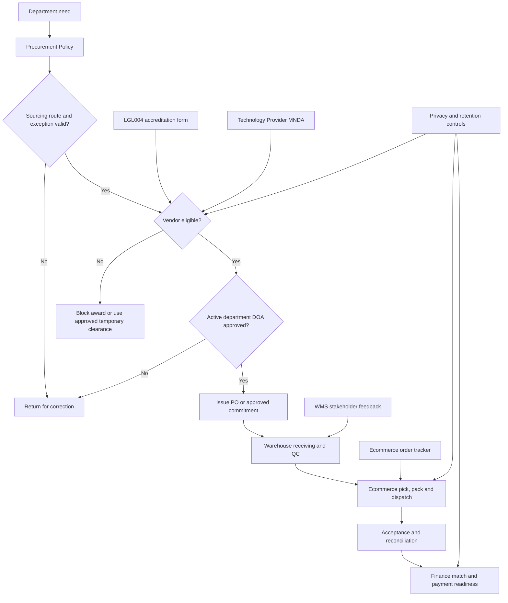

# Mwell Intra Process Reference Library

**Purpose:** Place the source basis for every governed process inside the standalone handbook.

**Control rule:** This HTML appendix is an operating extract and traceability register. The approved original maintained by its business owner remains authoritative when wording differs. Do not replace a signed agreement, approved policy, active DOA revision, or completed form with this summary.

## Reference Register

| Reference document | Format and authority | Processes governed | Business owner | Handbook treatment |
| --- | --- | --- | --- | --- |
| `mWell Procurement Policy and Procedures - Revised Modern Visual Updated.docx` | Approved policy source | Request intake, sourcing route, exceptions, competition, approval, commitment, change control, receiving, acceptance and payment readiness | Procurement with Finance and Legal | Controlling rules and handoffs are reproduced below and mapped in the Vendor-to-Pay Control Matrix |
| `LGL004-Vendor Accreditation Form 2.0 (3).pdf` | Approved vendor accreditation form, version 2.0 / 2025 baseline | Vendor identity, declarations, entity evidence, qualification and accreditation | Legal / Vendor Management | Required fields, entity branches and declarations are reproduced below |
| `[MNDA]- Tech Service Provider.docx` | Controlled legal instrument template | Technology-provider confidentiality, privacy, execution, expiry and return/destruction | Legal | Operational clauses and lifecycle controls are reproduced below; the executed instrument controls the parties |
| `Ecomm-Order Page.xlsx` | Warehouse operating tracker supplied by stakeholders | Ecommerce order intake, customer/address data, payment, product lines, dispatch and reconciliation | Operations / Warehouse | Tracker fields are mapped to Intra fields and exports below so the spreadsheet is not re-entered |
| `wms comments (1).pdf` | Approved stakeholder feedback baseline for the August 2026 WMS release | Receiving, fulfillment, bundles, QC, delivery proof, department requests and returns | Operations / Warehouse | Accepted requirements and released behavior are summarized below |
| `Mwell_Intra_Feature_Roadmap_and_Cost_Analysis_v5_erp_benchmark_adjusted.xlsx` | Planning and benchmark source | Product scope, release sequencing and future capability assessment | Product / Steering group | Traceable launch items are maintained in the Requirements Traceability Matrix; roadmap-only items remain proposed |
| Active department DOA revision in Mwell Intra | Governed system record; effective-dated and immutable after activation | Named approval authority by department, category, amount and delegation | Department owner; administered by Platform Admin or Legal Admin | The active revision controls. Draft and temporary lists have no approval authority until activated |
| Republic Act No. 10173 and approved retention schedule | Regulatory and internal control source | Personal-data handling, evidence access, retention and deletion | Privacy, Legal and Information Security | Operational handling and retention rules are maintained in the security and retention sections |

## Reference-to-Process Map

## Procurement Policy Operating Extract

### Intake and route

- The requester records the need, line items, timing, budget context, business justification, alternatives, risk if not procured, technical scope and acceptance criteria.
- Procurement owns the sourcing route. A requester preference is an input, not an approval.
- A simple and comparable purchase below PHP 1,000,000 may use RFQ.
- A purchase at or above PHP 1,000,000 uses RFP. A lower-value purchase also uses RFP when it is complex, technical, strategic, high-risk or data-sensitive.
- Direct Award requires an allowed basis, named vendor, written justification, price support, accreditation or temporary-clearance path, Procurement review and current DOA approval.
- Petty cash is limited to an eligible one-time low-value purchase, with Finance confirmation, no recurrence or splitting, and required OR/SI and liquidation evidence.

### Competition, approval and commitment

- RFQ/RFP participants receive a common requirement and deadline. Technical and commercial evaluation evidence must remain attributable.
- The system resolves named approvers from the active department DOA by scope, amount, category, effective date and delegation. Self-approval is prohibited.
- A PO, contract or written agreement is issued only after the request, sourcing decision, vendor eligibility, commercial evidence and required approvals are complete.
- A material change to scope, price, vendor, delivery or terms creates a versioned amendment and returns to Procurement and DOA review.

### Receipt, acceptance and payment

- Warehouse records physical quantity, identity, condition, evidence, QC disposition and custody. Procurement cannot post a warehouse receipt.
- The requesting or technical department confirms goods, service or milestone acceptance and records exceptions.
- Finance payment readiness requires the approved PO/agreement, invoice or OR/SI, receiving or service acceptance, payment terms, tax/withholding support and resolved variance.
- Accepted quantity and value cap payment readiness. A mismatch enters a correction queue; it is not silently overridden.

## LGL004 Vendor Accreditation Operating Extract

### Common vendor facts and declarations

- Trade name and registration identity, contact number, business address, incorporation place/date, TIN, email and web/fax disposition.
- Principal and correspondence contacts, products/services, entity type, manpower, expertise, qualifications, certifications and completed projects.
- Truth and completeness certification, pending-legal-actions declaration or disclosure, consent to verification, and authorized signatory name, title, signature and date.
- A field that does not apply must be explicitly marked `N/A` with a reason; blank does not mean not applicable.

### Entity evidence branches

| Entity | Baseline evidence |
| --- | --- |
| Sole proprietorship | DTI registration, business permit, BIR 2303, three-year AFS, company profile, client/transaction proof, applicable privacy/cybersecurity evidence, bank proof, official receipt and NDA |
| Partnership | SEC registration, Articles of Partnership, notarized partnership resolution, business permit, BIR 2303, three-year AFS, company/client evidence, applicable privacy/cybersecurity evidence, bank proof, official receipt and NDA |
| Corporation | SEC registration, Articles and By-Laws, BIR 2303, three-year AFS, notarized Secretary's Certificate or Board Resolution, current GIS, business permit, company profile, expertise/client evidence, applicable privacy/cybersecurity evidence, bank proof, official receipt and NDA |
| Foreign vendor | Approved equivalent home-jurisdiction evidence plus applicable importation, tax, payment and risk controls |

### Technology-provider qualification

When applicable, capture the selected technology pool and evidence for database, frontend, backend/API, mobile, cloud, performance, architecture, DevOps, delivery history, named technical team, UI/UX, project management, business analysis, QA, agile delivery, cybersecurity and privacy. A certification is mandatory only when the approved form, law, policy, risk classification or engagement-specific Legal decision requires it.

## Technology Provider MNDA Operating Extract

- Use correct legal names, addresses, purpose, contacts and authorized signatories for both parties.
- Limit confidential information to the potential transaction and need-to-know representatives.
- Record execution and effective dates. The instrument remains effective until the earlier of two years from execution or the definitive agreement, unless the executed text states otherwise.
- Preserve Data Privacy Act obligations and required consent confirmation when personal data is handled.
- Track written return/destruction requests and the five-business-day completion deadline, subject to the executed instrument's legal and retention exceptions.
- Preserve amendment, governing-law, dispute, notice, assignment, publicity, remedy and counterpart terms in the executed version.
- Never generate an instrument from a template containing an unrelated vendor or stale party detail.

## Ecommerce Tracker-to-Intra Mapping

| Tracker information | Intra record | Entry point and control |
| --- | --- | --- |
| Order number and order date | Fulfillment order identity and timestamps | Import or create once; duplicate external order IDs are rejected |
| Shop or sales channel | Controlled sales-channel value | Choose the released channel value; unknown values fail validation |
| Customer name, contact and address | Customer and delivery destination | Address presets assist but the operator confirms province, postal code and service area |
| Payment method, payment reference and Maya status | Order payment fields | Maya status is required only when applicable; Finance evidence remains role-controlled |
| SKU, product, quantity and selling price | Order lines and Product-owned commercial snapshot | Product owns selling price; Warehouse cannot edit it during fulfillment |
| Bundle identity and set quantity | Bundle flag, generated set ID and component scans | Each physical set receives its own set ID; ordinary quantity is not automatically a bundle |
| Rack/bin and serial number | Pick source and serialized pick evidence | Scan the displayed location before each serialized unit; wrong-location and duplicate scans fail |
| Packaging supply | Packaging-consumption lines | Scan or select pouch, box, paper bag, label, wrap, tape or approved freebie consumed by the order |
| Waybill, courier and tracking | Dispatch fields | Waybill and courier are required before release; failed-delivery status remains traceable |
| Proof and release/handover details | Uploaded proof, release event and generated handover reference | Proof is uploaded directly; release is attributable to the acting user and timestamp |
| Delivery outcome | Delivery tracking and closure | Delivered, failed delivery, return-to-sender and other allowed outcomes require role authority and evidence |

The **Export current view** function produces one row per order line with order, customer, address, payment, product, commercial, dispatch, handover and audit fields. It is a controlled handoff, not a second tracker that users must maintain.

## WMS Feedback Reference Extract

- Receiving exposes PO and delivery-receipt references, delivery date, batch/lot or serial details, evidence and a legible receipt-line table.
- Fulfillment supports order and event work in a list/table view, bulk order intake while automation is pending, bundle/set identification, rack/bin scans and serialized picking.
- Quality Control records disposition, evidence, reason and the resulting putaway, hold, quarantine or vendor-return path.
- Delivery updates include a generated handover reference and direct image/proof upload with explicit permission checks.
- Department requests support multiple line items in one request and preserve allocation, issue, outcome and reconciliation.
- Returns distinguish a specific event return from a specific receiving/fulfillment return and use serial lookup to preserve origin.

## Document Ownership and Change Control

1. The business owner approves changes to the governing original.
2. Product and Engineering update the mapped controls, procedures, tests and this reference library in the same release.
3. Legal reviews changes to accreditation, privacy, confidentiality, retention or instruments.
4. Finance reviews changes to DOA, valuation, payment, tax, write-off or reconciliation controls.
5. Operations validates Warehouse, fulfillment, return, event and custody behavior in UAT.
6. The release manifest records source checksums and the deployed commit. A changed source with an unchanged handbook blocks release certification.
