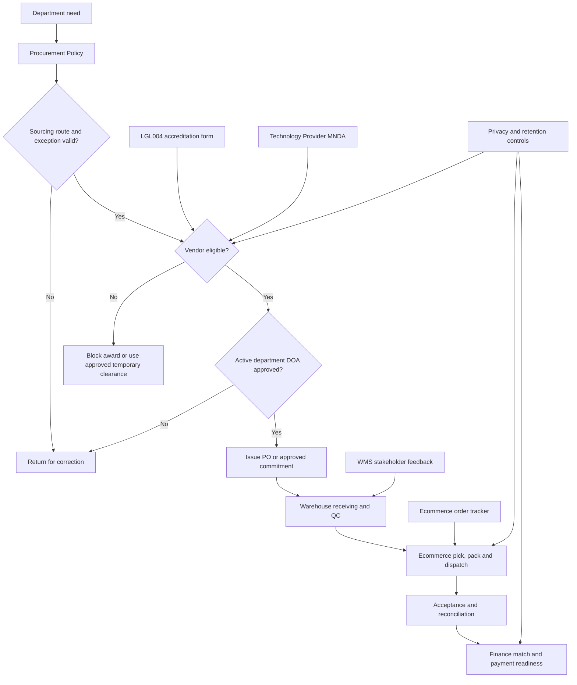
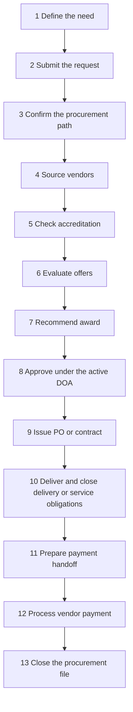
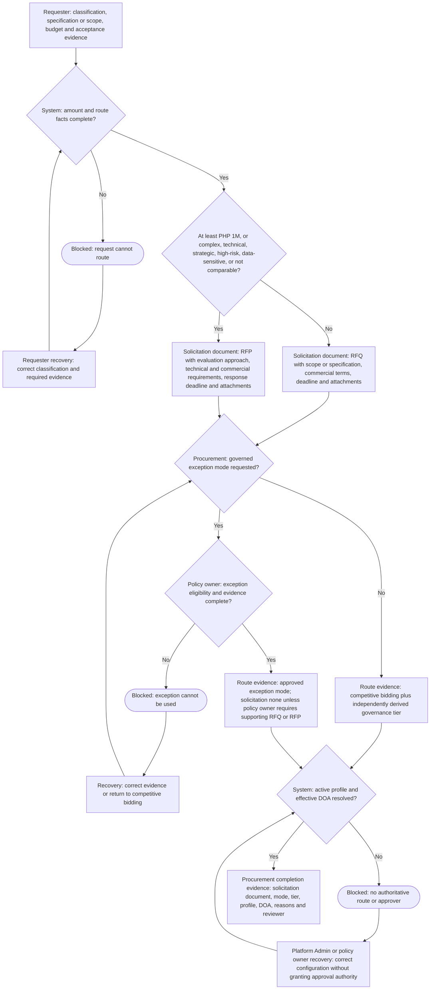
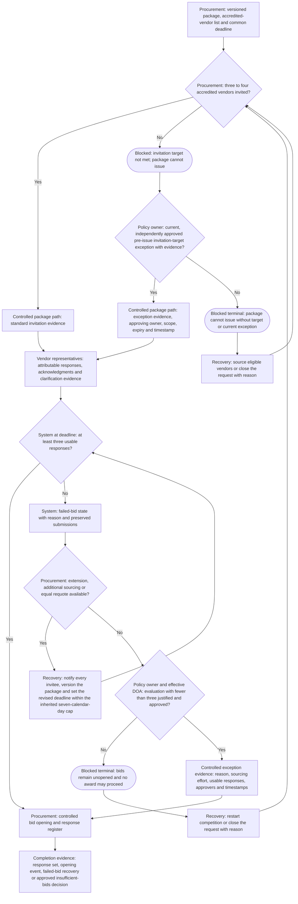
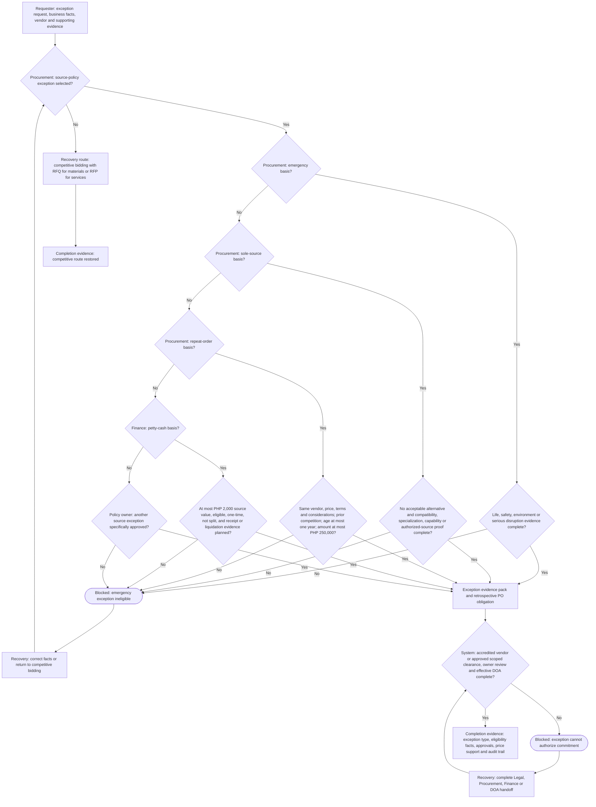
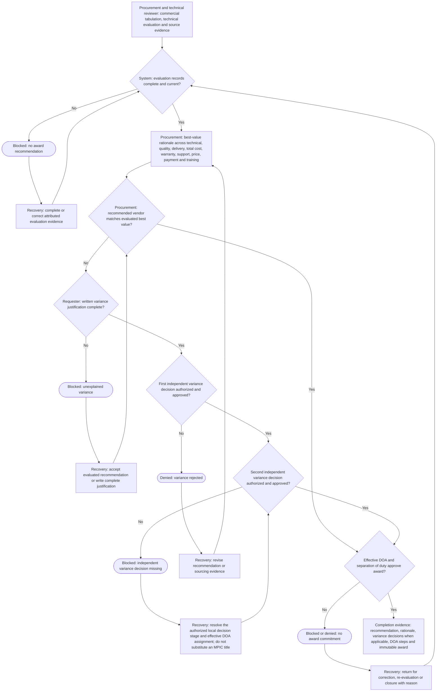
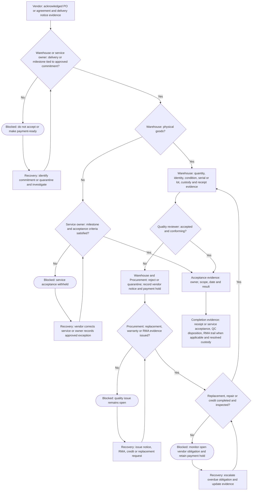
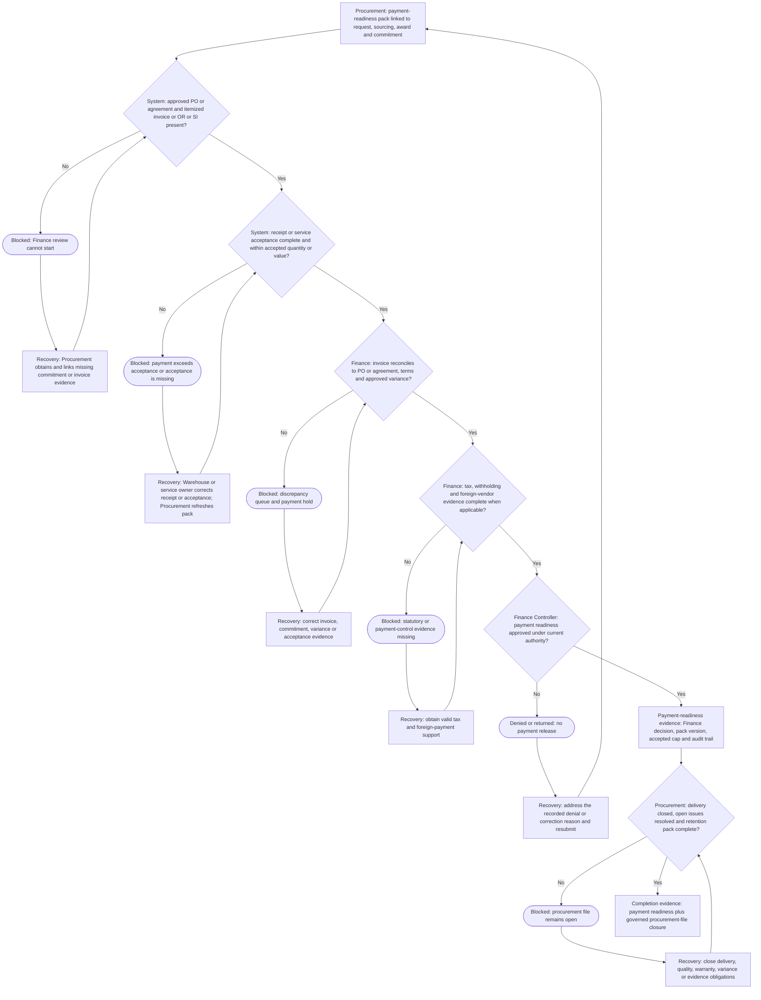

# Mwell Intra Process Reference Library

**Purpose:** Place the source basis for every governed process inside the standalone handbook.

**Control rule:** This HTML appendix is an operating extract and traceability register. The approved original maintained by its business owner remains authoritative when wording differs. Do not replace a signed agreement, approved policy, active DOA revision, or completed form with this summary.

## Reference Register

| Reference document | Format and authority | Processes governed | Business owner | Handbook treatment |
| --- | --- | --- | --- | --- |
| `mWell Procurement Policy and Procedures - Revised Modern Visual - Word Updated.docx` | Canonical mWell operating source supplied for alignment; the document identifies itself as an updated visual draft for review | Request intake, route selection, exceptions, competition, accreditation, approval, commitment, acceptance and payment readiness | Procurement, with Legal, Finance and the active department DOA owners | Primary operating basis. The app must not activate a profile derived from this source until its document status is approved. SHA-256: `51F4E381CF7DEC6A1950867C4839750078DB08D603A5DE8AA54B63D12F6D1239` |
| `MPIC Procurement Policy February2025.docx` | Incorporated reference named by the canonical mWell source | Numeric thresholds, timing and control practices that mWell has not replaced | MPIC source owner; mWell Procurement decides whether a control is inherited | Reference-only extract in `MPIC_PROCUREMENT_POLICY_FEBRUARY_2025.md`; inherited controls must retain visible provenance and cannot override the canonical mWell source or active DOA |
| `LGL004-Vendor Accreditation Form 2.0 (3).pdf` | Approved vendor accreditation form, version 2.0 / 2025 baseline | Vendor identity, declarations, entity evidence, qualification and accreditation | Legal / Vendor Management | Required fields, entity branches and declarations are reproduced below |
| `[MNDA]- Tech Service Provider.docx` | Controlled legal instrument template | Technology-provider confidentiality, privacy, execution, expiry and return/destruction | Legal | Operational clauses and lifecycle controls are reproduced below; the executed instrument controls the parties |
| `Ecomm-Order Page.xlsx` | Warehouse operating tracker supplied by stakeholders | Ecommerce order intake, customer/address data, payment, product lines, dispatch and reconciliation | Operations / Warehouse | Tracker fields are mapped to Intra fields and exports below so the spreadsheet is not re-entered |
| `wms comments (1).pdf` | Approved stakeholder feedback baseline for the August 2026 WMS release | Receiving, fulfillment, bundles, QC, delivery proof, department requests and returns | Operations / Warehouse | Accepted requirements and released behavior are summarized below |
| `Mwell_Intra_Feature_Roadmap_and_Cost_Analysis_v5_erp_benchmark_adjusted.xlsx` | Planning and benchmark source | Product scope, release sequencing and future capability assessment | Product / Steering group | Traceable launch items are maintained in the Requirements Traceability Matrix; roadmap-only items remain proposed |
| Active department DOA revision in Mwell Intra | Governed system record; effective-dated and immutable after activation | Named approval authority by department, category, amount and delegation | Department owner; administered by Platform Admin or Legal Admin | The active revision controls. Draft and temporary lists have no approval authority until activated |
| Republic Act No. 10173 and approved retention schedule | Regulatory and internal control source | Personal-data handling, evidence access, retention and deletion | Privacy, Legal and Information Security | Operational handling and retention rules are maintained in the security and retention sections |

## Current Persona Register

Mwell Intra uses the following 11 operating personas. Policy labels, job titles, and module role codes are scoped capabilities or control labels, not additional personas and not authority by themselves. Detailed permitted actions, prohibitions, handoffs, recovery paths, and application routes are maintained once in the canonical role guides; this library remains the authoritative source for policy and process controls.

<!-- canonical-personas:start -->
| Current persona | Governed operating scope |
| --- | --- |
| Platform Administrator | Identity, minimum-role, configuration, audit, and authorized DOA administration |
| General Employee | Own requests and contributions before independent review or operational release |
| Operations Associate | Attributable physical Warehouse execution and custody evidence |
| Operations Lead | Warehouse control decisions, setup, exceptions, releases, variances, and assigned approvals |
| Procurement Lead | Procurement route, sourcing, vendor-readiness, commitment, and closure evidence |
| Finance Controller | Independent valuation, matching, settlement, and payment-readiness review |
| Legal & Compliance Lead | Vendor, legal-instrument, compliance, and authorized DOA control decisions |
| Marketing & Events Lead | Event demand, custody coordination, outcome evidence, and settlement submission |
| Product Owner | Product readiness, pricing, and go-live decisions |
| Leadership / Insights | Governed read-only cross-module analysis and source tracing |
| Vendor Representative | Own-organization application, declaration, evidence, and correction submissions |
<!-- canonical-personas:end -->

## Reference-to-Process Map

## Procurement Policy Operating Extract

Start with [Mwell Canonical Procurement Policy Alignment](policy/MWELL_CANONICAL_POLICY_ALIGNMENT.md). Consult the [maintained MPIC February 2025 extract](policy/MPIC_PROCUREMENT_POLICY_FEBRUARY_2025.md) only for an incorporated control that the canonical mWell source does not replace. Mwell uses three separate route axes:

| Route axis | Operating rule |
| --- | --- |
| Solicitation document | Use RFQ below PHP 1,000,000 when the requirement is clear and comparable. Use RFP at PHP 1,000,000 and above, or at any amount for complex, technical, strategic, high-risk or data-sensitive work. Importation adds controls but does not automatically force RFP. An approved exception may use none when policy permits. |
| Procurement mode | Competitive bidding is the default; sole source, repeat order, emergency purchase, petty cash, or another approved exception requires its own eligibility and evidence |
| Governance tier | Standard, formal bid, high-risk/special control, and the current effective DOA are determined independently from the solicitation document |

Requirement kind remains important for scope, acceptance and reporting, but it does not select RFQ or RFP. Mwell approval authority always comes from the current effective department DOA, never from an MPIC title, person, annex or amount.

**Activation blocker:** the canonical source identifies itself as an updated visual draft. The app stores that document status and refuses to activate a policy profile until Procurement records the source as approved. The incorporated MPIC timing control is represented as at least seven working days for the initial bid window and no more than seven calendar days for an extension, with visible inherited-source provenance.

### Canonical 13-step procurement-to-payment overview

The application may show additional controlled states for package issuance, failed-bid recovery, vendor acknowledgement, inspection, quality recovery and Finance review. These are system-expanded states mapped to the 13 policy steps; they are not extra policy stages.

### Solicitation document and type classification

### Bid quorum and failed-bid recovery

### Exception eligibility

### Best-value award and recommendation variance

### Receiving, quality and RMA

### Payment evidence and file closure

### Operating rules

- The requester records the need, line items, timing, budget context, business justification, alternatives, risk if not procured, technical scope and acceptance criteria. Requester preference is not route approval.
- Procurement confirms all three route axes and retains the applicable active-profile snapshot. Direct Award is a legacy label only where mapped to an approved exception mode; a checkbox is never approval.
- Invitations target three to four accredited vendors. Sealed-bid opening requires at least three usable responses or an approved failed-bid recovery/insufficient-bids decision.
- Every invitee receives the same versioned package, clarification and deadline notice. Technical and commercial evidence remains attributable.
- A differing best-value recommendation requires written justification plus a first independent variance decision and a second independent variance decision. These neutral stages are usable only after Mwell policy/DOA owners authorize the stages and the effective DOA assigns the actors; current code names are not authority.
- Do not activate a profile derived from the canonical mWell draft until Procurement records the source document as approved. The extension control is already modeled in calendar days and remains visibly attributed to the incorporated MPIC reference.
- The system resolves named approvers from the active department DOA by scope, amount, category, effective date and delegation. Self-approval is prohibited.
- A PO, contract or written agreement is issued only after request, route, vendor eligibility, sourcing, commercial, protection and approval evidence is complete. Material change returns to Procurement and DOA review.
- Warehouse records physical quantity, identity, condition, evidence, QC disposition and custody. The service owner records milestone acceptance. Procurement cannot manufacture either record.
- Finance validates the approved commitment, invoice or OR/SI, receipt or service acceptance, payment terms, tax/withholding, foreign-vendor support and resolved variance. A mismatch remains blocked until corrected.

## LGL004 Vendor Accreditation Operating Extract

### Common vendor facts and declarations

- Trade name and registration identity, contact number, business address, incorporation place/date, TIN, email and web/fax disposition.
- Principal and correspondence contacts, products/services, entity type, manpower, expertise, qualifications, certifications and completed projects.
- Truth and completeness certification, pending-legal-actions declaration or disclosure, consent to verification, and authorized signatory name, title, signature and date.
- A field that does not apply must be explicitly marked `N/A` with a reason; blank does not mean not applicable.

### Entity evidence branches

| Entity | Baseline evidence |
| --- | --- |
| Sole proprietorship | DTI registration, business permit, BIR 2303, three-year AFS, company profile, client/transaction proof, applicable privacy/cybersecurity evidence, bank proof, official receipt and NDA |
| Partnership | SEC registration, Articles of Partnership, notarized partnership resolution, business permit, BIR 2303, three-year AFS, company/client evidence, applicable privacy/cybersecurity evidence, bank proof, official receipt and NDA |
| Corporation | SEC registration, Articles and By-Laws, BIR 2303, three-year AFS, notarized Secretary's Certificate or Board Resolution, current GIS, business permit, company profile, expertise/client evidence, applicable privacy/cybersecurity evidence, bank proof, official receipt and NDA |
| Foreign vendor | Approved equivalent home-jurisdiction evidence plus applicable importation, tax, payment and risk controls |

### Technology-provider qualification

When applicable, capture the selected technology pool and evidence for database, frontend, backend/API, mobile, cloud, performance, architecture, DevOps, delivery history, named technical team, UI/UX, project management, business analysis, QA, agile delivery, cybersecurity and privacy. A certification is mandatory only when the approved form, law, policy, risk classification or engagement-specific Legal decision requires it.

## Technology Provider MNDA Operating Extract

- Use correct legal names, addresses, purpose, contacts and authorized signatories for both parties.
- Limit confidential information to the potential transaction and need-to-know representatives.
- Record execution and effective dates. The instrument remains effective until the earlier of two years from execution or the definitive agreement, unless the executed text states otherwise.
- Preserve Data Privacy Act obligations and required consent confirmation when personal data is handled.
- Track written return/destruction requests and the five-business-day completion deadline, subject to the executed instrument's legal and retention exceptions.
- Preserve amendment, governing-law, dispute, notice, assignment, publicity, remedy and counterpart terms in the executed version.
- Never generate an instrument from a template containing an unrelated vendor or stale party detail.

## Ecommerce Tracker-to-Intra Mapping

| Tracker information | Intra record | Entry point and control |
| --- | --- | --- |
| Order number and order date | Fulfillment order identity and timestamps | Import or create once; duplicate external order IDs are rejected |
| Shop or sales channel | Controlled sales-channel value | Choose the released channel value; unknown values fail validation |
| Customer name, contact and address | Customer and delivery destination | Address presets assist but the operator confirms province, postal code and service area |
| Payment method, payment reference and Maya status | Order payment fields | Maya status is required only when applicable; Finance evidence remains role-controlled |
| SKU, product, quantity and selling price | Order lines and Product-owned commercial snapshot | Product owns selling price; Warehouse cannot edit it during fulfillment |
| Bundle identity and set quantity | Bundle flag, generated set ID and component scans | Each physical set receives its own set ID; ordinary quantity is not automatically a bundle |
| Rack/bin and serial number | Pick source and serialized pick evidence | Scan the displayed location before each serialized unit; wrong-location and duplicate scans fail |
| Packaging supply | Packaging-consumption lines | Scan or select pouch, box, paper bag, label, wrap, tape or approved freebie consumed by the order |
| Waybill, courier and tracking | Dispatch fields | Waybill and courier are required before release; failed-delivery status remains traceable |
| Proof and release/handover details | Uploaded proof, release event and generated handover reference | Proof is uploaded directly; release is attributable to the acting user and timestamp |
| Delivery outcome | Delivery tracking and closure | Delivered, failed delivery, return-to-sender and other allowed outcomes require role authority and evidence |

The **Export current view** function produces one row per order line with order, customer, address, payment, product, commercial, dispatch, handover and audit fields. It is a controlled handoff, not a second tracker that users must maintain.

## WMS Feedback Reference Extract

- Receiving exposes PO and delivery-receipt references, delivery date, batch/lot or serial details, evidence and a legible receipt-line table.
- Fulfillment supports order and event work in a list/table view, bulk order intake while automation is pending, bundle/set identification, rack/bin scans and serialized picking.
- Quality Control records disposition, evidence, reason and the resulting putaway, hold, quarantine or vendor-return path.
- Delivery updates include a generated handover reference and direct image/proof upload with explicit permission checks.
- Department requests support multiple line items in one request and preserve allocation, issue, outcome and reconciliation.
- Returns distinguish a specific event return from a specific receiving/fulfillment return and use serial lookup to preserve origin.

## Document Ownership and Change Control

1. The business owner approves changes to the governing original.
2. Product and Engineering update the mapped controls, procedures, tests and this reference library in the same release.
3. Legal reviews changes to accreditation, privacy, confidentiality, retention or instruments.
4. Finance reviews changes to DOA, valuation, payment, tax, write-off or reconciliation controls.
5. Operations validates Warehouse, fulfillment, return, event and custody behavior in UAT.
6. The release manifest records source checksums and the deployed commit. A changed source with an unchanged handbook blocks release certification.

## Flow-First Handbook Source Rules

The standalone handbook renders its governed operational journeys from the maintained manual. Each of the following journeys must lead with an overview flow, completion criteria, role/handoff view, and a decision/exception view: procurement to payment, vendor accreditation, receiving and putaway, ecommerce fulfillment, returns and replacements, inventory release, event custody, and inventory integrity.

The overview is the primary lifecycle statement. Role and decision views explain who may act and what happens when normal progression is blocked. Diagrams complement, but never replace, source records, policy evidence, role assignments, or released application controls.
