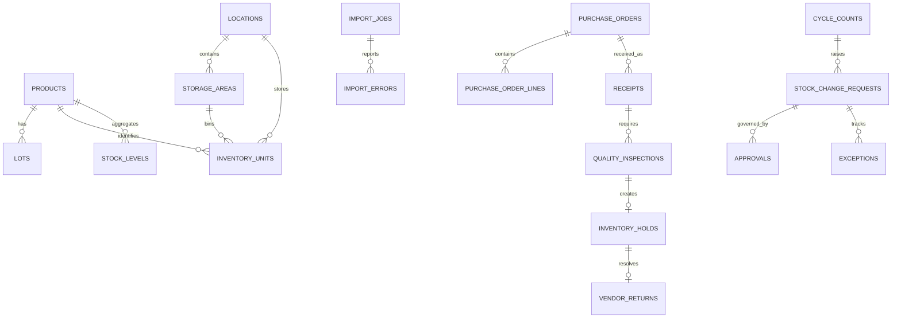

# Warehouse W1 ERD and Data Dictionary

## Entity relationships

## Core records

| Entity | Owner | Authoritative source | Sensitivity | Retention | Purpose |
| --- | --- | --- | --- | --- | --- |
| Product, lot | Warehouse Master Data | `warehouse.products`, `warehouse.lots` | Internal | Active + 7 years | SKU, cost, expiry and traceability master |
| Inventory position | Warehouse Operations | `warehouse.inventory_position_v1` | Internal | Current view | On-hand, commitment, hold and availability state |
| Movement | Warehouse Control | `warehouse.movements` | Internal audit | 7 years | Immutable inventory ledger |
| Receipt, quality, hold | Warehouse Quality | `warehouse.receipts`, `quality_inspections`, `inventory_holds` | Internal restricted | 7 years | Custody and disposition evidence |
| Cycle count, stock change | Warehouse Control | `cycle_counts`, `stock_change_requests`, `core.approvals` | Internal restricted | 7 years | Count evidence and maker-checker posting |
| Exception | Warehouse Control | `warehouse.exceptions` | Internal restricted | 7 years after closure | Operational exception queue and resolution |
| Import job | Warehouse Administrator | `import_jobs`, private Storage source | Restricted audit | 7 years | Immutable cutover source, checksum and reconciliation |
| Procurement PO | Procurement | `procurement.purchase_orders`, `purchase_order_lines` | Internal restricted | 7 years | Approved supply authorization handed to Warehouse |

## Calculation rules

| Metric | Rule | Source fields | Limitation |
| --- | --- | --- | --- |
| On hand | Bulk stock plus serialized units physically in `in_stock` or `returned` state | `stock_levels.quantity`, `inventory_units.status` | Returned units remain on hand but unavailable until QC disposition |
| Committed | Allocation quantity where status is `reserved` or `allocated` | `allocations.quantity`, `allocations.status` | Legacy allocations have no source location; the view assigns the product commitment once to its first stable position |
| Held | Quantity on active inventory holds | `inventory_holds.quantity`, `inventory_holds.status` | Released, vendor-return and written-off holds are excluded |
| Unavailable | Returned serialized units awaiting disposition | `inventory_units.status` | Active holds are reported separately and not double-counted |
| Available | `greatest(on_hand - committed - held - unavailable, 0)` | `inventory_position_v1` | Never reported below zero |
| Count accuracy | Exact-match submitted lines divided by submitted count lines | `bi_cycle_counts_v1.expected`, `counted` | Draft counts are excluded |

## Reporting views

All reporting views use `security_invoker = true`; source-table RLS remains authoritative.

| View | Grain | Personal data | Primary use |
| --- | --- | --- | --- |
| `inventory_position_v1` | Product, location, bin | None | ATP, reconciliation, valuation |
| `bi_movements_v1` | Movement | Actor identity excluded | Throughput and stock-flow BI |
| `bi_quality_v1` | Inspection and hold | Inspector identity excluded | Disposition and hold trends |
| `bi_cycle_counts_v1` | Cycle-count line | Counter identity excluded | Accuracy and variance trends |
| `warehouse_tasks` | Open operational task | Assignee UUID only when assigned | Due work and exception queue |

## Control invariants

- Business writes use guarded RPCs; authenticated clients cannot directly mutate controlled tables.
- Idempotency keys are scoped to actor and command, and payload reuse with different content is rejected.
- Hold release, stock approval and opening-balance apply enforce creator/approver separation.
- Procurement receipts require an approved or issued PO and cannot exceed remaining line quantity.
- Import reconciliation always satisfies `source = accepted + rejected + duplicate` before apply.
