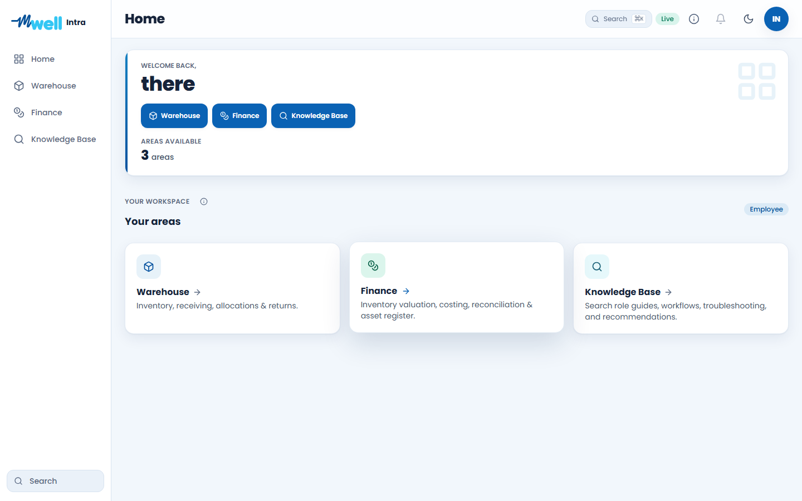
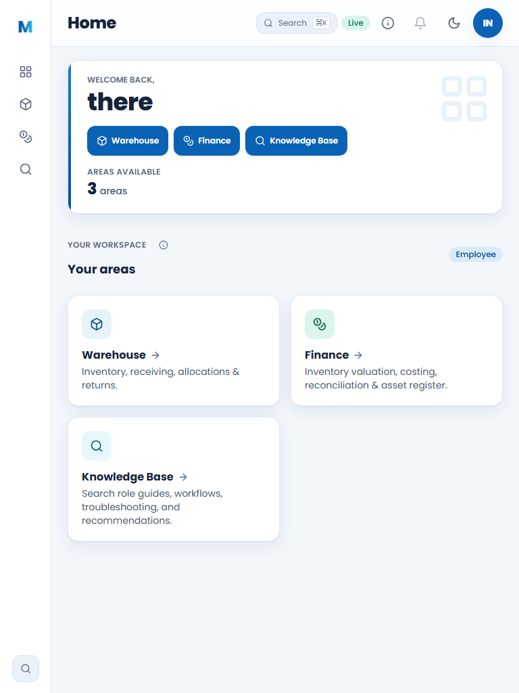
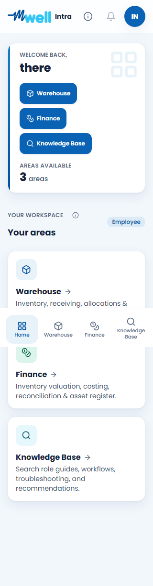

# Mwell Intra Vercel Launch Readiness Audit

**Environment:** https://mwell-intra.vercel.app  
**Production deployment:** `dpl_EsLaSE9mAXvNgdpZKkSUUXiyrVPg`  
**Git commit:** `54291869944ed4701082ab5b1ce89a3958a6a171`  
**Executed:** July 14, 2026 (Asia/Singapore)  
**Route evidence:** `test-results/full-intra-live-e2e-results.json`  
**Visual evidence:** `docs/audits/assets/2026-07-14-dashboard/`

## Verdict

**Conditional go for supervised operational UAT. No-go for unrestricted transaction launch until the governed live mutation certification below is complete.**

The deployed application passes authentication, role isolation, route rendering, responsive DOM checks, branding, module-area truthfulness, live Supabase schema cutover, static/security gates, and production health checks. No P0 application defect was found in the final deployment.

The remaining launch condition is a production transaction evidence gap: the final audit did not create live Legal, Procurement, Warehouse, Event, and DOA records because the reusable runner requires a privileged cleanup credential. That secret is intentionally not exportable from the Vercel release environment. Actual invitation email delivery was therefore not re-confirmed in this run. This credential must remain outside the application and be supplied only to a controlled CI audit job.

## Final Production Results

| Gate | Result |
| --- | ---: |
| Declared account types | 20/20 authenticated |
| Responsive viewports | 6/6 passed |
| Independent production sessions | 120/120 passed |
| Route checks | 1,026/1,026 classified correctly |
| Authorized rendered routes | 552 |
| Deliberate access-denied routes | 474 |
| Login failures | 0 |
| Expectation misses | 0 |
| Blank/error routes | 0 |
| Horizontal-overflow routes | 0 |
| Control-overlap routes | 0 |
| Dead-link routes | 0 |
| Unlabeled-control routes | 0 |
| Supabase/Next network errors | 0 |
| Browser console errors/warnings | 0 |
| Production visual captures | 6/6 passed |

The viewports were 1440x900, 1280x800, 768x1024, 390x844, 360x800, and 320x720. The personas covered Core Staff, Platform Admin, Vendor Portal, 9 Warehouse-oriented roles, 5 Procurement roles, and 3 Legal roles.

## Resolved Findings

### P0 resolved - Area count and visible destinations diverged

Warehouse Administrator previously reported three modules while only two quick destinations were visible. The dashboard count, hero links, workspace cards, and shell navigation now use one permission-aware `dashboardAreas` source. Warehouse Administrator consistently receives Warehouse, Finance, and Knowledge Base as three visible areas.

### P0 resolved - Workspace cards could be present but invisible

The critical destination grid inherited an animation state that could leave cards at zero opacity. Critical navigation cards now render deterministically. Rendered tests verify that all three cards are visible and usable.

### P1 resolved - Desktop logo was clipped and did not match the requested brand

The shell now uses the supplied mWell wordmark asset with an `Intra` lockup. The expanded desktop sidebar contains the complete mark and labels; tablet uses a compact mark; mobile uses the full lockup without colliding with header actions.

### P1 resolved - Mobile navigation labels were truncated

The mobile bar reserved a center-action slot even when no action existed. The empty slot is now omitted, and long labels wrap instead of being ellipsized. A regression test checks rendered label geometry at 390, 360, and 320 pixels.

### Prior launch blockers verified as cleared

- All 20 declared live test identities authenticate.
- Authenticated Supabase cutover passed across Core, Legal, Procurement, and Warehouse tables.
- Warehouse service-only command log remains denied to authenticated clients.
- Production health reports Supabase, client auth, static assets, invitation-delivery configuration, and service worker as healthy.
- Nine active DOA matrices cover nine departments; one draft matrix remains editable.
- Audited `QA-*` residue is zero in Core vendors, Legal invites/cases, Procurement requests/DOA, Warehouse storage areas, and Warehouse events.

## Outstanding Findings

### P1 - Governed live transaction certification is incomplete

The local production build passed the functional Warehouse, Procurement, Legal, policy, payment-readiness, and Knowledge Base suites. The live production audit passed all read/authorization routes, but did not execute the mutation runner's write/read-back/handoff/cleanup scenarios.

**Required before unrestricted launch:** run one traceable `QA-YYYYMMDD-8HEX` transaction at desktop and mobile through:

1. Vendor invitation, account activation, accreditation submission, correction, Legal review, Compliance decision, and actual email delivery.
2. Purchase request draft, validation, submission, department DOA routing, rejection/correction, approval, PO creation, and Finance handoff.
3. Warehouse location/bin creation, receiving, quality evidence, hold/release, putaway, stock ledger read-back, allocation, issue, return, cycle count, and adjustment approval.
4. Event creation and cross-role visibility.
5. Unauthorized, duplicate, stale-session, refresh, validation, correction, and role-handoff variants.
6. Database checkpoint verification followed by reviewed cleanup proving zero residual QA records.

Use a CI-only secret-manager credential with minimum required lifetime. Do not add a service-role secret to browser code, source control, screenshots, or general Vercel variables merely to satisfy the test runner.

### P2 - Actual invitation email delivery needs release-specific evidence

The health endpoint confirms that invitation delivery is configured, but this run did not send a new invitation because mutation cleanup was unavailable. Capture provider acceptance, recipient receipt, password setup, replay/expiry behavior, and failed-delivery handling during the governed transaction run.

### P2 - Auth connection allocation should be percentage-based before scaling

Supabase reports one informational performance advisor notice: Auth is capped at 10 database connections. Move Auth to percentage-based allocation before increasing the instance size so Auth can use the added capacity.

### P2 - Unused-index observations need telemetry, not immediate deletion

The performance advisor reports 151 informational unused-index observations. Many were recently added for foreign-key and governed query paths. Retain them until at least 30 days of representative production workload exists, then review size, scans, write cost, query plans, and integrity/join purpose before removal.

### Informational - Service-only command log has no client RLS policy

Supabase reports one informational security notice for `warehouse.command_log`. This is intentional: RLS is enabled, client roles have no table privilege or policy, and authenticated cutover confirms reads are denied. Adding a client policy would weaken the boundary.

## Security And Code Quality

- Supabase security advisor: 0 critical, 0 warning, 1 intentional informational notice.
- Production dependency audit: no known high-severity production vulnerability.
- Advisor hardening: 131 foreign-key/index controls verified.
- Policy-alignment schema: 17 governed tables verified.
- Warehouse W1 schema: 10 control tables, forced RLS, capabilities, and constraints verified.
- Unit suite: 242 tests passed across 21 files.
- Knowledge Base validation: 76 tests and 39 evidence requirements passed.
- RBAC suite: 38 tests passed.
- Local all-role route matrix: 68 tests passed.
- Local functional workflow suites: 84 passed and 6 explicitly skipped scenarios.
- Shell lint, TypeScript, production build, service-worker generation, and six-viewport rendered regression tests passed.

## Visual Evidence

### Desktop 1440

### Tablet 768

### Mobile 320

Additional captures: `desktop-1280.png`, `mobile-390.png`, and `mobile-360.png` in the same evidence directory.

## Launch Sequence

1. Run the governed live mutation certification from an isolated CI runner and archive its sanitized evidence.
2. Confirm actual invitation email delivery, expiry, replay prevention, and password setup.
3. Have Operations perform supervised device UAT using real Android/iOS phones and desktop browsers, with issue triage and named sign-off.
4. Promote from supervised UAT to normal use only after the mutation run cleans up successfully and leaves zero QA residue.
5. Monitor authentication failures, API errors, client-error telemetry, invitation delivery, and workflow latency daily during the first week.
6. Review Auth connection allocation before infrastructure scaling and review index usage after representative workload exists.

## Release Decision Owners

- **Engineering:** code, schema, deployment, monitoring, and cleanup-run evidence.
- **Security:** credential custody, advisor review, least privilege, and incident readiness.
- **Legal/Compliance:** accreditation policy, document/evidence, and decision-flow sign-off.
- **Procurement/Finance:** DOA tiers, approval ownership, PO/receipt/finance handoff sign-off.
- **Warehouse Operations:** receiving, quality, putaway, allocation, return, cycle-count, and mobile ergonomics sign-off.
- **Product owner:** final unrestricted-launch acceptance after all named owners sign.

