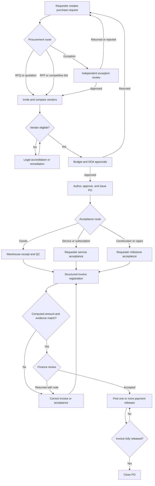

# Flow 01: Procurement to Payment

Date: 2026-08-04
Target: Mwell Intra UAT
Status: Remediated; release gates passed

## Intended flow

## Findings and remediation

| Priority | Finding | Resolution |
|---|---|---|
| P0 | RFQ/RFP existed in policy but had no operable sourcing record. | Added governed sourcing plans, invitations, responses, evaluation, award rationale, and closure. |
| P0 | Services and milestones were blocked by Warehouse goods receipts. | Added category-based goods, service, and milestone acceptance routes. |
| P0 | Finance could accept a pack but could not record payment execution. | Added attributable partial and full payment releases with unique references and automatic closure. |
| P0 | The invoice match was a user-controlled checkbox. | Replaced it with structured invoice fields and database-computed PO and accepted-value matching. |
| P0 | The requester responsible for non-stock acceptance could not open the linked PO. | Added own-request PO visibility and a requester acceptance route while keeping authoring and payment actions denied. |
| P1 | Insufficient competitive responses created a dead end. | Added submission and independent approval or rejection of an insufficient-bids exception. |
| P1 | Finance returns could be saved without actionable context. | A correction note is mandatory for every returned pack. |
| P1 | Department and cost center were free text. | Request entry now uses governed active choices and the database validates the pairing. |
| P1 | Acceptance value was not dependable for matching. | Added accepted commercial value and database derivation for goods receipts. |
| P1 | Procurement records were readable too broadly by module membership. | Tightened PO, sourcing, acceptance, and payment RLS to role authority or requester ownership. |

## Verification evidence

- Live UAT database transaction: RFQ plan, invitation, issue, response, vendor selection, non-stock acceptance, invoice rejection above accepted value, valid invoice, Finance acceptance, partial payment, final payment, and PO closure.
- Live UAT exception transaction: response shortfall, exception submission, independent approval, and sourcing closure.
- Both database simulations ran inside rollback transactions; cleanup checks confirmed no QA records remained.
- Supabase security advisor: zero findings after the schema changes.
- Supabase performance advisor: no missing foreign-key indexes introduced; unused-index notices remain for production telemetry review.
- Live requester RLS impersonation: own linked PO visible (`1`), another requester's PO hidden (`0`); rollback cleanup confirmed zero QA rows.
- Browser role handoff: passed at 1440x900, 1280x800, 768x1024, 390x844, 360x800, and 320x720.
- Browser assertions cover role switching, milestone acceptance, structured invoice entry, Finance acceptance, two payment releases, PO closure, persistence, and horizontal overflow.
- Desktop/mobile route crawl passed for Procurement Requester, Officer, Approver, Finance, Admin, and unified Finance, including access-denial correctness, dead links, labels, console errors, and overflow.
- All package tests, lint, type checking, and the production build passed. The local toolchain emits a Node 20 deprecation warning; the declared and deployment runtime remains Node 22 or newer.

## Controlled follow-ups

- Authenticate the same browser journey against UAT with a vaulted CI test account after test-account credentials are rotated and restored.
- Capture updated Knowledge Base screenshots from the deployed UAT build; existing payment screenshots must not be relabeled as the new screen.
- Review unused indexes only after representative production telemetry. No index should be removed from this audit alone.
