# Response to August 27 Warehouse Feedback

Source: August 27 section, pages 1-5 of `wms comments (4).pdf`.

Target: **Mwell Intra UAT**, https://mwell-intra-uat.vercel.app. This report does not certify or change the production site.

## Receiving and Inspection

**Reported:** Serial entry needed a scanner; different staff could not finish individual PO products independently; incomplete scans could not be saved.

**Change:** Each product has its own receive checkbox. Select only the products you are receiving, then reconcile each selected product's clean, damaged, unidentified, short and excess quantities. Open the scanner beside the correct product and physical condition. Camera scanning, a keyboard scanner and manual serial entry feed the same validation. Duplicate serials and scans beyond the entered quantity are rejected.

**Save progress** records an unfinished snapshot for the signed-in operator and PO. It does not receive stock, change quantities or reserve exclusive ownership of that PO line. Another operator has a separate snapshot. Reopening the PO restores saved work; changed PO quantities require review before submission. Concurrent final receipts are checked against locked server balances.

**Verified database behavior:** Four separate 100-unit SKU receipts were simulated through the live UAT RPC, alternating between Operations Associate and Operations Lead. Each receipt changed only its selected PO line, stored 100 unique serials, created a pending Quality inspection and active hold, and returned the same response on replay. All writes were rolled back. This was not a four-person simultaneous physical-scanner test.

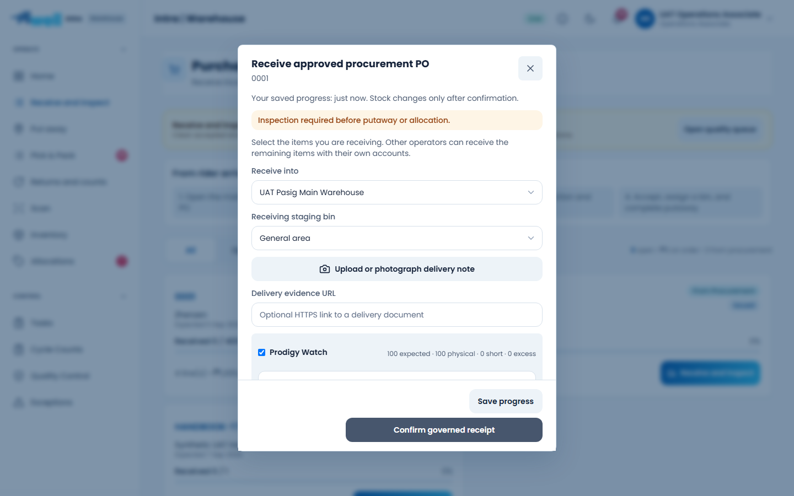

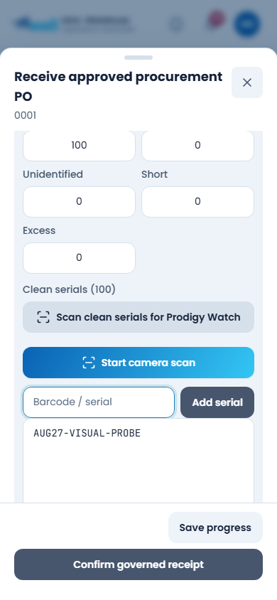

## Delivery Evidence

**Reported:** The team did not know where to obtain a receipt URL; an HTTP link caused a database constraint message.

**Change:** Use **Upload or photograph delivery note** directly in receiving. You no longer need to create a separate document URL. The optional **Delivery evidence URL** accepts a secure HTTPS link. An HTTP address receives a plain-language validation message before submission; the secure-evidence database constraint remains in place.

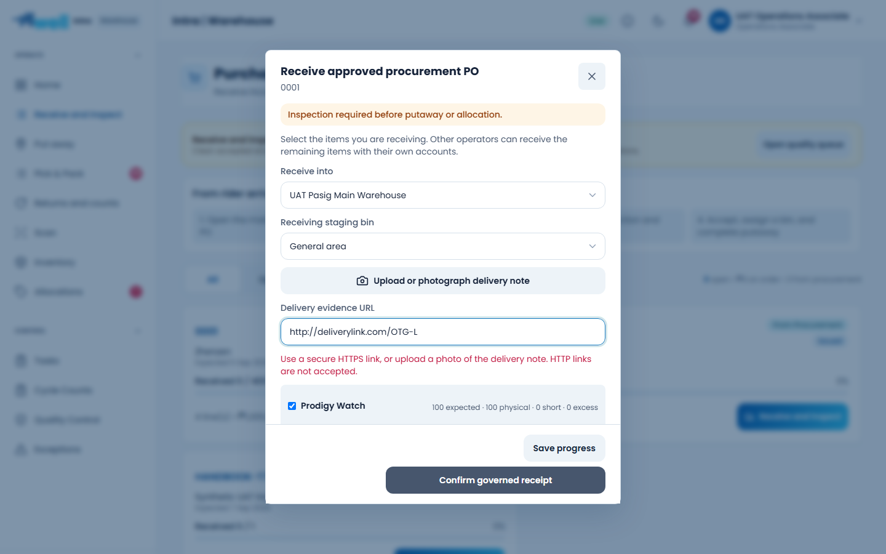

## Event Reservations

**Reported:** One event needed several products, including both selling and giveaway stock. Marketing needed a reservation action.

**Change:** Use **Add product** in New reservation. Each product line has its own quantity and **Selling / Giveaway** purpose. Combined demand for repeated products is checked against available stock before any line is saved. Marketing receives reservation authority through its applicable training requirement, not issue or approval authority.

Reservations remain acknowledged per-line commands, not an atomic batch. If a response is uncertain, the form locks, identifies confirmed saves, and directs the user to review recorded allocations before reserving only quantities confirmed missing. This avoids presenting an uncertain submission as a safe automatic retry.

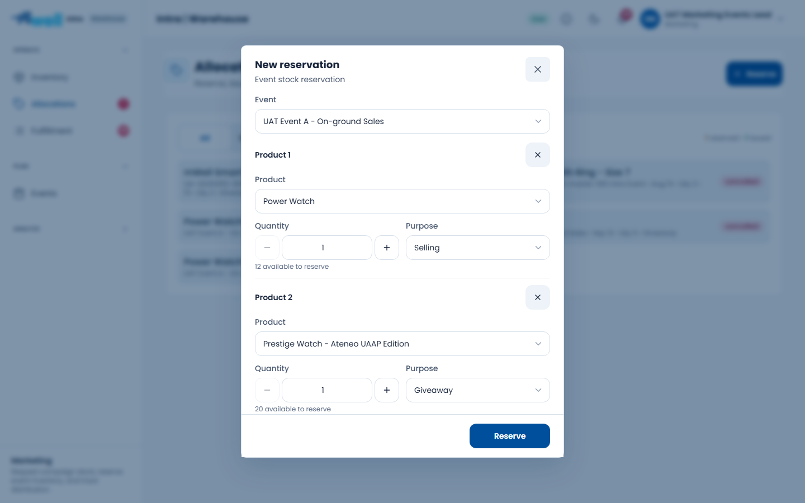

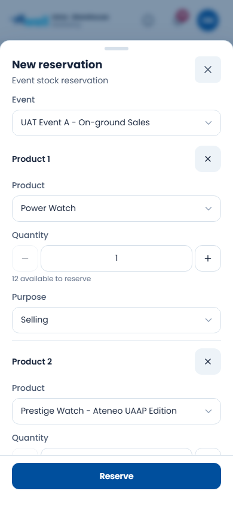

Marketing's synthetic UAT account completed the five-question assessment through the live interface on 28 August, scoring 100% on attempt one. Supabase records the passed attempt and active reservation certification. Existing attempts were not reset and completion was not inserted directly. The desktop/mobile follow-up confirmed reservation entry remains available after signing in again; issue and return actions remain absent.

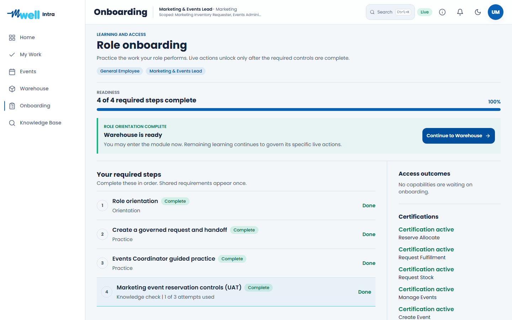

## Allocation Returns and Multi-Product Intake

**Reported:** The allocation return screen offered Restock, then rejected that action because the backend required quarantine. Returns receiving accepted only one product.

**Change:** Allocation returns now identify quarantine custody and no longer offer an immediate Restock disposition. Returns receiving supports several products, quantities and serialized identities in one intake. The selected source event and active destination/bin are validated. Invalid lines block the whole intake. Quality remains responsible for the final disposition; receipt of a return does not authorize resale or putaway.

Regression testing also checks lost responses, replay safety and the Quality queue after partially inspecting a multi-serial return.

**Live validation:** A return containing two serialized watches and three non-serialized bags was posted and read back inside a rolled-back UAT transaction. Replaying it created no additional movements. Pending returns did not change available-to-promise stock. An Operations Lead accepted one watch; availability increased by exactly one, while the other watch remained pending. This check caught and corrected a physical-stock/hold double deduction that isolated tests had missed.

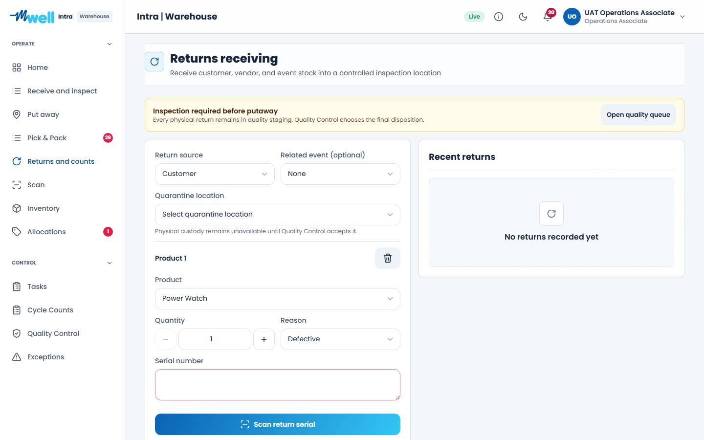

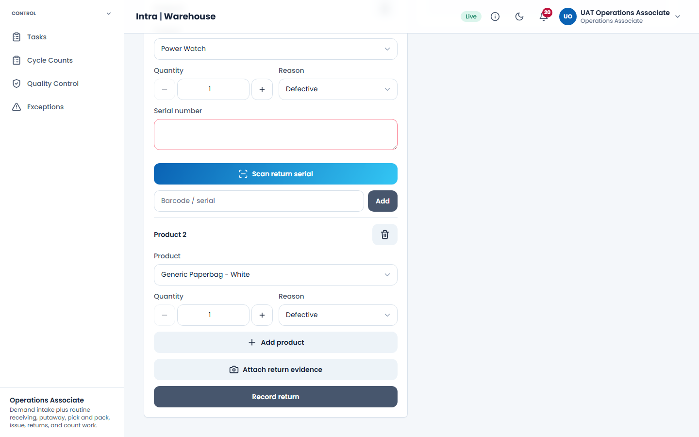

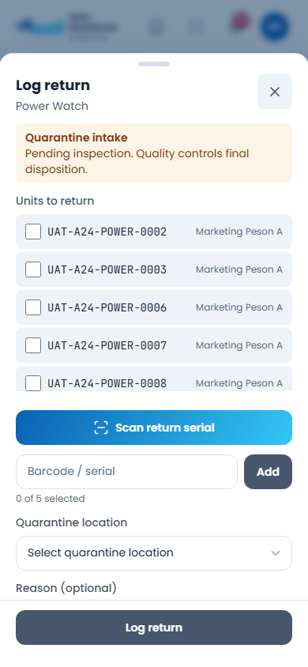

## Fulfillment Queues and Request Review

**Reported:** Queue counts were missing and approvers could not inspect a department request before deciding.

**Change:** Orders and events and Department requests display counts. Status counters act as filters. **View request** opens the requested items, quantities, request context and permitted decisions in a bounded dialog. Approval remains subject to role and independent-authority checks.

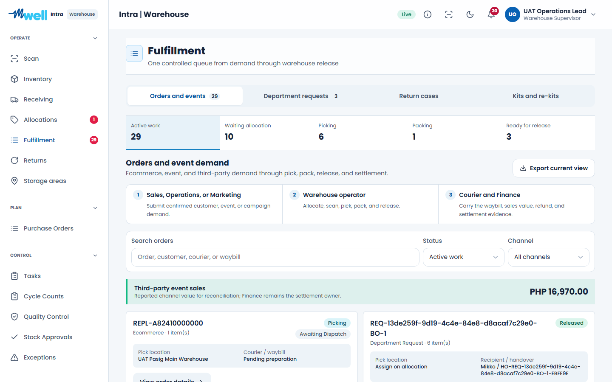

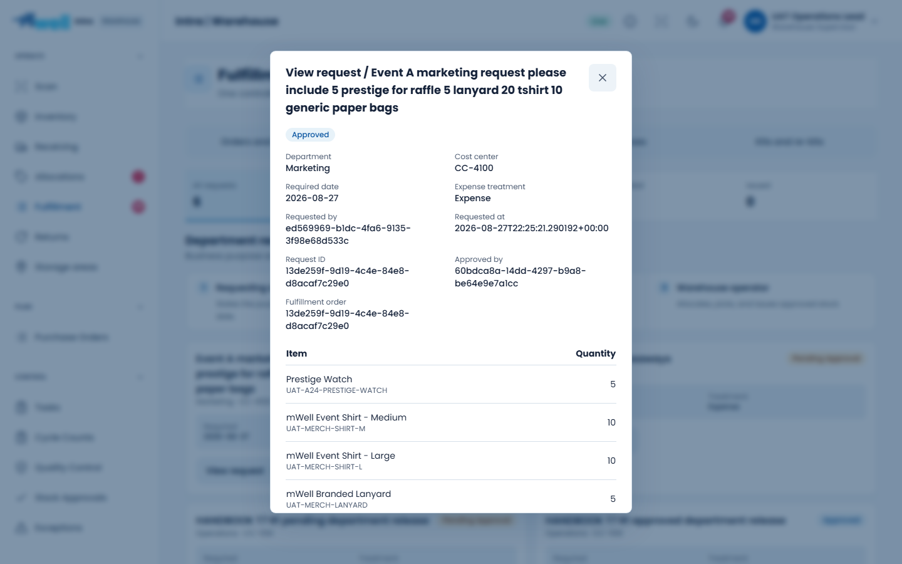

## Partial Backorders

**Reported:** A product that could not be supplied needed a zero fulfill-now quantity.

**Change:** A line may have zero fulfill-now quantity; its full demand moves to the linked backorder. The retained order must still contain at least one positive quantity, and at least one quantity must be deferred. Negative, fractional, excessive, all-zero and all-fulfilled splits are rejected.

**Verified database behavior:** The live UAT split command retained a positive line, deferred a zero line completely, preserved linked demand and replayed without duplication. The probe transaction was rolled back.

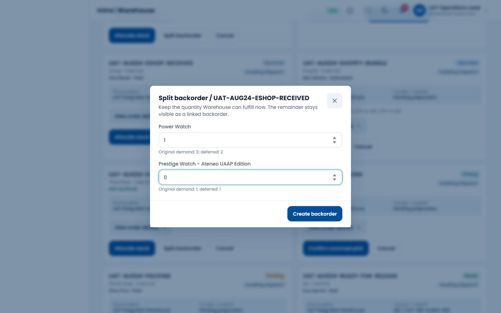

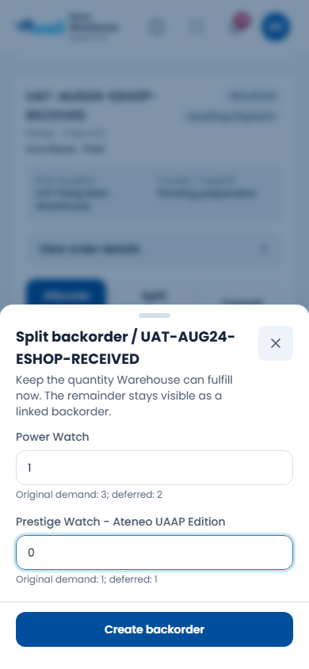

## Validation Record

Pre-deployment verification: 200 Warehouse component/logic tests, 142 data-repository tests, 135 Learning tests, 58 RBAC tests, 47 database regression tests, six training-publisher tests and 49 documentation-model tests passed. All 15 package typecheck tasks and the optimized Next.js build passed. Counts are per distinct test set, not totals inflated by repeated runs.

- Automated component/logic checks cover each changed workflow and negative cases.
- Database checks cover draft ownership, direct-write denial, stale revisions, capability revocation, bounded JSON, backorder validation and replay.
- Live authenticated probes cover draft save/read/isolation, independent PO-line receipts and backorder persistence. Operational probe writes were rolled back.
- The deployed application is commit `ef22d20`, Vercel deployment `dpl_7PxZBKV4qnpb8pcU43VXesp6GM43`. The public UAT alias and `/api/health` identify the UAT Supabase project `kkoitlvydytdhlpxhuah`.

**Live browser results:** Ten targeted cases passed: five workflows at desktop 1440 x 900 and mobile 390 x 844. Two additional Marketing access checks passed, preserving the completion earned during the first live assessment run. These are 12 distinct browser cases, not a certification of all Intra roles and modules. The affected personas are Operations Associate, Operations Lead and Marketing & Events Lead.

Receiving was saved through the UI, read back after reload and cleaned up by its exact actor/PO/revision. The other browser scenarios exercised controls and validation without posting operational receipts, reservations, returns or backorders. Their server transactions were tested separately in rolled-back UAT probes. No production transactions were performed.

The first browser runs exposed test-harness assumptions: the pre-certification Allocations page is access-denied, successful assessment completion closes its dialog, the upload control has a hidden file-input counterpart, and the page action is labelled Reserve. These assertions were corrected to match inspected source and the live DOM. The final tests still require the protected pre-training state, durable completion, correct control, and negative validation. Tracing is disabled to keep credentials/session tokens out of shareable artifacts.

Screenshots were visually reviewed, with horizontal overflow checks and explicit dialog bounds checks. Captures wait for dialog animations to finish; the first return screenshot had caught a partially opened sheet. The standalone HTML report embeds the images, supports search and section navigation, and lets reviewers enlarge screenshots. It was checked at desktop widths 1440 and 1920, including image loading, search, navigation and keyboard dismissal.

**Tester data preserved:** PO `0001` still has four 100-unit lines with zero received. The live verification found zero rollback-probe command records and zero rollback-probe serials. The test operator's receiving snapshot body is cleared; its revision tombstone is intentionally retained for stale-write protection. No other tester's saved work was reset.

The before-release UAT browser run reproduced the absent Save progress control. Its screenshot is preserved as the comparison baseline:

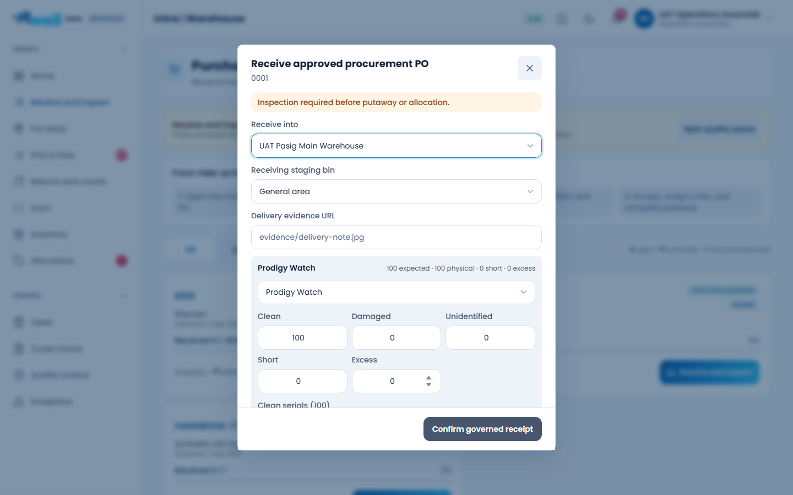

## Operational Acceptance

Before operational rollout, have the warehouse team rehearse four actual people scanning their assigned products, camera permission denial, poor connectivity, a paused receiving shift, and independent Quality handoff. Use distinct accounts. A draft is private progress, not a lock on a product.

Keep using the seeded UAT POs, stock, events, department requests and orders. Do not reset other testers' progressed records to reproduce a screenshot. Hardware camera optics, printing and real courier execution are outside this targeted software regression.

## Follow-Up Improvements

The request-review dialog still shows technical user IDs and raw timestamps in its audit metadata. A subsequent usability improvement should resolve permitted display names, format timestamps locally and place technical IDs in expandable audit details. The requested items are now readable, but the metadata is not yet as approachable as it could be.

The multi-product return form is long on a narrow screen. Its sections and actions remain reachable, but a compact line summary would make reviewing larger returns faster. Reservation writes remain per-line; an atomic multi-line server command would provide a stronger all-or-nothing guarantee than the current explicit recovery flow.
