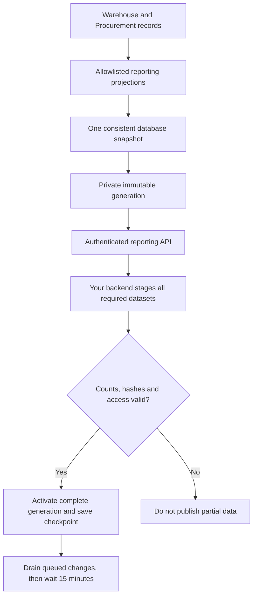

# Data Team Handoff

## Start Here

**What you can do now:** review the data contract, confirm your backend and database, and agree the reconciliation totals. **What you cannot do yet:** connect a dashboard to the proposed reporting API. The API, connector and machine credentials have not been delivered.

We are keeping your existing custom dashboard. The proposed integration would supply Warehouse and Procurement reporting data for all approved departments and locations, with a full first load followed by a 15-minute polling schedule. This is a reporting design, not permission to approve requests or move stock, and not a delivery commitment.

| Item | Current position |
| --- | --- |
| Application | Canonical UAT [mwell-intra-uat.vercel.app](https://mwell-intra-uat.vercel.app/); availability/build must be reconfirmed before use |
| Reporting integration | Security libraries implemented; field mapping and private authority work tracked in the engineering evidence appendix. No connectable service yet. |
| Initial scope | Warehouse and Procurement; all approved departments and locations |
| Consumer | Your custom application's backend, not its browser |
| Suggested connector | Node/TypeScript with PostgreSQL adapter; actual team stack still needs explicit confirmation |
| Timing | Poll every 15 minutes; not a guaranteed 15-minute end-to-end freshness SLA |
| SMTP | Not required for the proposed machine-to-machine connection |
| Handoff status | Engineering foundation for review; connection acceptance not started |

**First meeting outcome:** record a technical contact, target database/runtime, reporting owner, approved fields and retention rules. Do not send passwords, private keys or database connection strings in the meeting notes.

## What Data Is Included

The proposed contract contains **30 datasets**, grouped below. The draft field dictionary and source map are included for review. They distinguish observed source columns from proposed output fields, exclusions and unresolved relationships. They do not approve disclosure or create reporting projections. Every dataset remains unavailable until its implementation and disclosure checks pass; an unavailable dataset must not look like a successful empty result.

| Group | Proposed datasets |
| --- | --- |
| Warehouse reference | products, locations, bins, lots, kit_definitions |
| Stock and custody | inventory_units, inventory_positions, movements, holds, allocations |
| Inbound and Quality | receipts, inspections, vendor_returns |
| Fulfillment and returns | department_requests, fulfillment_orders, shipment_events, return_cases |
| Counts and conversion | cycle_counts, rekit_work_orders |
| Procurement reference and demand | suppliers, requests, approvals |
| Sourcing | sourcing_events, quotations |
| Orders and Finance handoff | purchase_orders, purchase_order_lines, amendments, receipts, payment_readiness |
| Cross-module joins | reference.links |

Names above use the `warehouse.` or `procurement.` prefix for their group, except `reference.links`. The inline Dataset Catalogue appendix supplies all 30 fully qualified names, grains and proposed source mappings. A named source in the design is not a verified deployed reporting projection.

**Not included by default:** private drafts, passwords/tokens, bank details, customer contact/address data, personal profiles, document bodies, signed download links, free-text notes and raw unreviewed JSON. Still-sealed bid contents remain restricted. A requirement for one of these fields needs a specific disclosure decision, not a general request for "all data."

An initial full load means all retained, authorized records at one consistent point in time. It cannot recreate history that Intra never recorded. Existing movement, receipt and decision records provide their recorded history; snapshots are not a new event-by-event audit trail.

## How Sync Will Work

This is the **proposed architecture**, not a diagram of a deployed reporting service.

1. The backend obtains a short-lived token and checks environment, permissions and dataset availability.
2. The first run pins one snapshot and stages all required datasets. Users keep seeing the last complete authorized generation, if one exists.
3. The connector verifies IDs, schema, row counts, relationships and hashes before activating the new generation.
4. Later runs apply complete-record updates and deletion markers by stable ID. Repeated pages must not duplicate quantities or orders.
5. Data and the saved checkpoint become active together. The connector acknowledges afterward and catches up before waiting again.

Keep the full dataset boundary: a refreshed PO beside an old receipt or inventory balance can produce misleading totals. Do not publish each dataset independently while the rest are still downloading.

## Connection Checklist

| Input | Responsible team | Required decision |
| --- | --- | --- |
| Named technical contact and backup | Data | Who runs and supports the connector? |
| Backend runtime and database | Data | Confirm versions, network restrictions and scheduling method |
| Dataset and field approval | Data owner + Intra | Approve the exact disclosure bundle, including commercial values |
| API origin and contract version | Intra | Issued only after implementation and UAT verification |
| Token issuer, audience and client registration | Infrastructure / identity | Managed OAuth client-credentials profile; separate UAT and production |
| Private-key and DB secret references | Data | Approved backend secret manager, never browser code or git |
| Replica identity and progress storage | Joint | One registered primary replica and durable checkpoints |
| Viewer access and retention | Data owner + Security | Dashboard/export permissions, cache/backup retention and purge responsibilities |
| Support and incident contacts | Joint | Who disables access, investigates failures and confirms recovery? |

Do not use a shared tester account, scrape UI screens, or hand out a Supabase service-role key to get an early connection working. Existing interactive CSV exports are not certified as a complete unattended feed.

## Proposed API and Connector

**Design reference only. None of the endpoints or commands in this section is supplied as working software in this handoff.** Proposed base path: `/api/reporting/v1`.

| Interface | Purpose |
| --- | --- |
| `GET /connection`, `GET /catalog` | Validate connection, environment and approved dataset contract |
| `POST /snapshots` | Start or recover an idempotent full-load stream |
| `GET /snapshots/{id}` | Snapshot manifest, dataset counts, hashes and expiry |
| `GET /snapshots/{id}/datasets/{dataset}` | Bounded, immutable pages |
| `GET /changes` | Resume from the supplied checkpoint/cursor; do not construct it yourself |
| `GET /streams/{stream}/generations/{generation}` | Reconcile a complete incremental generation |
| `POST /checkpoints`, `GET /status` | Acknowledge local completion and monitor freshness |

The draft field dictionary is included in the engineering downloads. A checked OpenAPI file, working sample responses, Postman collection, typed connector, PostgreSQL adapter and SQLite demonstration are **still deliverables**, not hidden somewhere in this package.

The intended operator commands are `doctor`, `sync --once` and `sync --interval 900`. Exact executable paths, exit codes and configuration keys must come from the tested connector release. Schedule one recurring mechanism only; do not run both an internal timer and an external 15-minute scheduler.

## Reporting Rules That Matter

| Do this | Avoid this |
| --- | --- |
| Join on documented opaque IDs and `reference.links` | Joining on SKU labels, names or display PO numbers alone |
| Preserve on-hand, held, committed and available balances separately | Calling all on-hand stock available |
| Count one physical receipt using canonical links | Adding Warehouse and Procurement receipt totals together |
| Preserve quantity units and money currency/decimal precision | Floating-point money or mixing currencies silently |
| Keep `null` as unknown/not recorded | Filling missing prices or dates with zero or today's date |
| Treat approval, delivery, acceptance and payment readiness as separate milestones | Reporting approved as delivered or payment-ready as paid |
| Replace a parent-owned line collection when stable child IDs do not exist | Using an array position as a durable line identity |
| Keep quality flags and unresolved links visible | Guessing legacy links to make a chart balance |

Reconcile at the **same generation**, not against a live screen that has since changed. Agree representative totals for stock by product/location, serialized units, received/accepted/rejected quantities, PO balances, fulfillment states and readiness packs. Record permitted legacy gaps rather than hiding them.

## Failures and Recovery

| Situation | Required behavior | Your next action |
| --- | --- | --- |
| Caught up | Keep checkpoint; wait for next poll | None |
| Network / 429 / temporary 503 | Bounded retry; respect Retry-After | Investigate repeated failure; do not launch many new full loads |
| Expired token | Renew; at most one same-request retry for an expired/unclassified 401 | Escalate a repeated 401 or disabled client |
| Revoked access / scope withdrawal | Stop and quarantine affected data, including dashboard caches | Follow approved purge and replacement-bootstrap procedure |
| Cannot reconfirm authorization | Hide data after its authorization deadline, at most 30 minutes under the proposed contract | Restore identity/connectivity; do not bypass access validation |
| Expired snapshot/checkpoint, 410 | Bootstrap again with valid authorization | Keep source records untouched |
| Count/hash/schema mismatch | Do not activate | Send request ID, generation, dataset and sanitized error |
| Wrong environment | Stop | Correct configuration before another run |

Capture and polling can each wait 15 minutes, with up to five minutes proposed capture time. Unfavorable alignment can take roughly **35 minutes plus ingestion**. Show captured time and last successful apply time; the proposed stale-data warning is over 40 minutes. These are design targets to measure, not observed service levels. Authorization expiry is independent of freshness.

## Acceptance and Ownership

**Intra Engineering owns:** projections and field mapping, API/worker implementation, stable identities, security boundaries, migration/deployment, generation integrity and operational monitoring.

**Data owns:** target database, backend secrets, connector scheduling, dashboard calculations, viewer/export access, cache/backup handling and recipient-side reconciliation.

**Joint acceptance requires:**

- One complete UAT bootstrap with counts and business totals reconciled.
- At least four consecutive incremental cycles, including create, update and delete behavior.
- Interrupted/resumed download and duplicate-page retry without double counting.
- Multiple queued generations and a published zero-change generation.
- Key rotation, revocation, wrong environment and withdrawn-field handling.
- No partial publication after failed integrity checks or access expiry.
- Representative-volume performance proof and no unacceptable source workflow slowdown.
- Signed dataset meaning, disclosure and retention decisions; a separate production approval.

The proposed performance gate is capture within five minutes and no more than 10% increase in representative Warehouse transaction p95 latency. If it fails, Engineering must revisit extraction architecture, not relax reconciliation.

| Acceptance item | Named owner | Evidence / decision | Status |
| --- | --- | --- | --- |
| Backend and database confirmed | To assign | Runtime/version/network record | Open |
| Dataset/disclosure contract | To assign | Approved dictionary and scope | Open |
| Reporting service and connector | Engineering lead to assign | Release tag, tests and UAT URL | Not built |
| Consumer reconciliation | Data lead to assign | Counts/totals and recovery results | Not started |
| Production access | Security + business owners to assign | Separate approval | Not authorized by this pack |

## References and Next Step

The HTML includes the proposed design, implementation plan, security review, engineering progress, draft source map and field dictionary as offline downloads. The Release Status identifies the exact deployed build and its test boundary. The September 20 design remains a proposal; the newer progress ledgers describe only the components actually tested. Neither is a penetration-test certificate or approval to disclose data.

**Next step:** Data confirms the setup checklist and reviews the draft field meanings. Infrastructure identifies the managed token issuer and deployment identities. Engineering then implements and tests the projections, capture/publication pipeline and recipient connector against that agreement. App certification and reporting-service acceptance stay separate. Nothing in this pack changes business workflows, grants credentials or enables a production connection.
