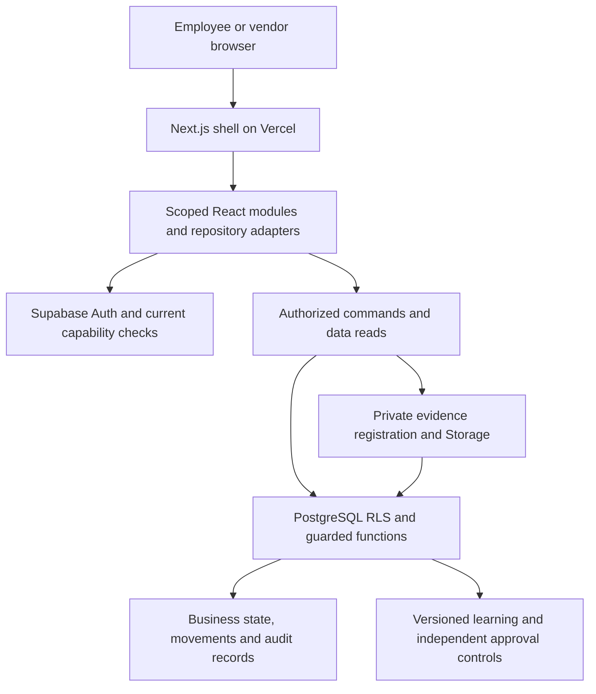

# Technical Team Handoff

## Start Here

**The app has a canonical UAT environment. It is not fully certified for production.** This pack transfers operating context and the remaining work; it does not record an accepted production handover. Current mutable evidence is in this pack's Release Status section, generated from the handoff-owned `release-status.json`. That file is not the application's main release-status file.

| Release fact | Evidence boundary |
| --- | --- |
| Canonical UAT | [mwell-intra-uat.vercel.app](https://mwell-intra-uat.vercel.app/) |
| Source reviewed | Exact application and reference revisions appear in this pack's Release Status and Source Review; use the full monorepo, not a branch name alone. |
| Live commit and health | Exact deployment ID, observed commit, backend and check time appear in Release Status. Do not reuse an older health observation for a new release. |
| UAT Supabase project | `kkoitlvydytdhlpxhuah` |
| Certification tracking | CI208 passed all 12 jobs on baseline 9823059. The newer release needs its own CI result, recorded in Release Status; the earlier pass does not certify changed code. |
| Release ownership | Engineering deployed the reviewed source, installed two scoped UAT migrations and ran the targeted live DOA approval check. Receiving-team acceptance remains separate. |
| Reporting API | Inactive security foundation and draft source mapping; no endpoint or connector in the running architecture below |
| SMTP | Explicitly deferred; no change or delivery-certification claim |

Health proves availability only at its recorded time, not workflow correctness, email delivery or security completeness. Earlier CI results are historical. Preserve the current run URL, application commit and complete job results when updating status. The reporting foundation and dependency update are a new candidate, not a documentation-only relabeling of CI208.

## Repository and System Map

Use the full Intra repository at the exact revision linked in this pack's Source Review, or a separately verified source-transfer archive of that revision. It contains `apps/shell`, `modules`, `packages` and the root pnpm workspace. **Do not deploy the older standalone Warehouse application.** No original developer directory is required. This release was authorized for UAT only. A Bitbucket import or source copy is not production deployment authorization. Do not use a dirty working directory as a certified release.



| Area | Source location | What the receiving engineer owns |
| --- | --- | --- |
| Shell, routing and endpoints | `apps/shell` | Auth lifecycle, route composition, environment and API entry points |
| Business workspaces | `modules/warehouse`, `procurement`, `legal`, `events`, `product`, `finance`, `insights`, `learning`, `work` | Workflow UI, domain contracts and scoped adapters |
| Shared platform | `packages/auth`, `rbac`, `data-kit`, `core-data`, `ui`, `config` | Identity/capabilities, data boundaries, outbox, design primitives |
| Database | `supabase/migrations` | Ordered, reviewed schema/function/RLS changes and effective runtime verification |
| Tests and certification | `scripts/qa`, `scripts/verify-*`, `.github/workflows/uat-live-certification.yml` | Unit/SQL/live tests, fixture isolation and evidence completeness |
| Documentation | `docs`, `apps/shell/public/knowledge`, `scripts/docs` | Technical/functional reference, in-app guidance and generated handbook |

Baseline stack: Node 24 for this tested release, pnpm 10.23.0, Turborepo, Next.js 16, React 19, TypeScript, Supabase PostgreSQL/Auth/Storage. The package manifest permits Node 22+, but the receiving team should use Node 24 to reproduce current certification. The lockfile is authoritative for installed versions.

## First-Day Setup

1. Obtain repository access and a clean checkout of the agreed branch/commit. Record local HEAD and preserve existing uncommitted work.
2. Use Node 24 and pnpm 10.23.0. Install from the lockfile; do not inherit the legacy Node 22 setting.
3. Request approved UAT environment values through the secret manager. Confirm the UAT project before any write-capable command. Never copy a production secret into local testing.
4. Start the shell and confirm its health/environment. Then run the non-live checks below.

```sh
pnpm install --frozen-lockfile
pnpm --filter @intra/shell dev --port 3022
```

Port 3022 is an example; use another free port if occupied. Stop the dev process before changing its environment. Configuration file selection follows the shell's Next.js runtime and local team setup; verify the resolved target instead of assuming a root `.env` was loaded.

```sh
pnpm lint
pnpm typecheck
pnpm test
pnpm build
pnpm verify:app-documentation-html
```

These are the receiving team's reproduction commands. Our clean-source results are recorded below; the receiver must run them again in their own environment. Historical evidence tests require the original Git history. Live certification/provisioning scripts can mutate UAT and require approved fixtures, credentials and cleanup. Read their environment guards before invoking them.

## Environment and Security Controls

### Reporting Foundation

The `apps/shell/lib/reporting` helpers validate short-lived access tokens, strict JSON and bounded transport, and verify canonical record/dataset hashes. The accompanying dictionary is a draft reviewed against source metadata, not an approved disclosure contract or working export. The authority migration and its test scope are documented in the bundled `reporting-authority-foundation.md`.

Keep reporting disconnected until the remaining security gates pass. Do not create a shortcut using a browser session, shared Supabase service-role key or direct operational-table access. The managed issuer, isolated deployment identities, approved projections, shared quotas, capture/publication pipeline, private storage permissions and recipient connector still need integration acceptance. An installed private schema alone does not prove any of those boundaries.

The deployment install uses `--frozen-lockfile` so Vercel reproduces the reviewed dependencies. See the dependency remediation ledger for exact package versions and tests. No new data-team credential or human business authority is granted by this foundation.

| Setting / resource | Required handling |
| --- | --- |
| `APP_ENV`, `SUPABASE_PROJECT_REF` | Match intended environment; UAT ref is listed above |
| `NEXT_PUBLIC_SUPABASE_URL`, `NEXT_PUBLIC_SUPABASE_ANON_KEY` | Public client configuration only; RLS and function authority remain essential |
| Server secret/service-role credentials | Server/CI vault only; never browser, report, git or data-team credential |
| `APP_URL` | Canonical HTTPS origin for hosted UAT; approved local origin for development |
| `NEXT_PUBLIC_DATA_SOURCE` / demo flags | Verify live mode; never enable memory/demo fallbacks for real UAT acceptance |
| `NEXT_PUBLIC_ENABLE_SW` | Service-worker behavior requires refresh/update and offline regression checks |
| Mutation guards / audit credentials | UAT-only, explicit run scope, dedicated identities, run-tagged fixtures |
| Vercel configuration | Full monorepo; project root `apps/shell`; inspect its `vercel.json` |

The current Vercel file pins the Knowledge server page to `hnd1`. Do not generalize that to all functions. Quality summaries avoid eager photo downloads; source evidence loads separately. Preserve privacy and authorization while investigating performance. Maximum-capacity certification is not established by these optimizations.

Core boundaries to preserve:

- Effective database authority, current identity, role scope and required learning govern commands; UI visibility alone is not authorization.
- Core Platform Admin is not automatic Warehouse, Legal or Procurement business authority.
- Combined roles do not waive maker/checker, receiver/inspector or releaser/recipient separation.
- Server transactions preserve stock, source references, evidence and audit history together. An uncertain response must recover the original command, not create another one.
- Private files require current authorized access. Durable registration IDs are not expiring preview URLs.
- Reporting grants will be read-only and separate from human sessions; no generic direct database access for dashboard consumers.

## What Passed and What Did Not

| Evidence | Result | Limit |
| --- | --- | --- |
| Full CI | CI208: all 12 jobs passed; complete cross-shard bundle verified | Automated suite certification, not production acceptance |
| Seller contract test | CI208 event custody and warehouse access contracts passed | An automated contract pass is not the live stock-to-Finance journey |
| Vendor upload authority | CI208 vendor application and independent Legal handoff passed on desktop and mobile, followed by cleanup | Independently provisioned case; invitation-email acceptance not certified |
| Onboarding automation | CI208 desktop/mobile first-login and isolated-identity learning gates passed | Automated learners are not a real participant pilot or business acceptance |
| Route and transaction coverage | Six route widths passed; 48/48 maintained workflows passed at each of 1440 and 390 pixels; both independent cleanups passed | Not 96 unique journeys, every possible transaction or exhaustive visual certification |
| Seller chain | Previously blocked final approval passed through live UI; unassigned eligibility denied and prior decisions unchanged | Downstream PO, receiving, seller outcomes and Finance proof remain open |

Do not add overlapping test counts as unique coverage. Do not relabel earlier screenshots with the current commit. A matrix job skipped by an upstream failure is not a successful test of that workflow.

## Release Verification

- Application commit: `9823059bbe08fd1949105a5901683188e5716115`. UAT deployment: `dpl_FTMPTes5Uj8v3sEcDc3uyz3vaPSy`. Runtime sources match 9989a0d; the successor corrects audit fixtures and contracts, not business permissions.
- Installed migrations: `20260922111953_procurement_doa_tier_guard.sql` and `20260922123940_procurement_final_approval_doa_authority.sql`. No blind migration replay; original public governed wrapper and prior decisions are preserved.
- Fresh locked source install and Vercel build passed. Workspace validation passed 44/45 tasks; the shell task's two failures were historical screenshot checks without Git history. Its full affected 32-test file passed with the original Git objects available. A copied ZIP alone does not carry those objects.
- SQL/CI regressions: 110 passed. Native PostgreSQL concurrency/regressions: 16 passed, none skipped. Production dependency audit: no known vulnerabilities found. This is not a penetration test or capacity certification.
- Live UI: named Operations Lead approved the existing synthetic PHP340 request; persisted status is Approved. Both prior approvals remain hash-identical. Unassigned Procurement Lead's eligibility is denied. Screenshots at 1440, 390 and 320 pixels have no page-wide overflow.
- Minor wording follow-up: the final approval confirmation still mentions forwarding to a next tier. It should describe final approval and PO readiness instead. This did not alter routing or saved state; keep it on the UX backlog.
- CI206 passed preparation and all six route widths. Its desktop run passed 47 of 48 workflows, including vendor submission and Legal readback. Both transaction widths failed only the DOA activation fixture because it chose the first alphabetical employee without the department-head role. Both independent cleanups passed. The corrected test selects distinct Operations Lead and Procurement Lead identities. Local audit/CI contracts: 173 passed, one explicitly live-only case skipped; the live case is exercised separately by the transaction run.
- CI208 passed all 12 jobs. Each transaction viewport passed 48/48 maintained workflows, including named DOA activation and vendor-to-Legal handoff. Both independent cleanup receipts report complete. Bundle artifact 10710067181 is retained locally with verified SHA-256 `25afc13332595d1a9b1688afca80fb9966a1f1a40fe73bf2e619121df4bde8ba`; GitHub retention ends October 22. Human participant testing, the separate seller chain, fresh production-backend bootstrap, backup/Storage restore and production go/no-go remain separate.

## Open Work Register

The September 22 event PR belongs to **Operations**, even though the event is managed by Marketing. Its first two approvals passed, but the software incorrectly required Procurement Admin for its assigned final approver. The better fix honors the approved DOA rather than replacing the Operations Lead with Procurement Lead. Draft `98055107-8114-4fd3-8916-0b756c77e259` remains inactive and is no longer the recommended workaround. Do not activate it or rewrite the PR. New policy versions do not silently replace existing snapshotted approvals.

The forward candidate `20260922123940_procurement_final_approval_doa_authority.sql` removes the final-tier admin-name requirement while retaining an active employee, current Procurement approval capability, training and exact next-pending assignee. It also requires exactly one current matrix and matching final assignment for the request's department/category/amount and frozen matrix version. Ambiguous, expired, revoked and stale authority fails closed. Final writes briefly take shared policy-table locks with immediate retry messaging during policy edits; eligibility is rechecked before saving. The private delegate is not executable by API roles. The live inbox uses server eligibility, while memory-mode tier rules remain unchanged. No active policy, role, learning or decision is rewritten. **Installed on UAT and deployed in 9989a0d; CI205 predates the fix.** Final local results: 110 SQL/CI checks (63 new, 18 prior, 29 contracts), 16 native PostgreSQL checks and 538 Procurement tests including 51 inbox regressions. Nonfinite policy limits and stale database snapshots fail closed. The inbox binds permission to the exact server step and current reviewed facts, closes stale confirmations and provides refresh recovery. These overlapping results are not full-app certification. Separate live proof now confirms the assigned Operations Lead can approve the existing synthetic request, while the unassigned Procurement Lead cannot decide it. Prior decision hashes are unchanged.

Earlier candidate checks and failed runs remain retained, not relabelled as new-build evidence. The live approval screenshots at 1440/390/320 belong to 9989a0d; its runtime source is unchanged in 9823059. CI206 passed the six route widths and exposed the DOA fixture-selection error. CI208 retests the final revision. Overlapping local, browser and SQL counts are not added together as unique coverage.

| ID | Priority / accountable role | Specific next action | Closure evidence |
| --- | --- | --- | --- |
| T01 | Closed / Engineering + QA | Exact deployed application 9823059 and CI208 outcome recorded. | Canonical health at 17:31:24Z; all 12 job conclusions and immutable bundle digest in Release Status |
| T02 | Closed / QA lead | Full automated certification completed after the fixture repair. | Six route widths; 48/48 workflows per transaction width; both independent cleanups; complete bundle |
| T03 | Journey gap / Warehouse + Events + Finance | Revalidate date-valid event fixtures; then execute procurement, receipt, independent Quality, putaway, pick/pack, separate release, acknowledgment, seller outcomes, return/recovery and Finance readback. | Same source IDs/serials across all actors; actual movements and balances; retained cleanup disposition |
| T04 | Closed / Legal + QA | Deployed signature-readiness fix passed CI208 vendor submission and Legal handoff at 1440 and 390. | Both transaction reports: vendor application legal prerequisite and legal submitted application handoff are successful; email acceptance excluded |
| T05 | Closed / Legal Engineering | Both CI208 scoped and independent cleanup receipts report complete. Earlier CI205 draft remains historical evidence, not an unresolved runtime failure. | Runs QA-20260922-0000519B and QA-20260922-0000519C; independent cleanup jobs 106855823269 and 106855823275 |
| T06 | Evidence gap / UX + business UAT lead | Review complete desktop/mobile screens, long forms, errors and deep links; recruit actual participants for first-use testing. | Screenshot review log and participant results; automated accounts labelled separately |
| T07 | Decision / Events owner + Finance | Approve a post-event correction process, accountable actors and audit evidence. Keep current closed-event restrictions until then. | Recorded policy and governed implementation/retest if changed |
| T08 | New development / Data + Engineering + Infra | Confirm stack, disclosure, identity provider and worker hosting; implement the separate reporting design. | Tested API/connector, reconciliation, security/performance evidence and consumer acceptance |
| T09 | Excluded / release owner | Record SMTP as deferred, including invitation/password-reset delivery coverage not exercised. | Explicit release scope decision; do not mark delivery passed from configured health flags |
| T10 | UX follow-up / Design + Engineering | Darken shared inline error text on the light-gray surface: the DOA Version error measured 4.17:1 against a 4.5:1 requirement. Show tier eligibility in the approver picker and correct final-approval helper wording. These observations are not erased by a green route audit. | Error-state contrast at least 4.5:1, named-actor selection tested, accurate final-step copy and desktop/mobile screenshots |

Closed items retain their evidence rather than disappearing from the register. Owners above are responsibilities, not named acceptances. Automated results do not close T03, T06, T07, T08 or T10; SMTP remains excluded under T09.

## Deployment and Rollback Runbook

### Before deployment

Record commit, target Vercel project, Supabase project, migration versions, approved change scope and rollback owner. Rehearse migrations on an isolated appropriate database. Back up through the approved process and verify a restore reference. Compare runtime function definitions/grants where wrappers or authority changed. No blind migration push across every file in a dirty checkout.

### Release sequence

1. Confirm authorization to deploy to **UAT**, not production. Freeze conflicting schema/master-data changes for the window.
2. Apply only reviewed migrations in dependency order; preserve signed evidence and audit history.
3. Deploy from a clean commit-bound source snapshot into the intended Vercel project.
4. Check candidate health, exact commit, UAT project and assets before moving the canonical alias.
5. Verify canonical health, then authenticated positive/negative smoke paths and the full agreed CI gates.
6. Record results, update operational guidance/handbook and publish a short tester update. Failed or skipped gates remain open.

### Stop and recovery

Stop writes for data exposure, unauthorized approval, corrupted stock, duplicate material movement, unrecoverable login or an unexplained inventory imbalance. Preserve record/command IDs and sanitized logs. The release owner decides containment and application rollback. Database recovery uses a rehearsed restore or reviewed forward correction; do not improvise destructive SQL or delete business transactions to make tests pass.

Database backup coverage does not by itself prove private-object recovery. Infra must demonstrate database **and Storage** recovery, approved RPO/RTO, retention and key recovery. These are handoff acceptance items, not established facts in this pack.

## Operations and Support

Monitor health/build identity, authentication/RPC denial trends, failed saves, evidence reads, queued conflicts, receiving/Quality/putaway backlogs, approval aging and inventory invariants. Track route and transaction p95 against an agreed baseline; no maximum-capacity claim is made here.

| Symptom | First checks | Do not do |
| --- | --- | --- |
| Access denied | Current role/scope, training, expiry and exact action | Add broad roles to bypass the issue |
| Unknown save result | Original command identity and saved record/history | Submit a replacement transaction blindly |
| Evidence not loading | Queue versus photo-read error, owner binding, object registration | Upload duplicates or make the bucket public |
| Report numbers differ | Same filter, source time, quantities and canonical links | Edit balances to match a spreadsheet |
| Wrong deep link / lost context | Original URL, redirect, role and encoded ID | Remove access checks to make navigation work |

Before support takes ownership, name the release manager, app engineer, DB/Storage operator, Security contact, business UAT lead and module owners. Agree support hours and response targets; proposed runbook schedules are not staffed commitments. Record P0 immediate containment, P1 core-flow blockers, P2 significant usability issues and P3 polish with an accountable owner and retest.

## Handoff Acceptance

| Required item | Current status |
| --- | --- |
| Repository, CI, Vercel and Supabase access transferred by approved channels | Receiving team's confirmation needed |
| Clean local setup and tests reproduced | Not performed by receiving team in this handoff |
| Exact release and migration inventory recorded | Reviewed source pinned; live commit and installed migration inventory still require recipient reconciliation |
| Automated CI complete | CI208 passed all 12 jobs on 9823059 |
| Separate high-risk seller journey complete | Open; final approval passed but downstream stock-to-Finance proof remains |
| Named support owners, alert destinations and escalation roster | To assign |
| Database/Storage restore drill, retention, RPO/RTO | Evidence required |
| Real-user UAT and visual review | Open |
| Production go/no-go | Not granted |

The inline Source Review appendix identifies commit-pinned technical/functional, cutover, policy, retention, issue-management and implementation references. The pack is usable offline; opening repository references requires authorized repository access. Their dated claims do not override Release Status. Secrets and the application source tree are deliberately not bundled.

**Separate decisions:** technical transfer means the receiving engineers can access, reproduce and operate the agreed system with named support owners. Tester readiness means accounts, fixtures, prerequisites and known issues are allocated for controlled sessions. Neither grants business acceptance or a production go/no-go. Each acceptance record needs a named decision maker, date, exact build, evidence and any time-limited exception.
