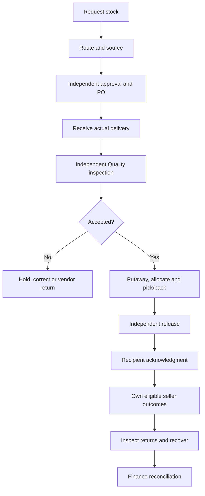

# Tester Handoff

## Start Here

Open [live UAT](https://mwell-intra-uat.vercel.app/), use your assigned test account, and work only on records allocated to your test run. **The automated release checks passed. This is still UAT, not production approval or your team's completed acceptance.**

The current changes are live on UAT as `9823059`. CI208 passed all 12 jobs, including desktop/mobile workflows and cleanup. We also confirmed the assigned final DOA approval through the app and checked the saved result. Your checklist starts as Not run so your own results stay separate from automation. Confirm your session's build with the coordinator, and do not switch to a more powerful account to get around a blocker.

**Before your session, ask the UAT coordinator for:** your account/password through the approved private channel, your scenario and record IDs, the next person's handoff slot, and the current known-issues list. Passwords are intentionally not in this document.

SMTP/email delivery is excluded for now. Use an already provisioned account. If your only path requires an invitation or password-reset email, mark that step **Blocked - email delivery excluded** and contact the coordinator. Do not mark it passed or create repeated invitations.

## Accounts and Responsibilities

This is the source-defined UAT roster, not a fresh login check for every account. The coordinator must confirm availability and training before allocating one. Only one person should use a shared test identity at a time; use separately provisioned accounts for simultaneous tests. Do not use `intra.ci.*` accounts, which belong to automated runs.

| Test role | Account | Main work |
| --- | --- | --- |
| General Employee | intra.test.employee@mwell.com.ph | Procurement/department demand and receipt acknowledgment where eligible |
| Operations Associate | intra.test.operations.associate@mwell.com.ph | Warehouse floor work, including receiving, putaway and Pick & Pack under assigned permissions |
| Operations Lead | intra.test.operations.lead@mwell.com.ph | Independent review, approvals and warehouse oversight |
| Procurement Lead | intra.test.procurement.lead@mwell.com.ph | Request routing, sourcing, PO and replenishment handoff |
| Finance Controller | intra.test.finance@mwell.com.ph | Financial review, payment readiness and event reconciliation |
| Legal & Compliance Lead | intra.test.legal.lead@mwell.com.ph | Vendor review, compliance and governed policy decisions |
| Marketing & Events Lead | intra.test.marketing.events@mwell.com.ph | Event coordination, demand and eligible recipient handoffs |
| Product Owner | intra.test.product.owner@mwell.com.ph | Readiness, pricing and approved conversion/recovery recipes |
| Leadership / Insights | intra.test.leadership@mwell.com.ph | Scoped reporting and source-record links, not stock mutation |
| Platform Administrator | intra.test.admin@mwell.com.ph | Controlled access and directory administration; not automatic departmental approval |
| Vendor Representative | intra.test.vendor@mwell.com.ph | Own vendor application, evidence and eligible PO acknowledgment |
| Synthetic Event Seller | intra.seller.uat.sep20@mwell.com.ph | Own assigned event and acknowledged stock only |

Some job personas deliberately combine scoped roles. Extra roles do not let someone approve their own work, inspect their own receipt or acknowledge their own release. Operations-only access is not warehouse execution permission; Business Unit request access is not allocation authority.

## Before Changing Anything

1. Confirm the UAT URL, your displayed identity, role and assigned training.
2. Open the allocated record and note its ID, current state, quantity and next responsible person.
3. Confirm the test data covers your positive and negative cases. Use synthetic names/documents only.
4. Check that the next actor is available. A request submitted without its approval/release/acceptance handoff is not an end-to-end pass.
5. Save the original link. After each confirmed action, reopen the record and check its saved result, not just the notification.

**Test-data warning:** September 20 and September 21 seller events are dated historical fixtures. Their assignments and saved stock state must be revalidated before use on September 22 or later. Do not extend/backdate them yourself. An approved request, linked order or planned serial manifest is not proof of ready-to-sell stock.

The coordinator should provide a new date-valid event and run-tagged data when needed, through normal permissions and approvals. Keep earlier tester records untouched. Planned serial numbers in a manifest do not mean those physical-unit records exist.

## The Main Handoffs



This is the event-stock journey. Ecommerce delivery and internal department requests have different final acknowledgment paths; not every order goes to a seller. Never skip a hold or acceptance step to reach the next screen.

## Onboarding and Everyday Checks

**ONB-01: First use and combined roles.** With a designated fresh learner, open the permitted workspace, inspect assigned requirements and start the relevant guided simulation. Complete the practice, return to the checklist and reload. Expected: progress belongs to that learner and exact assignment; unrelated authorized work remains accessible. Practice must not create live warehouse transactions. Repeat with a multi-role learner; similar role names must not merge distinct requirements. Existing completed test accounts cannot prove first use.

**NAV-01: Moving between screens.** Open My Work, follow an allocated record link, use Back and reopen the copied link in a fresh signed-in session. Switch browser tabs with an unsaved form open, without submitting. Expected: correct record and permitted context; a successful background check should not unnecessarily replace the form. A failed access check offers recovery rather than pretending no work exists. Save before leaving forms where unsaved-state preservation is not promised.

**SEC-01: Wrong-role checks.** Ask the coordinator for a denied route and another synthetic vendor/event record. Try to open them with your normal scoped test account. Expected: no unauthorized data or command. A denied action is a successful negative test only when the intended denial is confirmed; an unrelated loading error is not a pass. Stop immediately if private information is exposed.

## Procurement to Warehouse

**Operations approval fix is live:** final approval now follows the approved DOA, including the named department head within the allowed amount and category. We tested the existing September 22 synthetic request using its assigned Operations Lead: approval saved successfully, and the two earlier approvals stayed unchanged. The unassigned Procurement Lead was still denied. Keep the earlier replacement-approver draft inactive. You do not need extra roles or repeat training to work around the old error. This proves approval only; a PO, receiving, stock and seller-to-Finance checks are still needed for this scenario.

**The mobile layout fixes are live:** long approval emails, attachment details and Department hierarchy controls were corrected. CI208 passed the route/layout checks at all six desktop, tablet and mobile widths. Continue checking your actual records, long values and dialogs; those automated results do not replace your session's visual checks. Report any clipping or hard-to-tap control with the page and screen width.

| Case | Steps | Expected result and handoff |
| --- | --- | --- |
| PR-01 Request and correction | Requester creates a synthetic request with controlled department/cost center, goods/services classification, lines, estimate and required evidence. Save/reopen, submit, then use a separately authorized reviewer for return/correction or approval. | Draft and submitted states remain distinct. Invalid required fields point to the correction. Requester cannot self-approve. Record the resulting request ID and next owner. |
| PR-02 Sourcing and PO | Procurement confirms the route, prepares the appropriate sourcing package, uses approved vendor/evaluation evidence and independent decisions, then creates the eligible PO. Reopen dates and sourcing state. | Saved deadline and guidance match the actual state. No PO through a missing required approval. Do not use an exception solely to avoid a blocked normal path. |
| PR-03 Replenishment | Operations recommends quantity/reason from Inventory. Procurement accepts and completes the linked draft request with classification, controlled codes and evidence. Confirm the route separately. | Recommendation does not change stock or issue a PO. The linked draft retains the accepted item, quantity and reason. Retry must not make another request. |
| IN-01 Receive selected lines | Receiver opens an allocated issued PO, enters the actual delivery date, exact selected lines, quantities, destination, traceability and delivery evidence. Save a partial draft, reopen and submit the agreed lines. | Draft does not add inventory. Confirmed receipt has exact PO-line links and pending Quality/custody controls. Other open lines remain receivable. |
| IN-02 Receiving negatives | On separate allocated data, try a duplicate serial, wrong product/bin, invalid quantity and missing required evidence. Test short/excess/damaged conditions through their actual governed paths. | No unauthorized or duplicate stock. Clear correction and preserved valid input. Record the precise rejection; do not release a hold as a workaround. |
| QC-01 Independent inspection | A different authorized inspector reviews each unit/quantity and evidence, then accepts or records the appropriate rejection/hold. Reopen Quality and stock. | Accepted procurement receipt inspection releases its provisional hold as designed; no extra approval is invented. Held stock remains unavailable. Receiver self-inspection is rejected. |
| QC-02 Batch and evidence | Select compatible allocated inspections, review each item/serial and attach synthetic photos. Test one invalid item; separately retry a failed read without saving. | Rejected batch saves none. Queue/photo retry does not create an inspection or duplicate upload. Reopen successful records and confirm exact evidence ownership. |
| WH-01 Putaway and transfer | Move only accepted eligible stock, checking source/destination bin and serial. Try a held or wrong-bin unit separately. | Correct unit/bin history persists; rejected movement changes nothing. Same transaction is not repeated after an uncertain response. |

## Fulfillment, Returns and Counts

| Case | Steps | Expected result and handoff |
| --- | --- | --- |
| FUL-01 Ecommerce intake | Import/create an allocated synthetic order using the current template. Review original order/channel, lines, quantities, delivery, payment/commercial fields and instructions. Include a bundle and a normal item. | Invalid row is clearly identified. Required tracker fields stay in the app; Warehouse cannot override Product-governed price. Bundles retain their per-set identity. |
| FUL-02 Pick, pack, release | Operations Associate opens Pick & Pack, allocates eligible stock, scans exact bin/product/serials, records packing and required shipment evidence. A different permitted operator releases. | Order lines and serials survive reload; wrong product/bin/duplicate scans fail. One confirmed release creates one stock effect. Full details and next action stay visible. |
| FUL-03 Recipient / delivery | For internal demand, eligible recipient opens the issued Department request and uses Acknowledge receipt with reference/evidence. For courier orders, follow the delivery-proof path. | Internal receipt and courier delivery are not confused. Releaser cannot acknowledge their own release. Unreleased request cannot be acknowledged. |
| RET-01 Customer return | Find the original released order/serial, create allocated return intake, confirm quarantine, then independently review and resolve replacement/refund as permitted. | Original order remains linked. A replacement produces its linked fulfillment record with verified delivery details. Intake is not immediate saleable stock. |
| RET-02 Return negatives | Try duplicate intake, unrelated serial/source order, missing required evidence and a stale/unauthorized decision on isolated data. | No double return, no unrelated linkage and no bypass of current authority. Check saved case before retrying an unknown outcome. |
| CNT-01 Count and variance | Assigned counter runs a normal and a blind count with observed quantities/serials, then submits. Another permitted reviewer handles a material variance. | Blind mode does not reveal expected balances or variance before submission. Counter cannot self-approve; saved adjustment and movement reconcile. |
| REC-01 Interrupted save | In a coordinator-led drill, interrupt a designated safe test submission and reopen its recovery path with the same command identity. | Check/recover the original result; never generate a replacement transaction to get a success message. A confirmed rejection permits correction; unknown outcome does not. |

## Events, Product, Finance and Other Roles

| Case | Steps | Expected result and handoff |
| --- | --- | --- |
| EVT-01 Demand and seller waiting | Coordinator creates a new approved test event, assigns the named seller for its valid dates and submits multi-item demand. Separate approver reviews it. Seller opens event before stock is ready. | Exactly one linked order; no stock created by demand. Seller sees why they must wait; recording stays disabled until the actual release and acknowledgment prerequisites pass. |
| EVT-02 Seller outcomes | After eligible stock and acknowledgment, each assigned seller records their own sale/giveaway and reloads their entries. Test foreign event, other seller's entry, insufficient balance and duplicate retry separately. | Own eligible outcome only, one stock effect, correct balances; unauthorized actions fail. This entire successful chain still needs live certification. |
| EVT-03 Correction and return | Use the permitted reversal path for an erroneous outcome; keep original entry. Return exact eligible units, inspect independently and recover to base product only with an approved Product recipe and matching lineage. | No erased history, invented conversion or free stock. Reusable variants remain active; Product retires them when appropriate. Closed-event corrections require the unresolved policy decision. |
| PROD-01 Readiness and pricing | Contributor prepares allocated readiness/pricing work; Product handles its authorized review; Operations receives the linked handoff. Test stale version and self-decision. | Current version/evidence and independent decisions; Product metadata access does not confer custody access. |
| FIN-01 Payment readiness | Complete receipt/acceptance, then prepare the pack with registered invoice/supporting evidence. Finance reviews the exact PO/accepted value, including an eligible fully received Closed PO. | No artificial extra PO balance. Missing acceptance, wrong evidence, duplicate or stale decision blocks. Payment readiness is not proof of bank payment. |
| FIN-02 Event reconciliation | Finance follows the allocated event's movements, custody, seller entries, reversals, returns and evidence. | Source totals and owner scope agree. Review authority is current; no broad Warehouse access inferred from event role. |
| VEN-01 Vendor evidence | Already provisioned vendor opens their own allocated case, uploads an allowed original file, verifies registered filename after reload, completes declarations and captures a fresh signature before Sign and submit. Separate Legal reviewer opens it and requests a correction if appropriate. | The signing-date readiness fix is live. Vendor does not need a Legal role to upload. Saved securely confirms a draft, not submission: check the submitted status after reload and have Legal open the same case. If Submit is disabled, check remaining required fields, documents, declarations and signature; report a blocker if they are all complete. Wrong-case/requirement access must still fail. |
| ADM-01 Administration / DOA | Admin or Legal prepares an allocated draft directory/DOA change; another authorized checker activates when required. Verify canonical department, each named actor's approval role and denial of self-activation. | Choose the person approved for each tier, not simply the first dropdown entry. An active employee without the required tier authority cannot be activated. No free-text/unknown department grants; role revocation blocks current commands without expanding another user's authority. UAT test limits are not production policy approval. |
| BI-01 Leadership and reports | Read assigned dashboards, change filters, follow source links and request only authorized exports. | Scope and filter totals match sources; read-only role cannot approve or move stock. Existing exports are not the proposed unattended Data API. |

These are executable test instructions, **not a list of passed cases**. The coordinator must supply exact fixture IDs and any required policy/role prerequisites before marking a case Ready.

## Desktop and Mobile Review

Run the main transaction journeys at **1440 x 900 desktop** and **390 x 844 mobile**. The full route/layout matrix also covers 1280 x 800, 768 x 1024, 360 x 800 and 320 x 720. Browser emulation does not replace a physical-device camera/scan check.

- Can you quickly identify the page, record, status, next owner and next action?
- Are headers, fields, tables, labels and error text readable without clipping or page-wide sideways scrolling?
- Do long dialogs keep title/Close and actions reachable while the body scrolls?
- Do keyboard focus and touch actions work without another control intercepting them?
- Does hide/show navigation work on desktop and preserve a clear return route?
- On mobile Pick & Pack, use Status and Search orders; the desktop counter strip is not required there.
- Do copied/deep links reopen the right permitted record, including after login? Does Back restore useful list context?
- Can you tell loading, no records, failed read, missing permission and missing training apart?
- Do notifications lead to the correct scoped source without losing the workflow?
- After an error, are the cause and next step clear, with valid input retained where promised?

Capture the whole desktop screen and the mobile viewport at the important state, plus lower dialog sections when necessary. File existence or an automated geometry pass is not a human visual review.

## When You Get Stuck

| Message / situation | What to do |
| --- | --- |
| Required learning | Resume the assigned practice, return and refresh access. Do not create live stock to complete a simulation. |
| Access could not be verified | Check connection and use Retry access. It only checks permissions, not the transaction. |
| Active hold | Leave affected stock in its source bin and contact the Quality owner. Remove it from the draft if moving other eligible items. |
| Receipt already reserved/recorded | Reopen the original PO line and receipt decision. Do not create a second receipt. Send both IDs to the lead. |
| No seller assignment / stock not ready | Ask the coordinator to check valid assignment dates and the linked order's release/acknowledgment. |
| Unknown save result | Stop repeat submissions, preserve reference and check the original record/recovery action. |
| Evidence/queue loading failure | Use the specific read retry; do not submit a new inspection or duplicate document. |
| Real data, cross-user exposure or wrong stock | Stop that test and alert the coordinator immediately. Do not continue downstream actions. |

## Results and Issue Reporting

Use **Not run, Ready, Pass, Fail, Blocked, Retest**. Pass means the expected saved result and next handoff were verified. A blocked prerequisite is not a failed downstream implementation, and neither is a pass. Record who tested and when; automated accounts do not count as real-user acceptance.

Copy this short report when something fails:

```text
Case ID and short title:
UAT URL / build:
Tester role (no password):
Date, time and timezone:
Device / browser / viewport:
Test record IDs and starting state:
Steps to reproduce:
Expected result:
Actual result / exact message:
Screenshot or sanitized evidence filename:
Did anything save or change stock? Confirmed / unknown:
Impact / workaround:
Next owner / retest result:
```

The HTML's downloadable `test-results.csv` has a starter row for each of the 27 cases above, all **Not run**. The same files are included beside the HTML in the distribution. Fill preconditions and record IDs before use; it is an execution log, not completed evidence. The separate `issue-template.csv` is for problems found. Duplicate a case row for each independently executed actor, viewport, positive/negative path or retest; 27 case groups do not mean only 27 executions.

Stop and escalate security exposure, data loss or stock corruption immediately. Core journey blockers must be fixed before production sign-off. Significant usability issues need a fix or explicitly owned, time-limited disposition. Retest the original path, a negative case, the next actor and desktop/mobile after a fix.

## Completion and Next Session

Each role should complete its normal journey, a correction, a denied action and a recovery drill. Cross-role cases must retain the same source IDs so handoffs can be traced. Actual physical scan/camera behavior, first-use clarity and training effectiveness need real participants.

Open items today: full CI, end-to-end seller stock/returns/Finance proof, complete vendor upload-to-Legal proof, complete screenshot review, actual participant pilot and the post-event correction decision. SMTP remains separately excluded. Do not close these because this handoff document exists.

The inline Source Review appendix identifies the source-defined roster, workflow contracts and certification matrix. No historical application screenshot is presented as fresh evidence. Rendered screenshots of these new handoff documents verify only the documents, never application journeys.

**Tester readiness is not final acceptance.** Before marking a case Ready, record the allocated identity, date-valid fixture, required learning, next actor and known blockers. Before business sign-off, the responsible business owner must accept actual participant results and all unresolved risks on the exact candidate build. Production approval is a separate decision.

**Next step:** the coordinator allocates accounts, fresh date-valid fixtures and paired handoff slots, then records the first session in the result sheet. This pack does not create users, stock or approvals.
