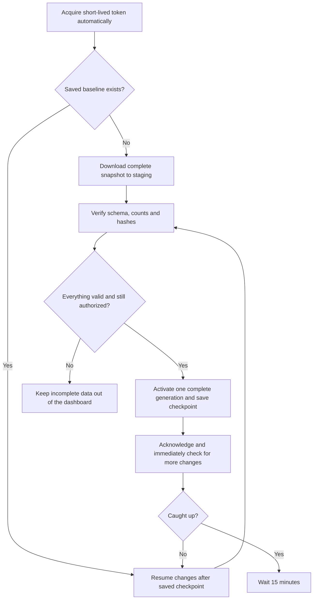

# Connect and Sync: Data-Team Handoff

September 20, 2026. Proposed delivery guide. **The API and connector have not been built or deployed yet.** Commands below define what the implementation must deliver; do not use them as if they are available today.

## What You Will Receive

Your existing dashboard stays in place. A connector on your backend copies Warehouse and Procurement reporting data for all departments/locations into your database. It performs one full load, then picks up changes every 15 minutes. No Intra user account, manual export, browser automation or SMTP setup is required for routine syncing.

The default bundle covers products, stock, movements, receiving/Quality, fulfillment/returns, procurement requests/approvals, sourcing, POs, amendments and payment readiness. Private drafts, personal contacts, bank details, documents and still-sealed commercial information are excluded. The catalogue will show exact available datasets/fields; an unsupported required dataset is not represented as a successful empty export.

The handoff includes a tested Node/TypeScript connector, PostgreSQL adapter, SQLite demonstration, OpenAPI, Postman collection, synthetic examples, field dictionary and common SQL joins. The connector handles authentication, pagination, retries and saved progress. Your team owns dashboard calculations and end-user access.

## Setup Inputs

| Input | Supplied by | Notes |
|---|---|---|
| UAT API base URL and expected environment | Intra team | Confirm deployment; no proposed URL is assumed live |
| Approved token URL/issuer, client ID and reporting audience | Identity/infra owner | Machine client, not a person's login |
| Private-key secret reference and matching registered public key | Data-team backend owner | Private key stays in your secret manager; do not email/paste it |
| Target database secret reference and backend runtime | Data team | PostgreSQL adapter is the proposed default; confirm your actual stack |
| Registered consumer ID and local progress location | Joint setup | One primary replica by default; keeps runs from overwriting each other |
| Viewer permissions, data retention and incident contact | Data team + data owner | Backend all-department access does not authorize every viewer |

## First Successful Connection

1. Install the approved connector release and configure the inputs above on your backend, outside browser code and git.
2. Run the proposed `doctor` command. It checks TLS, token acquisition, UAT/production separation, allowed scopes, dataset readiness, target database permissions and saved-progress storage. It never prints credentials or record contents.
3. Run `sync --once`. The connector pins a consistent snapshot, downloads and verifies every required dataset, and makes the completed generation visible in your database. A partial failed load stays in staging, away from the dashboard.
4. Check its completion summary: generation, record counts, captured time, applied time, warnings and unresolved legacy links. Compare the supplied business-total checks with Intra before allowing real users to rely on it.
5. Schedule `sync --interval 900`, or run `sync --once` every 15 minutes through your existing job scheduler. Use one scheduler, not both; the connector also prevents overlapping runs.

Proposed commands delivered with implementation:

```sh
node examples/reporting-client/cli.mjs doctor
node examples/reporting-client/cli.mjs sync --once
node examples/reporting-client/cli.mjs sync --interval 900
```

No token, private key or database password is accepted as a command-line argument. Configuration points to approved secrets. Target: first synthetic connection within 30 minutes after network/account prerequisites are complete; this must be measured during UAT.

## What Happens During Each Sync



The connector does not add quantities every time it sees a row. It replaces records by stable ID, applies removal markers and commits progress with the data. It drains queued generations before waiting 15 minutes, so recovery can catch up after an outage. That makes repeated pages and restarts safe. A snapshot covers retained authorized data now, not historical states that Intra never stored.

## When Something Goes Wrong

| Result | What the connector does | What your team does |
|---|---|---|
| No changes / caught_up | Keeps the same checkpoint and waits | Nothing; check the next scheduled run |
| Network outage / 429 / 503 | Bounded retry from the same saved page; no duplicate application | Check status if repeated; do not start many parallel full loads |
| Access token expired | Renews proactively; at most one token refresh and same-request retry on an expired/unclassified 401 | Nothing unless identity is disabled or the refreshed request still fails |
| Client revoked or scope/disclosure withdrawn | Stops and quarantines affected active/staged/cache data | Contact owner; apply purge/rebootstrap instructions before restoring viewer access |
| Authorization cannot be reconfirmed | Can show previously authorized data only until the stated validity deadline, at most 30 minutes | Reconnect or resolve identity/infra issue; do not bypass the access check |
| Snapshot/checkpoint expired / HTTP 410 | Starts a replacement bootstrap with valid credentials; preserves progress safely | Allow it to finish; no manual source-data deletion |
| Hash/count/schema mismatch | Refuses activation and reports request/generation IDs | Send redacted diagnostics; do not ignore validation or edit totals |
| Wrong environment or unsupported contract | Stops rather than mixing datasets | Fix configuration or upgrade the approved connector |
| Invalid cursor / HTTP 400 | Stops blind retries and reports its safe error code | Use recovery tooling; never construct/edit cursor contents manually |

The developer package will include exit codes and structured diagnostics for these outcomes, plus safe support instructions. SQL errors, record contents and credentials must not appear in support logs.

## Freshness and Business Meaning

Capture and polling each run every 15 minutes; processing adds time. A change can take roughly 35 minutes plus ingestion in an unfavorable schedule alignment. This is not a strict 15-minute end-to-end SLA. Show both captured time and last successful apply time. Warn when applied source data is over 40 minutes old; authorization validity is a separate, shorter check and can suspend access even when cached data exists.

Do not merge on display labels. Use request/PO/receipt/order/product IDs from the dictionary and documented relationships. Keep money as decimal values with currency and quantity with its unit. `null` is unknown, not zero. On-hand is not available stock; approved is not delivered; payment readiness is not payment confirmation. Parent-owned lines without persisted line IDs are replaced as one collection, not joined through array position.

## Security Responsibilities

- Store the machine private key and database credentials only on the backend in approved secret storage. Do not share the Supabase service-role key.
- Use separate UAT and production registrations, databases and credentials. Do not point a test connector at production by changing an unvalidated URL.
- Let the supplied client renew short-lived access tokens. Normal private-key rotation preserves sync state with unchanged grants. A compromised registration is permanently denied and replaced with a new client ID; merely changing its key is not enough to invalidate old tokens.
- Restrict dashboard viewers and exports to their approved audience. Apply parameterized SQL and escaped output; source text is not executable SQL or HTML.
- Quarantine/purge withdrawn information from active/staging/cache/derived outputs; backups have bounded retention and must reapply purge rules before restoration serves users.
- Follow same-origin API continuation paths only; never forward Authorization to a different host or disable certificate checks to make a connection work.

## Acceptance Before Live Use

Together, we will run a full load, four incremental cycles, an interrupted/resumed run, a duplicate retry, a data reconciliation and a key-rotation exercise. We will also verify that unauthorized dashboard viewers cannot read/export the data, and that disclosure withdrawal stops access even when a replacement snapshot is unavailable.

The first release is UAT only. Production access is separately approved. An automated pass does not replace your team's acceptance of the field meanings or its security responsibilities.

## Detailed References

[Technical specification](../../superpowers/specs/2026-09-20-reporting-api-design.md), [implementation plan](../../superpowers/plans/2026-09-20-reporting-api-implementation.md), and [security findings](SECURITY-REVIEW.md).
