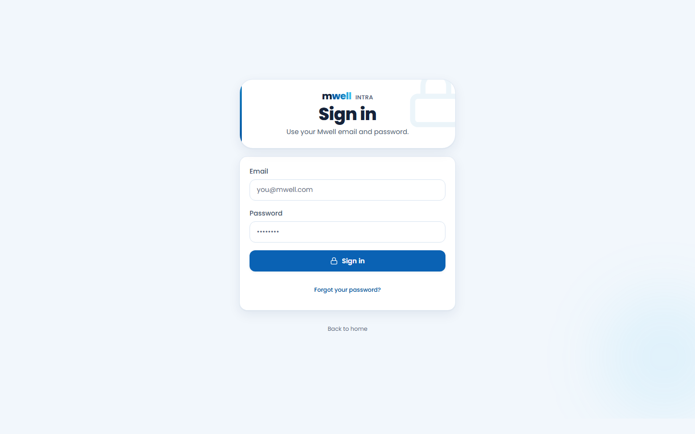
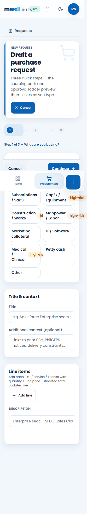
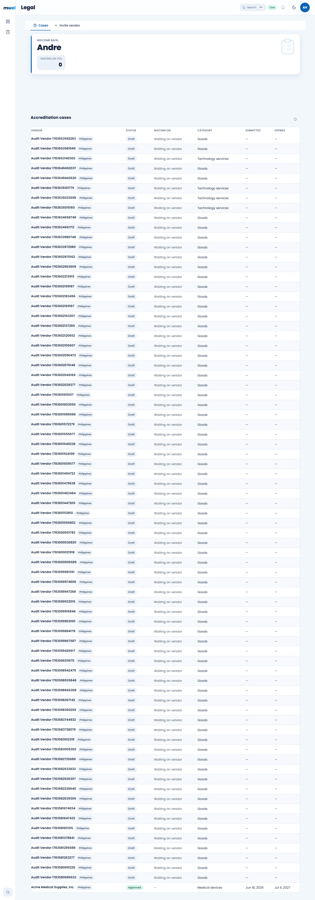
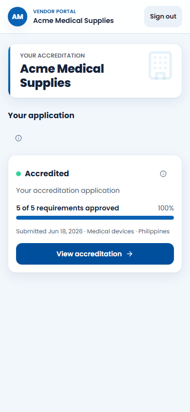
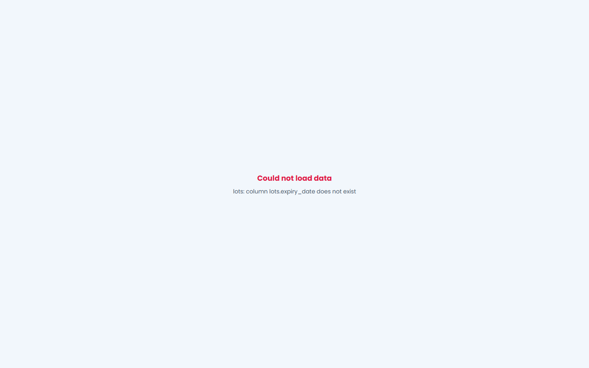

# Mwell Intra User Manual

**Audience:** Employees and vendors. Administrator procedures are in the final section.
**Live app:** https://mwell-intra.vercel.app
**Evidence date:** July 11, 2026

> Launch status: Procurement draft creation and read workflows, Legal case review, Vendor Portal, and role isolation are available. Warehouse transactions, vendor invitation delivery, governed request submission, and several narrow-mobile flows remain blocked. See the production audit before training users on those tasks.

## Sign In

1. Open the live app.
2. Enter your assigned Mwell email and password.
3. Select **Sign in** once and wait for your workspace.
4. If the page remains on Sign in, verify the account exists and request a password reset. Do not repeatedly retry a shared account.

## Navigation

- Desktop uses the left rail. Hover an icon to identify it.
- Mobile uses the bottom navigation. **Home** returns to your module list; the raised center action starts the current module's primary task.
- Search opens records and destinations you are permitted to view.
- The **Live** badge means the app is connected to Supabase.
- Access denied is expected when your role does not include a module. Ask an administrator for a role review rather than borrowing another account.

## Employee Workflows

### Procurement Requester

**Create a draft:** Procurement -> New request -> choose a request type -> enter title/context -> add line items -> continue through justification -> Save draft.

Check the generated request page for title, requester, estimated total, sourcing route, line items, and activity. Draft creation has been verified at 360px and above. At 320px, use desktop until the mobile action-bar defect is fixed.

### Procurement Officer

Review purchase requests, validate sourcing method and evidence, and prepare purchase orders only from eligible approved requests. Do not bypass vendor accreditation or DOA requirements. Mobile list controls currently overlap the bottom navigation at some narrow widths; use desktop for PO work until corrected.

### Approver and Finance

Open **Approval inbox**, verify the request version, amount, department, evidence, and named DOA assignment, then approve or reject with a useful note. Never approve a step assigned to another person. Governed submission remains unavailable until department DOA matrices are activated.

### Legal Reviewer

Open **Legal -> Cases**, select a vendor, review the requirement checklist and documents, record corrections, and make a disposition only when the evidence supports it. Vendor invitation delivery is currently blocked by missing server configuration; do not promise that an invite email was sent until the screen confirms delivery.

### Vendor

Open **Vendor Portal**, review accreditation status, select **View accreditation**, complete required fields, upload current evidence, and respond to correction requests. Submit only when every required item is complete. Vendors can see only their own organization.

### Warehouse and Finance Operations

Warehouse live transactions are temporarily blocked by a database contract mismatch. Do not use Receiving, Storage/Bins, Allocation, Returns, Cycle Count, Warehouse Finance, BI, Pricing, or Events for production work until the P0 fix is deployed and re-certified.

## Common Recovery

| Situation | What to do |
|---|---|
| Sign in stays on the login page | Confirm the account exists; request reset or provisioning |
| Access denied | Return Home and use an assigned module; request role review if needed |
| Could not load data | Capture route, time, role, and reference; do not repeatedly submit |
| Button hidden on mobile | Rotate to a wider device or use desktop; report viewport and screenshot |
| Duplicate-looking transaction | Search before retrying; include the original reference in the incident |
| Vendor email not received | Check delivery status; Legal/Admin must verify server configuration |

## Administrator Appendix

### Users and Roles

Use **Admin -> Users & Roles** to inspect a profile and assign the minimum module role needed. Keep Platform Admin separate from operational approval roles. At 320-360px the page overflows; use desktop until corrected.

### Delegation of Authority

Platform Admin or Legal Admin can open **Delegation of Authority**, create a department matrix, add named approvers and amount bands, save it as draft, validate it, and activate it. Configuration permission does not make the configurator an approver. Exactly one active matrix is required for every launch department.

### Production Support

- Record time, user, role, route, transaction ID, and visible error.
- Never collect passwords, tokens, or full private documents in tickets.
- Use Vercel logs for app/API failures and Supabase logs/advisors for Auth, REST, RLS, and database failures.
- Tag QA transactions with a run ID and archive them after review.
- Rotate any credential that appears in chat, screenshots, logs, or documentation.

## Documentation Gallery

All validated screenshots are in `docs/manual/assets/live-20260711/`. The interactive handbook is `docs/manual/index.html`.
