# Mwell Intra Standalone Operating Handbook

**Audience:** All authenticated employees and vendors

**Live app:** https://mwell-intra.vercel.app

**Reviewed:** August 21, 2026

**Release authority:** Use the commit-bound manifest packaged with this handbook.

**Content owners:** Platform, Procurement, Legal, Warehouse

This handbook is the complete standalone operating reference for Mwell Intra. Use its contents, full-text search, process diagrams, role procedures, application screenshots, and governed source register without opening a separate help system. Operational routes continue to enforce role-based access.

## Start Here

1. Use the handbook search to find an outcome such as `receive stock`, `PR`, `vendor renewal`, `bins`, or `DOA`.
2. Read the complete process diagram first, including every decision and exception branch.
3. Confirm your role, authority, required evidence, and handoff before opening the application.
4. Review the [Process Reference Library](../PROCESS_REFERENCE_LIBRARY.md) when a step is governed by policy, a legal form, a source tracker, or an approved control.
5. Sign in with your assigned Mwell identity and execute only the procedure permitted by your role.

Never share passwords, tokens, private keys, or confidential documents in support messages or screenshots.

## Navigation

- **Desktop:** left icon rail; hover an icon for its label.
- **Mobile:** bottom navigation; additional modules are under **More**.
- **Command palette:** `Ctrl+K` or `Cmd+K` opens task and destination search.
- **Live badge:** the session is connected to Supabase.
- **Access denied:** stop and request a minimum-role review for the operational route.

## User Types and Responsibilities

| User type                      | Primary responsibility                                       | Main handoff              |
| ------------------------------ | ------------------------------------------------------------ | ------------------------- |
| Core staff                     | Use this handbook to find the governed workflow and complete shared tasks | Platform Admin for access |
| Platform Admin                 | Identities, scoped roles, audit review, DOA access           | Department owner          |
| Vendor portal                  | Application, evidence, instruments, corrections, renewal     | Legal                     |
| Warehouse Logistics Supervisor | Receiving, inspection, tagging, putaway                      | Operations / Finance      |
| Warehouse Operations           | Allocation, issue, transfer, return, reconciliation          | Business unit / Finance   |
| Warehouse Finance              | Valuation, variance, reconciliation, approvals               | Warehouse Admin           |
| Warehouse BI Analyst           | Governed analysis and reports                                | Operational owners        |
| Warehouse Business Unit        | Inventory demand and outcome confirmation                    | Operations                |
| Warehouse Marketing            | Event demand, custody, usage, return                         | Operations                |
| Warehouse Procurement          | Receivable PO and supplier coordination                      | Logistics Supervisor      |
| Warehouse Pricing              | Landed cost and controlled price proposals                   | Finance                   |
| Warehouse Admin                | Locations, areas, bins, routes, imports                      | Logistics Supervisor      |
| Procurement Requester          | Need, justification, line items, evidence                    | Procurement Officer       |
| Procurement Officer            | Sourcing route, competition, vendor readiness, PO            | Approver / Warehouse      |
| Procurement Approver           | Named DOA decision                                           | Next approval tier        |
| Procurement Finance            | Financial approval, acceptance, payment readiness            | Finance processing        |
| Procurement Admin              | Procurement controls and exception oversight                 | Platform / Legal          |
| Legal Reviewer                 | Evidence, instruments, risk, accreditation decision          | Vendor / Procurement      |
| Legal Compliance               | Compliance disposition, expiry, renewal                      | Legal Admin               |
| Legal Admin                    | Invitations, Legal workflow, department DOA                  | Vendor / Legal Reviewer   |

## Comprehensive Launch Flow

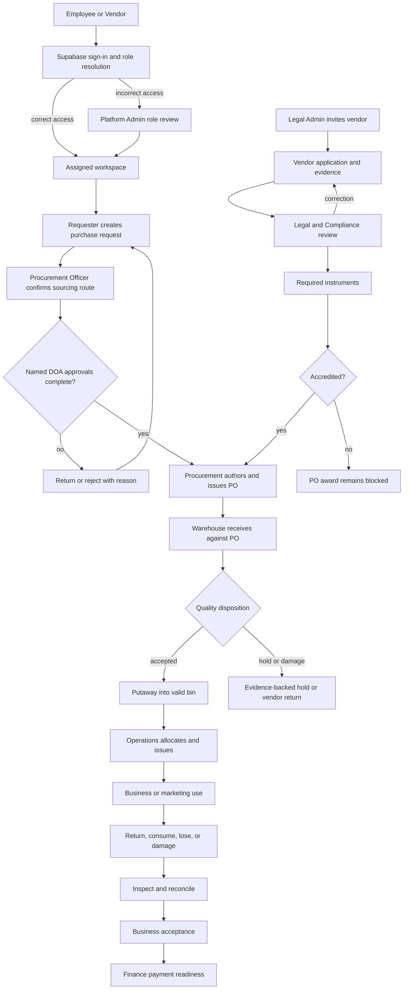
```mermaid
flowchart TD
  Staff[Employee or Vendor] --> Auth[Supabase sign-in and role resolution]
  Auth -->|correct access| Work[Assigned workspace]
  Auth -->|incorrect access| Admin[Platform Admin role review]
  Admin --> Work
  Work --> PR[Requester creates purchase request]
  PR --> POps[Procurement Officer confirms sourcing route]
  POps --> DOA{Named DOA approvals complete?}
  DOA -->|no| Return[Return or reject with reason]
  Return --> PR
  DOA -->|yes| PO[Procurement authors and issues PO]
  Invite[Legal Admin invites vendor] --> Apply[Vendor application and evidence]
  Apply --> Review[Legal and Compliance review]
  Review -->|correction| Apply
  Review --> Instruments[Required instruments]
  Instruments --> Accredited{Accredited?}
  Accredited -->|no| Block[PO award remains blocked]
  Accredited -->|yes| PO
  PO --> Receive[Warehouse receives against PO]
  Receive --> Inspect{Quality disposition}
  Inspect -->|accepted| Putaway[Putaway into valid bin]
  Inspect -->|hold or damage| Hold[Evidence-backed hold or vendor return]
  Putaway --> Allocate[Operations allocates and issues]
  Allocate --> Event[Business or marketing use]
  Event --> ReturnStock[Return, consume, lose, or damage]
  ReturnStock --> Reconcile[Inspect and reconcile]
  Reconcile --> Accept[Business acceptance]
  Accept --> Pay[Finance payment readiness]
```

## Procurement Flow

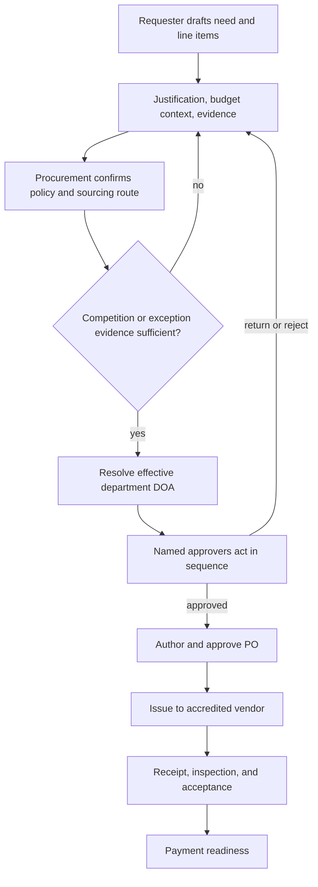
```mermaid
flowchart TD
  A[Requester drafts need and line items] --> B[Justification, budget context, evidence]
  B --> C[Procurement confirms policy and sourcing route]
  C --> D{Competition or exception evidence sufficient?}
  D -->|no| B
  D -->|yes| E[Resolve effective department DOA]
  E --> F[Named approvers act in sequence]
  F -->|return or reject| B
  F -->|approved| G[Author and approve PO]
  G --> H[Issue to accredited vendor]
  H --> I[Receipt, inspection, and acceptance]
  I --> J[Payment readiness]
```

### Requester

Use **Procurement -> New request**. Choose category, enter complete line items, explain need and alternatives, attach evidence, review the sourcing preview, save the draft, and submit only after route confirmation.

### Officer and Administrator

Confirm policy route, competition or exception pack, accreditation, and request completeness. Author a PO only from an approved eligible request. Preserve request, PO, receipt, and acceptance links.

### Approver and Finance

Act only on the step assigned to your identity. Review the current request version, amount, route, evidence, and comments. Approve, reject, or return with a specific reason.

## Vendor Accreditation Flow

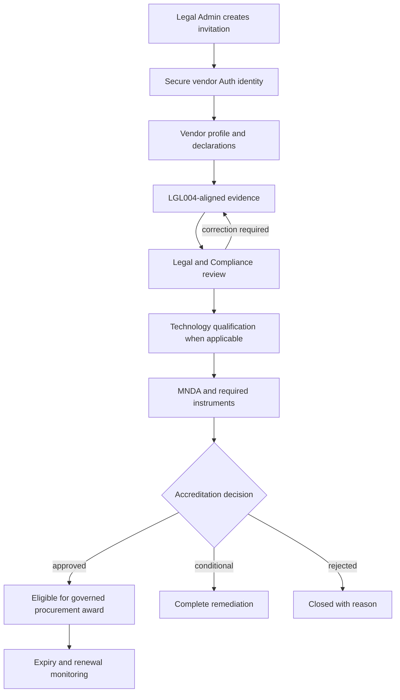
```mermaid
flowchart TD
  Invite[Legal Admin creates invitation] --> Identity[Secure vendor Auth identity]
  Identity --> Profile[Vendor profile and declarations]
  Profile --> Evidence[LGL004-aligned evidence]
  Evidence --> Legal[Legal and Compliance review]
  Legal -->|correction required| Evidence
  Legal --> Tech[Technology qualification when applicable]
  Tech --> Sign[MNDA and required instruments]
  Sign --> Decision{Accreditation decision}
  Decision -->|approved| Eligible[Eligible for governed procurement award]
  Decision -->|conditional| Remedy[Complete remediation]
  Decision -->|rejected| Closed[Closed with reason]
  Eligible --> Renewal[Expiry and renewal monitoring]
```

Vendors can see only their organization. Legal must not approve incomplete, expired, inconsistent, or unsupported evidence. Procurement must verify active accreditation before award.

## Warehouse Flow

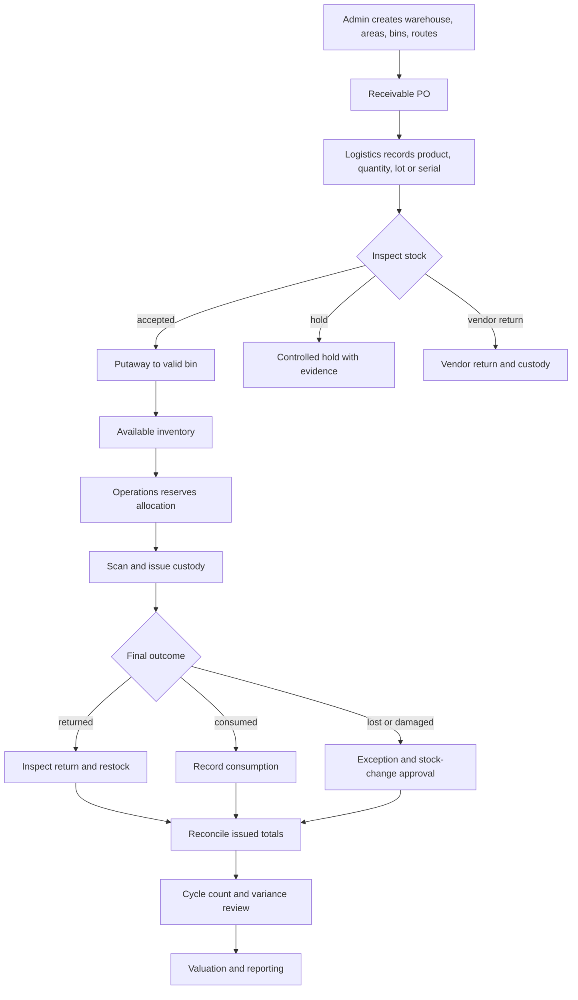
```mermaid
flowchart TD
  Setup[Admin creates warehouse, areas, bins, routes] --> PO[Receivable PO]
  PO --> Receipt[Logistics records product, quantity, lot or serial]
  Receipt --> Inspection{Inspect stock}
  Inspection -->|accepted| Bin[Putaway to valid bin]
  Inspection -->|hold| Hold[Controlled hold with evidence]
  Inspection -->|vendor return| VR[Vendor return and custody]
  Bin --> Available[Available inventory]
  Available --> Reserve[Operations reserves allocation]
  Reserve --> Issue[Scan and issue custody]
  Issue --> Outcome{Final outcome}
  Outcome -->|returned| ReturnInspect[Inspect return and restock]
  Outcome -->|consumed| Consume[Record consumption]
  Outcome -->|lost or damaged| Exception[Exception and stock-change approval]
  ReturnInspect --> Reconcile[Reconcile issued totals]
  Consume --> Reconcile
  Exception --> Reconcile
  Reconcile --> Count[Cycle count and variance review]
  Count --> Finance[Valuation and reporting]
```

### Setup and Bins

Warehouse Admin creates the site, storage areas, scannable bins, and allowed operation routes. Verify destinations before receiving production stock.

### Receiving and Inspection

Select the PO and destination, record each line, scan serial/lot details, and attach evidence. Inspection supports accepted, hold, damaged, unavailable, and vendor-return outcomes. Non-accepted outcomes require a reason and evidence.

### Allocation, Events, and Returns

Reserve only available non-held stock. Scan custody on issue. Record consumed, returned, lost, and damaged quantities. Close the event only after all issued quantity reconciles.

### Ecommerce Fulfillment and Pick & Pack

Import orders with the provided CSV template or create an order in the app. Select a controlled sales channel and payment method; record the payment reference and Maya status when applicable. Customer address presets populate province, postal code, and service area, but the operator remains responsible for confirming the delivery address before release.

Selling price is assigned by Product and is read-only in Warehouse. Do not type or override a commercial price during fulfillment. For bundle orders, mark the line as a bundle and verify the generated set ID for every set. A quantity of two standalone products is not automatically a bundle.

Before picking, scan the displayed rack or bin and then scan each serialized unit. Confirm packaging supplies, waybill, courier, dispatch details, and the generated handover reference. Upload proof directly in Intra; an external evidence URL is not required. Use **Export current view** when a controlled CSV handoff is needed.

### Customer Returns and Original Release Matching

Customer Service or Operations scans the returned serial with the camera or enters it manually. Intra matches the serial to its original picked release and order when evidence exists. Verify the displayed source before accepting custody. An unmatched serial must remain visibly unresolved and be escalated for controlled investigation; do not attach it to an unrelated order.

### Counts and Adjustments

Create a count draft, record physical quantity and evidence, review variance, and post only an approved stock-change request. Never edit stock levels directly.

## DOA Administration

Platform Admin or Legal Admin opens **Admin -> Delegation of Authority**. Select **Create revision** on the current department matrix, update version and named assignments, save a draft, validate gaps/overlaps/final approval, and activate deliberately. Active records are immutable; activation supersedes the prior revision and preserves history.

## Troubleshooting and Recovery

| Situation                      | Action                                                                                  |
| ------------------------------ | --------------------------------------------------------------------------------------- |
| Sign-in remains on login       | Verify identity, request reset, or ask Platform Admin to confirm provisioning           |
| Access denied                  | Confirm the role matrix in this handbook; request minimum-role review for the route      |
| Loading skeleton remains       | Check connection, wait once, refresh, then capture route/time/role                      |
| Validation prevents submit     | Correct every labeled field and required evidence; do not bypass the gate               |
| Possible duplicate transaction | Refresh and search the record before retrying                                           |
| Stale-state message            | Reload the current record and re-evaluate before acting                                 |
| Vendor invitation not received | Legal checks delivery status and contact address before retrying                        |
| Receipt variance or damage     | Use inspection/hold/vendor-return workflow with evidence                                |
| Return serial has no source    | Quarantine the item, preserve the scanned serial, and investigate before replacement    |
| Vendor invitation rate-limited | Do not repeatedly resend; verify delivery state and escalate SMTP capacity              |
| Mobile control is obscured     | Scroll into the reserved safe area; report viewport and screenshot if still unreachable |

Support evidence should contain route, time, role, safe record ID, expected outcome, visible error, and a redacted screenshot. Never include credentials or private document contents.

## Security and Data Handling

- Use individual accounts; never share QA or production passwords.
- Grant minimum scoped roles.
- Treat access denied as a control, not an obstacle to bypass.
- Keep evidence and decisions in the governed workflow.
- Verify saved state before retrying writes.
- Rotate any credential exposed in chat, logs, screenshots, or documentation.

## Glossary

- **DOA:** Delegation of Authority approval matrix.
- **PR:** Purchase request.
- **PO:** Purchase order.
- **Putaway:** controlled movement of accepted stock into a valid bin.
- **Cycle count:** physical count used to govern stock variance.
- **Idempotency:** duplicate-effect prevention for retried commands.
- **RLS:** database row-level security.

## Future Recommended Features

All items below are **proposed**, not current capabilities:

1. Handbook section drafting, approval, effective dating, and version history.
2. Contextual help launched from operational controls.
3. Search analytics and unsuccessful-query reporting.
4. Article feedback and correction requests.
5. Policy-to-procedure traceability.
6. Guided sandbox walkthroughs.
7. Multilingual governed documentation.
8. Managed offline handbook distribution and update notification.
9. Role onboarding curricula and completion tracking.
10. Workflow-linked release notes.

## Flow-First Operational Journeys

Read the overview before performing work. Use **By role** to confirm the handoff owner and **Decisions** before taking an exception path. The lifecycle ribbon is a reading aid; the underlying record, evidence, role assignment, and audit trail remain the source of truth.

### Procurement to Payment

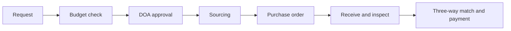
```mermaid
%% handbook-flow: workflow=procurement-to-payment; view=overview; stages=Request|Budget|DOA|Source|PO|Receive|Pay
flowchart LR
  R[Request] --> B[Budget check] --> D[DOA approval] --> S[Sourcing] --> P[Purchase order] --> G[Receive and inspect] --> Y[Three-way match and payment]
```
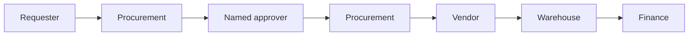
```mermaid
%% handbook-flow: workflow=procurement-to-payment; view=role; stages=Request|Budget|DOA|Source|PO|Receive|Pay
flowchart LR
  A[Requester] --> B[Procurement]
  B --> C[Named approver]
  C --> D[Procurement]
  D --> E[Vendor]
  E --> F[Warehouse]
  F --> G[Finance]
```
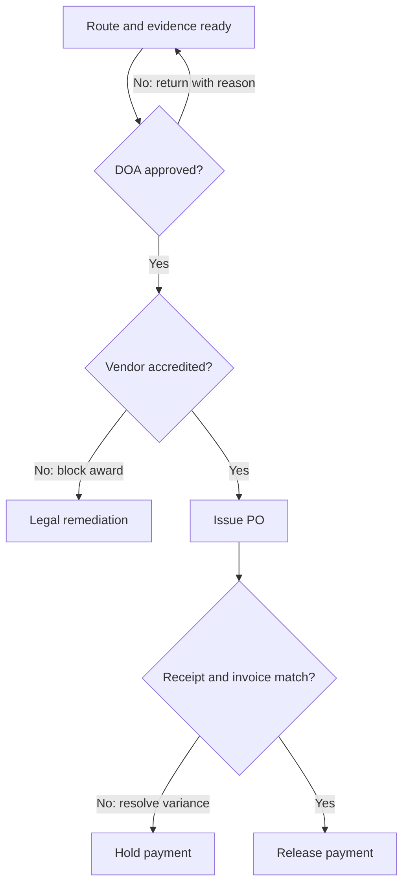
```mermaid
%% handbook-flow: workflow=procurement-to-payment; view=decision; stages=Request|Budget|DOA|Source|PO|Receive|Pay
flowchart TD
  A[Route and evidence ready] --> B{DOA approved?}
  B -->|No: return with reason| A
  B -->|Yes| C{Vendor accredited?}
  C -->|No: block award| D[Legal remediation]
  C -->|Yes| E[Issue PO]
  E --> F{Receipt and invoice match?}
  F -->|No: resolve variance| G[Hold payment]
  F -->|Yes| H[Release payment]
```

**Completion criteria:** the request, budget/DOA decision, sourcing evidence, active vendor accreditation, issued PO, receipt/inspection evidence, invoice and acceptance are linked before Finance releases payment.

### Vendor Accreditation

```mermaid
%% handbook-flow: workflow=vendor-accreditation; view=overview; stages=Invite|Profile|Evidence|Review|Instrument|Decision|Renewal
flowchart LR
  I[Invite] --> P[Vendor profile] --> E[Evidence] --> R[Legal review] --> N[Required instruments] --> D[Accreditation decision] --> M[Renewal monitoring]
```
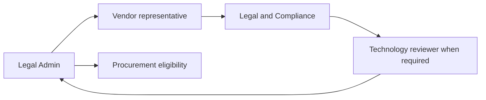
```mermaid
%% handbook-flow: workflow=vendor-accreditation; view=role; stages=Invite|Profile|Evidence|Review|Instrument|Decision|Renewal
flowchart LR
  L[Legal Admin] --> V[Vendor representative]
  V --> C[Legal and Compliance]
  C --> T[Technology reviewer when required]
  T --> L
  L --> P[Procurement eligibility]
```
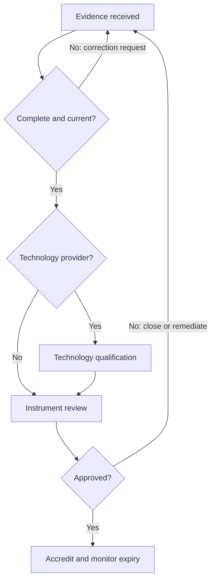
```mermaid
%% handbook-flow: workflow=vendor-accreditation; view=decision; stages=Invite|Profile|Evidence|Review|Instrument|Decision|Renewal
flowchart TD
  E[Evidence received] --> C{Complete and current?}
  C -->|No: correction request| E
  C -->|Yes| T{Technology provider?}
  T -->|Yes| Q[Technology qualification]
  T -->|No| I[Instrument review]
  Q --> I
  I --> D{Approved?}
  D -->|No: close or remediate| E
  D -->|Yes| A[Accredit and monitor expiry]
```

**Completion criteria:** the vendor has an attributable invitation, current LGL004-aligned evidence, applicable technology qualification and executed instruments; Legal records a decision and Procurement sees only the resulting eligibility.

### Receiving and Putaway

```mermaid
%% handbook-flow: workflow=receiving-putaway; view=overview; stages=PO|Delivery|Receive|Inspect|Putaway|Available
flowchart LR
  P[Receivable PO] --> D[Delivery] --> R[Receive line and serial or batch] --> I[Inspect] --> B[Put away] --> A[Available stock]
```

```mermaid
%% handbook-flow: workflow=receiving-putaway; view=role; stages=PO|Delivery|Receive|Inspect|Putaway|Available
flowchart LR
  P[Procurement] --> L[Logistics supervisor]
  L --> Q[Quality control]
  Q --> O[Operations associate]
  O --> F[Warehouse finance]
```
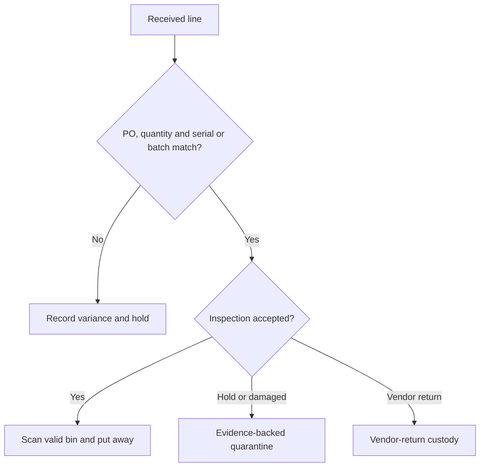
```mermaid
%% handbook-flow: workflow=receiving-putaway; view=decision; stages=PO|Delivery|Receive|Inspect|Putaway|Available
flowchart TD
  R[Received line] --> M{PO, quantity and serial or batch match?}
  M -->|No| V[Record variance and hold]
  M -->|Yes| I{Inspection accepted?}
  I -->|Yes| B[Scan valid bin and put away]
  I -->|Hold or damaged| H[Evidence-backed quarantine]
  I -->|Vendor return| X[Vendor-return custody]
```

**Completion criteria:** each receipt line has PO and delivery references, delivery date, required serial/batch evidence, a recorded disposition and a valid destination before it becomes available stock.

### Ecommerce Fulfillment

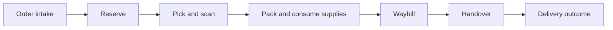
```mermaid
%% handbook-flow: workflow=ecommerce-fulfillment; view=overview; stages=Order|Reserve|Pick|Pack|Waybill|Release|Delivery
flowchart LR
  O[Order intake] --> R[Reserve] --> P[Pick and scan] --> K[Pack and consume supplies] --> W[Waybill] --> H[Handover] --> D[Delivery outcome]
```
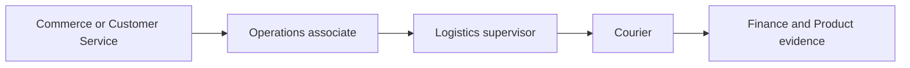
```mermaid
%% handbook-flow: workflow=ecommerce-fulfillment; view=role; stages=Order|Reserve|Pick|Pack|Waybill|Release|Delivery
flowchart LR
  C[Commerce or Customer Service] --> O[Operations associate]
  O --> L[Logistics supervisor]
  L --> R[Courier]
  R --> F[Finance and Product evidence]
```
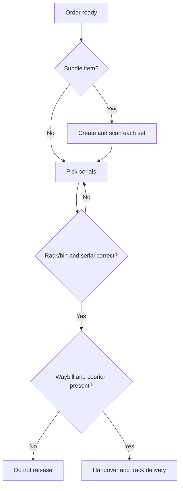
```mermaid
%% handbook-flow: workflow=ecommerce-fulfillment; view=decision; stages=Order|Reserve|Pick|Pack|Waybill|Release|Delivery
flowchart TD
  O[Order ready] --> B{Bundle item?}
  B -->|Yes| S[Create and scan each set]
  B -->|No| P[Pick serials]
  S --> P
  P --> L{Rack/bin and serial correct?}
  L -->|No| P
  L -->|Yes| W{Waybill and courier present?}
  W -->|No| H[Do not release]
  W -->|Yes| D[Handover and track delivery]
```

**Completion criteria:** an order has its controlled channel, address and payment fields, every required rack/bin and serialized scan, bundle-set evidence where applicable, packaging consumption, waybill/courier, attributable handover proof and a tracked delivery outcome.

### Returns and Replacements

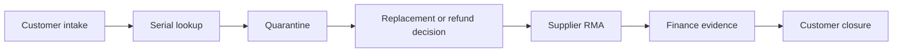
```mermaid
%% handbook-flow: workflow=returns-replacements; view=overview; stages=Intake|Serial lookup|Quarantine|Decision|RMA|Finance|Closure
flowchart LR
  I[Customer intake] --> S[Serial lookup] --> Q[Quarantine] --> D[Replacement or refund decision] --> R[Supplier RMA] --> F[Finance evidence] --> C[Customer closure]
```
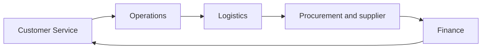
```mermaid
%% handbook-flow: workflow=returns-replacements; view=role; stages=Intake|Serial lookup|Quarantine|Decision|RMA|Finance|Closure
flowchart LR
  C[Customer Service] --> O[Operations]
  O --> L[Logistics]
  L --> P[Procurement and supplier]
  P --> F[Finance]
  F --> C
```
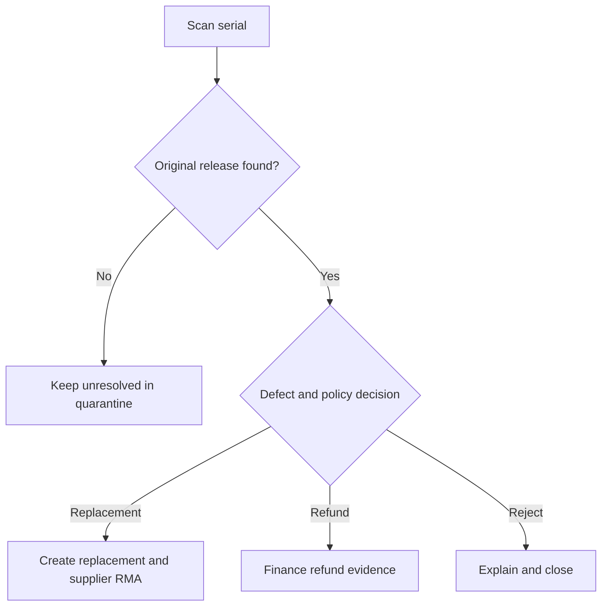
```mermaid
%% handbook-flow: workflow=returns-replacements; view=decision; stages=Intake|Serial lookup|Quarantine|Decision|RMA|Finance|Closure
flowchart TD
  S[Scan serial] --> M{Original release found?}
  M -->|No| Q[Keep unresolved in quarantine]
  M -->|Yes| D{Defect and policy decision}
  D -->|Replacement| R[Create replacement and supplier RMA]
  D -->|Refund| F[Finance refund evidence]
  D -->|Reject| C[Explain and close]
```

**Completion criteria:** the return is traced to its original release or remains explicitly unresolved, then retains defect evidence, custody location, supplier RMA/refund or replacement evidence and an attributable customer outcome.

### Inventory Release

```mermaid
%% handbook-flow: workflow=inventory-release; view=overview; stages=Demand|Approval|Reserve|Issue|Use|Return|Reconcile
flowchart LR
  D[Department demand] --> A[Approval] --> R[Reserve] --> I[Issue custody] --> U[Use or giveaway] --> T[Return or loss] --> C[Reconcile]
```
```mermaid
%% handbook-flow: workflow=inventory-release; view=role; stages=Demand|Approval|Reserve|Issue|Use|Return|Reconcile
flowchart LR
  B[Business unit or Marketing] --> A[Approver]
  A --> O[Operations]
  O --> W[Warehouse]
  W --> F[Finance]
```
```mermaid
%% handbook-flow: workflow=inventory-release; view=decision; stages=Demand|Approval|Reserve|Issue|Use|Return|Reconcile
flowchart TD
  D[Request] --> A{Authority and stock available?}
  A -->|No| R[Return with reason or replenish]
  A -->|Yes| I[Scan issue custody]
  I --> O{Outcome recorded?}
  O -->|Returned| C[Inspect and restock]
  O -->|Consumed or giveaway| E[Post expense or usage]
  O -->|Lost or damaged| X[Exception approval]
```

**Completion criteria:** all department requests have one or more line items, authority, issued custody evidence, a recorded outcome and reconciliation. Merchandise is treated as expense under the applicable cost center.

### Event Custody

```mermaid
%% handbook-flow: workflow=event-custody; view=overview; stages=Demand|Approval|Transfer|Event|Outcome|Return|Settlement
flowchart LR
  D[Marketing demand] --> A[Approval] --> T[Event transfer] --> E[Event use] --> O[Sales or giveaway outcome] --> R[Return] --> S[Settlement]
```
```mermaid
%% handbook-flow: workflow=event-custody; view=role; stages=Demand|Approval|Transfer|Event|Outcome|Return|Settlement
flowchart LR
  M[Marketing and Events] --> A[Approver]
  A --> O[Operations]
  O --> W[Warehouse]
  W --> F[Finance]
```
```mermaid
%% handbook-flow: workflow=event-custody; view=decision; stages=Demand|Approval|Transfer|Event|Outcome|Return|Settlement
flowchart TD
  T[Transferred stock] --> O{Event outcome}
  O -->|Sold| S[Capture sale summary]
  O -->|Given away| G[Record giveaway]
  O -->|Returned| R[Inspect return]
  O -->|Lost or damaged| X[Evidence and approval]
  R --> K{Re-kit eligible?}
  K -->|Yes| Q[Open-box re-kitting]
  K -->|No| C[Controlled disposition]
```

**Completion criteria:** event demand, approval, transfer scans, sales/giveaway quantities, returned/lost/damaged evidence, re-kitting decision and Finance settlement reconcile to the final event balance.

### Inventory Integrity

```mermaid
%% handbook-flow: workflow=inventory-integrity; view=overview; stages=Count|Variance|Approval|Adjust|Expiry|Recall|Reconcile
flowchart LR
  C[Cycle count] --> V[Variance] --> A[Adjustment approval] --> J[Post adjustment] --> E[Expiry control] --> R[Recall handling] --> F[Serialized reconciliation]
```
```mermaid
%% handbook-flow: workflow=inventory-integrity; view=role; stages=Count|Variance|Approval|Adjust|Expiry|Recall|Reconcile
flowchart LR
  O[Operations] --> S[Logistics supervisor]
  S --> F[Warehouse finance]
  F --> P[Procurement or supplier]
  P --> A[Platform audit]
```
```mermaid
%% handbook-flow: workflow=inventory-integrity; view=decision; stages=Count|Variance|Approval|Adjust|Expiry|Recall|Reconcile
flowchart TD
  C[Physical count] --> V{Variance found?}
  V -->|No| R[Reconcile serials]
  V -->|Yes| E[Attach evidence]
  E --> A{Adjustment approved?}
  A -->|No| I[Investigate]
  A -->|Yes| P[Post governed adjustment]
  R --> X{Expired, recalled or damaged?}
  X -->|Yes| Q[Quarantine and disposition]
  X -->|No| K[Close count]
```

**Completion criteria:** the physical count, variance evidence, approval, stock adjustment, serialized reconciliation and any expiry/recall/damage disposition are all recorded; staff never edit quantity directly.

## Application Screen Reference

The canonical standalone file is `docs/manual/index.html`. Screens below establish layout and control location; follow the written procedure and current field labels if a released screen has changed.

### Sign-in and Workspace

### Procurement

### Legal and Vendor Accreditation

Screenshots that show retired errors are historical audit evidence and are intentionally excluded from this handbook.
