# Mwell Intra Standalone Operating Handbook

## September 20 UAT Update

The [September 20 experience update](../releases/2026-09-20-EXPERIENCE-REMEDIATION-CANDIDATE.md) covers the revised work lists, warehouse navigation, batch inspection and event-seller/recovery approach deployed to UAT at `bc5b398`. Required database updates and seller learning publication are installed. The follow-up corrects the new seller's first-login learning display without granting completion or wider permissions. Full transaction certification remains open; read the release status for what has actually been checked. SMTP is unchanged.

Onboarding opens with a compact **Choose a task** control, your progress and your next required action. Select **Start**, **Resume** or **Try again** beside the requirement title. Expand **Choose a task** (or **Change task**) to find another task, then scroll the page through the results. For shared tasks, expand **Available to** and the role count to see the full audience. **Continue to My Work** remains available before all learning is finished; actions that require certification still wait for their assigned learning. Shared multi-role requirements, prerequisites and approvals are unchanged.

For event sellers, complete **Role orientation**, then **Record your event sales and giveaways**. Finish the six practice decisions and check that both requirements show complete. Do not repeat completed orientation or use a colleague's account. Training completion does not assign an event or stock: ask the authorized event owner to check your named assignment and its dates. The September 20 synthetic seller completed this actual UAT onboarding path; the operational event journey remains a separate test.

In Procurement, a confirmed request may show sourcing as **Not started** until its plan is created. Once a sourcing event exists, reopen the same request to review its saved sourcing and evaluation records. Viewing that evidence does not authorize variance approval or award. If variance history is unavailable to your account, use the designated reviewer; do not treat missing review visibility as an empty history. A failed sourcing read offers Retry sourcing and should not be worked around by creating a duplicate request.

Sourcing deadlines use the local time on your device. The deadline editor and saved summary should show the same local time; reopening and saving without changing the deadline must not move it. Check the date and time before issuing the package. If they disagree, stop and report the request number rather than adjusting the deadline to compensate.

Sourcing guidance follows the recorded stage. **Not started** means prepare the plan; **draft** means complete the plan and accredited invitations before governed issue, not close the response window. Issued events handle responses and controlled closure; evaluation, any required independent review and award remain separate steps. Failed bids use recovery controls, while awarded or cancelled events retain their history. Retry an unavailable sourcing read before continuing. The draft-stage guidance was checked on live `b16c8d6` in desktop and mobile views; later business stages remain separate test scenarios.

Current version-2 learning shows the verified role context for **Procurement Admin**, **Procurement Finance** and **Vendor Portal**. These labels identify existing assignments and certificates; they do not add authority, complete learning or certify payment release. Unrecognized curricula or versions remain unidentified. Vendor onboarding shows a loading state while the session is restored, then checks the resolved account before displaying its learning.

A completed checklist does not always produce a capability certificate. If no certificates are recorded, check whether required learning is complete, still outstanding or not assigned. Do not repeat completed training just to fill an empty certificate list; existing permissions still apply.

After receiving practice is confirmed complete, select **Finish review** once. While navigation is pending, the page shows **Returning to your onboarding checklist**. If needed, use **Return to onboarding**; do not submit the simulated receipt again. Neither return action creates a receipt or another learning attempt.

Vendor accreditation accepts original JPEG, PNG, WebP or PDF files up to 10 MB. If an upload fails, the message stays beside the upload controls and your selected file remains available. Follow the message; if the result is uncertain, check the case's document list before uploading again. Uploading documents does not submit the application or complete Legal review.

## Warehouse Access Recovery

Returning to a browser tab should keep the open form while the app successfully rechecks the same user's access. **Checking warehouse access** means verification is still running. **Could not verify warehouse access** means the check did not finish: check your connection, then choose **Retry access**. Retry checks permissions only; it does not submit, approve or replay your work.

**No warehouse access** means a completed check did not grant access. Contact your administrator if this is unexpected. A failed access check or a confirmed permission change can close the workspace. Unsaved edits are not guaranteed to survive that failure, signing out or a page reload. If you had already selected Save, check the record's saved status before submitting again.

## September 13 Return And Quality Display Update

**Assigned training:** Follow the requirements shown in Onboarding. A new permission is not proof of completed training. If a task's required training is missing or unclear, ask your administrator to check the published assignment; repeating unrelated practice will not resolve it. The September 14 training-version correction does not reset progress or mark new exercises complete.

For exports, distinguish **opening the page** from **preparing a file**. Warehouse dashboard access does not require analytics or Finance viewing permission. Data & Reports needs analytics access; Inventory Reports follows its analytics/Finance and Insights access checks. An export still needs the separate current export-preparation permission. The Operations Associate dashboard entry does not unlock those reporting pages.

Being able to view a report or recommendation does not mean you can act on it. Export preparation and replenishment actions depend on your current command permissions. Operations submits the recommendation; Procurement handles its decision and handoff. Read-only records remain available to the roles allowed to see them.

**App updates while working:** Update and install notices stay behind an open warehouse form. Finish or deliberately close the form before selecting Reload. Do not reload during submission; unsaved edits may be lost. Dismissing the notice does not submit or cancel your work.

**Recommending more stock:** Open the item in Inventory and choose **Recommend replenishment**. Check the available inventory and minimum stock, enter the quantity and reason, and adjust **Planning assumption (days)** if needed. The default 14 days is an assumption, not a supplier delivery promise. **Save recommendation** sends the recommendation for Procurement's decision; it does not add stock or create a PO. An accepted or handed-off recommendation is read-only here. If saving cannot be confirmed, close and reopen to check its status before trying again. Cancel closes the form; it does not cancel a saved recommendation.

**Which role does the work?** Operations alone submits demand and customer cases, recommends replenishment and prepares governed exports. Floor work such as receiving, inspection, picking, packing and stock movement requires the separate Warehouse Operator or other authorized execution role. Operations Associates may hold both roles. Business Unit users request stock and acknowledge eligible handovers; warehouse staff allocate and issue it. Pricing is read-only. Finance reviews warehouse exports; Procurement Officer/Admin handle replenishment decisions and governed PO cancellation. These are existing responsibilities, not new access. If your account has several roles, their permissions combine, but training, evidence and independent-review requirements remain.

**Replenishment completion update:** After Procurement accepts the recommendation, an authorized Procurement user selects **Complete Procurement request**. The existing request form keeps the accepted item, quantity and reason fixed. Select the requirement classification, provide the estimate, department, cost center, funding and applicable solicitation details, and attach specification and budget evidence. Review these details and select **Create draft & complete handoff**. The result is a linked draft, not a submitted request, approved spend, PO or stock receipt. **Confirm procurement route** remains a separate action in that draft.

If the initial check fails, use **Back to recommendation** when offered. If saving stops, reopen Warehouse replenishment planning and check whether a draft was linked before trying again; uploaded evidence may be retained for reconciliation. An older linked draft that reports a missing classification needs support review; do not create a duplicate to work around it. Acceptance and Dismiss need Procurement management permission; completing the request also needs request-creation permission. This update does not grant either permission or remove required training.

**Receiving and Quality:** The person inspecting a procurement receipt must differ from its recorded receiver, even when either account has several roles. An accepted receipt inspection releases its provisional hold in the same transaction; check the result before putaway rather than looking for another approval button. A continuing hold needs an authorized hold reviewer who did not create that hold. Operations and Procurement can coordinate the work, but those roles alone do not authorize receiving, inspection, stock movement or hold release. Follow the specific controls for returns; do not assume every return has the same actor checks as a procurement receipt.

In long dialogs, scroll within the form to reach the remaining fields. The title, Close control and footer actions stay in the frame. The September 14 dialog adjustment prevents field focus or scrolling from shifting that outer frame; it does not fill, submit or approve the form for you.

In **Resolve return case**, the status describes the customer case, not the location or condition of the returned item. **Customer case submitted / awaiting resolution** means a decision is still needed. Read the separate intake message: a verified link confirms a recorded physical intake, but does not confirm that Quality has cleared the stock. When the summary says intake is not verified in this view, check the original order and saved return before proceeding; do not create a duplicate just to remove the message.

Open **Quality Control** to check the current inspection and holds. **Pending**, **Holds** and **Completed** each show their own count. Search narrows that count: **1 of 3** means one match from three records in the selected tab. Clear search to see the full list. A loading error is not an empty queue.

The workflow is unchanged. Keep the required quarantine bin, evidence, independent Quality review and permitted resolution. Viewing the summary or changing a filter does not move stock or approve a return. These instructions describe the September 13 display candidate; the dated release record confirms deployment and verification separately.

## September 12 Workspace Layout

**Vendor training and PO acknowledgment:** Accept your current invitation and complete the assigned vendor training. No internal department membership is needed. Open **Purchase order acknowledgements**, choose **Read purchase order**, review the document, enter an acknowledgment reference, and select **Acknowledge revision**. The saved status remains after refresh. If the document changes, review the updated revision before retrying. On narrow screens, long case-status labels wrap so the full message remains readable.

**Vendor invitation recovery:** A saved case does not mean the invitation email was sent. If the service reaches its sending limit, ask your administrator to check email delivery before using **Retry invitation email** on the existing case. Do not create a duplicate case. Pending delivery is not confirmed delivery. Vendor access still requires acceptance of the current invitation.

**Starting updated training:** Start, Resume and assessment retries open the assignment selected on the page. An older completed version does not replace the newer training you still need to finish. Previous completion records are kept.

**Training and receiving follow-up:** Guided practice follows the checkpoints in your assigned training version. When it shows Complete, you do not need to answer extra steps from a newer version. If the assigned steps cannot load, close the practice, refresh once, and contact your administrator if it persists. New short, excess, damaged and unidentified receipts require the actual delivery date and retain it in receipt history. Their Quality hold and independent review still apply. Historical dates are not filled in automatically.

Mixed photo/link galleries use two columns on small screens so website addresses stay readable; photo-only galleries retain their existing layout. Opening a link or a photo remains read-only.

**External evidence links:** Older receipts may contain a delivery website link instead of an uploaded photo. Choose **External evidence** to open that address in a new tab. The app does not verify that an external website is available or that its content is a valid inspection photo. Uploaded photos still open in the photo viewer. If the external link is wrong or unavailable, give the Warehouse lead the receipt reference and ask for the correct supporting document; do not repeat receiving or alter a Quality decision to fix the link.

**Task queue recovery:** A failed Warehouse Tasks read is not an empty queue. Choose **Retry task queue** after checking your connection. Task labels load without downloading inspection photos; use the task's source link to review the evidence in Quality Control. No task completion, inspection or stock step changes.

Quality Control keeps the complete inspection queue available without downloading every photo at startup. On **Completed**, photos load as their rows come into view. Select a thumbnail to review the original evidence. **Retry photos** retries an image read, not an inspection or stock decision. A photo loading error does not mean the inspection has no evidence. All inspection, hold and independent-review steps remain unchanged.

**Loading follow-up:** Quality Control now waits for warehouse startup before fetching its inspection and hold queues. Wait for the queue to finish before making a decision; if it fails, use **Retry quality queue**. Do not repeat a receipt or release a hold to get past loading. Permission checks have also been made faster without changing your roles, required training, approval steps or evidence. UAT records marked **PERF-SEP12** are synthetic volume-test drafts and unallocated orders, not real stock or deliveries; existing operational test scenarios remain available.

**Authorization follow-up:** Return resolution now checks current permission and any required training before saving or replaying a completed case. Quarantine, Finance evidence, replacement delivery and customer closure steps remain unchanged. If access is denied, check your assigned responsibility and training; do not recreate the return. Names on your own department stock requests remain available. Viewing names on another person's request requires current issuing or request-approval authority. Missing names do not mean the records were deleted.

The final visual pass also corrects outlined dialog-action text in dark mode, including View original order. Contrast is checked against the rendered button background; destinations and actions are unchanged.

On mobile Pick & Pack, use Status to choose the queue and Search orders to find a record. Desktop retains the counter strip. Dependency security patches in this release do not require a new account or change your workflow.

The updated interface uses distinct page headers, shaded section headings and clearer dialog headers and footers across internal and vendor workspaces. Status colors still indicate the same business states. Your roles, approvals and transaction steps have not changed.

- Use Hide navigation or Show navigation in the desktop header to give the record more room. This browser remembers the choice. The visible sidebar stays available while the page scrolls; mobile navigation is unchanged.
- My Work shows compact request rows on desktop and stacked information on mobile. Open the source record to act; the queue does not approve or complete it for you.
- Order details and order intake use wider desktop dialogs, with related information grouped together and a separate action footer. On mobile, scroll the dialog body to reach the remaining fields.
- On supported lists, opening a record and returning restores list context. Copy reference copies the identifier; Copy link copies the canonical record address, not your personal list filters. The recipient still needs access.
- The procurement request form warns on browser exit or its Cancel action when unsaved. Order intake warns when its local draft could not be saved. These are not universal warnings for every in-app link; save important work before navigating away.

Earlier dated sections below describe their respective releases. This layout update does not replace the process instructions or authorization requirements.

## September 11 UX Remediation (Live UAT)

The final UX build is live on **mwell-intra-uat.vercel.app**, release `343b372`. The final screen/navigation check passed all 110 primary captures across 11 test personas at desktop and mobile widths. This is not certification of every transaction. The release verification record retains the detailed coverage and limitations.

The layout update is live throughout UAT: shared page headers and section boundaries, compact Home and Admin launchers, Warehouse shift queues and counters, Procurement filters and tables, Finance review areas, and Event lists. Existing form fields, actions, approvals, access rules and handoff order remain unchanged. Desktop pages group comparable information; mobile pages wrap the same controls.

**Start with My Work:** Home gives employees a direct My Work entry while keeping all assigned modules available under Browse all areas. In My Work, choose **Needs your action**, **Waiting on someone else**, or **Recently completed**, then use **Search work** and **Module** to narrow the list. The address retains these choices, and browser Back restores the previous view. **Open record** and **View request** open the existing source without submitting anything. Tracking covers your latest supported purchase and department stock requests, within the window stated on screen, not every module's history. A closed, rejected or cancelled request is a final request disposition, not proof of delivery or payment. Failed tracking reads show a warning and Retry tracking rather than a misleading zero. Leadership follow-ups remain a separate section under the chosen view.

These instructions describe the September 11 UAT release. Earlier dated UAT notes below retain their own release scope. App tests and desktop/mobile acceptance are tracked separately; this update does not certify every transaction or close all historical audit findings.

1. **Keep the intended link:** Open the shared guide, task or record link and sign in with your assigned account. Supported local links retain their query context, such as the selected article or task. Access is checked again after sign-in. An unavailable or unauthorized destination does not grant access. A section-only link is not guaranteed to survive sign-in; use the page's section navigation after arrival when needed.
2. **Return to the same work:** In Pick & Pack, choose the order status, search and channel, then open **Order details**. Copy the address to share the selected readable record and queue context with an authorized colleague. Department requests retain their selected request and status. Reload or use browser Back/Forward to revisit recorded navigation; closing a detail keeps the queue filters. Choosing an order counter clears search and channel. Unsaved action forms are not part of the link. Combined Operations users see **Department requests** only with stock-request capability. In Insights, choosing an area changes its address. Admin directory filters, page and selected **Manage** user are addressable; Legal retains its Cases/Lifecycle view and case filter. Do not treat these links as saved edits.
3. **Choose another task:** In onboarding, expand **Change task**, then search **All eligible tasks** by task, module or role and choose **Select task**. Clear the search to see the complete eligible list, beyond the recommendations. A return link is kept only within the selected task's workspace; otherwise the task's own destination is used. An unrelated selected requirement is cleared. Browser Back returns to the previous task selection. Selection does not complete training or unlock an unassigned action.
4. **Read the right alert count:** The main bell shows the latest 10 accessible notifications, with **All**/**Unread** and **Unread first**/**Newest first**. Its unread badge is not an all-history or outstanding-task count. **Open record** appears only for supported, authorized destinations; opening a notice does not mark it read. **Mark read** is separate. **Warehouse alerts** are active stock/reservation issues, highest priority first, and remain until the underlying issue is resolved. They cannot be cleared by marking them read. An empty notification view is not proof that My Work is empty.
5. **Search older audit evidence:** In **Admin > Audit history**, enter search text, an optional Module and **From (UTC+08)**/**Through (UTC+08)** dates, then select **Search**. Each search step checks up to 2,000 retained authorized events and returns up to 50 matches. **Search unfinished** means older history remains unchecked, even if this page has no matches: select **Continue searching**. Use **Older results** when more matches are known, and **Previous** to revisit a page. The footer reports how many events were checked and whether matching history has ended. **Export current page CSV** exports only the displayed matches, not all history. Apply changed filters before paging or exporting. Run Search again to start fresh. If loading fails, use **Retry audit history**; unavailable or unfinished history is not proof that evidence is absent.
6. **Find vendor purchase orders:** From the vendor workspace, select **Purchase orders**. Review only orders awarded to your organization and their current acknowledgement requirements. Use **Back to vendor portal** to return to applications. Navigation does not acknowledge an order. If the list cannot load, select **Retry purchase orders**, not an acknowledgement action.
7. **Review Finance handoffs:** Use the PO link in the Finance payment queue or **Review next payment pack** to open that PO's **Payment handoff** section. Use **Back to Finance** to return. PO section links expose **Line items**, **Policy evidence** and **Receiving** where applicable. In a Finance close draft with a selected receipt source, **Open source record** opens the read-only **Receipt evidence** summary. Review its identity, party, date, amount and registered evidence labels. For linked close entries, **Open protected evidence** offers **View protected evidence** when authorized. **Back to close draft** returns to a draft bound to that source; do not assume every unsaved field is restored. Use **Retry receipt** for an unavailable read. Request receipt-line or Quality details beyond this summary from Warehouse; the viewer does not grant receiving, inspection or correction authority.
8. **Recover a failed read:** Use the recovery button beside the failed list or record, such as **Retry cases**, **Retry case**, **Retry purchase order**, **Retry directory** or **Retry audit history**. A failed read is not an empty queue. In Finance, retry the named unavailable source without discarding other valid source results. For an Insights follow-up, read the error inside the open dialog and retry the same request. If a submitted business action has an uncertain outcome, reopen the source and check saved state before submitting again.

Start at the **My Work** heading and review the primary assignments and approvals queue before the follow-up queue below it. Use **Open record** to check the current record. **No work in this view** means no matching assignments were returned for this view; other departments may still be working on your requests. **Queue unavailable** means the read failed: select **Retry** and do not assume you are caught up, even if a priority count or earlier records remain visible. **How work is assigned** opens the specific My Work guide; browser Back returns to My Work. On narrow screens, the three view labels are shortened to **Action**, **Waiting** and **Completed**.

On record details that show **Workflow status**, read **Current status**, **Next responsibility** and **Next step**, then any **Needs attention** message before opening the existing action controls. **Next responsibility** describes the role or team expected to handle the next step, not a named-person assignment. It does not assign an owner, grant access or make you eligible to perform the action. Check actual assignments, permissions, evidence and independent-review requirements in the source record. An unknown, unavailable or unverified readiness result is not ready: use the displayed recovery control or ask the responsible team to confirm the missing information. The absence of a warning is not approval to proceed.

- **Procurement request and PO:** Confirm the reference, status and amount in the compact header, then read the workflow summary. Check request routing and pending approval, then use the linked PO for receiving, acceptance, payment and closure follow-up. Request approval is not PO issue or payment approval. A PO marked **Closed** does not confirm settlement; inspect separate payment evidence, the remaining balance and lifecycle records. Accepted evidence alone does not authorize payment release. Use **Retry closure review** when closure review is unavailable, or **Retry goods acceptance** on an unavailable goods-acceptance record. A failed supporting read does not prove there is no pending responsibility.
- **Warehouse order and department request:** Check the linked fulfillment record and its handoff. An approved request is not issued stock; release is not delivery or recipient acceptance. If the linked order is unavailable, ask Warehouse to verify it before claiming completion. For a rejected stock request, ask the approver for the rejection reason and create a new corrected request if still needed. The original stays rejected and immutable: there is currently no stock-request rejection-reason input, in-place resubmission or system-linked revision. This is separate from Procurement's request-revision workflow. **Awaiting receipt confirmation** names **Recipient / another authorized staff member** as the next responsibility. Confirm actual receipt with a reference and proof; the person who released the items cannot confirm receipt. Existing authorization and independent-release rules remain unchanged.
- **Customer return in Pick & Pack:** Read the summary in the resolution or customer-closure form. Resolution is separate from customer closure, and customer closure does not release quarantined stock. Quality Control remains responsible for any required stock-release decision.
- **Legal case:** Review outstanding evidence, requested corrections and any pending independent confirmation. A proposed decision is not final approval, and provisional clearance is not full accreditation. Unknown checklist coverage must be confirmed with Legal.
- **Event:** Read the event lifecycle together with the custody and reconciliation handoff. Event completion or settlement approval is not proof of Warehouse return completion or Finance close; follow the outstanding source records.
- **Product readiness:** Confirm the current approved package, required evidence and Operations acknowledgement separately. WMS kit publication follows the approved handoff where applicable; acknowledgement alone does not publish a kit. Resolve unknown requirements with Product without inventing a publication prerequisite.
- **Finance close:** Expand **Workflow details for [source reference]** on the close entry and check its status, evidence and next independent role. Existing-entry edit and flag forms also show the summary. Preparation, posting and reconciliation are separate steps; a responsibility label does not override actor-separation or certification checks. Correct system-generated Event entries through the governed Event correction route. Posted and reconciled entries remain immutable.

These handoff instructions describe the existing workflow; they do not change its sequence, approval ownership, vendor scope, learning requirements or evidence obligations. Not every record or state is certified by this documentation pass; implementation and acceptance evidence remain separate.

For Procurement policy evidence, select the named **Policy requirement** and **Evidence format**, fill in the business fields shown, and choose **Add policy evidence**. A **Supporting request attachment** selector appears when existing request files are available; it is not a new-file upload. Changing the requirement clears its facts fields. Correct inline errors before submission, and check saved evidence before repeating an uncertain write. The submission is for review, not proof that a control is approved.

For Product readiness, **Kit approval: Not required before handoff** means an active WMS kit is not a prerequisite for acknowledging the current approved Product package. Review its approval, evidence and conditions, then use **Acknowledge Operations handoff** only with the required authority. **Kit publication** separately shows the visible WMS definition's status, version and approval reference when available; active publication follows the approved Operations handoff. **No visible kit definition** does not mean that kit approval is required first, and **Unavailable - refresh to check** is not proof that a kit is missing. Handoff acknowledgement does not itself publish a WMS kit. If a package explicitly shows **Required before handoff** or an unknown kit requirement, ask Product to resolve that requirement before retrying.

**September 11 performance update:** The UAT audit-history query now has a supporting index, and three access checks have been optimized without changing permissions. The matching app improvements are live on UAT in release `e411a7e`: stock actions read fewer unrelated datasets, and notifications pause periodic checks while the tab is hidden. Returning to the tab updates notifications without restarting the page. Receiving, approvals, picking, release and acknowledgment steps remain the same. This is not a claim that every page has completed live load testing.

## Order Context, Return References And Alerts (Live UAT, September 11)

These refinements are deployed to UAT in release `e411a7e`. No approval, receiving, pick/pack, return or release steps have changed.

1. Select **View details** in the warehouse conflict banner to inspect each saved change. Read the reason, product, bins, quantity and available serial or line references. Check current history before retrying. **Discard queued copy** only removes the device copy; it cannot reverse saved stock movements. Opening the panel does not replay anything.
2. Check **Original order** in the customer return list and resolution form. The form includes the case number, item, serial and reported issue. If the linked order is unavailable, ask Customer Service or the warehouse lead to confirm it; do not guess. Existing quarantine and replacement-destination requirements remain in place.
3. Open **Order details** to see the saved request context, quantities picked, expandable serials, instructions, activity and handover references. Internal requests show payment as not applicable, rather than missing. Customer shipments retain their shipment history and controlled delivery/commercial details. Missing stored information is labelled, not invented.
4. The main notification bell shows the latest 10 accessible notifications. Choose **All** or **Unread**, then **Unread first** or **Newest first**. Its badge counts unread items in that list, not all history. Opening it does not mark items read; use **Mark read** explicitly. Refresh after an uncertain update before retrying. Warehouse **Module alerts** are separate current stock/reservation alerts ordered by urgency, with links only where your role has access.

On desktop, the six order counters stay on one row and the wider detail panels separate the record sections. On a small screen, those sections stack and the panel scrolls. Close returns to the initiating control without saving the form.

**Plain-language error update, live UAT:** Error messages explain what happened and the next step, without database terms. A PO item awaiting a receiving decision needs an independent Warehouse Supervisor in **Receive and inspect > Controlled receipt decisions**; do not receive the same units again. Stock **waiting for inspection** is not automatically damaged: an authorized person other than the receiver must inspect it in **Quality Control > Pending**. For other holds, ask the warehouse supervisor to review the reason. Remove a held unit from the move selection to move other eligible units; never remove the hold just to continue. A connection error does not prove nothing was saved: reopen the record and check its history before trying again. This wording update was deployed September 11.

**September 9 feedback update, live on UAT:** Revision `044ee26` and both required database updates were deployed September 10. Operations Associate access, receiving validation and desktop/mobile receiving layout, returns guidance and the Pick & Pack queue received live smoke checks. Full transaction retesting and the reported physical Jacket-S label match remain open. Use Reload if an existing tab announces an available update.

**September 8 UAT update:** Revision `4459b4d` includes scoped requester names in request review, wrapping product attributes, required actual delivery dates for new governed receipts, private photo storage, newest-first receipt/return history, and saved-photo review under Quality Control > Completed. The actual delivery date is separate from the posting timestamp. Previously saved records are not assigned invented dates or replacement evidence. The focused release evidence is in the September 8 open-items remediation report; earlier dated audit snapshots below retain their original scope and do not describe the latest fix status. These changes target UAT, not the main production app.

**Task preparation:** Home and onboarding offer **What are you working on?**. Choose **Prepare for task** to prioritize learning for the selected task. This handbook's task chapters describe the corresponding operating procedures. Suggestions are presentation, not a grant of role or record access; a selected task does not establish that an operation is authorized or complete.

In the candidate, **Needed for this task** includes the exact selected capabilities and their required prerequisites. **Other required learning** and **Optional guidance** remain available; mandatory obligations, policy versions, scores, attempt limits and expiry do not change. If readiness is unavailable, refresh learning status rather than treating the missing response as ready. A task with no outstanding learning still requires its normal role, record, evidence and approval checks.

**September 7 local refinement, not yet a live-release claim:** An unavailable task now provides **Refresh task readiness** beside the warning. This reloads learning status without changing your selected task or granting completion. Wait for the refresh to finish; if it fails, retry. If the unavailable warning remains, ask the training administrator to check the exact task's published curriculum and assignment. A 100% overall completion bar describes assigned learning, not proof that every selected task has a valid mapping. **Other required learning** now separates outstanding and completed counts.

Feature guides provide **Before you start** near the title to move directly to prerequisites. Expand **Overview and audience** for the longer description, audience, ownership and glossary; expand **Policy references** for the source policy list. These presentation changes do not remove prerequisites or replace the policy. Planned features retain a reference-only warning.

Orientation links and introductions are advisory, not a second completion credential. Reading this handbook or dismissing an introduction never awards certification. Only governed learning records establish completion; stored reading preferences do not.

Where contextual help is available, open it alongside the current task without submitting or resetting the form. Close help to return to the source control. If help cannot load, retry or consult the corresponding task chapter in this handbook without assuming the business action failed or completed. Required learning retains its separate-tab recovery: finish the exact requirement, return, refresh access and review current record state before submitting.

Task guides lead with outcome/access and prerequisites, then the existing decision flow and owners, controls and actual screen evidence, followed by result/handoff/recovery. **Control reference** retains fields, data effects, statuses and controlled policy references. A missing screenshot is explicitly unverified, not a completed blank guide. Current candidate screenshots, desktop/mobile interactions and the human pilot remain subject to their own recorded checks; the inventory or generated handbook is not proof of live acceptance.

**Audience:** All authenticated employees and vendors

**Live app:** https://mwell-intra.vercel.app

**UAT app:** https://mwell-intra-uat.vercel.app (August 27 feedback changes target UAT only)

**Reviewed:** August 28, 2026 for the August 27 WMS feedback; other sections retain their documented acceptance boundaries

**Current UAT operating baseline:** August 26, 2026; includes the August 24/25 WMS feedback scenarios, governed mixed PO receiving, exact serialized Quality custody, and corrected cross-role operational visibility

**Procurement application behavior baseline:** `32170e425e125c63597ea8e05c6287a7cd256f5b`; schema boundary verified on UAT and commit-bound browser certification pending

**Release authority:** Use the commit-bound manifest packaged with this handbook.

**September 5 UAT follow-up:** Operations users may inspect an authorized purchase order and complete their acceptance work without receiving access to private payment documents. Payment-document lookup is reserved for employees with effective Procurement authoring, administration, or Finance-read capability. A scope message is expected for other PO viewers; do not request extra Finance access merely to remove that message. Putaway shows the selected stock identity once inside its capture dialog. Receiving progress, correction links, independent stock approval, and queued-versus-committed recovery are described in the September 5 operating guides. These UAT changes are not a promotion of the main production app, and full transaction certification is still pending.

**Content owners:** Platform, Procurement, Legal, Warehouse

In Onboarding, read the module and canonical curriculum role underneath each certification capability. Labels recognize exact known curriculum identities and versions, including published capability-practice and receiving curricula. Similar capability names can belong to different authorities; they are not automatically duplicate permissions and remain separate entries. Active and historical entries keep their own status and validity. If **Role context unavailable** appears, ask the role owner to review the unmatched curriculum identity or version; do not assume it belongs to your current role. The label does not create or remove access.

A fully received PO can display **Closed** before Finance has paid it. Do not reopen it or invent an outstanding delivery line to prepare payment. Use its acceptance, invoice, readiness and payment-release records to establish whether payment is authorized or complete. Draft and cancelled POs remain ineligible. In a request, expand **Why this route and policy profile** to review the computed procurement controls without changing them.

**Read receipt and closure states separately.** **Received** uses the matching normalized PO-line receipt count, not the old embedded PO snapshot. **Unknown** means the count is unavailable, including a denied or failed read; it does not mean zero or fully received. Refresh or escalate to the record owner without changing permissions. **Not yet QC accepted (outstanding)** is the quantity still lacking Quality acceptance, not necessarily an undelivered balance. A physically delivered PO can therefore be Closed while **Awaiting QC acceptance** remains. **PO closed; lifecycle review required** means governed closure is not confirmed. **Package closed** requires the governed lifecycle's closed state. Current control gaps remain visible and must be resolved; PO status alone does not prove historical control approval, acceptance, payment, or file closure.

Warehouse serial identity uses the database's uppercase convention. Scanning a lowercase version of the same serial must not create a second unit or a second pending inspection. Always confirm the receipt, product, bin and serial together; an unrelated serial still cannot be inspected. Completed raw-receipt QC leaves the exact unit `in_stock`, not stranded in `pending_inspection`. Active holds still enforce availability, including for non-accepted QC: `in_stock` does not mean held stock can be allocated or picked. Governed hold release does not change the unit status. Original recorded receipt evidence is retained. Excess-custody uploads use your signed-in session; resolve any upload error before recording the disposition.

The September 6 certification follow-up documents the UAT changes deployed in `ab00617`; full live certification is still pending. In Pick & Pack, **Floor work** filters the queue to actionable floor tasks. For a pending department or event request, select **View request**, review quantities in **Review request**, then choose **Approve** only with the required independent authority. Reopen the source request to confirm its approved status before the Operations handoff. The request card itself is not the approval form.

For excess custody, select **Upload evidence**, choose the actual supporting file, and wait for the attachment to finish before submitting. A typed storage path is not an upload. A rejected final disposition keeps the dialog open and shows the server error beside **Record final disposition**. Correct the reported issue and retry; the reason and uploaded evidence remain available. If the result cannot be confirmed, review the record before retrying rather than assuming nothing was saved. Successful recording closes the dialog. A provisional receipt hold remains in place until a separate authorized inspector accepts the exact receipt line and stock identity with matching evidence. Receiving staff cannot release that hold directly. Finance payment preparation similarly requires the real invoice and registered supporting documents; missing goods acceptance must be corrected by its authorized owner, not bypassed by Finance.

When opening DOA settings, wait until the workspace finishes loading and **Save draft** becomes enabled before entering or saving a policy. Authority-history loading settles separately. On narrow screens, department actions appear below their details; on desktop they sit beside them. These layout and readiness changes do not grant additional authority.

The final September 5 follow-up lets the shared header wrap when enlarged text cannot fit on one row; branding and account/help controls must remain available without horizontal scrolling. Local training inspections must also retain their exact procurement line: inspecting the same SKU in the same bin on line A must not consume line B or make A reappear pending. These local simulation safeguards complement, but do not replace, the governed live database workflow.

Warehouse task filters are retained in the URL. Opening a task and choosing Back to tasks restores Due, Blocked or Completed; unrelated return URLs are not accepted. My Work source links announce the task title to screen readers. Receipt requirement links open the matching line and focus the specific quantity, serial, product-mapping or description field. The persistent requirements region provides a polite update after leaving a field rather than announcing on each keystroke.

The September 5 follow-up through UAT commit `7dd30cb` includes source-specific Finance retry, precise mixed legacy/exact Quality accounting, the vendor requirement counter, and larger Product record links. Retry must retain valid information from other authorized Finance sources; an account/access change must clear the previous scope. Quality must stop with a recoverable error if inspection records conflict, rather than inventing a zero queue. Vendor outstanding requirements include documents and agreements, not uploads alone. Product record links are permalinks, not a separate history browser. Targeted live checks do not replace full transaction certification.

When enlarged text leaves too little space beside a page-title icon, the title and icon must stack rather than collide. Event outcome totals must also reflow without losing their labels or values. This final layout follow-up requires a matching deployed visual check; do not reduce text size to work around crowding.

The account menu must stay within the available screen area. Long role information may scroll inside the menu; scroll there to reach its lower actions. Authority labels must wrap instead of widening the page. Escape closes the menu and returns focus to the account button; clicking outside closes it without signing out.

The notification popup must also stay above fixed navigation. Scroll inside it to read the complete message or reach a notification action. Its header, explanatory text and action labels must remain readable at enlarged text sizes.

Notifications belong to the currently verified account and access scope. Changing accounts or permissions must clear the previous list before loading the new one. Do not interpret an unavailable notification service as confirmation that there are no alerts.

This handbook is the complete standalone operating reference for Mwell Intra. Use its contents, full-text search, process diagrams, role procedures, application screenshots, and governed source register without opening a separate help system. Operational routes continue to enforce role-based access.

## Start Here

1. Use the handbook search to find an outcome such as `receive stock`, `PR`, `vendor renewal`, `bins`, or `DOA`.
2. Read the complete process diagram first, including every decision and exception branch.
3. Confirm your role, authority, required evidence, and handoff before opening the application.
4. Review the [Process Reference Library](../PROCESS_REFERENCE_LIBRARY.md) when a step is governed by policy, a legal form, a source tracker, or an approved control.
5. Sign in with your assigned Mwell identity and execute only the procedure permitted by your role.

Never share passwords, tokens, private keys, or confidential documents in support messages or screenshots.

### August 27 Warehouse Feedback Update

- **Receive a PO:** Open Purchase Orders, choose Receive and inspect, and select only the item lines assigned to you. Other staff use their own accounts for the remaining items. Reconcile clean, damaged, unidentified, short and excess quantities for each selected line.
- **Scan and pause:** Open the serial scanner for the correct item and condition. A camera, scanner keyboard input, or manual entry can add serials. Save progress accepts unfinished scans; it does not receive stock. Reopen the same PO with the same account to resume. If the PO changed, review deselected items before continuing.
- **Delivery evidence:** Upload or photograph the delivery note. A secure HTTPS document link is optional; an insecure HTTP address cannot be submitted. Confirm governed receipt only after the selected items and evidence are complete. Quality inspection still precedes putaway and availability.
- **Reserve an event:** Use Allocations or Reserve for this event. Both open the same multi-product form, with Selling or Giveaway per line. The complete reservation is one atomic operation: a confirmed rejection reserves nothing. If a response is uncertain, use **Recover reservation**. The original event, lines and command are locked until recovery confirms the result. Reopening the form in the same browser restores that pending command; do not create replacement reservations in another browser. Marketing's earned reservation permission does not grant issue or approval authority.
- **Marketing training:** Complete the five-question Marketing event reservation controls assessment in Onboarding. Existing event training alone does not unlock the new reservation permission. The new assessment requires all answers correct and permits three attempts; failed attempts do not grant stock authority.
- **Return stock:** Add multiple return items, identify their source event where applicable, and scan the returned identities. Intake always goes into quarantine. Quality, not the intake operator, authorizes restocking. If the submitted result is unknown, keep the original payload unchanged and use **Recover original result**. A confirmed validation rejection allows correction; a timeout is not confirmation that nothing saved.
- **Review requests:** In Pick & Pack, check the tab counters and use View request to inspect item quantities before approval. Split backorder permits zero fulfill-now for an individual line, but the split still needs both a fulfill-now quantity and a deferred quantity overall.

### September 5 UAT Candidate: Control Queues and Receiving

These procedures describe the remediation candidate. They are not proof of live deployment; confirm the release manifest before using them as the UAT acceptance baseline.

1. **Find the exact task:** Open a task using its action. A Quality task opens its specific inspection, including older queue entries. A count task opens the recorded count rather than starting a new count. An exception task selects the referenced exception. If the source is missing or already completed, review the displayed status; do not act on a substitute record.
2. **Inspect a receipt:** In Quality Control, search by product, serial or source reference and expand the receipt group. Check the serial and quantity before opening inspection. Repeated products on different PO lines remain separate obligations. A queue loading error is not an empty queue; retry before deciding there is no work. If loading takes too long, check your connection and select **Retry quality queue** when the recovery message appears. Inspection actions stay blocked until all control records load successfully; do not interpret a timeout as zero work or submit a decision from an incomplete queue.
3. **Review a stock adjustment:** Confirm the product, SKU, warehouse/bin, requester, reason, expected quantity, counted quantity, proposed change, financial impact and supporting evidence. Open the source count when needed. If required count context is unavailable, approval stays blocked. The requester still cannot approve their own change.
4. **Complete governed PO receiving:** Desktop uses a wider dialog. Expand the item line you are working on and collapse other lines to reduce scrolling. The fixed footer lists missing requirements; select a requirement to reach its field or line. Complete delivery evidence and line corrections before confirming. Save progress remains a draft, not a receipt.
5. **Use help without losing your place:** Contextual help stays within the viewport. Dismiss it with Escape or an outside click. Help does not change permission or transaction state.

### September 7 Feedback: Merchandise Barcodes and Quantities

Merchandise configured as non-serialized is quantity-controlled. A product barcode identifies the product variant, not one individual piece. For example, all identical tumblers can use one product barcode; jacket S, M and L must use three different product identities and barcodes. Follow the product's configured tracking policy, not its name alone. Serialized devices still require a unique serial for every physically present unit.

For a delivery of 1,000 identical non-serialized tumblers, identify the tumbler product and record the counted quantity as 1,000. Do not scan 1,000 invented serials. For a request of ten tumblers, identify the same product and use quantity 10. Product identification does not prove physical quantity: the operator must count the units. A scan is not a receipt, inspection, approval or release.

In direct receiving, the initial merchandise scan uses the entered quantity. Scanning the same product again verifies its existing draft line without adding that quantity a second time; deliberately edit the line or use Add to receipt for an additional quantity. Governed PO receiving keeps its condition quantities separate: verifying the product does not rewrite the clean, damaged or other outcome counts. Read product-verification feedback beside the affected receipt line, then correct a rejected barcode before continuing. During picking, verify the directed bin first where required, then the product barcode and exact requested whole quantity. Use the backorder process for a partial pick. Barcode verification is a local form check; the saved movement records product, quantity and custody context, not independent evidence that a physical scan occurred.

**Receiving:** Open the matching eligible PO in Receive and inspect. Confirm the product variant, quantities and required evidence. Enter **Actual delivery date** as the date the goods physically arrived, not the expected PO date or posting date. Use a valid date no later than today in the Philippines and retain the dated delivery note. Keep jacket sizes on separate lines. Record the actual condition breakdown; do not mark damaged units as accepted. Complete governed receipt and check **Actual delivery** in receipt history. Older receipts without a recorded date remain unknown; do not invent historical dates. Complete independent Quality inspection, then Put away accepted stock into the correct bin. Stock in inspection or on hold is not automatically available for requests.

**Marketing through Allocations:** Reserve the product quantity for the intended event with the correct Selling or Giveaway purpose. The authorized Operations user issues the reservation to the recorded recipient. Marketing reservation permission does not grant stock-issue or approval permission.

**Marketing through Pick & Pack:** Submit the department stock request with its products, quantities, department and purpose. A separate authorized decision owner approves it. Operations allocates available stock, confirms the source bin and item identity, picks and packs it, and completes the authorized release and recipient handover. Do not issue the same physical stock again through Allocations merely because the other path exists. Test the two paths with separate quantities and references.

Release must use available stock in the exact picked bin. If that bin does not have the required available quantity, release is rejected; there is no fallback to another bin or general-area stock. Review the recorded pick, holds and bin balance, and resolve the discrepancy through the authorized workflow before retrying. Stock elsewhere does not justify releasing from the recorded bin.

**September 8 tester PO sets:** Six untouched tester POs are reserved across the three sets below. Each Company D jacket PO contains S 100, M 100 and L 100; each Company E tumbler PO contains 300. Together they provide **900 jackets and 900 tumblers** of ordered receiving capacity, not already accepted or available stock.

| Tester set | Company D jacket PO | Company E tumbler PO |
| --- | --- | --- |
| Original September 7 | `UAT-SEP07-PO-0005` | `UAT-SEP07-PO-0006` |
| Repeat set 1 | `UAT-SEP08-TESTER1-PO-0005` | `UAT-SEP08-TESTER1-PO-0006` |
| Repeat set 2 | `UAT-SEP08-TESTER2-PO-0005` | `UAT-SEP08-TESTER2-PO-0006` |

Each set uses its own product variants and product barcodes. These are synthetic receiving fixtures, not supplier commitments, real approvals or purchasing-price guidance. Before testing, check the selected PO's current remaining quantity; the untouched baseline does not promise that another tester has not subsequently used it.

**Verification records are not tester stock:** Do not use `UAT-SEP08-VERIFY-PO-0005` or `UAT-SEP08-VERIFY-PO-0006`, their separate products, or bin `S8V-STOCK` for repeat tester scenarios. On September 8, the automated UAT tumbler journey completed receipt/QC/putaway of 1,000 and departmental release of 10 through separate Operations actors. Database readback confirmed 990 remaining in the same picked bin. This is software transaction evidence using synthetic records, not a physical delivery or real-user pilot. Repeat the process with an untouched tester set.

Never repeat receipt of an already consumed test PO. Use its remaining balance or request a new clearly labelled fixture. Existing tester stock and progress must not be reset to make the scenario repeatable.

**September 4 carryover corrections:** New demand drafts receive an editable `ORD-` reference automatically. Keep an external shop reference when required; resuming a draft retains its existing reference. Leave the bundle option off for ordinary items; only real bundle sets need set codes. For serialized bin-to-bin relocation, choose the source warehouse and bin, scan the exact units to move, then choose the destination. The quantity comes from the selected serials. Changing the source clears those selections. A held, unavailable or wrong-bin unit remains blocked; do not remove a hold merely to complete a test. If a move is not confirmed, read back the original units before retrying.

### Safe Attachments and Interrupted Work

**Warehouse photo evidence:** In live UAT, photo capture uploads PNG, JPEG, WebP or GIF files up to 8 MB to private storage using your signed-in account. Wait for the preview and successful upload before submitting. If upload fails, retry the failed file; an error does not count as evidence. A successful upload is not a submitted inspection. After the business action succeeds, reopen its evidence to check the saved attachment. Authorized handover roles can view evidence linked to their readable records, not arbitrary files belonging to another user. Older inline evidence remains historical evidence; it is not presented as a newly uploaded file. The separate document controls below have their own limits.

**Finding a posted record:** Recent receipts and returns show the newest posting first. The receipt's actual delivery date is a separate field and can be earlier than the posting date. Reload to confirm the saved record and its evidence; do not submit the same delivery again merely because an old screen was open.

**Reviewing an inspection:** Open Quality Control, select **Completed**, and find the product and source reference. Open the evidence thumbnail on that inspection to view the saved photo. This is a read-only review; opening the image does not repeat or change the inspection. If evidence is unavailable, report the exact source rather than uploading a replacement under another record.

**Requester and product details:** Authorized department-request reviewers see the requester name attached to that request without access to the full profile directory. If no name is available, do not infer an identity. Product attributes appear as labelled details rather than one-line badges, so long values can wrap on mobile; category and serialization remain separate status labels.

1. Open the intended record before attaching evidence. An upload started for one record cannot satisfy another record's evidence requirement.
2. Wait for uploads to finish before confirming the business action. Removed attachments remain removed even when another upload completes later. If some files fail, keep successful files and retry the failed files.
3. In a supported document control, upload a JPEG, PNG, WebP or PDF up to 4 MB, or choose a registered document; an HTTPS link remains an alternative. Private files require authorized preview access. A successful upload alone does not mean the business action has been submitted.
4. Returns and order intake retain drafts for the current operator in the same browser. Resume or discard an editable draft deliberately. Recover a pending transaction before creating another intake; never discard an unknown result and submit again with a new reference.
5. Drafts are not stock movements, assignments, approvals, shared team records, or cross-device backups. Review current stock, permissions and source records before submitting a restored draft. Do not use shared browser profiles for individual operators.
6. Incomplete learning does not block unrelated authorized workspace exploration. A controlled action lists the learning it needs. **Resume onboarding** opens that requirement in a new tab, keeping the current form open. Finish the required evidence, return to the original tab, and select **Refresh access**. Review current record state before submitting. If the role itself lacks permission, ask the administrator for the appropriate assignment; completing training does not grant one.

### Guided Practice Feedback

All user types use one checklist model. Users with several roles see combined assigned learning, with shared approved requirements grouped and distinct policy versions and role authority kept separate. Vendors use the same experience within their own vendor scope, not employee workspaces. Orientation is still required where it is a prerequisite to a governed action; it is no longer a blanket navigation gate. An access-sensitive page may still require a capability that is not yet certified.

In employee and vendor onboarding, read the coach's feedback before choosing again. Long coach content scrolls within the panel on desktop and mobile; scroll inside it to reach feedback and **Back**, **Resume later**, or **Exit training**. A rejected choice keeps the current checkpoint open. Complete every required checkpoint before finishing the review.

Local demo or sandbox completion is practice evidence, not a live certification or a new permission. Existing completed onboarding also does not prove that a new attempt was completed during a later verification run.

For receiving practice, choose the practice PO, record delivery details and traceability, select the training destination, attach practice evidence, and confirm the condition. Review the simulated receipt before submitting. The saved-draft checkpoint is recorded when you reach review; you do not need to pause the exercise to earn it. Completion still requires the final submission and a confirmed training result. If a result cannot be confirmed, return to onboarding and refresh status before retrying; do not repeatedly submit or create a live receipt to finish training.

After receiving practice confirms completion, select **Finish review** to return to your onboarding checklist. The completed coach offers Finish instead of **Resume later**; the completed banner's Exit also returns to the checklist. This ends practice without opening live receiving or submitting another receipt. Unfinished practice keeps its Pause/Resume and Exit controls. Finish is unavailable while completion is saving or has failed. Your recorded learning evidence is kept. When returning to an existing work form, use **Refresh access** and recheck the record before acting.

**Emergency access may be requested. Approval is required** means you may follow the emergency-access process. It does not mean access has been granted or that required training can be skipped.

See [Reviewed Task Training](REVIEWED_TASK_TRAINING.md) for the four reviewed inspection, payment-readiness, putaway and pick/pack scenarios, the separate vendor evidence review, and the dated release-status snapshot. Coverage applies **when assigned**; learning does not replace operational authority. The content received independent automated review, not a human pilot.

The candidate vendor evidence-responsibility review explains how to prepare evidence and keep legal declarations separate. It does not upload documents, sign an MNDA, acknowledge a purchase order, submit accreditation, or approve a vendor. Complete those steps in the actual vendor workflow. This new exercise is local catalog content until a reviewed version is published to the live learning curriculum.

## Navigation

- **Desktop:** left icon rail; hover an icon for its label.
- **Mobile:** bottom navigation; additional modules are under **More**.
- **Command palette:** `Ctrl+K` or `Cmd+K` opens task and destination search.
- **Live badge:** the session is connected to Supabase.
- **Access denied:** stop and request a minimum-role review for the operational route.

## User Types and Responsibilities

Mwell Intra currently uses exactly 11 operating personas. Module role codes such as `warehouse:finance`, `procurement:requester`, or `events:coordinator` are scoped capabilities inside these personas; they are not additional user types and do not create approval authority. A title never replaces the active department DOA or an independently assigned control role.

<!-- canonical-personas:start -->

| Current persona         | Primary responsibility                                                                                  | Explicit authority boundary and main handoff                                                  |
| ----------------------- | ------------------------------------------------------------------------------------------------------- | --------------------------------------------------------------------------------------------- |
| Platform Administrator  | Identities, minimum-role assignments, governed configuration, and authorized DOA administration         | Administers approved configuration only; business decisions remain with the assigned owner    |
| General Employee        | Creates and corrects own Procurement, department inventory, Events, and Product contributions           | Cannot approve own work, release stock, or make owner/Finance decisions                       |
| Operations Associate    | Performs floor receiving, scanning, putaway, fulfillment, returns, event transfer, and counts           | Cannot approve controlled exceptions or use Operations Lead authority                         |
| Operations Lead         | Reviews assigned Procurement approvals and governs Warehouse setup, exceptions, releases, and variances | Cannot replace Legal, Finance, Product Owner, or active DOA authority                         |
| Procurement Lead        | Confirms sourcing routes, vendor readiness, competition, PO evidence, and Procurement closure           | Does not post physical receipt, Legal eligibility, or Finance readiness                       |
| Finance Controller      | Reviews cross-module valuation, matching, event settlement, and payment-readiness evidence              | Does not manufacture operational acceptance or replace source-module decisions                |
| Legal & Compliance Lead | Manages vendor invitations, accreditation, instruments, compliance decisions, and authorized DOA checks | Does not award Procurement work or substitute a title for active authority                    |
| Marketing & Events Lead | Coordinates event planning, demand, custody outcomes, returns, and settlement submission                | Warehouse controls physical issue/return; Finance independently approves submitted settlement |
| Product Owner           | Owns Product readiness, pricing, and go-live decisions                                                  | Operations acknowledges approved handoff; Product does not perform Warehouse or Finance work  |
| Leadership / Insights   | Reads governed cross-module metrics and drill-down context                                              | Read-only analysis; cannot mutate source transactions                                         |
| Vendor Representative   | Submits only their organization’s application, evidence, acknowledgements, and corrections              | Cannot see another vendor or claim Mwell approval, award, or payment status                   |

<!-- canonical-personas:end -->

## Comprehensive Launch Flow

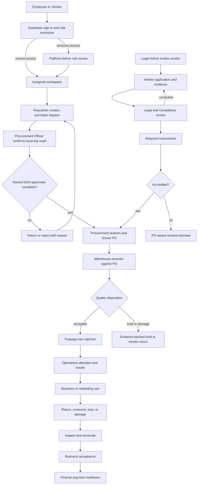
```mermaid
flowchart TD
  Staff[Employee or Vendor] --> Auth[Supabase sign-in and role resolution]
  Auth -->|correct access| Work[Assigned workspace]
  Auth -->|incorrect access| Admin[Platform Admin role review]
  Admin --> Work
  Work --> PR[Requester creates purchase request]
  PR --> POps[Procurement Officer confirms sourcing route]
  POps --> DOA{Named DOA approvals complete?}
  DOA -->|no| Return[Return or reject with reason]
  Return --> PR
  DOA -->|yes| PO[Procurement authors and issues PO]
  Invite[Legal Admin invites vendor] --> Apply[Vendor application and evidence]
  Apply --> Review[Legal and Compliance review]
  Review -->|correction| Apply
  Review --> Instruments[Required instruments]
  Instruments --> Accredited{Accredited?}
  Accredited -->|no| Block[PO award remains blocked]
  Accredited -->|yes| PO
  PO --> Receive[Warehouse receives against PO]
  Receive --> Inspect{Quality disposition}
  Inspect -->|accepted| Putaway[Putaway into valid bin]
  Inspect -->|hold or damage| Hold[Evidence-backed hold or vendor return]
  Putaway --> Allocate[Operations allocates and issues]
  Allocate --> Event[Business or marketing use]
  Event --> ReturnStock[Return, consume, lose, or damage]
  ReturnStock --> Reconcile[Inspect and reconcile]
  Reconcile --> Accept[Business acceptance]
  Accept --> Pay[Finance payment readiness]
```

## Procurement Flow

Use the canonical 13-step **Procurement to Payment** flow later in this handbook. The route has three independent axes:

| Axis                  | Operating decision                                                                                                                                                                                                                             |
| --------------------- | ---------------------------------------------------------------------------------------------------------------------------------------------------------------------------------------------------------------------------------------------- |
| Solicitation document | RFQ below PHP 1,000,000 when clear and comparable; RFP at PHP 1,000,000 and above or for complex, technical, strategic, high-risk, data-sensitive or non-comparable work at any amount; an approved exception may use none when policy permits |
| Procurement mode      | Competitive bidding is the default; each exception mode requires its own eligibility and evidence                                                                                                                                              |
| Governance tier       | Standard, formal bid, high-risk/special control, and current effective DOA are derived independently                                                                                                                                           |

Requirement kind determines scope, acceptance and reporting, not RFQ/RFP selection. Importation adds customs, landed-cost, logistics, currency and acceptance controls but does not automatically force RFP. Only the current effective Mwell DOA names approval authority. MPIC role titles, people, limits and annexes do not grant Mwell authority.

When creating a request, choose the named category first by selecting anywhere on its category tile, then explicitly classify it as **Goods / materials** or **Services**. The full tile is the radio hit area on desktop and mobile and exposes a visible keyboard focus state. On **Codes & justification**, wait for the controlled Department directory, choose the Department, and then choose its Cost Center. In live mode both controls remain selects while loading on desktop and mobile. If the directory cannot load, the form disables them and presents recovery guidance instead of accepting free-text authority values. Every PO line used for goods acceptance must retain its governed unit price. After Warehouse receipt and QC, Intra computes accepted value from accepted quantity multiplied by the PO-line price; Finance does not rely on a user-entered acceptance total.

The canonical source is `mWell Procurement Policy and Procedures - Revised Modern Visual - Word Updated.docx`. It identifies itself as an updated visual draft, so its application profile remains draft until Procurement records the source as approved. Operating instructions also use neutral **first independent variance decision** and **second independent variance decision** stages until Mwell policy/DOA owners authorize the local mapping. The inherited extension cap is modeled as seven calendar days.

## Procurement Role Procedures

Each procedure is standalone. Stop when its denial check fails; never use another role's credentials or evidence to continue.

### Requester

**Current persona mapping:** General Employee. `Requester` is the Procurement capability exercised by that persona.

- **Start condition:** A department need has an identified requester, budget context, cost center, required date, and business purpose.
- **Permitted action:** Create or correct the request; classify goods/materials or services; enter line items, specification or scope, acceptance criteria, alternatives, risk, and attachments; submit the current version.
- **Prohibited action:** Do not approve your own request, confirm the final route, choose an exception by preference, fabricate vendor competition, post a receipt, or assert Finance readiness.
- **Handoff:** Send the complete current request to the Procurement Lead; provide technical evaluation when formally assigned.
- **Denial check:** Stop if required facts or evidence are missing, the record is stale, the request is already submitted, or your identity is not the requester/authorized editor.
- **Recovery:** Reload the current record, address each validation or return reason, replace stale evidence, and resubmit a new attributable version.
- **Completion evidence:** Submitted request ID and version, requester identity, classification, budget/cost-center evidence, specification or scope, acceptance criteria, attachments, and submission timestamp.

### Department Head

**Current persona mapping:** Operations Lead only when that test identity is the active assigned Procurement approver. `Department Head` remains a DOA control label, not a separate persona or automatic authority grant.

- **Start condition:** The current effective DOA assigns your identity a valid approval step. The Department Head title alone does not assign either neutral variance-decision stage.
- **Permitted action:** Review the current request version, route axes, amount, budget, assigned decision evidence, recommendation, rationale, and prior decisions; approve, reject, or return with a specific reason within the assigned step.
- **Prohibited action:** Do not approve your own request or work, act from an expired/delegated-out assignment, claim first or second independent variance-decision authority from your title, substitute an MPIC title or annex for the Mwell DOA, or edit source evidence while deciding.
- **Handoff:** Send an approval to the next authorized decision owner under the effective DOA; send a return/rejection to Requester and Procurement.
- **Denial check:** Stop if the assignment, effective date, category/amount scope, record version, separation of duty, or required evidence does not match.
- **Recovery:** Return the record with an actionable reason or ask an authorized DOA administrator to correct configuration; re-evaluate only the new current version.
- **Completion evidence:** Immutable decision, acting identity, active DOA revision and step, request version, reason/comments, and timestamp.

### Procurement Lead

**Current persona mapping:** Procurement Lead.

- **Start condition:** A submitted request is ready for route confirmation, sourcing, award, commitment, monitoring, payment-pack preparation, or file closure.
- **Permitted action:** Confirm solicitation document, procurement mode, governance tier, active profile and reasons; issue equal versioned packages; monitor the three-to-four invite target and response quorum; record tabulation, best-value recommendation, exceptions, PO/agreement, vendor notices, payment pack, and closure request.
- **Prohibited action:** Do not change requester facts, treat amount as the RFQ/RFP switch, open fewer than three sealed responses without governed recovery, select an automatic lowest-price winner, decide Legal eligibility, post Warehouse acceptance, approve your own award, or release payment.
- **Handoff:** Route technical work to the assigned reviewer; route a justified variance to the authorized first and second independent variance-decision owners only after Mwell approves those stages; route award authority to current DOA approvers, accreditation issues to Legal/Compliance, receipts to Warehouse/Operations, and the complete payment pack to Finance Controller.
- **Denial check:** Stop if the profile or DOA is unresolved, vendor eligibility is invalid, package/equal-notice evidence is incomplete, quorum recovery is unapproved, evaluation is stale, or separation of duty fails.
- **Recovery:** Correct the package, source additional eligible vendors, use a current independently approved pre-issue invitation-target exception, run equal-notice extension/requote only under an authorized extension unit, obtain a controlled insufficient-bids decision, refresh evaluations, or close/return with reason.
- **Completion evidence:** Route decision with all three axes, policy/DOA snapshot, sourcing communications and responses, evaluations, recommendation/variance evidence, approved commitment, monitoring trail, payment pack, and closure event.

In live mode, Procurement Lead and Finance Controller can read the governed operational request register required for sourcing, commitment, matching, and payment work. General Employee and other requester-scoped users remain limited to requests they own or were explicitly granted. A direct request URL keeps its record identity: an authorized user sees the request, while a missing or unauthorized record displays an explicit recovery state instead of silently returning to the request list.

### Legal/Compliance

**Current persona mapping:** Legal & Compliance Lead.

- **Start condition:** Vendor accreditation, probation, scoped temporary clearance, legal instrument, compliance evidence, or an exception requiring Legal review is assigned to your authority.
- **Permitted action:** Review current commercial/legal evidence; request correction; make the authorized accreditation, probation, clearance, suspension/revocation, or instrument decision with evidence and notice.
- **Prohibited action:** Do not award the procurement, map an MPIC approver into Mwell, approve a request outside current capability, decide a case you prepared when independent decision is required, or turn a client assertion into vendor eligibility.
- **Handoff:** Publish the governed eligibility projection to Procurement; return deficiencies to the vendor representative; route financial or DOA questions to Finance or the department owner.
- **Denial check:** Stop if evidence is missing/expired, clearance scope or dates do not match the request, maker-decider separation fails, revision is stale, or notice/evidence references are absent.
- **Recovery:** Request exact corrections, assign an independent decision maker, revoke or expire invalid clearance, and issue a version-bound decision after evidence is complete.
- **Completion evidence:** Case/revision, decision, effective/expiry dates and scope, evidence references, notice reference, acting identity, and audit timestamp.

### Technical Reviewer

**Current persona mapping:** No separate current persona. This is a controlled specialist assignment described by Procurement policy; it must be assigned to an eligible current identity before use and does not inherit decision authority.

- **Start condition:** Procurement assigns a current solicitation response set and evaluation criteria for technical review.
- **Permitted action:** Evaluate compliance, quality/specification, delivery, warranty, support, training, security/privacy, and other assigned criteria; record comments and evidence within the five-working-day source SLA.
- **Prohibited action:** Do not view or alter commercial data when the controlled evaluation separates it, change the solicitation after bids close, pick the final winner, approve your own request, or use undocumented criteria.
- **Handoff:** Return the signed technical evaluation to Procurement; identify clarification or non-compliance without contacting one bidder privately.
- **Denial check:** Stop if the package version, criteria, response identity, conflict-of-interest state, assignment, or evidence is incomplete.
- **Recovery:** Ask Procurement for a common clarification, corrected assignment, or versioned package; re-evaluate every affected response consistently.
- **Completion evidence:** Reviewer/assignment, package version, criteria and scores/disposition, evidence, comments, due/completion timestamps, and conflict declaration.

### Warehouse/Operations

**Current persona mapping:** Operations Associate performs floor transactions; Operations Lead performs controlled setup, approval, exception, and variance decisions.

- **Start condition:** An issued approved PO/agreement or service milestone is ready for delivery, receipt, inspection, custody, or acceptance.
- **Permitted action:** Record actual quantity, identity, serial/lot, condition, evidence, custody and QC; accept conforming delivery; quarantine/reject non-conformance; record service/milestone acceptance when you are the authorized owner.
- **Prohibited action:** Do not create missing PO authority, accept against an unrelated commitment, hide shortages/damage, release your own controlled hold, change commercial terms, or mark payment ready.
- **Handoff:** Send accepted receipt/service evidence to Procurement; send quality, warranty, replacement, or RMA issues to Procurement and vendor; send resolved acceptance evidence into the Finance pack.
- **Denial check:** Stop if the commitment is missing/ineligible, delivery identity does not match, required evidence is absent, destination/custody is invalid, or controlled exception separation fails.
- **Recovery:** Quarantine and preserve evidence, correct the PO/receipt link, obtain Supervisor disposition, issue vendor-return custody, and re-inspect replacement/repair before acceptance.
- **Completion evidence:** PO/agreement link, receipt or milestone record, quantity/value, serial/lot where applicable, evidence, QC/acceptance disposition, custody, RMA/replacement trail, actors, and timestamps.

### Finance Controller

**Current persona mapping:** Finance Controller.

- **Start condition:** Procurement submits a versioned payment-readiness pack or a source-policy petty-cash/financial exception requires Finance decision.
- **Permitted action:** Validate itemized invoice/OR/SI, approved PO/agreement, accepted quantity/value, payment terms, tax/withholding, foreign-vendor evidence, variance, active threshold/profile and current authority; approve, return, or deny readiness.
- **Prohibited action:** Do not manufacture receipt/acceptance, waive missing evidence without authority, exceed accepted value, rely on the source PHP 50,000 value as approval authority, decide your own conflicting variance, or release payment from stale evidence.
- **Handoff:** Return corrections to Procurement and the evidence owner; send an approved readiness decision to the governed payment process; send authority conflicts to the effective DOA owner.
- **Denial check:** Stop if pack/acceptance versions differ, invoice exceeds accepted unpaid value, PO/agreement or tax evidence is missing, vendor eligibility is invalid, variance is unresolved, or your authority/separation does not match.
- **Recovery:** Record the discrepancy, maintain payment hold, require corrected invoice/acceptance/tax/variance evidence, and review a newly versioned pack.
- **Completion evidence:** Finance decision, pack and acceptance versions, invoice and commitment references, match result, tax/withholding/foreign evidence, accepted cap, reason, identity, and timestamp.

### Vendor Representative

**Current persona mapping:** Vendor Representative.

- **Start condition:** Your vendor organization receives an invitation, clarification, PO/agreement, delivery issue, correction request, accreditation task, or RMA notice.
- **Permitted action:** Access only your organization; acknowledge the exact package/PO; submit attributable responses before the deadline; ask clarifications; provide current evidence; report delay; complete correction, replacement, warranty, RMA, credit, or delivery action.
- **Prohibited action:** Do not view another vendor's response, reuse another recipient's acknowledgment, submit against a superseded package, bypass the deadline, alter Mwell decisions, or claim accreditation/award/payment status.
- **Handoff:** Send sourcing responses to Procurement, accreditation evidence to Legal/Compliance, delivery/quality evidence to Warehouse/Operations and Procurement, and invoices/payment support through the governed channel.
- **Denial check:** Stop if vendor identity/organization, notification group, package version, deadline, PO, or requested evidence does not match.
- **Recovery:** Use the current invitation or correction link, ask Procurement for equal clarification/extension, replace expired evidence, or complete the documented RMA/credit path.
- **Completion evidence:** Vendor identity, organization, package/PO version, acknowledgment, submission/clarification/delivery timestamps, response/evidence hashes, and correction or RMA outcome.

### Platform Admin

**Current persona mapping:** Platform Administrator.

- **Start condition:** An authorized owner requests role, capability, policy-profile, holiday calendar, or DOA configuration/support, or a denial indicates configuration may be incomplete.
- **Permitted action:** Administer approved effective-dated configuration, validate gaps/overlaps, grant minimum scoped access, preserve history, and provide audit/configuration evidence.
- **Prohibited action:** Do not name yourself or another user as a business approver without owner authority, activate draft policy values by implication, edit immutable decisions, bypass separation of duty, apply the parked migration, or claim deployment/UAT certification from local docs.
- **Handoff:** Return valid configuration to the business owner and affected role; route policy conflicts to Procurement/Finance/Legal and migration/deployment work to the separate controlled cutover.
- **Denial check:** Stop if the request lacks owner approval, effective dates overlap, authority scope is unclear, the target is shared/unverified, or the change would rewrite transaction history.
- **Recovery:** Keep the record draft, obtain owner/DOA approval, correct dates/scope, test locally, and use the controlled migration and release runbooks when authorized.
- **Completion evidence:** Approved change request, before/after configuration version, effective dates, owner, acting admin, validation results, audit event, and explicit statement of whether activation/deployment occurred.

## Vendor Accreditation Flow

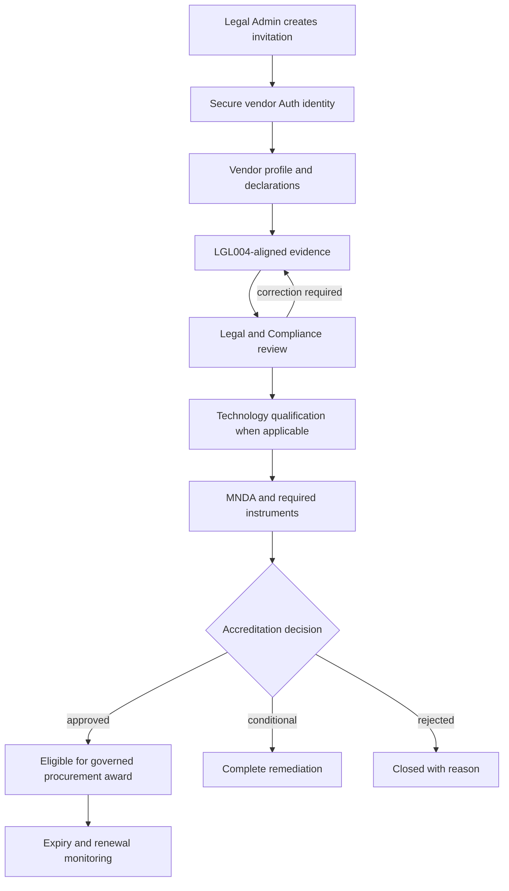
```mermaid
flowchart TD
  Invite[Legal Admin creates invitation] --> Identity[Secure vendor Auth identity]
  Identity --> Profile[Vendor profile and declarations]
  Profile --> Evidence[LGL004-aligned evidence]
  Evidence --> Legal[Legal and Compliance review]
  Legal -->|correction required| Evidence
  Legal --> Tech[Technology qualification when applicable]
  Tech --> Sign[MNDA and required instruments]
  Sign --> Decision{Accreditation decision}
  Decision -->|approved| Eligible[Eligible for governed procurement award]
  Decision -->|conditional| Remedy[Complete remediation]
  Decision -->|rejected| Closed[Closed with reason]
  Eligible --> Renewal[Expiry and renewal monitoring]
```

Vendors can see only their organization. Legal must not approve incomplete, expired, inconsistent, or unsupported evidence. Procurement must verify active accreditation before award.

## Warehouse Flow

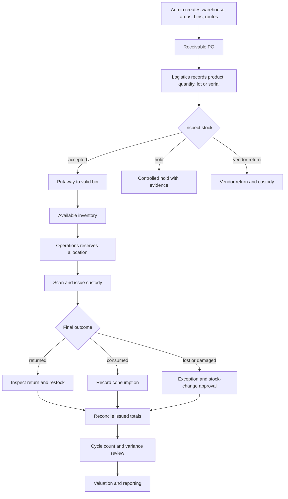
```mermaid
flowchart TD
  Setup[Admin creates warehouse, areas, bins, routes] --> PO[Receivable PO]
  PO --> Receipt[Logistics records product, quantity, lot or serial]
  Receipt --> Inspection{Inspect stock}
  Inspection -->|accepted| Bin[Putaway to valid bin]
  Inspection -->|hold| Hold[Controlled hold with evidence]
  Inspection -->|vendor return| VR[Vendor return and custody]
  Bin --> Available[Available inventory]
  Available --> Reserve[Operations reserves allocation]
  Reserve --> Issue[Scan and issue custody]
  Issue --> Outcome{Final outcome}
  Outcome -->|returned| ReturnInspect[Inspect return and restock]
  Outcome -->|consumed| Consume[Record consumption]
  Outcome -->|lost or damaged| Exception[Exception and stock-change approval]
  ReturnInspect --> Reconcile[Reconcile issued totals]
  Consume --> Reconcile
  Exception --> Reconcile
  Reconcile --> Count[Cycle count and variance review]
  Count --> Finance[Valuation and reporting]
```

### Setup and Bins

Warehouse Admin creates the site, storage areas, scannable bins, and allowed operation routes. Verify destinations before receiving production stock.

For bin relocation, choose the exact source and destination and scan the units to move. Remove a single incorrect scan using its removal control; the remaining list stays intact. Closing retains a local account/product-specific draft. After refresh, use **Resume draft** or **Discard draft**. Drafts do not transfer between devices. Active holds are checked before submission. If a hold blocks the move, keep the unit in its source custody and ask Quality to review it. An unknown network outcome requires checking movement history before retrying. On the product screen, select a bin's stock count to filter its serialized units and use **Load more** to see the remaining units.

### Receiving and Inspection

Select the PO and destination, record each line, scan serial/lot details, and attach evidence. Inspection supports accepted, hold, damaged, unavailable, and vendor-return outcomes. Non-accepted outcomes require a reason and evidence. Evidence must be an approved HTTPS resource, a governed private-storage object resolved through a signed URL, or a bundled UAT evidence asset. Intra does not request insecure or malformed links; it shows an explicit unavailable state so the operator can replace the evidence without generating a hidden browser failure.

In the governed PO receipt form, **Exception reason** explains damaged, short, excess or unidentified quantities; it is not an exemption request. Example: "Expected 100; received 95 clean and 5 damaged; photos attached." Expand the compact validation summary and select a missing requirement to reach its field. **Save progress** preserves unfinished input without receiving stock; **Confirm governed receipt** performs the receipt. For non-serialized merchandise, scan the barcode mapped to the exact product and size and enter the quantity, not invented device serials. A rejected barcode needs a label/mapping check by the Warehouse lead. General area means unassigned location, not QC acceptance.

### Allocation, Events, and Returns

Reserve only available non-held stock. Scan custody on issue. Record consumed, returned, lost, and damaged quantities. Close the event only after all issued quantity reconciles.

Use **Allocation Return** from the original issued allocation for its linked event-stock return. Do not record that same physical return again under Returns receiving. Returns receiving is the physical intake and inspection-staging workflow; a replacement/refund decision belongs to its customer return case.

### Ecommerce Fulfillment and Pick & Pack

Import orders with the provided CSV template or create an order in the app. Select a controlled sales channel and payment method; record the payment reference and Maya status when applicable. Customer address presets populate province, postal code, and service area, but the operator remains responsible for confirming the delivery address before release.

Selling price is assigned by Product and is read-only in Warehouse. Do not type or override a commercial price during fulfillment. For bundle orders, mark the line as a bundle and verify the generated set ID for every set. A quantity of two standalone products is not automatically a bundle.

Before picking, scan the displayed rack or bin and then scan each serialized unit. Confirm packaging supplies, waybill, courier, dispatch details, and the generated handover reference. Upload proof directly in Intra; an external evidence URL is not required. Use **Export current view** when a controlled CSV handoff is needed.

For a completed shipment, include completed orders in the status filter and open **Order details** to review the saved proof of delivery. Open its image to inspect it, then close the preview to return to the order. A missing or inaccessible attachment must be recovered; an "attached" label alone is not delivery proof. For an internal/event/third-party handover, the eligible recipient/requester or authorized non-releasing recorder uses **Acknowledge receipt**, enters the acceptance reference and uploads recipient evidence. The releasing operator cannot acknowledge their own handoff. This action does not grant requesters warehouse execution permissions.

**Marketing requester shortcut (live UAT, September 11):** Open **Fulfillment > Department requests** and find the issued request. Select **Acknowledge receipt** on the request or inside **View request**. Check the linked order and recipient, enter your acceptance reference, upload recipient acceptance evidence, then select **Confirm receipt**. The request shows **Receipt acknowledged** and its saved reference after confirmation. There is no need to switch to Orders and events. Do not acknowledge items you have not received. The releasing operator remains ineligible, including a user with multiple roles. A missing linked order needs a refresh and warehouse lead review; courier shipments require delivery proof instead. Closing the form does not record receipt.

**September 13 receipt-upload fix:** Eligible requesters can upload the acceptance image for their released handover using their own account. The image remains private; this permission does not allow unrelated warehouse uploads or grant picking, packing or release authority. Select **Confirm receipt** after the upload finishes, then check for **Receipt acknowledged**. This closes the linked request without deducting stock again. If an upload fails, keep the reference, retry the image and ask the Warehouse lead to check the linked order if access is still denied. Do not switch accounts or issue the same stock again.

**Layout update, live on UAT in build `75e733b`:** Allocation and start-picking confirmations appear beside the affected order instead of covering the scan form. If the order leaves your selected filter, its confirmation stays below the filters. Receipt capture opens as a single work surface; closing it returns you to the request. Expand **Order reference** to read or copy the full reference when the heading is shortened. Required evidence, approval, release and receipt steps are unchanged. Post-deployment checks covered Marketing, Operations and Admin on desktop and mobile; complete warehouse transaction certification remains separate.

**Shipment testing update:** The development team completed a limited ecommerce delivery journey on desktop and mobile, including a failed-delivery retry and private proof photo. Desktop continued from its saved release step after a test-only audit-label correction; mobile ran continuously. Delivery confirmation did not deduct stock again. Records marked **WMS-ECOM** are isolated audit fixtures, not shipments for testers to process. Other stock types, return branches, concurrent work and the real-user floor pilot remain open.

**Latest layout update, live on UAT in build `63a52fc`:** The pick form keeps its full reference under **Order reference** and the condition reminder under **Quality checkpoint**. New errors scroll into view without clearing scans. Packing confirmation stays on the order or below the filters; an operator other than the packer still performs release. The change passed 158 fulfillment tests and 30 local browser checks across six widths, followed by two fresh uninterrupted live ecommerce journeys with 32 checkpoints. The affected desktop/mobile error and packing screens were visually reviewed. Required process steps are unchanged; broader warehouse and human pilot acceptance remain open.

### Customer Returns and Original Release Matching

Customer Service or Operations scans the returned serial with the camera or enters it manually. Intra matches the serial to its original picked release and order when evidence exists. Verify the displayed source before accepting custody. An unmatched serial must remain visibly unresolved and be escalated for controlled investigation; do not attach it to an unrelated order.

Use the serial already on the physical device or in the original release, not a new serial. An already-scanned message means it is already in this draft. For a replacement, review the linked original order, confirm its complete customer/delivery details or enter a new destination with a reason. Missing historical details need customer confirmation, not a guessed backfill. The original order stays unchanged. Closed returns must not be reopened or create another stock movement merely because a previous command is retried.

### Counts and Adjustments

Create a count draft, record physical quantity and evidence, review variance, and post only an approved stock-change request. Never edit stock levels directly.

## DOA Administration

Platform Admin or Legal Admin opens **Admin -> Delegation of Authority**. Select **Create revision** on the current department matrix, confirm the displayed department name and stable department code, choose only from the active department directory, update version and named assignments, save a draft, validate gaps/overlaps/final approval, and activate deliberately. If validation fails, Intra scrolls to and focuses the first invalid field and shows the correction inline on both desktop and mobile. Reopen the saved draft before handoff; a success message alone is not persistence evidence. If the governed save fails, confirm no matrix appeared, retain the displayed reference, and escalate rather than choosing another department. Free-text departments are not accepted. Active records are immutable; a separate authorized checker activates the draft, supersedes the prior revision, and preserves history. UAT currently gives every temporary active matrix one open named assignment for Department Head, Procurement Head, Legal, Finance, and Final Approver so all derived request ladders can be tested. These `UAT-TEMP-*` assignments are replaceable test coverage and must not be treated as the approved production authority schedule.

## Troubleshooting and Recovery

| Situation                      | Action                                                                               |
| ------------------------------ | ------------------------------------------------------------------------------------ |
| Sign-in remains on login       | Verify identity, request reset, or ask Platform Admin to confirm provisioning        |
| Access denied                  | Confirm the role matrix in this handbook; request minimum-role review for the route  |
| Loading skeleton remains       | Check connection, wait once, refresh, then capture route/time/role                   |
| Validation prevents submit     | Correct every labeled field and required evidence; do not bypass the gate            |
| Possible duplicate transaction | Refresh and search the record before retrying                                        |
| Stale-state message            | Reload the current record and re-evaluate before acting                              |
| Vendor invitation not received | Legal checks delivery status and contact address before retrying                     |
| Receipt variance or damage     | Use inspection/hold/vendor-return workflow with evidence                             |
| Return serial has no source    | Quarantine the item, preserve the scanned serial, and investigate before replacement |
| Vendor invitation rate-limited | Do not repeatedly resend; verify delivery state and escalate SMTP capacity           |

Routine UAT regression verifies invitation persistence, case linkage, expiry, replay denial, and access state. Actual external email delivery is a separate controlled desktop canary so repeated code pushes do not exhaust the shared mail quota; a canary passes only when the persisted invite is `sent` with Auth identity, expiry, and generation evidence.
| Mobile control is obscured | Scroll into the reserved safe area; report viewport and screenshot if still unreachable |

Support evidence should contain route, time, role, safe record ID, expected outcome, visible error, and a redacted screenshot. Never include credentials or private document contents.

On screens narrower than 360px, Intra keeps four primary bottom-navigation destinations visible and moves lower-priority destinations into **More**. All destinations remain reachable, labels remain unclipped, and tap targets remain at least 44px. Do not zoom out to compensate for a layout issue; report any horizontal scrolling as a UI defect.

My Work may display long receipt, request, case, or transaction identifiers. These identifiers wrap inside their task card without widening the page; use **Open source** to inspect the authoritative record rather than trying to interpret an identifier from a truncated mobile view.

## Security and Data Handling

- Use individual accounts; never share QA or production passwords.
- Grant minimum scoped roles.
- Treat access denied as a control, not an obstacle to bypass.
- Keep evidence and decisions in the governed workflow.
- Verify saved state before retrying writes.
- Rotate any credential exposed in chat, logs, screenshots, or documentation.

## Glossary

- **DOA:** Delegation of Authority approval matrix.
- **PR:** Purchase request.
- **PO:** Purchase order.
- **Putaway:** controlled movement of accepted stock into a valid bin.
- **Cycle count:** physical count used to govern stock variance.
- **Idempotency:** duplicate-effect prevention for retried commands.
- **RLS:** database row-level security.

## Future Recommended Features

All items below are **proposed**, not current capabilities:

1. Handbook section drafting, approval, effective dating, and version history.
2. Contextual help launched from operational controls.
3. Search analytics and unsuccessful-query reporting.
4. Article feedback and correction requests.
5. Policy-to-procedure traceability.
6. Guided sandbox walkthroughs.
7. Multilingual governed documentation.
8. Managed offline handbook distribution and update notification.
9. Role onboarding curricula and completion tracking.
10. Workflow-linked release notes.

## Flow-First Operational Journeys

Read the overview before performing work. Use **By role** to confirm the handoff owner and **Decisions** before taking an exception path. The lifecycle ribbon is a reading aid; the underlying record, evidence, role assignment, and audit trail remain the source of truth.

### Procurement to Payment

```mermaid
%% handbook-flow: workflow=procurement-to-payment; view=overview; stages=Define need|Submit request|Confirm path|Source vendors|Check accreditation|Evaluate|Recommend award|Approve|Issue PO or contract|Deliver and close|Prepare payment handoff|Process payment|Close file
flowchart LR
  S1[1 Define the need] --> S2[2 Submit the request] --> S3[3 Confirm the procurement path] --> S4[4 Source vendors] --> S5[5 Check accreditation] --> S6[6 Evaluate offers] --> S7[7 Recommend award] --> S8[8 Approve under the active DOA] --> S9[9 Issue PO or contract] --> S10[10 Deliver and close obligations] --> S11[11 Prepare payment handoff] --> S12[12 Process vendor payment] --> S13[13 Close the procurement file]
```

```mermaid
%% handbook-flow: workflow=procurement-to-payment; view=role; stages=Define need|Submit request|Confirm path|Source vendors|Check accreditation|Evaluate|Recommend award|Approve|Issue PO or contract|Deliver and close|Prepare payment handoff|Process payment|Close file
flowchart LR
  R[Requester: need, classification and acceptance evidence] --> P[Procurement Lead: route and sourcing evidence]
  P --> S[System: profile, DOA, accreditation, risk and quorum controls]
  S --> V[Vendor representative: acknowledgment, response and delivery evidence]
  V --> PT[Procurement and technical reviewer: tabulation and evaluation]
  PT --> V1[Authorized first independent variance decision owner when needed]
  V1 --> V2[Authorized second independent variance decision owner when needed]
  V2 --> A[Named current DOA approvers: award decision]
  A --> PC[Procurement Lead: PO or agreement and monitoring]
  PC --> W[Warehouse or service owner: receipt, QC and acceptance]
  W --> F[Procurement and Finance Controller: payment-readiness evidence]
  F --> C[Procurement Lead: issue resolution and file closure]
```

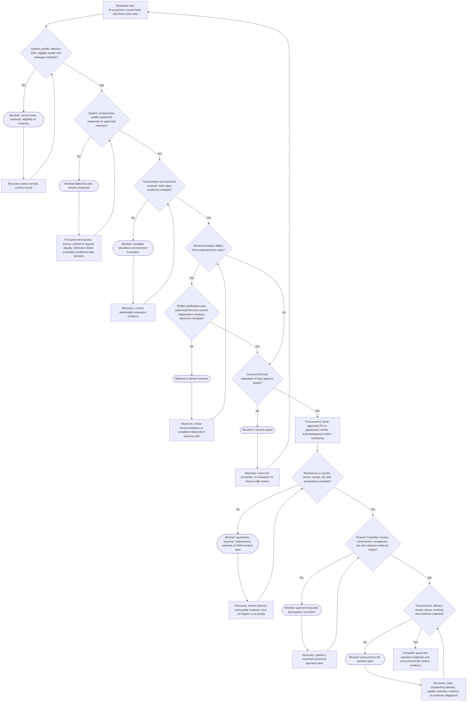
```mermaid
%% handbook-flow: workflow=procurement-to-payment; view=decision; stages=Define need|Submit request|Confirm path|Source vendors|Check accreditation|Evaluate|Recommend award|Approve|Issue PO or contract|Deliver and close|Prepare payment handoff|Process payment|Close file
flowchart TD
  A[Requester and Procurement: current facts and three route axes] --> B{System: profile, effective DOA, eligible vendor and package complete?}
  B -->|No| BX([Blocked: correct route, authority, eligibility or evidence])
  BX --> BR[Recovery owner corrects current record]
  BR --> B
  B -->|Yes| C{System: at least three usable sealed-bid responses or approved recovery?}
  C -->|No| CX([Blocked failed bid: bids remain unopened])
  CX --> CR[Procurement recovery: source, extend or requote equally; otherwise obtain controlled insufficient-bids decision]
  CR --> C
  C -->|Yes| D{Procurement and technical reviewer: best-value evidence complete?}
  D -->|No| DX([Blocked: complete tabulation and technical evaluation])
  DX --> DR[Recovery: correct attributable evaluation evidence]
  DR --> D
  D -->|Yes| E{Recommendation differs from evaluated best value?}
  E -->|Yes| F{Written justification plus authorized first and second independent variance decisions complete?}
  F -->|No| FX([Blocked or denied variance])
  FX --> FR[Recovery: revise recommendation or complete independent variance path]
  FR --> E
  F -->|Yes| G{Current DOA and separation of duty approve award?}
  E -->|No| G
  G -->|No| GX([Blocked or denied award])
  GX --> GR[Recovery: return for correction, re-evaluation or closure with reason]
  GR --> A
  G -->|Yes| H[Procurement: issue approved PO or agreement; vendor acknowledgment enters monitoring]
  H --> I{Warehouse or service owner: receipt, QC and acceptance complete?}
  I -->|No| IX([Blocked: quarantine, rejection, replacement, warranty or RMA remains open])
  IX --> IR[Recovery: resolve delivery and quality evidence, then re-inspect or re-accept]
  IR --> I
  I -->|Yes| J{Finance Controller: invoice, commitment, acceptance, tax and variance evidence match?}
  J -->|No| JX([Blocked: payment hold and discrepancy correction])
  JX --> JR[Recovery: submit a corrected versioned payment pack]
  JR --> J
  J -->|Yes| K{Procurement: delivery closed, issues resolved and evidence retained?}
  K -->|No| KX([Blocked: procurement file remains open])
  KX --> KR[Recovery: close outstanding delivery, quality, warranty, variance or evidence obligations]
  KR --> K
  K -->|Yes| L[Complete: governed payment readiness and procurement-file closure evidence]
```

**Completion criteria:** all 13 policy steps are attributable and linked: need and request facts; Procurement-confirmed route; vendor sourcing and accreditation; technical/commercial evaluation; award recommendation; current-DOA approval; PO/contract; delivery and obligation closure; payment handoff; Finance processing; and retained file-closure evidence. The application exposes extra controlled states for failed-bid recovery, acknowledgement, inspection, quality recovery and Finance review; these are system-expanded states, not extra policy steps.

### Vendor Accreditation

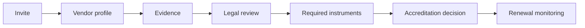
```mermaid
%% handbook-flow: workflow=vendor-accreditation; view=overview; stages=Invite|Profile|Evidence|Review|Instrument|Decision|Renewal
flowchart LR
  I[Invite] --> P[Vendor profile] --> E[Evidence] --> R[Legal review] --> N[Required instruments] --> D[Accreditation decision] --> M[Renewal monitoring]
```

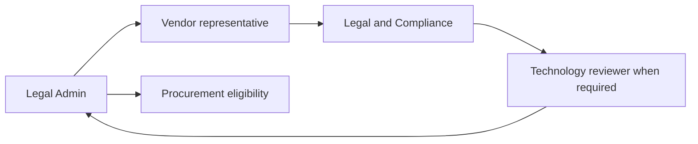
```mermaid
%% handbook-flow: workflow=vendor-accreditation; view=role; stages=Invite|Profile|Evidence|Review|Instrument|Decision|Renewal
flowchart LR
  L[Legal Admin] --> V[Vendor representative]
  V --> C[Legal and Compliance]
  C --> T[Technology reviewer when required]
  T --> L
  L --> P[Procurement eligibility]
```

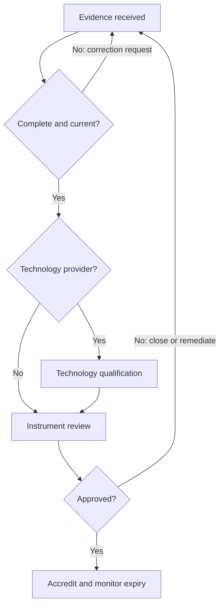
```mermaid
%% handbook-flow: workflow=vendor-accreditation; view=decision; stages=Invite|Profile|Evidence|Review|Instrument|Decision|Renewal
flowchart TD
  E[Evidence received] --> C{Complete and current?}
  C -->|No: correction request| E
  C -->|Yes| T{Technology provider?}
  T -->|Yes| Q[Technology qualification]
  T -->|No| I[Instrument review]
  Q --> I
  I --> D{Approved?}
  D -->|No: close or remediate| E
  D -->|Yes| A[Accredit and monitor expiry]
```

**Completion criteria:** the vendor has an attributable invitation, current LGL004-aligned evidence, applicable technology qualification and executed instruments; Legal records a decision and Procurement sees only the resulting eligibility.

### Receiving and Putaway

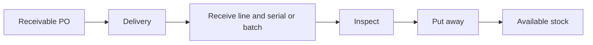
```mermaid
%% handbook-flow: workflow=receiving-putaway; view=overview; stages=PO|Delivery|Receive|Inspect|Putaway|Available
flowchart LR
  P[Receivable PO] --> D[Delivery] --> R[Receive line and serial or batch] --> I[Inspect] --> B[Put away] --> A[Available stock]
```

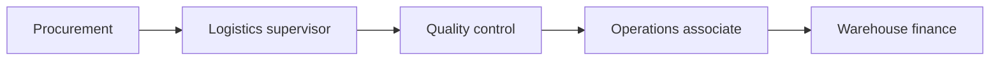
```mermaid
%% handbook-flow: workflow=receiving-putaway; view=role; stages=PO|Delivery|Receive|Inspect|Putaway|Available
flowchart LR
  P[Procurement] --> L[Logistics supervisor]
  L --> Q[Quality control]
  Q --> O[Operations associate]
  O --> F[Warehouse finance]
```

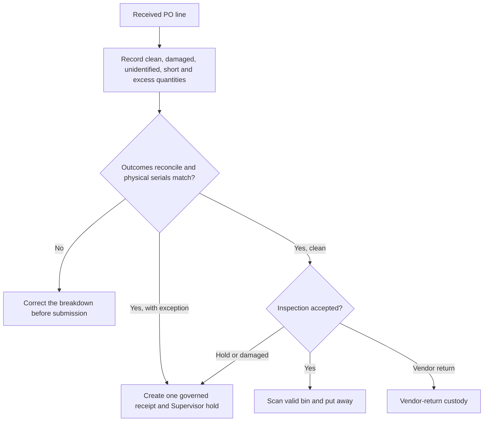
```mermaid
%% handbook-flow: workflow=receiving-putaway; view=decision; stages=PO|Delivery|Receive|Inspect|Putaway|Available
flowchart TD
  R[Received PO line] --> O[Record clean, damaged, unidentified, short and excess quantities]
  O --> M{Outcomes reconcile and physical serials match?}
  M -->|No| V[Correct the breakdown before submission]
  M -->|Yes, with exception| H[Create one governed receipt and Supervisor hold]
  M -->|Yes, clean| I{Inspection accepted?}
  I -->|Yes| B[Scan valid bin and put away]
  I -->|Hold or damaged| H
  I -->|Vendor return| X[Vendor-return custody]
```

Use Receiving staging for the physical delivery and Quality decision. Staging is not the final SKU location. After acceptance, Put away each SKU into its directed rack/bin, such as `A-01-01` through `A-01-04`. For a mixed line, enter every outcome quantity and scan one unique serial for every physically present serialized unit. Short quantity represents units not delivered and therefore has no serial. The entire breakdown is committed as one governed transaction; exception quantities remain held for a different Supervisor.

**Completion criteria:** each receipt line has PO and delivery references, delivery date, an outcome breakdown that reconciles to the remaining ordered quantity, required serial/batch evidence, a staging destination and a recorded Quality decision before accepted stock is put away and made available.

### Ecommerce Fulfillment

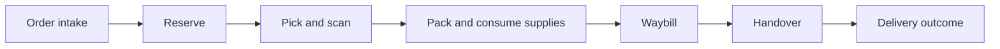
```mermaid
%% handbook-flow: workflow=ecommerce-fulfillment; view=overview; stages=Order|Reserve|Pick|Pack|Waybill|Release|Delivery
flowchart LR
  O[Order intake] --> R[Reserve] --> P[Pick and scan] --> K[Pack and consume supplies] --> W[Waybill] --> H[Handover] --> D[Delivery outcome]
```

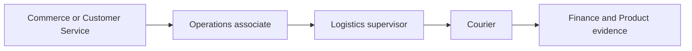
```mermaid
%% handbook-flow: workflow=ecommerce-fulfillment; view=role; stages=Order|Reserve|Pick|Pack|Waybill|Release|Delivery
flowchart LR
  C[Commerce or Customer Service] --> O[Operations associate]
  O --> L[Logistics supervisor]
  L --> R[Courier]
  R --> F[Finance and Product evidence]
```

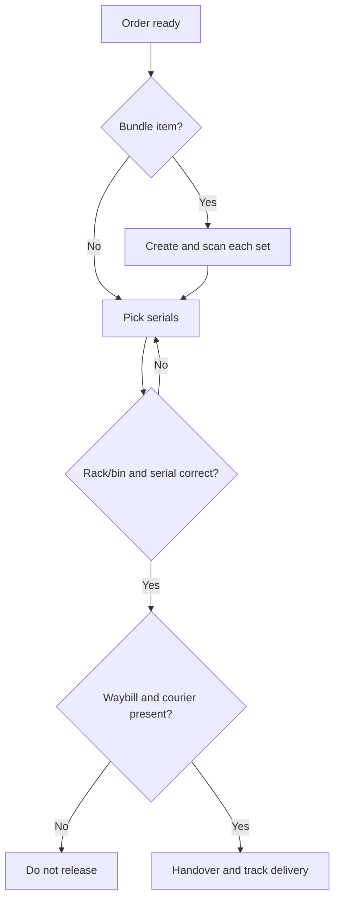
```mermaid
%% handbook-flow: workflow=ecommerce-fulfillment; view=decision; stages=Order|Reserve|Pick|Pack|Waybill|Release|Delivery
flowchart TD
  O[Order ready] --> B{Bundle item?}
  B -->|Yes| S[Create and scan each set]
  B -->|No| P[Pick serials]
  S --> P
  P --> L{Rack/bin and serial correct?}
  L -->|No| P
  L -->|Yes| W{Waybill and courier present?}
  W -->|No| H[Do not release]
  W -->|Yes| D[Handover and track delivery]
```

**Completion criteria:** an order has its controlled channel, address and payment fields, every required rack/bin and serialized scan, bundle-set evidence where applicable, packaging consumption, waybill/courier, attributable handover proof and a tracked delivery outcome.

### Returns and Replacements

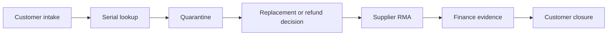
```mermaid
%% handbook-flow: workflow=returns-replacements; view=overview; stages=Intake|Serial lookup|Quarantine|Decision|RMA|Finance|Closure
flowchart LR
  I[Customer intake] --> S[Serial lookup] --> Q[Quarantine] --> D[Replacement or refund decision] --> R[Supplier RMA] --> F[Finance evidence] --> C[Customer closure]
```

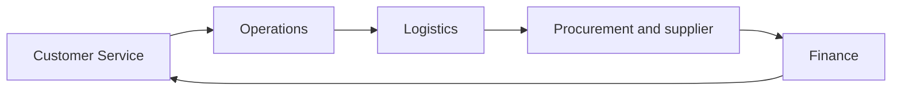
```mermaid
%% handbook-flow: workflow=returns-replacements; view=role; stages=Intake|Serial lookup|Quarantine|Decision|RMA|Finance|Closure
flowchart LR
  C[Customer Service] --> O[Operations]
  O --> L[Logistics]
  L --> P[Procurement and supplier]
  P --> F[Finance]
  F --> C
```

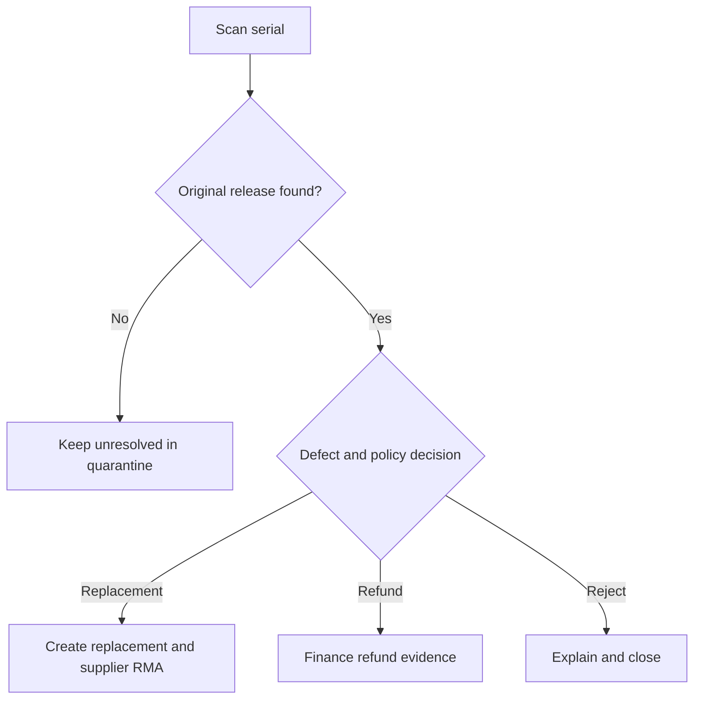
```mermaid
%% handbook-flow: workflow=returns-replacements; view=decision; stages=Intake|Serial lookup|Quarantine|Decision|RMA|Finance|Closure
flowchart TD
  S[Scan serial] --> M{Original release found?}
  M -->|No| Q[Keep unresolved in quarantine]
  M -->|Yes| D{Defect and policy decision}
  D -->|Replacement| R[Create replacement and supplier RMA]
  D -->|Refund| F[Finance refund evidence]
  D -->|Reject| C[Explain and close]
```

**Completion criteria:** the return is traced to its original release or remains explicitly unresolved, then retains defect evidence, custody location, supplier RMA/refund or replacement evidence and an attributable customer outcome.

### Inventory Release

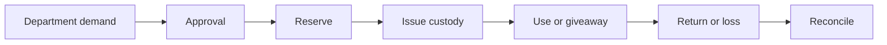
```mermaid
%% handbook-flow: workflow=inventory-release; view=overview; stages=Demand|Approval|Reserve|Issue|Use|Return|Reconcile
flowchart LR
  D[Department demand] --> A[Approval] --> R[Reserve] --> I[Issue custody] --> U[Use or giveaway] --> T[Return or loss] --> C[Reconcile]
```

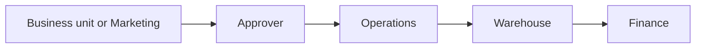
```mermaid
%% handbook-flow: workflow=inventory-release; view=role; stages=Demand|Approval|Reserve|Issue|Use|Return|Reconcile
flowchart LR
  B[Business unit or Marketing] --> A[Approver]
  A --> O[Operations]
  O --> W[Warehouse]
  W --> F[Finance]
```

```mermaid
%% handbook-flow: workflow=inventory-release; view=decision; stages=Demand|Approval|Reserve|Issue|Use|Return|Reconcile
flowchart TD
  D[Request] --> A{Authority and stock available?}
  A -->|No| R[Return with reason or replenish]
  A -->|Yes| I[Scan issue custody]
  I --> O{Outcome recorded?}
  O -->|Returned| C[Inspect and restock]
  O -->|Consumed or giveaway| E[Post expense or usage]
  O -->|Lost or damaged| X[Exception approval]
```

Marketing and Business Unit dashboard actions open the **Department requests** workspace directly. The requester sees their own requests; Warehouse and Procurement decision owners see only the operational records permitted by their role.

**Completion criteria:** all department requests have one or more line items, authority, issued custody evidence, a recorded outcome and reconciliation. Merchandise is treated as expense under the applicable cost center.

### Event Custody

```mermaid
%% handbook-flow: workflow=event-custody; view=overview; stages=Demand|Approval|Transfer|Event|Outcome|Return|Settlement
flowchart LR
  D[Marketing demand] --> A[Approval] --> T[Event transfer] --> E[Event use] --> O[Sales or giveaway outcome] --> R[Return] --> S[Settlement]
```

```mermaid
%% handbook-flow: workflow=event-custody; view=role; stages=Demand|Approval|Transfer|Event|Outcome|Return|Settlement
flowchart LR
  R[General Employee requester] --> M[Marketing and Events Lead]
  M --> W[Operations Associate: physical transfer]
  W --> M
  M --> F[Finance Controller: independent settlement approval]
```

```mermaid
%% handbook-flow: workflow=event-custody; view=decision; stages=Demand|Approval|Transfer|Event|Outcome|Return|Settlement
flowchart TD
  T[Transferred stock] --> O{Event outcome}
  O -->|Sold| S[Capture sale summary]
  O -->|Given away| G[Record giveaway]
  O -->|Returned| R[Inspect return]
  O -->|Lost or damaged| X[Evidence and approval]
  R --> K{Re-kit eligible?}
  K -->|Yes| Q[Open-box re-kitting]
  K -->|No| C[Controlled disposition]
  S --> E[Marketing submits outcomes and event evidence]
  G --> E
  Q --> E
  C --> E
  E --> F{Finance reference and evidence complete?}
  F -->|No| M[Return to Marketing and Events for correction]
  F -->|Yes| Z[Finance independently approves settlement]
  Z --> P[Finance Close posts and reconciles the bound entry]
```

For a third-party event sale, Marketing owns and approves the event, a Warehouse or Operations administrator controls the external custody location, Operations records the sale and gross sales, and Finance closes settlement. If no external location exists, the intake form blocks submission and links to Location management instead of leaving the operator at an empty selector.

**Completion criteria:** event demand, approval, transfer scans, sales/giveaway quantities, returned/lost/damaged evidence, re-kitting decision and Finance settlement reconcile to the final event balance.

### Inventory Integrity

For a **Blind count**, enter the quantities and serials you physically observe. Expected quantities, variance amounts, balance feedback and the **Variances only** filter are hidden while you count, including after an unsuccessful submission. An unexpected serial still blocks submission; investigate it through the controlled receiving or relocation process. Attach the required evidence before **Submit count**. Only a successfully recorded count provides its balance or review outcome; a draft does not complete a count or adjust stock. Normal counting mode retains its comparison and filtering controls.

```mermaid
%% handbook-flow: workflow=inventory-integrity; view=overview; stages=Count|Variance|Approval|Adjust|Expiry|Recall|Reconcile
flowchart LR
  C[Cycle count] --> V[Variance] --> A[Adjustment approval] --> J[Post adjustment] --> E[Expiry control] --> R[Recall handling] --> F[Serialized reconciliation]
```

```mermaid
%% handbook-flow: workflow=inventory-integrity; view=role; stages=Count|Variance|Approval|Adjust|Expiry|Recall|Reconcile
flowchart LR
  O[Operations] --> S[Logistics supervisor]
  S --> F[Warehouse finance]
  F --> P[Procurement or supplier]
  P --> A[Platform audit]
```

```mermaid
%% handbook-flow: workflow=inventory-integrity; view=decision; stages=Count|Variance|Approval|Adjust|Expiry|Recall|Reconcile
flowchart TD
  C[Physical count] --> V{Variance found?}
  V -->|No| R[Reconcile serials]
  V -->|Yes| E[Attach evidence]
  E --> A{Adjustment approved?}
  A -->|No| I[Investigate]
  A -->|Yes| P[Post governed adjustment]
  R --> X{Expired, recalled or damaged?}
  X -->|Yes| Q[Quarantine and disposition]
  X -->|No| K[Close count]
```

**Completion criteria:** the physical count, variance evidence, approval, stock adjustment, serialized reconciliation and any expiry/recall/damage disposition are all recorded; staff never edit quantity directly.

## August 24 WMS UAT Validation Pack

Use these records only in the UAT environment. They provide known starting points for role training, transaction testing and evidence capture. They are not production transactions and should not be copied into production.

### Receiving and Putaway Scenarios

| UAT purchase order  | Vendor      | Expected receipt                                                                        | Planned destination                                        |
| ------------------- | ----------- | --------------------------------------------------------------------------------------- | ---------------------------------------------------------- |
| `UAT-AUG24-PO-0001` | Zhenzen     | 100 Prodigy Watch, 100 Power Watch, 100 Prestige Watch and 100 Sports Watch; serialized | `A-01-03`, `A-01-01`, `A-01-02` and `A-01-04` respectively |
| `UAT-AUG24-PO-0002` | Company BBB | 100 OTG Bag Large                                                                       | `F-01-02`                                                  |
| `UAT-AUG24-PO-0003` | Company AAA | 100 Generic Paperbag White                                                              | `F-04-01`                                                  |

The Operations Associate can see these receivable goods purchase orders and their lines without receiving broad access to Procurement request records. Use `Q-01-01` for evidence-backed quarantine when an inspection outcome prevents normal putaway.

For the August 25 mixed-receipt check on one serialized PO 0001 line, record: 50 clean, 20 damaged, 10 unidentified and 20 short. Scan 80 unique serials across the three physically present outcomes, attach delivery evidence and an exception reason, then confirm that one receipt and separate Supervisor decisions for damaged, unidentified, and short outcomes are created atomically. After Quality acceptance, put away each SKU to its planned final bin; do not treat `Q-01-01` staging as the permanent location.

### Fulfillment, Delivery and Backorder Scenarios

| UAT order                     | Starting state      | What to validate                                                                             |
| ----------------------------- | ------------------- | -------------------------------------------------------------------------------------------- |
| `UAT-AUG24-ESHOP-RECEIVED`    | Received            | Complete allocation, rack/bin scans, serialized picking, packing, waybill and release        |
| `UAT-AUG24-SHOPIFY-BUNDLE`    | Allocated           | Build each OTG Set A separately and retain the serials assigned to each set                  |
| `UAT-AUG24-PICKING`           | Picking             | Resume an in-progress pick without duplicating a serial or skipping the source bin           |
| `UAT-AUG24-PACKING`           | Packing             | Record packaging supplies and prevent release until waybill and courier details are complete |
| `UAT-AUG24-READY-FOR-RELEASE` | Ready               | Perform attributable courier handover and release                                            |
| `UAT-AUG24-DELIVERY-FAILED`   | Released            | Record failed delivery, preserve custody and select the approved next action                 |
| `UAT-AUG24-SPLIT-BACKORDER`   | Partially allocated | Release only available lines and retain the unfulfilled quantity as an explicit backorder    |

### Return, Event and Internal Demand Scenarios

| Scenario                | Starting state         | What to validate                                                                                     |
| ----------------------- | ---------------------- | ---------------------------------------------------------------------------------------------------- |
| Defective Power Watch   | Submitted return       | Serial lookup, original release trace, defect evidence, quarantine and decision handoff              |
| Replacement return      | Decision required      | Replacement authorization, replacement issue, supplier evidence and customer closure                 |
| Refund return           | Resolved               | Finance evidence, refund closure and retained custody history                                        |
| Event A                 | Reconciliation pending | Sold, giveaway, returned, lost or damaged quantities and final settlement of PHP 16,970              |
| Marketing stock request | Pending                | Multi-line department demand, approval, reservation, physical issue and expense/cost-center evidence |

For every scenario, confirm both the visible status and the saved record after the next role takes over. A successful screen message alone is not completion evidence.

## Application Screen Reference

The canonical standalone file is `docs/manual/index.html`. Screens below establish layout and control location; follow the written procedure and current field labels if a released screen has changed.

### Sign-in and Workspace

### Procurement

### Legal and Vendor Accreditation

Screenshots that show retired errors are historical audit evidence and are intentionally excluded from this handbook.
