# Mwell Intra Standalone Operating Handbook

**Audience:** All authenticated employees and vendors

**Live app:** https://mwell-intra.vercel.app

**Reviewed:** August 23, 2026

**Procurement application behavior baseline:** `32170e425e125c63597ea8e05c6287a7cd256f5b`; schema boundary verified on UAT and commit-bound browser certification pending

**Release authority:** Use the commit-bound manifest packaged with this handbook.

**Content owners:** Platform, Procurement, Legal, Warehouse

This handbook is the complete standalone operating reference for Mwell Intra. Use its contents, full-text search, process diagrams, role procedures, application screenshots, and governed source register without opening a separate help system. Operational routes continue to enforce role-based access.

## Start Here

1. Use the handbook search to find an outcome such as `receive stock`, `PR`, `vendor renewal`, `bins`, or `DOA`.
2. Read the complete process diagram first, including every decision and exception branch.
3. Confirm your role, authority, required evidence, and handoff before opening the application.
4. Review the [Process Reference Library](../PROCESS_REFERENCE_LIBRARY.md) when a step is governed by policy, a legal form, a source tracker, or an approved control.
5. Sign in with your assigned Mwell identity and execute only the procedure permitted by your role.

Never share passwords, tokens, private keys, or confidential documents in support messages or screenshots.

## Navigation

- **Desktop:** left icon rail; hover an icon for its label.
- **Mobile:** bottom navigation; additional modules are under **More**.
- **Command palette:** `Ctrl+K` or `Cmd+K` opens task and destination search.
- **Live badge:** the session is connected to Supabase.
- **Access denied:** stop and request a minimum-role review for the operational route.

## User Types and Responsibilities

| User type                      | Primary responsibility                                                    | Main handoff              |
| ------------------------------ | ------------------------------------------------------------------------- | ------------------------- |
| Core staff                     | Use this handbook to find the governed workflow and complete shared tasks | Platform Admin for access |
| Platform Admin                 | Identities, scoped roles, audit review, DOA access                        | Department owner          |
| Vendor portal                  | Application, evidence, instruments, corrections, renewal                  | Legal                     |
| Warehouse Logistics Supervisor | Receiving, inspection, tagging, putaway                                   | Operations / Finance      |
| Warehouse Operations           | Allocation, issue, transfer, return, reconciliation                       | Business unit / Finance   |
| Warehouse Finance              | Valuation, variance, reconciliation, approvals                            | Warehouse Admin           |
| Warehouse BI Analyst           | Governed analysis and reports                                             | Operational owners        |
| Warehouse Business Unit        | Inventory demand and outcome confirmation                                 | Operations                |
| Warehouse Marketing            | Event demand, custody, usage, return                                      | Operations                |
| Warehouse Procurement          | Receivable PO and supplier coordination                                   | Logistics Supervisor      |
| Warehouse Pricing              | Landed cost and controlled price proposals                                | Finance                   |
| Warehouse Admin                | Locations, areas, bins, routes, imports                                   | Logistics Supervisor      |
| Procurement Requester          | Need, justification, line items, evidence                                 | Procurement Officer       |
| Procurement Officer            | Sourcing route, competition, vendor readiness, PO                         | Approver / Warehouse      |
| Procurement Approver           | Named DOA decision                                                        | Next approval tier        |
| Procurement Finance            | Financial approval, acceptance, payment readiness                         | Finance processing        |
| Procurement Admin              | Procurement controls and exception oversight                              | Platform / Legal          |
| Legal Reviewer                 | Evidence, instruments, risk, accreditation decision                       | Vendor / Procurement      |
| Legal Compliance               | Compliance disposition, expiry, renewal                                   | Legal Admin               |
| Legal Admin                    | Invitations, Legal workflow, department DOA                               | Vendor / Legal Reviewer   |

## Comprehensive Launch Flow

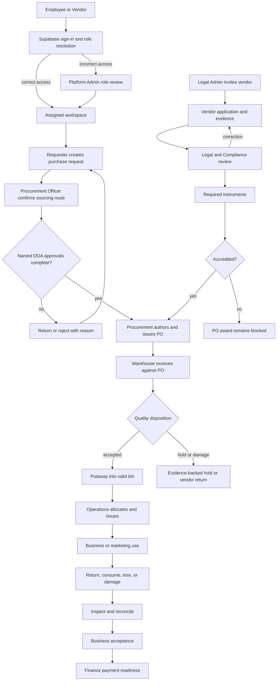
```mermaid
flowchart TD
  Staff[Employee or Vendor] --> Auth[Supabase sign-in and role resolution]
  Auth -->|correct access| Work[Assigned workspace]
  Auth -->|incorrect access| Admin[Platform Admin role review]
  Admin --> Work
  Work --> PR[Requester creates purchase request]
  PR --> POps[Procurement Officer confirms sourcing route]
  POps --> DOA{Named DOA approvals complete?}
  DOA -->|no| Return[Return or reject with reason]
  Return --> PR
  DOA -->|yes| PO[Procurement authors and issues PO]
  Invite[Legal Admin invites vendor] --> Apply[Vendor application and evidence]
  Apply --> Review[Legal and Compliance review]
  Review -->|correction| Apply
  Review --> Instruments[Required instruments]
  Instruments --> Accredited{Accredited?}
  Accredited -->|no| Block[PO award remains blocked]
  Accredited -->|yes| PO
  PO --> Receive[Warehouse receives against PO]
  Receive --> Inspect{Quality disposition}
  Inspect -->|accepted| Putaway[Putaway into valid bin]
  Inspect -->|hold or damage| Hold[Evidence-backed hold or vendor return]
  Putaway --> Allocate[Operations allocates and issues]
  Allocate --> Event[Business or marketing use]
  Event --> ReturnStock[Return, consume, lose, or damage]
  ReturnStock --> Reconcile[Inspect and reconcile]
  Reconcile --> Accept[Business acceptance]
  Accept --> Pay[Finance payment readiness]
```

## Procurement Flow

Use the canonical 13-step **Procurement to Payment** flow later in this handbook. The route has three independent axes:

| Axis                  | Operating decision                                                                                                                                                                                                                             |
| --------------------- | ---------------------------------------------------------------------------------------------------------------------------------------------------------------------------------------------------------------------------------------------- |
| Solicitation document | RFQ below PHP 1,000,000 when clear and comparable; RFP at PHP 1,000,000 and above or for complex, technical, strategic, high-risk, data-sensitive or non-comparable work at any amount; an approved exception may use none when policy permits |
| Procurement mode      | Competitive bidding is the default; each exception mode requires its own eligibility and evidence                                                                                                                                              |
| Governance tier       | Standard, formal bid, high-risk/special control, and current effective DOA are derived independently                                                                                                                                           |

Requirement kind determines scope, acceptance and reporting, not RFQ/RFP selection. Importation adds customs, landed-cost, logistics, currency and acceptance controls but does not automatically force RFP. Only the current effective Mwell DOA names approval authority. MPIC role titles, people, limits and annexes do not grant Mwell authority.

When creating a request, choose the named category first by selecting anywhere on its category tile, then explicitly classify it as **Goods / materials** or **Services**. The full tile is the radio hit area on desktop and mobile and exposes a visible keyboard focus state. On **Codes & justification**, wait for the controlled Department directory, choose the Department, and then choose its Cost Center. In live mode both controls remain selects while loading on desktop and mobile. If the directory cannot load, the form disables them and presents recovery guidance instead of accepting free-text authority values. Every PO line used for goods acceptance must retain its governed unit price. After Warehouse receipt and QC, Intra computes accepted value from accepted quantity multiplied by the PO-line price; Finance does not rely on a user-entered acceptance total.

The canonical source is `mWell Procurement Policy and Procedures - Revised Modern Visual - Word Updated.docx`. It identifies itself as an updated visual draft, so its application profile remains draft until Procurement records the source as approved. Operating instructions also use neutral **first independent variance decision** and **second independent variance decision** stages until Mwell policy/DOA owners authorize the local mapping. The inherited extension cap is modeled as seven calendar days.

## Procurement Role Procedures

Each procedure is standalone. Stop when its denial check fails; never use another role's credentials or evidence to continue.

### Requester

- **Start condition:** A department need has an identified requester, budget context, cost center, required date, and business purpose.
- **Permitted action:** Create or correct the request; classify goods/materials or services; enter line items, specification or scope, acceptance criteria, alternatives, risk, and attachments; submit the current version.
- **Prohibited action:** Do not approve your own request, confirm the final route, choose an exception by preference, fabricate vendor competition, post a receipt, or assert Finance readiness.
- **Handoff:** Send the complete current request to the Procurement Lead; provide technical evaluation when formally assigned.
- **Denial check:** Stop if required facts or evidence are missing, the record is stale, the request is already submitted, or your identity is not the requester/authorized editor.
- **Recovery:** Reload the current record, address each validation or return reason, replace stale evidence, and resubmit a new attributable version.
- **Completion evidence:** Submitted request ID and version, requester identity, classification, budget/cost-center evidence, specification or scope, acceptance criteria, attachments, and submission timestamp.

### Department Head

- **Start condition:** The current effective DOA assigns your identity a valid approval step. The Department Head title alone does not assign either neutral variance-decision stage.
- **Permitted action:** Review the current request version, route axes, amount, budget, assigned decision evidence, recommendation, rationale, and prior decisions; approve, reject, or return with a specific reason within the assigned step.
- **Prohibited action:** Do not approve your own request or work, act from an expired/delegated-out assignment, claim first or second independent variance-decision authority from your title, substitute an MPIC title or annex for the Mwell DOA, or edit source evidence while deciding.
- **Handoff:** Send an approval to the next authorized decision owner under the effective DOA; send a return/rejection to Requester and Procurement.
- **Denial check:** Stop if the assignment, effective date, category/amount scope, record version, separation of duty, or required evidence does not match.
- **Recovery:** Return the record with an actionable reason or ask an authorized DOA administrator to correct configuration; re-evaluate only the new current version.
- **Completion evidence:** Immutable decision, acting identity, active DOA revision and step, request version, reason/comments, and timestamp.

### Procurement Lead

- **Start condition:** A submitted request is ready for route confirmation, sourcing, award, commitment, monitoring, payment-pack preparation, or file closure.
- **Permitted action:** Confirm solicitation document, procurement mode, governance tier, active profile and reasons; issue equal versioned packages; monitor the three-to-four invite target and response quorum; record tabulation, best-value recommendation, exceptions, PO/agreement, vendor notices, payment pack, and closure request.
- **Prohibited action:** Do not change requester facts, treat amount as the RFQ/RFP switch, open fewer than three sealed responses without governed recovery, select an automatic lowest-price winner, decide Legal eligibility, post Warehouse acceptance, approve your own award, or release payment.
- **Handoff:** Route technical work to the assigned reviewer; route a justified variance to the authorized first and second independent variance-decision owners only after Mwell approves those stages; route award authority to current DOA approvers, accreditation issues to Legal/Compliance, receipts to Warehouse/Operations, and the complete payment pack to Finance Controller.
- **Denial check:** Stop if the profile or DOA is unresolved, vendor eligibility is invalid, package/equal-notice evidence is incomplete, quorum recovery is unapproved, evaluation is stale, or separation of duty fails.
- **Recovery:** Correct the package, source additional eligible vendors, use a current independently approved pre-issue invitation-target exception, run equal-notice extension/requote only under an authorized extension unit, obtain a controlled insufficient-bids decision, refresh evaluations, or close/return with reason.
- **Completion evidence:** Route decision with all three axes, policy/DOA snapshot, sourcing communications and responses, evaluations, recommendation/variance evidence, approved commitment, monitoring trail, payment pack, and closure event.

### Legal/Compliance

- **Start condition:** Vendor accreditation, probation, scoped temporary clearance, legal instrument, compliance evidence, or an exception requiring Legal review is assigned to your authority.
- **Permitted action:** Review current commercial/legal evidence; request correction; make the authorized accreditation, probation, clearance, suspension/revocation, or instrument decision with evidence and notice.
- **Prohibited action:** Do not award the procurement, map an MPIC approver into Mwell, approve a request outside current capability, decide a case you prepared when independent decision is required, or turn a client assertion into vendor eligibility.
- **Handoff:** Publish the governed eligibility projection to Procurement; return deficiencies to the vendor representative; route financial or DOA questions to Finance or the department owner.
- **Denial check:** Stop if evidence is missing/expired, clearance scope or dates do not match the request, maker-decider separation fails, revision is stale, or notice/evidence references are absent.
- **Recovery:** Request exact corrections, assign an independent decision maker, revoke or expire invalid clearance, and issue a version-bound decision after evidence is complete.
- **Completion evidence:** Case/revision, decision, effective/expiry dates and scope, evidence references, notice reference, acting identity, and audit timestamp.

### Technical Reviewer

- **Start condition:** Procurement assigns a current solicitation response set and evaluation criteria for technical review.
- **Permitted action:** Evaluate compliance, quality/specification, delivery, warranty, support, training, security/privacy, and other assigned criteria; record comments and evidence within the five-working-day source SLA.
- **Prohibited action:** Do not view or alter commercial data when the controlled evaluation separates it, change the solicitation after bids close, pick the final winner, approve your own request, or use undocumented criteria.
- **Handoff:** Return the signed technical evaluation to Procurement; identify clarification or non-compliance without contacting one bidder privately.
- **Denial check:** Stop if the package version, criteria, response identity, conflict-of-interest state, assignment, or evidence is incomplete.
- **Recovery:** Ask Procurement for a common clarification, corrected assignment, or versioned package; re-evaluate every affected response consistently.
- **Completion evidence:** Reviewer/assignment, package version, criteria and scores/disposition, evidence, comments, due/completion timestamps, and conflict declaration.

### Warehouse/Operations

- **Start condition:** An issued approved PO/agreement or service milestone is ready for delivery, receipt, inspection, custody, or acceptance.
- **Permitted action:** Record actual quantity, identity, serial/lot, condition, evidence, custody and QC; accept conforming delivery; quarantine/reject non-conformance; record service/milestone acceptance when you are the authorized owner.
- **Prohibited action:** Do not create missing PO authority, accept against an unrelated commitment, hide shortages/damage, release your own controlled hold, change commercial terms, or mark payment ready.
- **Handoff:** Send accepted receipt/service evidence to Procurement; send quality, warranty, replacement, or RMA issues to Procurement and vendor; send resolved acceptance evidence into the Finance pack.
- **Denial check:** Stop if the commitment is missing/ineligible, delivery identity does not match, required evidence is absent, destination/custody is invalid, or controlled exception separation fails.
- **Recovery:** Quarantine and preserve evidence, correct the PO/receipt link, obtain Supervisor disposition, issue vendor-return custody, and re-inspect replacement/repair before acceptance.
- **Completion evidence:** PO/agreement link, receipt or milestone record, quantity/value, serial/lot where applicable, evidence, QC/acceptance disposition, custody, RMA/replacement trail, actors, and timestamps.

### Finance Controller

- **Start condition:** Procurement submits a versioned payment-readiness pack or a source-policy petty-cash/financial exception requires Finance decision.
- **Permitted action:** Validate itemized invoice/OR/SI, approved PO/agreement, accepted quantity/value, payment terms, tax/withholding, foreign-vendor evidence, variance, active threshold/profile and current authority; approve, return, or deny readiness.
- **Prohibited action:** Do not manufacture receipt/acceptance, waive missing evidence without authority, exceed accepted value, rely on the source PHP 50,000 value as approval authority, decide your own conflicting variance, or release payment from stale evidence.
- **Handoff:** Return corrections to Procurement and the evidence owner; send an approved readiness decision to the governed payment process; send authority conflicts to the effective DOA owner.
- **Denial check:** Stop if pack/acceptance versions differ, invoice exceeds accepted unpaid value, PO/agreement or tax evidence is missing, vendor eligibility is invalid, variance is unresolved, or your authority/separation does not match.
- **Recovery:** Record the discrepancy, maintain payment hold, require corrected invoice/acceptance/tax/variance evidence, and review a newly versioned pack.
- **Completion evidence:** Finance decision, pack and acceptance versions, invoice and commitment references, match result, tax/withholding/foreign evidence, accepted cap, reason, identity, and timestamp.

### Vendor Representative

- **Start condition:** Your vendor organization receives an invitation, clarification, PO/agreement, delivery issue, correction request, accreditation task, or RMA notice.
- **Permitted action:** Access only your organization; acknowledge the exact package/PO; submit attributable responses before the deadline; ask clarifications; provide current evidence; report delay; complete correction, replacement, warranty, RMA, credit, or delivery action.
- **Prohibited action:** Do not view another vendor's response, reuse another recipient's acknowledgment, submit against a superseded package, bypass the deadline, alter Mwell decisions, or claim accreditation/award/payment status.
- **Handoff:** Send sourcing responses to Procurement, accreditation evidence to Legal/Compliance, delivery/quality evidence to Warehouse/Operations and Procurement, and invoices/payment support through the governed channel.
- **Denial check:** Stop if vendor identity/organization, notification group, package version, deadline, PO, or requested evidence does not match.
- **Recovery:** Use the current invitation or correction link, ask Procurement for equal clarification/extension, replace expired evidence, or complete the documented RMA/credit path.
- **Completion evidence:** Vendor identity, organization, package/PO version, acknowledgment, submission/clarification/delivery timestamps, response/evidence hashes, and correction or RMA outcome.

### Platform Admin

- **Start condition:** An authorized owner requests role, capability, policy-profile, holiday calendar, or DOA configuration/support, or a denial indicates configuration may be incomplete.
- **Permitted action:** Administer approved effective-dated configuration, validate gaps/overlaps, grant minimum scoped access, preserve history, and provide audit/configuration evidence.
- **Prohibited action:** Do not name yourself or another user as a business approver without owner authority, activate draft policy values by implication, edit immutable decisions, bypass separation of duty, apply the parked migration, or claim deployment/UAT certification from local docs.
- **Handoff:** Return valid configuration to the business owner and affected role; route policy conflicts to Procurement/Finance/Legal and migration/deployment work to the separate controlled cutover.
- **Denial check:** Stop if the request lacks owner approval, effective dates overlap, authority scope is unclear, the target is shared/unverified, or the change would rewrite transaction history.
- **Recovery:** Keep the record draft, obtain owner/DOA approval, correct dates/scope, test locally, and use the controlled migration and release runbooks when authorized.
- **Completion evidence:** Approved change request, before/after configuration version, effective dates, owner, acting admin, validation results, audit event, and explicit statement of whether activation/deployment occurred.

## Vendor Accreditation Flow

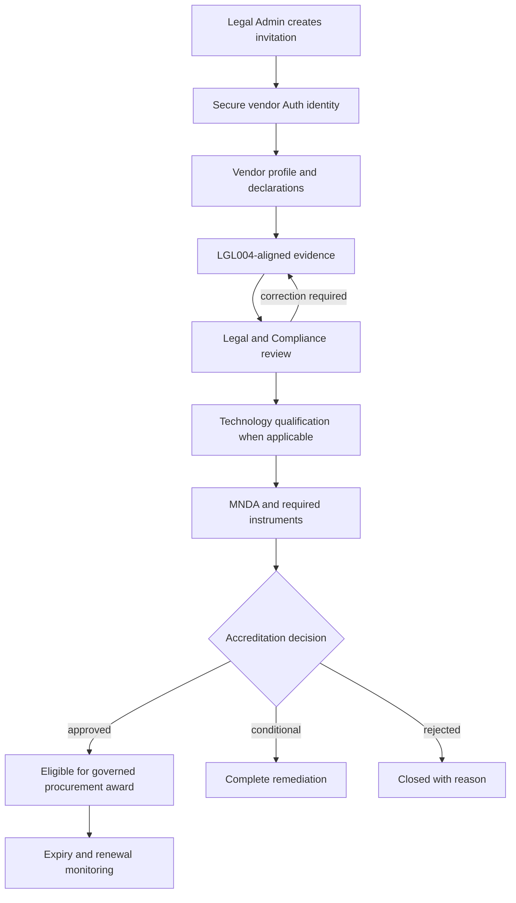
```mermaid
flowchart TD
  Invite[Legal Admin creates invitation] --> Identity[Secure vendor Auth identity]
  Identity --> Profile[Vendor profile and declarations]
  Profile --> Evidence[LGL004-aligned evidence]
  Evidence --> Legal[Legal and Compliance review]
  Legal -->|correction required| Evidence
  Legal --> Tech[Technology qualification when applicable]
  Tech --> Sign[MNDA and required instruments]
  Sign --> Decision{Accreditation decision}
  Decision -->|approved| Eligible[Eligible for governed procurement award]
  Decision -->|conditional| Remedy[Complete remediation]
  Decision -->|rejected| Closed[Closed with reason]
  Eligible --> Renewal[Expiry and renewal monitoring]
```

Vendors can see only their organization. Legal must not approve incomplete, expired, inconsistent, or unsupported evidence. Procurement must verify active accreditation before award.

## Warehouse Flow

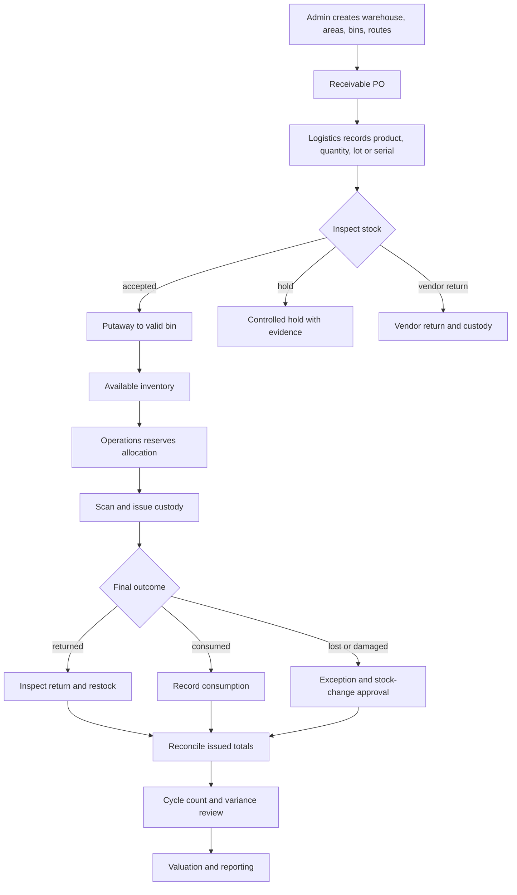
```mermaid
flowchart TD
  Setup[Admin creates warehouse, areas, bins, routes] --> PO[Receivable PO]
  PO --> Receipt[Logistics records product, quantity, lot or serial]
  Receipt --> Inspection{Inspect stock}
  Inspection -->|accepted| Bin[Putaway to valid bin]
  Inspection -->|hold| Hold[Controlled hold with evidence]
  Inspection -->|vendor return| VR[Vendor return and custody]
  Bin --> Available[Available inventory]
  Available --> Reserve[Operations reserves allocation]
  Reserve --> Issue[Scan and issue custody]
  Issue --> Outcome{Final outcome}
  Outcome -->|returned| ReturnInspect[Inspect return and restock]
  Outcome -->|consumed| Consume[Record consumption]
  Outcome -->|lost or damaged| Exception[Exception and stock-change approval]
  ReturnInspect --> Reconcile[Reconcile issued totals]
  Consume --> Reconcile
  Exception --> Reconcile
  Reconcile --> Count[Cycle count and variance review]
  Count --> Finance[Valuation and reporting]
```

### Setup and Bins

Warehouse Admin creates the site, storage areas, scannable bins, and allowed operation routes. Verify destinations before receiving production stock.

### Receiving and Inspection

Select the PO and destination, record each line, scan serial/lot details, and attach evidence. Inspection supports accepted, hold, damaged, unavailable, and vendor-return outcomes. Non-accepted outcomes require a reason and evidence.

### Allocation, Events, and Returns

Reserve only available non-held stock. Scan custody on issue. Record consumed, returned, lost, and damaged quantities. Close the event only after all issued quantity reconciles.

### Ecommerce Fulfillment and Pick & Pack

Import orders with the provided CSV template or create an order in the app. Select a controlled sales channel and payment method; record the payment reference and Maya status when applicable. Customer address presets populate province, postal code, and service area, but the operator remains responsible for confirming the delivery address before release.

Selling price is assigned by Product and is read-only in Warehouse. Do not type or override a commercial price during fulfillment. For bundle orders, mark the line as a bundle and verify the generated set ID for every set. A quantity of two standalone products is not automatically a bundle.

Before picking, scan the displayed rack or bin and then scan each serialized unit. Confirm packaging supplies, waybill, courier, dispatch details, and the generated handover reference. Upload proof directly in Intra; an external evidence URL is not required. Use **Export current view** when a controlled CSV handoff is needed.

### Customer Returns and Original Release Matching

Customer Service or Operations scans the returned serial with the camera or enters it manually. Intra matches the serial to its original picked release and order when evidence exists. Verify the displayed source before accepting custody. An unmatched serial must remain visibly unresolved and be escalated for controlled investigation; do not attach it to an unrelated order.

### Counts and Adjustments

Create a count draft, record physical quantity and evidence, review variance, and post only an approved stock-change request. Never edit stock levels directly.

## DOA Administration

Platform Admin or Legal Admin opens **Admin -> Delegation of Authority**. Select **Create revision** on the current department matrix, confirm the displayed department name and stable department code, choose only from the active department directory, update version and named assignments, save a draft, validate gaps/overlaps/final approval, and activate deliberately. If validation fails, Intra scrolls to and focuses the first invalid field and shows the correction inline on both desktop and mobile. Reopen the saved draft before handoff; a success message alone is not persistence evidence. If the governed save fails, confirm no matrix appeared, retain the displayed reference, and escalate rather than choosing another department. Free-text departments are not accepted. Active records are immutable; a separate authorized checker activates the draft, supersedes the prior revision, and preserves history. UAT currently gives every temporary active matrix one open named assignment for Department Head, Procurement Head, Legal, Finance, and Final Approver so all derived request ladders can be tested. These `UAT-TEMP-*` assignments are replaceable test coverage and must not be treated as the approved production authority schedule.

## Troubleshooting and Recovery

| Situation                      | Action                                                                               |
| ------------------------------ | ------------------------------------------------------------------------------------ |
| Sign-in remains on login       | Verify identity, request reset, or ask Platform Admin to confirm provisioning        |
| Access denied                  | Confirm the role matrix in this handbook; request minimum-role review for the route  |
| Loading skeleton remains       | Check connection, wait once, refresh, then capture route/time/role                   |
| Validation prevents submit     | Correct every labeled field and required evidence; do not bypass the gate            |
| Possible duplicate transaction | Refresh and search the record before retrying                                        |
| Stale-state message            | Reload the current record and re-evaluate before acting                              |
| Vendor invitation not received | Legal checks delivery status and contact address before retrying                     |
| Receipt variance or damage     | Use inspection/hold/vendor-return workflow with evidence                             |
| Return serial has no source    | Quarantine the item, preserve the scanned serial, and investigate before replacement |
| Vendor invitation rate-limited | Do not repeatedly resend; verify delivery state and escalate SMTP capacity           |

Routine UAT regression verifies invitation persistence, case linkage, expiry, replay denial, and access state. Actual external email delivery is a separate controlled desktop canary so repeated code pushes do not exhaust the shared mail quota; a canary passes only when the persisted invite is `sent` with Auth identity, expiry, and generation evidence.
| Mobile control is obscured | Scroll into the reserved safe area; report viewport and screenshot if still unreachable |

Support evidence should contain route, time, role, safe record ID, expected outcome, visible error, and a redacted screenshot. Never include credentials or private document contents.

## Security and Data Handling

- Use individual accounts; never share QA or production passwords.
- Grant minimum scoped roles.
- Treat access denied as a control, not an obstacle to bypass.
- Keep evidence and decisions in the governed workflow.
- Verify saved state before retrying writes.
- Rotate any credential exposed in chat, logs, screenshots, or documentation.

## Glossary

- **DOA:** Delegation of Authority approval matrix.
- **PR:** Purchase request.
- **PO:** Purchase order.
- **Putaway:** controlled movement of accepted stock into a valid bin.
- **Cycle count:** physical count used to govern stock variance.
- **Idempotency:** duplicate-effect prevention for retried commands.
- **RLS:** database row-level security.

## Future Recommended Features

All items below are **proposed**, not current capabilities:

1. Handbook section drafting, approval, effective dating, and version history.
2. Contextual help launched from operational controls.
3. Search analytics and unsuccessful-query reporting.
4. Article feedback and correction requests.
5. Policy-to-procedure traceability.
6. Guided sandbox walkthroughs.
7. Multilingual governed documentation.
8. Managed offline handbook distribution and update notification.
9. Role onboarding curricula and completion tracking.
10. Workflow-linked release notes.

## Flow-First Operational Journeys

Read the overview before performing work. Use **By role** to confirm the handoff owner and **Decisions** before taking an exception path. The lifecycle ribbon is a reading aid; the underlying record, evidence, role assignment, and audit trail remain the source of truth.

### Procurement to Payment

```mermaid
%% handbook-flow: workflow=procurement-to-payment; view=overview; stages=Define need|Submit request|Confirm path|Source vendors|Check accreditation|Evaluate|Recommend award|Approve|Issue PO or contract|Deliver and close|Prepare payment handoff|Process payment|Close file
flowchart LR
  S1[1 Define the need] --> S2[2 Submit the request] --> S3[3 Confirm the procurement path] --> S4[4 Source vendors] --> S5[5 Check accreditation] --> S6[6 Evaluate offers] --> S7[7 Recommend award] --> S8[8 Approve under the active DOA] --> S9[9 Issue PO or contract] --> S10[10 Deliver and close obligations] --> S11[11 Prepare payment handoff] --> S12[12 Process vendor payment] --> S13[13 Close the procurement file]
```

```mermaid
%% handbook-flow: workflow=procurement-to-payment; view=role; stages=Define need|Submit request|Confirm path|Source vendors|Check accreditation|Evaluate|Recommend award|Approve|Issue PO or contract|Deliver and close|Prepare payment handoff|Process payment|Close file
flowchart LR
  R[Requester: need, classification and acceptance evidence] --> P[Procurement Lead: route and sourcing evidence]
  P --> S[System: profile, DOA, accreditation, risk and quorum controls]
  S --> V[Vendor representative: acknowledgment, response and delivery evidence]
  V --> PT[Procurement and technical reviewer: tabulation and evaluation]
  PT --> V1[Authorized first independent variance decision owner when needed]
  V1 --> V2[Authorized second independent variance decision owner when needed]
  V2 --> A[Named current DOA approvers: award decision]
  A --> PC[Procurement Lead: PO or agreement and monitoring]
  PC --> W[Warehouse or service owner: receipt, QC and acceptance]
  W --> F[Procurement and Finance Controller: payment-readiness evidence]
  F --> C[Procurement Lead: issue resolution and file closure]
```

```mermaid
%% handbook-flow: workflow=procurement-to-payment; view=decision; stages=Define need|Submit request|Confirm path|Source vendors|Check accreditation|Evaluate|Recommend award|Approve|Issue PO or contract|Deliver and close|Prepare payment handoff|Process payment|Close file
flowchart TD
  A[Requester and Procurement: current facts and three route axes] --> B{System: profile, effective DOA, eligible vendor and package complete?}
  B -->|No| BX([Blocked: correct route, authority, eligibility or evidence])
  BX --> BR[Recovery owner corrects current record]
  BR --> B
  B -->|Yes| C{System: at least three usable sealed-bid responses or approved recovery?}
  C -->|No| CX([Blocked failed bid: bids remain unopened])
  CX --> CR[Procurement recovery: source, extend or requote equally; otherwise obtain controlled insufficient-bids decision]
  CR --> C
  C -->|Yes| D{Procurement and technical reviewer: best-value evidence complete?}
  D -->|No| DX([Blocked: complete tabulation and technical evaluation])
  DX --> DR[Recovery: correct attributable evaluation evidence]
  DR --> D
  D -->|Yes| E{Recommendation differs from evaluated best value?}
  E -->|Yes| F{Written justification plus authorized first and second independent variance decisions complete?}
  F -->|No| FX([Blocked or denied variance])
  FX --> FR[Recovery: revise recommendation or complete independent variance path]
  FR --> E
  F -->|Yes| G{Current DOA and separation of duty approve award?}
  E -->|No| G
  G -->|No| GX([Blocked or denied award])
  GX --> GR[Recovery: return for correction, re-evaluation or closure with reason]
  GR --> A
  G -->|Yes| H[Procurement: issue approved PO or agreement; vendor acknowledgment enters monitoring]
  H --> I{Warehouse or service owner: receipt, QC and acceptance complete?}
  I -->|No| IX([Blocked: quarantine, rejection, replacement, warranty or RMA remains open])
  IX --> IR[Recovery: resolve delivery and quality evidence, then re-inspect or re-accept]
  IR --> I
  I -->|Yes| J{Finance Controller: invoice, commitment, acceptance, tax and variance evidence match?}
  J -->|No| JX([Blocked: payment hold and discrepancy correction])
  JX --> JR[Recovery: submit a corrected versioned payment pack]
  JR --> J
  J -->|Yes| K{Procurement: delivery closed, issues resolved and evidence retained?}
  K -->|No| KX([Blocked: procurement file remains open])
  KX --> KR[Recovery: close outstanding delivery, quality, warranty, variance or evidence obligations]
  KR --> K
  K -->|Yes| L[Complete: governed payment readiness and procurement-file closure evidence]
```

**Completion criteria:** all 13 policy steps are attributable and linked: need and request facts; Procurement-confirmed route; vendor sourcing and accreditation; technical/commercial evaluation; award recommendation; current-DOA approval; PO/contract; delivery and obligation closure; payment handoff; Finance processing; and retained file-closure evidence. The application exposes extra controlled states for failed-bid recovery, acknowledgement, inspection, quality recovery and Finance review; these are system-expanded states, not extra policy steps.

### Vendor Accreditation

```mermaid
%% handbook-flow: workflow=vendor-accreditation; view=overview; stages=Invite|Profile|Evidence|Review|Instrument|Decision|Renewal
flowchart LR
  I[Invite] --> P[Vendor profile] --> E[Evidence] --> R[Legal review] --> N[Required instruments] --> D[Accreditation decision] --> M[Renewal monitoring]
```

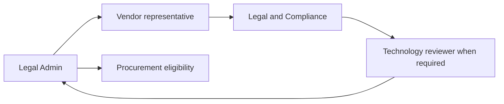
```mermaid
%% handbook-flow: workflow=vendor-accreditation; view=role; stages=Invite|Profile|Evidence|Review|Instrument|Decision|Renewal
flowchart LR
  L[Legal Admin] --> V[Vendor representative]
  V --> C[Legal and Compliance]
  C --> T[Technology reviewer when required]
  T --> L
  L --> P[Procurement eligibility]
```

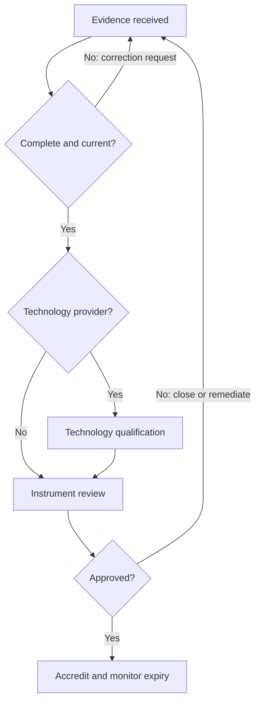
```mermaid
%% handbook-flow: workflow=vendor-accreditation; view=decision; stages=Invite|Profile|Evidence|Review|Instrument|Decision|Renewal
flowchart TD
  E[Evidence received] --> C{Complete and current?}
  C -->|No: correction request| E
  C -->|Yes| T{Technology provider?}
  T -->|Yes| Q[Technology qualification]
  T -->|No| I[Instrument review]
  Q --> I
  I --> D{Approved?}
  D -->|No: close or remediate| E
  D -->|Yes| A[Accredit and monitor expiry]
```

**Completion criteria:** the vendor has an attributable invitation, current LGL004-aligned evidence, applicable technology qualification and executed instruments; Legal records a decision and Procurement sees only the resulting eligibility.

### Receiving and Putaway

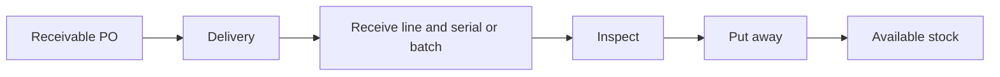
```mermaid
%% handbook-flow: workflow=receiving-putaway; view=overview; stages=PO|Delivery|Receive|Inspect|Putaway|Available
flowchart LR
  P[Receivable PO] --> D[Delivery] --> R[Receive line and serial or batch] --> I[Inspect] --> B[Put away] --> A[Available stock]
```

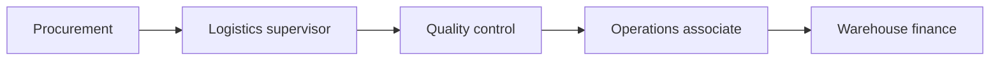
```mermaid
%% handbook-flow: workflow=receiving-putaway; view=role; stages=PO|Delivery|Receive|Inspect|Putaway|Available
flowchart LR
  P[Procurement] --> L[Logistics supervisor]
  L --> Q[Quality control]
  Q --> O[Operations associate]
  O --> F[Warehouse finance]
```

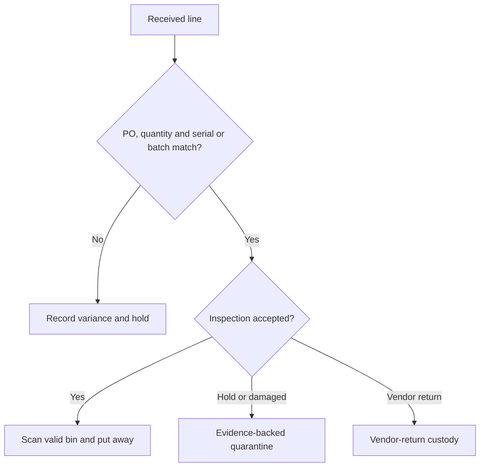
```mermaid
%% handbook-flow: workflow=receiving-putaway; view=decision; stages=PO|Delivery|Receive|Inspect|Putaway|Available
flowchart TD
  R[Received line] --> M{PO, quantity and serial or batch match?}
  M -->|No| V[Record variance and hold]
  M -->|Yes| I{Inspection accepted?}
  I -->|Yes| B[Scan valid bin and put away]
  I -->|Hold or damaged| H[Evidence-backed quarantine]
  I -->|Vendor return| X[Vendor-return custody]
```

**Completion criteria:** each receipt line has PO and delivery references, delivery date, required serial/batch evidence, a recorded disposition and a valid destination before it becomes available stock.

### Ecommerce Fulfillment

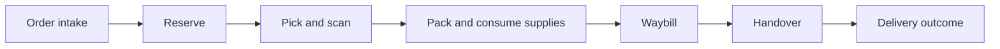
```mermaid
%% handbook-flow: workflow=ecommerce-fulfillment; view=overview; stages=Order|Reserve|Pick|Pack|Waybill|Release|Delivery
flowchart LR
  O[Order intake] --> R[Reserve] --> P[Pick and scan] --> K[Pack and consume supplies] --> W[Waybill] --> H[Handover] --> D[Delivery outcome]
```

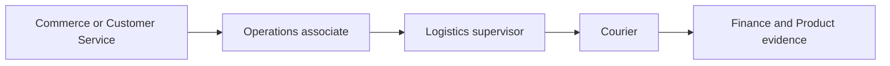
```mermaid
%% handbook-flow: workflow=ecommerce-fulfillment; view=role; stages=Order|Reserve|Pick|Pack|Waybill|Release|Delivery
flowchart LR
  C[Commerce or Customer Service] --> O[Operations associate]
  O --> L[Logistics supervisor]
  L --> R[Courier]
  R --> F[Finance and Product evidence]
```

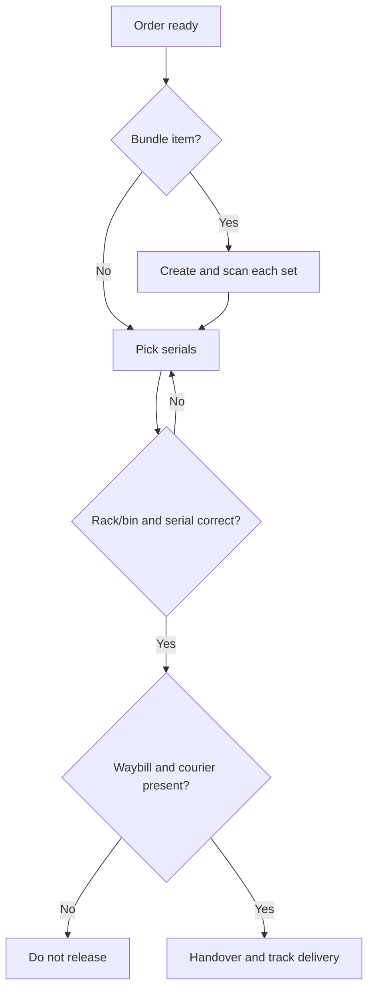
```mermaid
%% handbook-flow: workflow=ecommerce-fulfillment; view=decision; stages=Order|Reserve|Pick|Pack|Waybill|Release|Delivery
flowchart TD
  O[Order ready] --> B{Bundle item?}
  B -->|Yes| S[Create and scan each set]
  B -->|No| P[Pick serials]
  S --> P
  P --> L{Rack/bin and serial correct?}
  L -->|No| P
  L -->|Yes| W{Waybill and courier present?}
  W -->|No| H[Do not release]
  W -->|Yes| D[Handover and track delivery]
```

**Completion criteria:** an order has its controlled channel, address and payment fields, every required rack/bin and serialized scan, bundle-set evidence where applicable, packaging consumption, waybill/courier, attributable handover proof and a tracked delivery outcome.

### Returns and Replacements

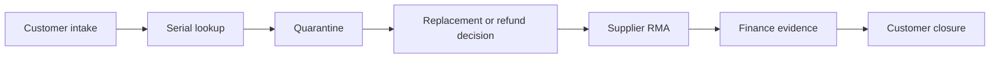
```mermaid
%% handbook-flow: workflow=returns-replacements; view=overview; stages=Intake|Serial lookup|Quarantine|Decision|RMA|Finance|Closure
flowchart LR
  I[Customer intake] --> S[Serial lookup] --> Q[Quarantine] --> D[Replacement or refund decision] --> R[Supplier RMA] --> F[Finance evidence] --> C[Customer closure]
```

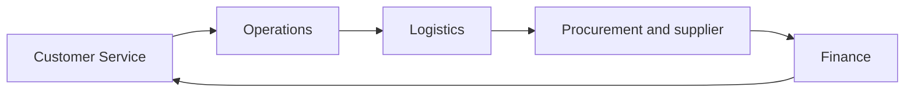
```mermaid
%% handbook-flow: workflow=returns-replacements; view=role; stages=Intake|Serial lookup|Quarantine|Decision|RMA|Finance|Closure
flowchart LR
  C[Customer Service] --> O[Operations]
  O --> L[Logistics]
  L --> P[Procurement and supplier]
  P --> F[Finance]
  F --> C
```

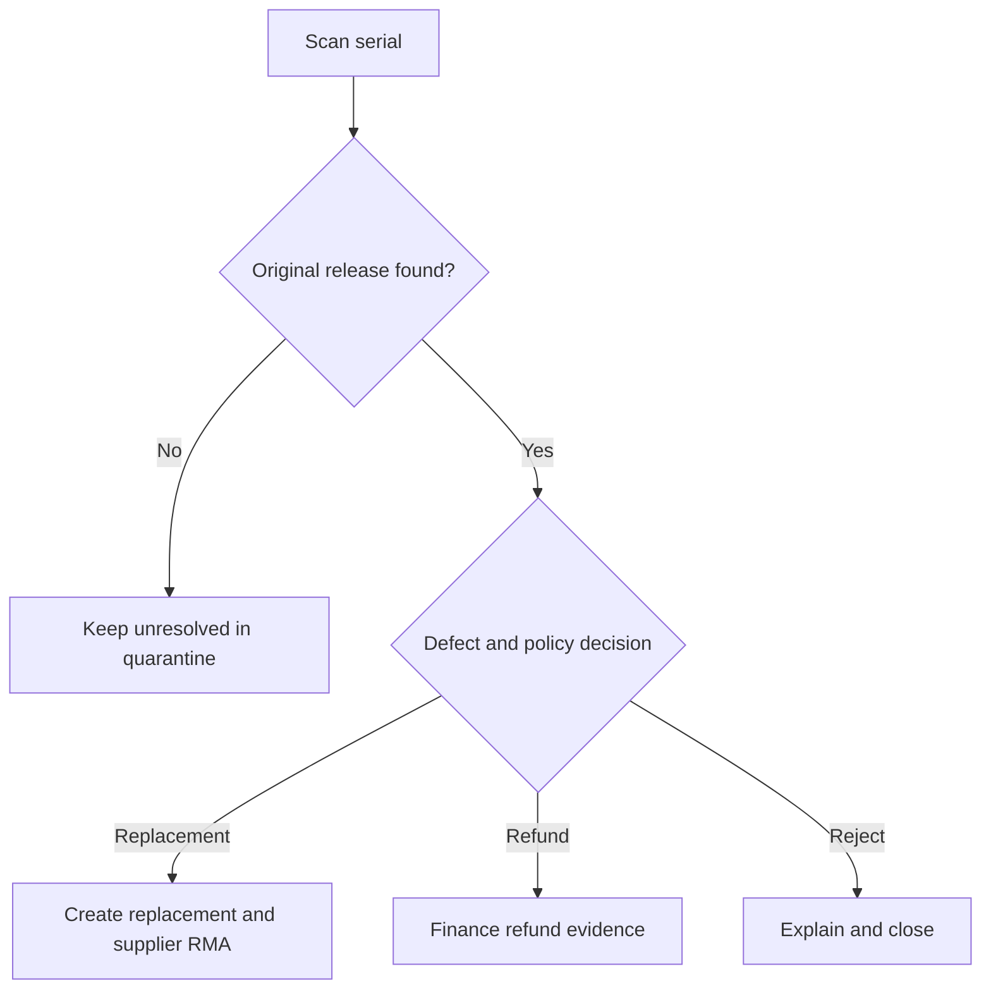
```mermaid
%% handbook-flow: workflow=returns-replacements; view=decision; stages=Intake|Serial lookup|Quarantine|Decision|RMA|Finance|Closure
flowchart TD
  S[Scan serial] --> M{Original release found?}
  M -->|No| Q[Keep unresolved in quarantine]
  M -->|Yes| D{Defect and policy decision}
  D -->|Replacement| R[Create replacement and supplier RMA]
  D -->|Refund| F[Finance refund evidence]
  D -->|Reject| C[Explain and close]
```

**Completion criteria:** the return is traced to its original release or remains explicitly unresolved, then retains defect evidence, custody location, supplier RMA/refund or replacement evidence and an attributable customer outcome.

### Inventory Release

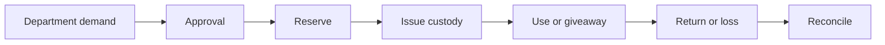
```mermaid
%% handbook-flow: workflow=inventory-release; view=overview; stages=Demand|Approval|Reserve|Issue|Use|Return|Reconcile
flowchart LR
  D[Department demand] --> A[Approval] --> R[Reserve] --> I[Issue custody] --> U[Use or giveaway] --> T[Return or loss] --> C[Reconcile]
```

```mermaid
%% handbook-flow: workflow=inventory-release; view=role; stages=Demand|Approval|Reserve|Issue|Use|Return|Reconcile
flowchart LR
  B[Business unit or Marketing] --> A[Approver]
  A --> O[Operations]
  O --> W[Warehouse]
  W --> F[Finance]
```

```mermaid
%% handbook-flow: workflow=inventory-release; view=decision; stages=Demand|Approval|Reserve|Issue|Use|Return|Reconcile
flowchart TD
  D[Request] --> A{Authority and stock available?}
  A -->|No| R[Return with reason or replenish]
  A -->|Yes| I[Scan issue custody]
  I --> O{Outcome recorded?}
  O -->|Returned| C[Inspect and restock]
  O -->|Consumed or giveaway| E[Post expense or usage]
  O -->|Lost or damaged| X[Exception approval]
```

**Completion criteria:** all department requests have one or more line items, authority, issued custody evidence, a recorded outcome and reconciliation. Merchandise is treated as expense under the applicable cost center.

### Event Custody

```mermaid
%% handbook-flow: workflow=event-custody; view=overview; stages=Demand|Approval|Transfer|Event|Outcome|Return|Settlement
flowchart LR
  D[Marketing demand] --> A[Approval] --> T[Event transfer] --> E[Event use] --> O[Sales or giveaway outcome] --> R[Return] --> S[Settlement]
```

```mermaid
%% handbook-flow: workflow=event-custody; view=role; stages=Demand|Approval|Transfer|Event|Outcome|Return|Settlement
flowchart LR
  M[Marketing and Events] --> A[Approver]
  A --> O[Operations]
  O --> W[Warehouse]
  W --> F[Finance]
```

```mermaid
%% handbook-flow: workflow=event-custody; view=decision; stages=Demand|Approval|Transfer|Event|Outcome|Return|Settlement
flowchart TD
  T[Transferred stock] --> O{Event outcome}
  O -->|Sold| S[Capture sale summary]
  O -->|Given away| G[Record giveaway]
  O -->|Returned| R[Inspect return]
  O -->|Lost or damaged| X[Evidence and approval]
  R --> K{Re-kit eligible?}
  K -->|Yes| Q[Open-box re-kitting]
  K -->|No| C[Controlled disposition]
```

**Completion criteria:** event demand, approval, transfer scans, sales/giveaway quantities, returned/lost/damaged evidence, re-kitting decision and Finance settlement reconcile to the final event balance.

### Inventory Integrity

```mermaid
%% handbook-flow: workflow=inventory-integrity; view=overview; stages=Count|Variance|Approval|Adjust|Expiry|Recall|Reconcile
flowchart LR
  C[Cycle count] --> V[Variance] --> A[Adjustment approval] --> J[Post adjustment] --> E[Expiry control] --> R[Recall handling] --> F[Serialized reconciliation]
```

```mermaid
%% handbook-flow: workflow=inventory-integrity; view=role; stages=Count|Variance|Approval|Adjust|Expiry|Recall|Reconcile
flowchart LR
  O[Operations] --> S[Logistics supervisor]
  S --> F[Warehouse finance]
  F --> P[Procurement or supplier]
  P --> A[Platform audit]
```

```mermaid
%% handbook-flow: workflow=inventory-integrity; view=decision; stages=Count|Variance|Approval|Adjust|Expiry|Recall|Reconcile
flowchart TD
  C[Physical count] --> V{Variance found?}
  V -->|No| R[Reconcile serials]
  V -->|Yes| E[Attach evidence]
  E --> A{Adjustment approved?}
  A -->|No| I[Investigate]
  A -->|Yes| P[Post governed adjustment]
  R --> X{Expired, recalled or damaged?}
  X -->|Yes| Q[Quarantine and disposition]
  X -->|No| K[Close count]
```

**Completion criteria:** the physical count, variance evidence, approval, stock adjustment, serialized reconciliation and any expiry/recall/damage disposition are all recorded; staff never edit quantity directly.

## Application Screen Reference

The canonical standalone file is `docs/manual/index.html`. Screens below establish layout and control location; follow the written procedure and current field labels if a released screen has changed.

### Sign-in and Workspace

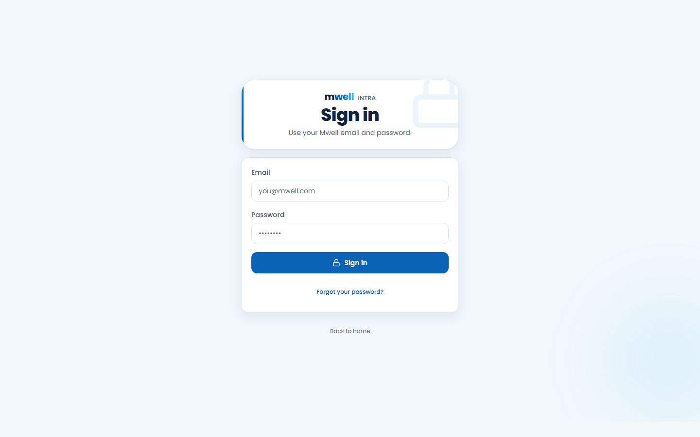

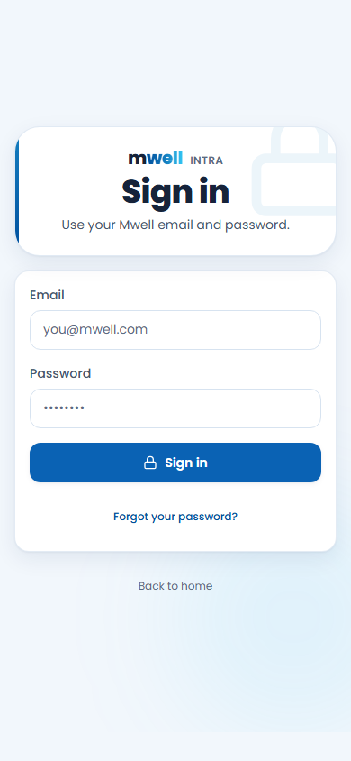

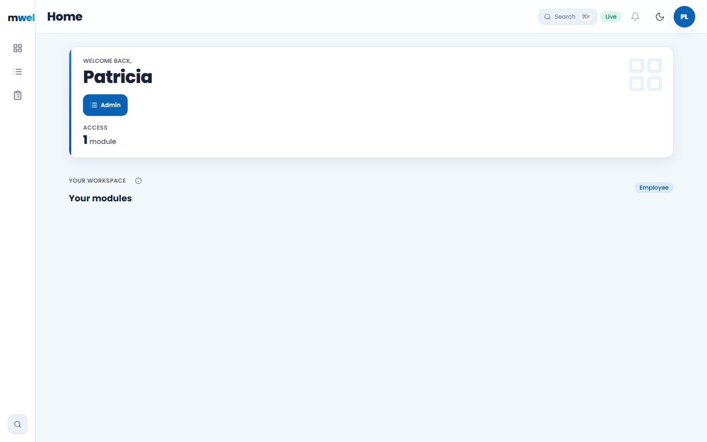

### Procurement

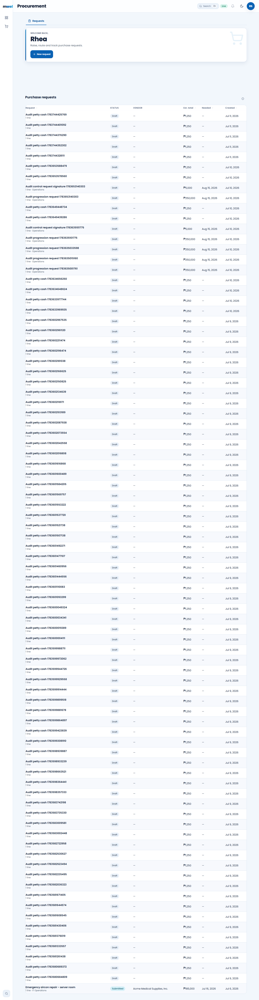

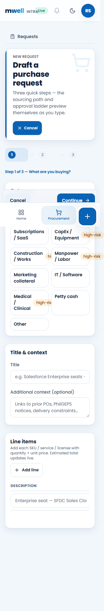

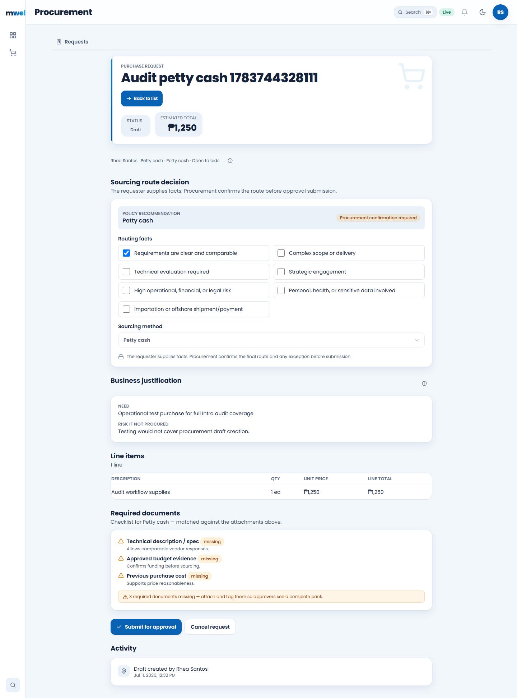

### Legal and Vendor Accreditation

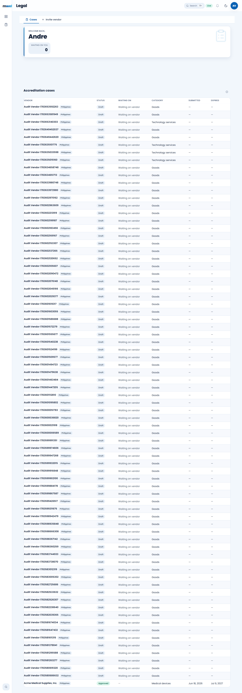

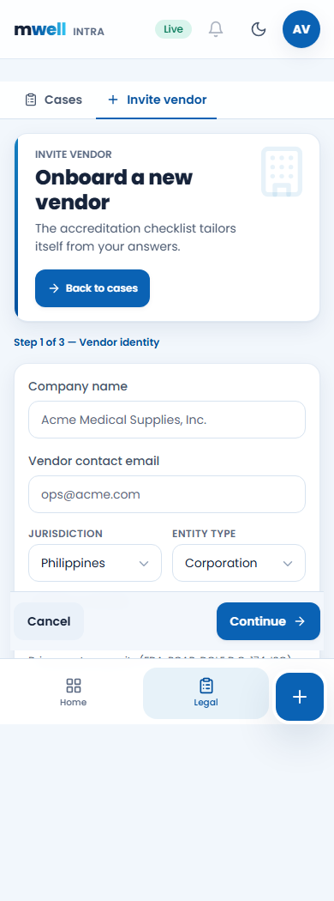

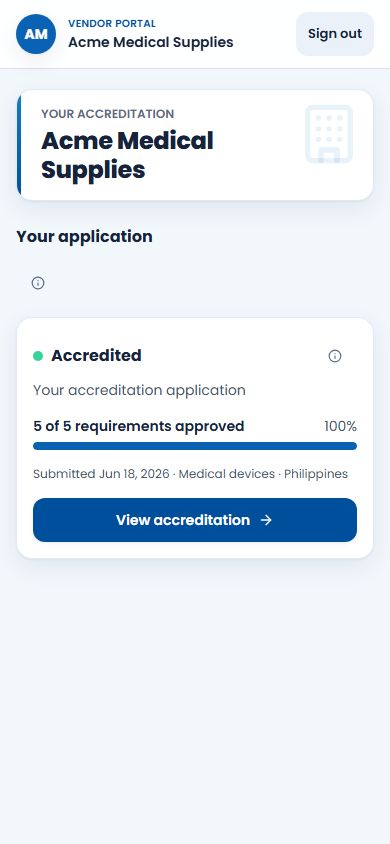

Screenshots that show retired errors are historical audit evidence and are intentionally excluded from this handbook.
