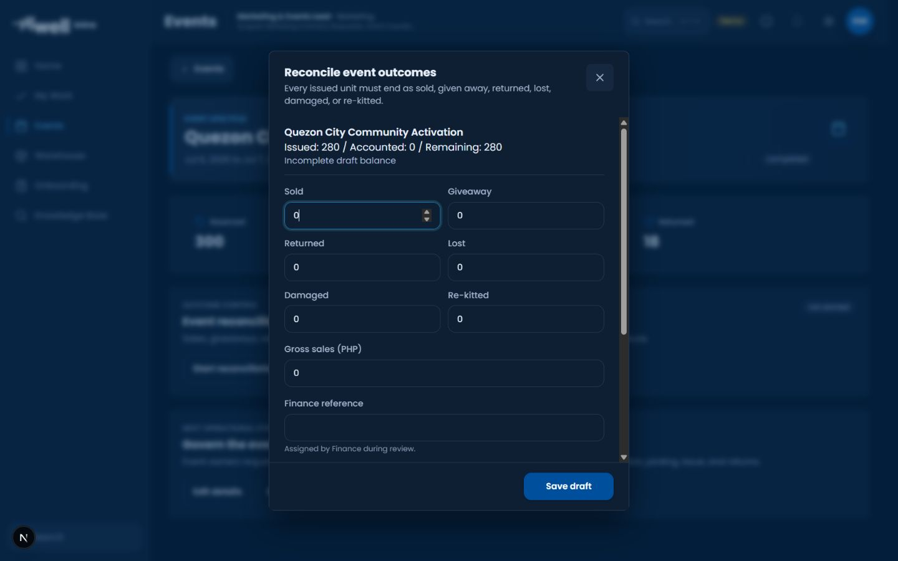
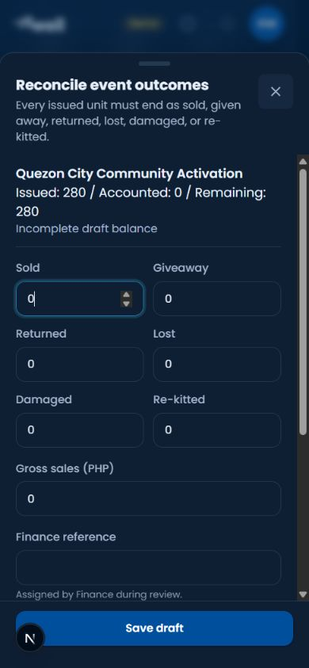
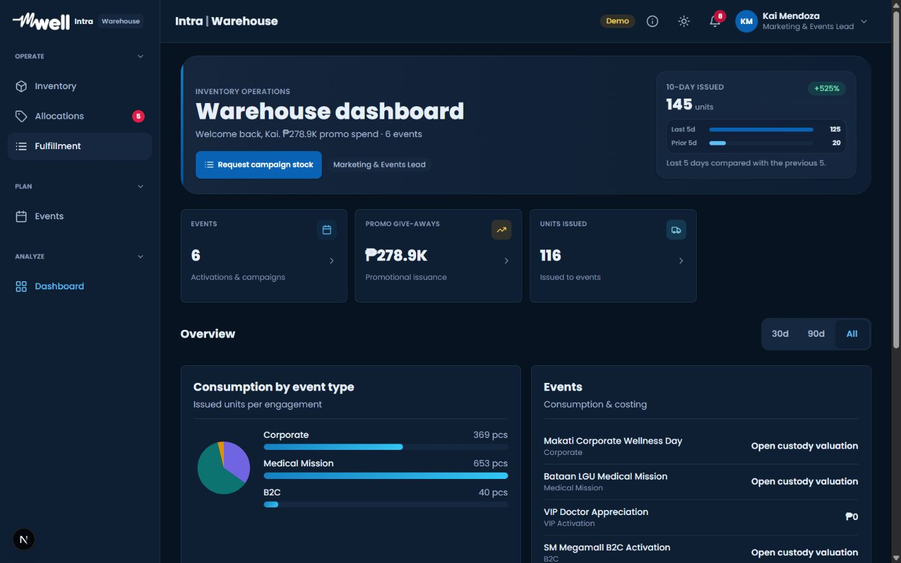
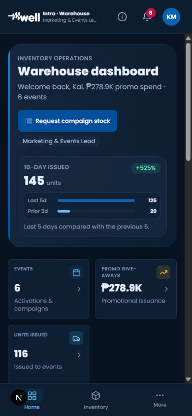

# Warehouse and Events Candidate

Status: **Deployed to UAT on 2026-09-05; end-to-end acceptance pending. Not production acceptance.** These procedures describe https://mwell-intra-uat.vercel.app. Main production has not been promoted; physical devices, concurrency, and complete cross-role transactions still require their recorded acceptance results.

## Scope

### Certification 153 Follow-up

The full run did not pass. A forward UAT database correction now permits release of a provisional receipt hold only after matching independent acceptance has been recorded. The receipt owner cannot inspect their own receipt, and pending holds cannot be released directly. Custody identity and release attribution remain checked. Local SQL regressions passed; a complete live transaction rerun is still required.

The audit now opens **View request** before approving an event-related stock request in **Review request**. Excess-custody decisions use the actual **Upload document** control; a made-up evidence path is not an acceptable substitute. The Floor work touch-target improvement is local pending deployment and live visual verification.

Additional security candidate pending parent application: `20260905095000_return_intake_certified_boundary.sql`. Read-only UAT metadata confirmed v2 already checks live certification before replay; the new wrapper makes the public governed boundary explicit while preserving the original implementation behind revoked direct client access. No validator weakening or applied migration edit. Return-intake tests: 37/37 passed. Separate launch-verifier PGlite fixture currently lacks inspect_quality; this is not a demonstrated v2 certification bypass.

Candidate remediation covers WE01, WE02, WE05, WE10, WE13, WE14, LV06 and LV07. No deployment, live database changes, commits, or authorization bypasses were performed. Warehouse shared store and the parent-owned governed receipt editor were not changed by this work.

## Candidate Behavior

### Local WE04 Follow-up (Pending Deployment)

Training/demo parity follow-up: memory quality inspections now retain the selected procurement line ID in their returned and listed records, including idempotent replay. When one receipt has the same product in the same bin on lines A and B, inspecting A leaves B pending; do not treat product/bin equality as proof that both lines were inspected. An explicit line must belong to that receipt/product, and cumulative inspections cannot exceed its received quantity. This is a local in-memory adapter correction, not evidence of a Supabase defect or a change to live certification, RLS, or separation of duties.

Conflicting inspection records now show an inline quality-queue error with Retry quality queue instead of escaping rendering. Until a complete valid queue is restored, source auto-opening and inspection/hold submissions are blocked. Retrying corrected records restores the exact-source workflow without submitting an inspection. Latest focused verification: 32 domain/UI tests passed; scoped lint and warehouse typecheck passed.

Quality receipt reconciliation now allocates exact procurement-line and serial identities before legacy quantities, independent of inspection input order. Each inspection quantity is consumed once; identical repeated IDs count once, while conflicting records with one ID produce an explicit reload error. Legacy quantities only reduce an unambiguous remaining custody identity. Unresolved alternatives remain pending rather than being assigned by row order. Serialized residual work retains one exact serial per quantity-one task.

Stored legacy receipt JSON may omit the bin. A matching exact procurement line or serial can still account for an inspection with a bin when only one custody identity remains; known bin conflicts or competing unknown/known-bin identities remain pending. Local domain/UI verification passed 31 tests, including reversed records, repeated IDs, split quantities, serial boundaries, 101 active holds across pagination, and retained group search/current-versus-total counts. These source changes are not yet a deployed or live transaction acceptance claim. The separate live Inspect hit-target finding remains with the visibility investigation owner.

- Linked allocation returns retain their allocation identity and enforce cumulative outstanding quantity. Partial returns may complete an allocation across calls; excess returns fail atomically and exact idempotent retries do not write again.
- New reservations require a planned or active event. Previously committed reservation retries retain their original result after event closure.
- Live Events and Warehouse event detail use the common lifetime custody projection. Returned allocations remain part of lifetime issued totals. Outstanding custody is not automatically treated as sold or consumed.
- Reconciliation separates sold, giveaway, returned, lost, damaged and re-kitted quantities. Drafts may be incomplete; submission and approval require valid whole quantities accounting for all issued units.
- Valuation uses captured issue costs. Missing historical snapshots and ambiguous mixed costs remain unavailable rather than being reconstructed from today's catalogue price.
- Floor work includes received, allocated, picking, packing and ready demand. The shared navigation contract is `/fulfillment?filter=floor_work`; released follow-up is separate. Inbound counters use issued purchase orders with outstanding quantities and retain unavailable prices as unknown.
- Certification, RLS, Finance separation of duties, evidence requirements and idempotency remain in force. Orientation grants module entry, not completion of action-specific training.

## Local Browser Verification

Used an independent Codex In-app Browser session at `http://localhost:3017`, with the local server explicitly configured for memory data. Signed in as the demo Kai Mendoza profile and completed the actual Role orientation review using Continue and Finish review. The screen then showed 1 of 4 requirements complete and allowed entry to Events; remaining action certification stayed required. No event, reconciliation or inventory transaction was saved.

| Surface | Observed result |
| --- | --- |
| Events list | 3 events, 1 planned, 1 active, 460 units issued |
| Quezon City Community Activation | Reserved 300, issued 280, returned 18 |
| Reconciliation editor | Issued 280, accounted 0, remaining 280; incomplete draft balance; all six outcome labels readable |
| Warehouse Marketing dashboard | 6 events, 116 units issued KPI, 145 units in the 10-day comparison; allocation navigation badge 5 |
| Warehouse fulfillment navigation | Opens `/warehouse/fulfillment?filter=floor_work`; Marketing defaults to Department requests, with all request counters 0 |
| Responsive inspection | Actual screenshots inspected at 1440 x 900 and 390 x 844; editor labels fit, balance wraps, no page-width overflow in inspected mobile surfaces |

The memory Events and Warehouse modules display different seeded event populations. These observations verify rendering, not shared live-data agreement. Operator pick/pack and inbound purchase-order count agreement still require a role-specific journey; Marketing's zero request list does not prove those paths.

## Captured Evidence

## Automated Verification

Bundled Node 24 was placed first in PATH. Latest AppShell and Dashboard focused run passed **32 tests across 2 files**. The all-roles overview passed in 3.43 seconds (also passed in isolated runs); its timeout was not increased. Two Operator assertions were changed to re-query current DOM inside `waitFor` after detached-element failures during initialization. AppShell now expects the intentional floor-work query string.

Latest return-intake PGlite run: **36 tests passed**, including actual legacy wrapper retirement, no-write rejection, post-migration v2 authentication/capability/certification checks on replay, quarantine and idempotency, and historical empty return lines. The unapplied candidate backfill preserves `[]` instead of attempting to write NULL to a NOT NULL column.

Earlier scoped evidence: Events 35 tests; data-kit return safety and memory repository 114 tests; warehouse six-file focused run 47 tests. Events, warehouse and data-kit typechecks passed at that checkpoint. These are scoped results, not a claim that the current full workspace suite passes.

WE10 canonical single-cost mixed-purpose acceptance was rerun successfully (domain suite 5/5): one SKU issued 10 at captured cost 100; catalogue later 999; approved sold 4, giveaways 3, physical returns 2, lost 1. Valuation is respectively 400, 300, 200 and 100. This helper regression and the separate SQL cost-snapshot regression must not be described as one end-to-end live journey. Mixed purposes at one historical cost are supported; differing historical issue costs without outcome-to-lot attribution remain uncertain.

## Migration Compatibility and Release Gates

UAT migration: `supabase/migrations/20260905092000_warehouse_integrity.sql`, applied under installed version `20260905044928` and name `warehouse_integrity`. Reconcile installed names and definitions before replaying it. Application and migration deployment are not substitutes for transaction acceptance.

- Repository DDL confirms text event/allocation identities, JSONB return lines and integer movement quantities. The new numeric valuation column is additive; JSONB composite-record inserts adapt to the table row type. Existing secure-evidence checks are not replaced.
- The candidate preserves the `record_return_v2(jsonb)` authorization/idempotency implementation, changes normalized line identity, and moves allocation completion into cumulative accounting. Its guarded source replacements must match the installed function body.
- Reconciliation source chain includes `save_event_reconciliation_uncertified_impl(jsonb)` and `save_event_reconciliation_pre_action_evidence(jsonb)`, reached through certification, handoff and action-evidence wrappers. The candidate changes only their lifetime-issued query. A full installed wrapper-chain replay remains a release gate; the existing selected-migration fixture is not that replay.
- `reserve_batch(jsonb)` resolves replay before its event check; the candidate adds the event row lock and terminal-state restriction. `manage_event` already locks that event row. Real multi-session PostgreSQL races remain untested.
- **Legacy API blocker resolved in the candidate:** `record_return(jsonb)` retains its signature and existing authenticated execute permission solely to return SQLSTATE `0A000`: "Legacy return intake is retired. Reload or upgrade the app and retry using record_return_v2." It unconditionally raises before any delegation or raw caller-authored stock write. Anonymous/public execution and authenticated access to the hidden legacy implementation are revoked. Stale clients must upgrade; the current app uses v2. The regression installs the actual historical implementation and certification wrapper before applying the candidate, checks unchanged state for raw-write/empty/null payloads, then verifies the v2 safety chain. The allocation trigger still requires issued status; no permissive compatibility bypass was added.
- Review `warehouse.return_lineage_audit` before operational rollout. Ambiguous or excessive historical returns are not silently repaired. Historical cost gaps remain intentionally unavailable.
- A full disposable-database migration replay, authenticated live-mode UI read checks, and concurrency tests are required before production acceptance. No live write was used for this review.

Detailed remediation status: `outputs/sep05-remediation/warehouse-integrity.md`.
