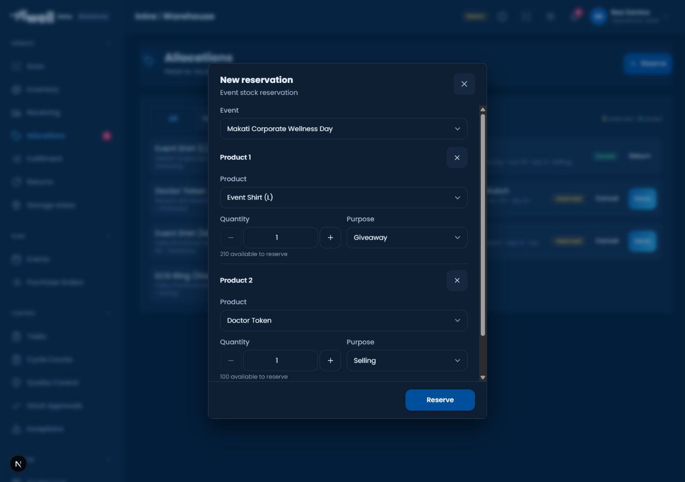
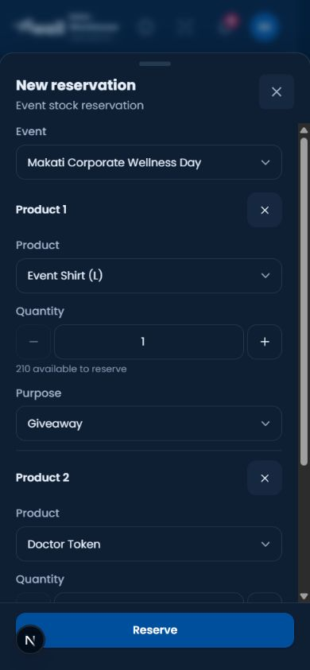
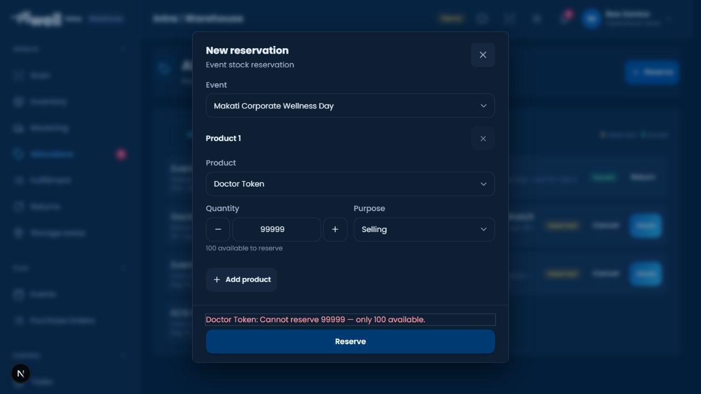

# Cross-Role Recovery and Evidence Remediation

Date: 28 August 2026. Target: mWell Intra UAT only.

## Release Status

Corrective implementation and automated regression are complete. The four reviewed database migrations are installed on UAT. The deployed app identity is exposed at `https://mwell-intra-uat.vercel.app/api/health`; match its commit to the deployment receipt before accepting a release. This source document is not a full operational certification. Production and seeded UAT tester records have not been changed by these checks.

## Changes

| Finding | Corrective implementation | Safety boundary |
| --- | --- | --- |
| P1 duplicate and unequal reservations | Shared multi-product reservation form, immediate single-flight guard, persisted immutable command, atomic server batch and replayable result | A confirmed rejected batch creates no allocations; an unknown result must be recovered before a new intent |
| P1 evidence crosses inspections | Semantic inspection identity and upload-generation guards; controlled evidence list | Closing or switching records invalidates late callbacks |
| P1 removed evidence reappears | Upload completion reconciles with the latest selection; partial failure retains successful files; retry and parent pending signals | Actions cannot commit while their evidence is uploading |
| P1 return retry dead end | Durable operator-scoped drafts and immutable submitted payload; typed success, confirmed rejection and unknown outcomes | Unknown outcomes remain locked for original-result recovery; no automatic new command key |
| P2 scanner inconsistency | Guided event issue and re-kit identity controls using the existing scanner engine, with product/bin/serial validation | No automatically selected serial counts as operator confirmation; camera/hardware rehearsal remains separate |
| P2 evidence-link friction | Shared attachment control, local upload and authorized document selection at the audited departmental actions | Private storage and business-record authorization remain mandatory |
| P2 misleading training denial | Distinct assignment, training and access-refresh recovery states | No role or approval bypass; mixed-role access still follows earned capabilities |
| P2 draft loss | Returns, order intake and Finance drafting gain operator-scoped recovery | Browser-local drafts are not shared assignments, business transactions or cross-device backup |
| P2 request review metadata | Short Review request title, requested items first, purpose in body, local dates, expandable raw audit details | Unknown identities remain explicitly unavailable rather than exposing a directory or inventing a name |
| Additional P1 Event/Finance reconciliation | Status and reconciled actor/time are written in the same row update | Existing separation-of-duties, optimistic locking, lineage trigger and audit checks remain intact |

## Verification Record

- Cross-module TypeScript and lint: 15 tasks passed each. Three pre-existing unused-argument warnings remain in Procurement; no lint errors.
- Full Warehouse regression: 75 files, 605 tests passed. The first broad run found two obsolete tests denying Marketing its approved reservation/Event access; corrected expectations retain explicit no-receiving/no-issuing checks. The complete rerun passed.
- Additional inspection/excess-custody regression: 3 files, 15 tests passed. This overlaps inspection coverage above; these totals are not additive unique cases.
- Shared authentication Guard: 23 tests passed.
- Private evidence API: 20 tests passed, including signature/type validation, same-origin authentication, record-bound references, denied access, rate-limit response, malformed responses and the exact 4 MB boundary.
- Department regression checkpoints: Finance 48, Events 32, Legal 163 and Procurement 199 tests passed. Additional saved-evidence UI checks passed: Legal 5 and Procurement 6. These are execution counts, not a claim of unique end-to-end business scenarios.
- Scoped evidence and Finance SQL: 24 PGlite checks passed, including text/UUID document registries, complete Event approval/post/reconcile handoff, independent actors, stale versions, private access and the actor-scoped upload limit. Atomic reservation SQL: 13 checks passed.
- Knowledge Base content and evidence provenance: 80 tests passed. Handbook catalog and guide contracts: 43 tests passed.
- Reservation/return implementation lane: 112 Warehouse, 275 data-kit and 45 PGlite checks passed. These overlap some integration cases above and are not an additive unique-case total.
- UAT atomic reservation migration applied. Rolled-back authenticated RPC checks passed for commit, identical replay, over-demand rejection and missing-actor rejection. No reservation, command-log or stock changes from these probes were retained.
- UAT scoped evidence probe passed using the existing Finance test identity and an existing PO: the server allocated a private record-bound path and rejected registration without the stored object. The probe was rolled back. It initially exposed a missing legacy rate-limit helper; a forward migration removed that dependency, and the exact probe then passed. No live file was uploaded.
- Browser: actual local application, Operations Lead demo profile, normal orientation and guided-practice path. No training state was injected. Multi-product reservation inspected at desktop 1440 x 1000 and mobile 390 x 844. Insufficient-stock validation rejected a 99,999-unit request without creating an allocation.
- Visual evidence below is local demo evidence, not proof of deployed UAT state or live database persistence.

The last validation screenshot is a 1280 x 720 desktop capture. The browser's viewport override did not apply during that final recheck, so it is not labeled as a fresh mobile pass. Earlier mobile form captures remain separate evidence.

## Release and Acceptance Boundaries

1. Verified and installed on UAT: atomic event reservations, scoped action evidence, atomic Finance reconciliation and the independent action-evidence rate limit.
2. Automated checks cover the changed repository, components, API, database, permissions and documentation contracts. Browser screenshots above cover the actual local app, not a complete live role matrix.
3. Deployment acceptance requires a successful Vercel build, UAT identity, reachable Supabase and page assets, and signed-out route/API checks. The health endpoint must identify `appEnv: uat` and project `kkoitlvydytdhlpxhuah`.
4. Authenticated role-by-role live uploads and physical-device rehearsal remain necessary before operational sign-off. No suitable pre-existing posted Event close entry was available for a non-destructive live reconciliation rehearsal; the complete transition was verified in isolated SQL tests.

## Operational Limits

This remediation does not certify every persona or every app transaction. Physical barcode scanners, cameras, printing, four genuinely simultaneous operators, courier execution and external vendor email receipt still require a controlled operational rehearsal. PGlite tests are isolated SQL regression checks, not proof of multi-session production concurrency. Tests using mocked Storage boundaries establish state safety, not live upload availability.

An attachment upload that finishes after a form is closed may leave an unreferenced private object. It cannot become evidence for a different record. Retention cleanup for unreferenced uploads must be separately governed; do not delete tester evidence indiscriminately.
