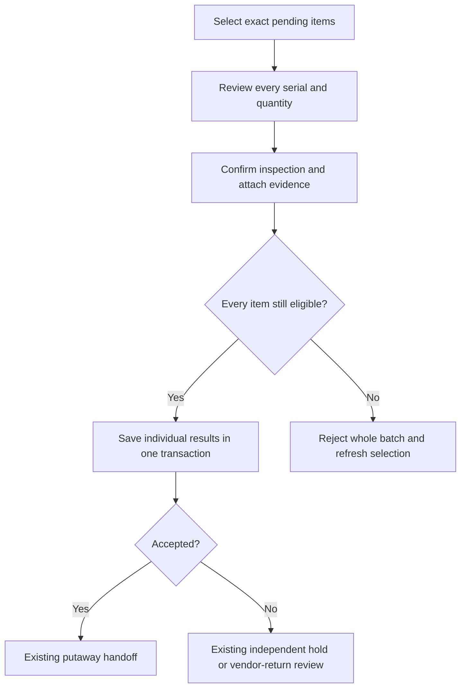

# September 20 Experience Update

Status: deployed to UAT at `bc5b39849bf33662bfefac7b365ad64ce71a968a` on September 20, 2026. The five migration bundle and the subsequent Finance ledger authority correction are installed. Existing approvals, stock controls and required learning still apply. SMTP and the reporting API are unchanged. Deployment is not full certification: the automated pipeline and the complete seller-to-Finance transaction journey still need successful evidence.

## Finding Your Work

My Work now reads open requests separately from recent closed history, so older requests do not disappear just because newer records were added. In Procurement, search by request number, title or other displayed request details. Ownership, dates, status and sort controls keep their context when you open a request and go back. A saved request link loads that request directly, subject to your existing access.

An explicit UAT record view can separate known load-test fixtures from ordinary work. Nothing is deleted. A record labelled scenario-ready is a declared test scenario, not proof that every checkpoint was completed. Normal business views continue to include their authorized records.

## Warehouse Screens

The desktop fulfillment queue uses compact, single-column order summaries. Open an order for the complete details and actions. Mobile references wrap without pushing the first action far down the page. Status wording follows the same saved stage in the list and detail view.

Warehouse has visible All workspaces and My Work links. Alerts can be searched and grouped, with a responsible team shown where it can be identified. Opening an alert does not resolve the underlying issue. A link is only offered when your account can enter its destination; seeing a record does not grant permission to approve or change it.

A physical-return shortcut is only offered for eligible released custody and to a role allowed to receive returns. Other users see the responsible Warehouse handoff instead. Prior returns remain part of the eligibility check.

## Inspecting Several Items

Quality Control now includes a batch option on UAT, with its database migration installed. Desktop and mobile selection/review were checked without submitting existing tester inspections. Successful and rejected live submissions remain distinct transaction checks.

1. Expand the receipt or return group and select the items you actually checked. A selection is limited to 50 inspection records from the same source, product, PO line, bin and lot.
2. Choose Review selected inspections. Check the list and quantities. Every serial remains a separate item; a bulk quantity is not permission to sample just part of it.
3. Confirm that you inspected every selected item. Choose the shared result, add a reason for any non-accepted result, and attach the batch evidence.
4. Submit once. Each item receives its own inspection result. If one item is no longer eligible, the entire batch is rejected rather than partially saved.
5. If the app confirms rejection, correct the details or return to the queue and select eligible items. If the response is lost, the original selection and details stay locked: use Review unconfirmed inspection and retry the original attempt. A later access error does not establish whether the earlier save succeeded. The retry key prevents a second application; check the saved inspections rather than starting another attempt.

Individual inspection remains available. A receiver cannot inspect their own governed procurement receipt. Holds and vendor returns still follow their existing independent disposition process.

## Event Sellers And Watch Recovery

The agreed approach is one named account per seller, limited to assigned events. Marketing prepares the event demand, which can contain several products and quantities in one request. The existing approval, fulfillment and acknowledgment steps remain in place.

The new custody controls are prospective and disabled until an authorized event owner enables them before the first issue. An administrator must assign the narrow seller role and the required learning must be published and completed. Existing historical stock is not silently assigned to a seller or reconstructed from matching product names.

The UAT test seller is a synthetic Marketing employee with the seller role only. Marketing membership supports the normal training assignment; it does not grant Warehouse, Procurement, event-management or Finance authority. Warehouse data access is checked by the database as well as the screen. The seller sees assigned event work through the scoped Events interface.

Sellers record their own sales and giveaways against acknowledged event custody, with the exact serials where required. The app checks remaining quantities and duplicate references. Corrections use a linked reversal; they do not erase the original entry. Finance reviews the event records independently.

Unsold watches return through the original event custody and Quality inspection. A Product-approved recovery recipe then controls conversion back to the base watch. The original serial is preserved, packaging is accounted for explicitly, and the conversion needs its separate preparation, independent Quality approval and execution. Bags remain separate unless the approved recipe explicitly includes them. Do not delete or rename a variant to make its balance disappear.

Product approves recipes in Product > Stock conversion recipes. Warehouse operators and authorized inspectors use the separate Stock conversion tab in Fulfillment; they do not need kit-administration access. The Product recipe view does not expose operational custody data. Approved conversion preserves the original procurement receipt identity instead of rewriting its history.

The event cannot be cancelled while released stock still awaits acknowledgment, and settlement cannot replace missing stock with invented return or loss quantities. Complete physical handovers and recorded returns first. Submitted or approved settlement prevents new demand from changing its reconciled balance. Post-event corrections and variant SKU retirement remain undecided; the candidate keeps existing product lifecycle rules and strict assignment dates.

Native PostgreSQL concurrency and role-isolation checks passed in an isolated fixture environment, including competing transactions and actual scoped seller RPCs. UAT migrations, seller learning publication and the seller curriculum mapping are now installed. The synthetic seller `intra.seller.uat.sep20@mwell.com.ph` was created without email delivery, with the seller role only and Marketing member scope. Its first-login test found a learning-page parsing error. This follow-up accepts a blank legacy persona label only for the exact published internal seller role curriculum v1; it preserves assigned learning, attempts, locks and certificate checks. The actual UI completion retest is recorded separately, not inferred from this correction. No event, stock allocation, sale or giveaway is credited by the parser fix. A screenshot or an automated account is not a human seller pilot.

The first CI run stopped on a real Finance ledger permission check. The correction now uses current effective authority instead of the raw role capability. The deployed database verification reports zero raw authority boundaries, no missing objects and no missing grants. The full CI rerun must still pass; do not count skipped downstream checks as successful.

## Learning And Help

Qualified returning users are directed toward their work, while assigned outstanding learning remains visible. Completed learning is collapsed instead of dominating the page. The knowledge area uses task, role and reference navigation with search; existing article links are retained. None of these presentation changes marks a requirement complete or removes an approval.

## Tester Checkpoints

### Synthetic Seller Handover

The seller's actual UI retest passed on deployed `f6b816d`: orientation plus all six seller practice decisions were saved, each requirement has exactly one attempt, and completion remained after reload. The normal learning evaluator issued one certificate scoped to this account, its seller role assignment and Marketing membership. Parent read-only audit checks verified all seven checkpoint records and their evidence hashes; the learner's raw audit-table restriction stayed in place. No direct completion/certificate insert was used. Desktop and mobile completion views were inspected. This is automated UAT evidence, not a human pilot or an event transaction certificate.

The owner has now enabled a dedicated synthetic event and assigned this seller for September 20. On live `0124b95`, one demand for three test watches and two event materials was saved; retrying its original key retained exactly one request. A separate Warehouse lead approved request `31356e67-cfdb-4467-847b-4b4a0452cbad` through the UI, creating the linked fulfillment order with both lines intact. Desktop/mobile order details and the request-to-order link were checked. Allocation correctly stopped at zero available stock, leaving the order awaiting allocation and creating no stock or allocation rows. No stock has been picked, released or acknowledged, and no sale or giveaway has been recorded. Assignment expiry remains unchanged; continuing after the test date needs an authorized new assignment, not a silent extension.

The follow-up adds a clear coordinator handoff when no event assignment is visible, and a release/acknowledgment explanation when an open event has no stock ready for recording. It changes no command or approval. The KB and offline manuals carry the same instructions. The smoke runner now checks the actual department-membership table. Full CI on `0124b95` passed the upstream security, build and documentation checks but stopped at an outdated return-link test selector. The corrected harness renders the real shared component, retaining route, permission, keyboard and touch-target assertions; its complete local gate passes 22 tests. A new hosted run is still required.

The next hosted run, #201 on `fe2dbfd`, passed the repaired return-link gate but stopped at the onboarding state wait. Its screenshots showed completed users with their learning history correctly collapsed; the test was waiting for obsolete visible orientation wording. The corrected driver reads the current visible required-step total, checks the internal/vendor onboarding context, and rejects stale, missing, impossible or incomplete results. All 11 existing personas then passed live desktop and mobile read-only retests (22 journeys), with zero training repeated and saved screenshots. This verifies returning-user completion and workspace handoff, not new-user training or the full operational event chain. No app, role, certificate or SMTP behavior changed. Full hosted certification still needs a successful rerun.

- Reopen an older open request, search for it, open its link and return to the same filtered list.
- Compare fulfillment summary and detail status, then check the correct next actor and eligible return path.
- Check desktop and mobile views, including long references, expanded details, dialogs and alert filters.
- Verify a successful inspection batch, a rejected stale selection and an identical retry with no duplicate results.
- After release setup, test two different sellers, a seller assigned to another event, duplicate references, sold-versus-returned serial conflicts, a correction and Finance readback.
- Complete approved watch conversion and recovery with exact serial and packaging balances. Preserve all test evidence and report the record numbers.

Five existing roles were checked on live UAT at desktop and mobile widths, producing 44 screenshots with no recorded page errors, horizontal overflow or automated accessibility findings. This read-only screen check is not an all-role transaction certificate. Verification results and remaining gaps are recorded separately in the September 20 remediation ledger.
