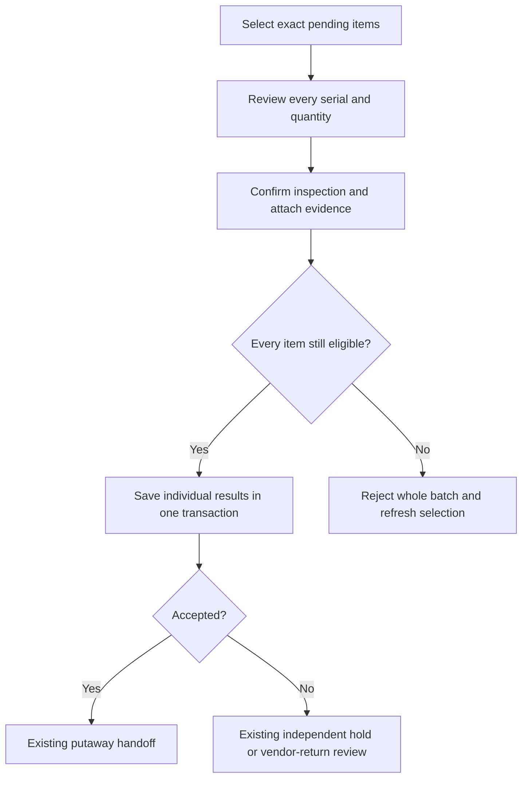

# September 20 Experience Update

Status: local candidate checks complete; live validation remains open. This is not a UAT deployment notice. Existing approvals, stock controls and required learning still apply. SMTP and the reporting API are unchanged.

## Finding Your Work

My Work now reads open requests separately from recent closed history, so older requests do not disappear just because newer records were added. In Procurement, search by request number, title or other displayed request details. Ownership, dates, status and sort controls keep their context when you open a request and go back. A saved request link loads that request directly, subject to your existing access.

An explicit UAT record view can separate known load-test fixtures from ordinary work. Nothing is deleted. A record labelled scenario-ready is a declared test scenario, not proof that every checkpoint was completed. Normal business views continue to include their authorized records.

## Warehouse Screens

The desktop fulfillment queue uses compact, single-column order summaries. Open an order for the complete details and actions. Mobile references wrap without pushing the first action far down the page. Status wording follows the same saved stage in the list and detail view.

Warehouse has visible All workspaces and My Work links. Alerts can be searched and grouped, with a responsible team shown where it can be identified. Opening an alert does not resolve the underlying issue. A link is only offered when your account can enter its destination; seeing a record does not grant permission to approve or change it.

A physical-return shortcut is only offered for eligible released custody and to a role allowed to receive returns. Other users see the responsible Warehouse handoff instead. Prior returns remain part of the eligibility check.

## Inspecting Several Items

The candidate adds a batch option to Quality Control. Its database migration must be installed before it can save on UAT.

1. Expand the receipt or return group and select the items you actually checked. A selection is limited to 50 inspection records from the same source, product, PO line, bin and lot.
2. Choose Review selected inspections. Check the list and quantities. Every serial remains a separate item; a bulk quantity is not permission to sample just part of it.
3. Confirm that you inspected every selected item. Choose the shared result, add a reason for any non-accepted result, and attach the batch evidence.
4. Submit once. Each item receives its own inspection result. If one item is no longer eligible, the entire batch is rejected rather than partially saved.
5. If the app confirms rejection, correct the details or return to the queue and select eligible items. If the response is lost, the original selection and details stay locked: use Review unconfirmed inspection and retry the original attempt. A later access error does not establish whether the earlier save succeeded. The retry key prevents a second application; check the saved inspections rather than starting another attempt.

Individual inspection remains available. A receiver cannot inspect their own governed procurement receipt. Holds and vendor returns still follow their existing independent disposition process.

## Event Sellers And Watch Recovery

The agreed approach is one named account per seller, limited to assigned events. Marketing prepares the event demand, which can contain several products and quantities in one request. The existing approval, fulfillment and acknowledgment steps remain in place.

The new custody controls are prospective and disabled until an authorized event owner enables them before the first issue. An administrator must assign the narrow seller role and the required learning must be published and completed. Existing historical stock is not silently assigned to a seller or reconstructed from matching product names.

Sellers record their own sales and giveaways against acknowledged event custody, with the exact serials where required. The app checks remaining quantities and duplicate references. Corrections use a linked reversal; they do not erase the original entry. Finance reviews the event records independently.

Unsold watches return through the original event custody and Quality inspection. A Product-approved recovery recipe then controls conversion back to the base watch. The original serial is preserved, packaging is accounted for explicitly, and the conversion needs its separate preparation, independent Quality approval and execution. Bags remain separate unless the approved recipe explicitly includes them. Do not delete or rename a variant to make its balance disappear.

Product approves recipes in Product > Stock conversion recipes. Warehouse operators and authorized inspectors use the separate Stock conversion tab in Fulfillment; they do not need kit-administration access. The Product recipe view does not expose operational custody data. Approved conversion preserves the original procurement receipt identity instead of rewriting its history.

The event cannot be cancelled while released stock still awaits acknowledgment, and settlement cannot replace missing stock with invented return or loss quantities. Complete physical handovers and recorded returns first. Submitted or approved settlement prevents new demand from changing its reconciled balance. Post-event corrections and variant SKU retirement remain undecided; the candidate keeps existing product lifecycle rules and strict assignment dates.

These are candidate workflows. Migration, activation, learning publication, native concurrent-transaction testing and saved UAT transaction evidence remain release checks. A screenshot or local simulated account is not a completed live seller pilot.

## Learning And Help

Qualified returning users are directed toward their work, while assigned outstanding learning remains visible. Completed learning is collapsed instead of dominating the page. The knowledge area uses task, role and reference navigation with search; existing article links are retained. None of these presentation changes marks a requirement complete or removes an approval.

## Tester Checkpoints

- Reopen an older open request, search for it, open its link and return to the same filtered list.
- Compare fulfillment summary and detail status, then check the correct next actor and eligible return path.
- Check desktop and mobile views, including long references, expanded details, dialogs and alert filters.
- Verify a successful inspection batch, a rejected stale selection and an identical retry with no duplicate results.
- After release setup, test two different sellers, a seller assigned to another event, duplicate references, sold-versus-returned serial conflicts, a correction and Finance readback.
- Complete approved watch conversion and recovery with exact serial and packaging balances. Preserve all test evidence and report the record numbers.

Verification results and any remaining gaps are recorded separately in the September 20 remediation ledger. Do not treat this candidate guide as a statement that UAT has been upgraded.
