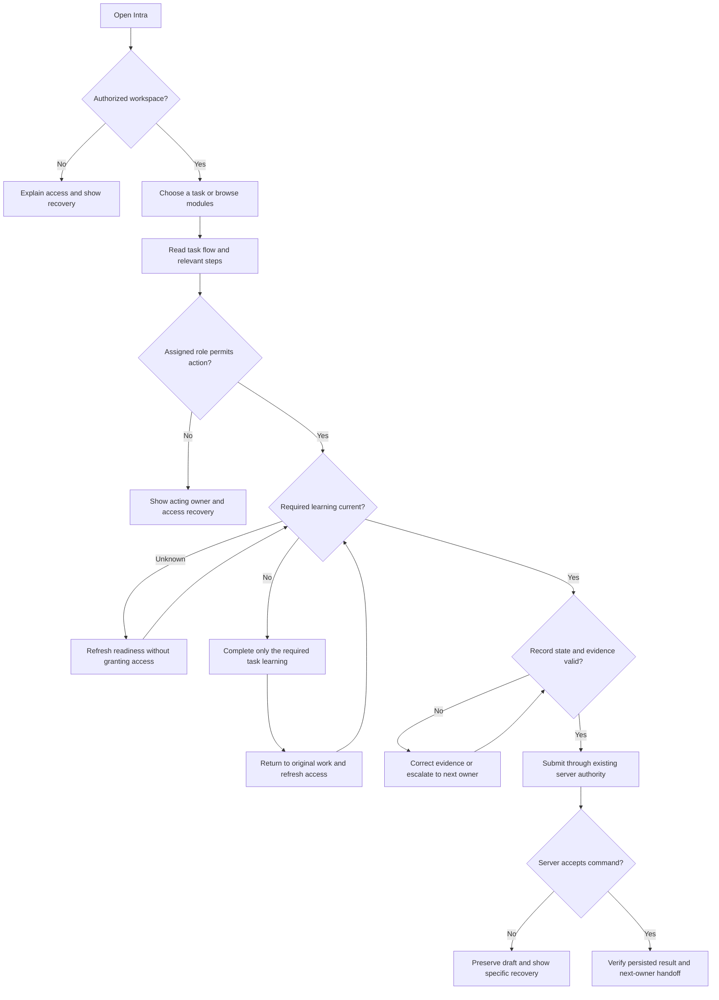

# Task-first onboarding and Knowledge Base design

Status: proposed implementation design based on the approved direction. Planning only; this document does not declare a deployment or authorize changes to policy content.

## Objective

A new user should be able to identify their next task, understand the important controls, perform the work safely, and know who receives the handoff without needing another person to explain the interface. Experienced users should find an answer without repeating introductory training.

Use one shared experience for all eleven operating personas and multi-role users. One experience does not mean identical requirements or interchangeable permissions.

## Existing foundation and constraints

The current local candidate provides action-scoped onboarding, an audience-aware checklist, exact requirement grouping, guided practice, policy/assessment handling, separate-tab recovery, and explicit KB task destinations. Preserve these foundations.

The KB still renders `FirstTimeJourney` through `HandbookLanding`. Its local `onboardingComplete` flag is independent of governed learning. Replace this competing completion signal; do not convert browser-local completion into certification.

The existing guide model already includes decision nodes, branch labels, role ownership, outcomes, evidence references, and hotspots. Extend and validate it instead of creating a second content platform.

The application uses Next.js, React, internal UI components, React Router within embedded modules, Supabase learning/authorization, Vitest, and Playwright. Reuse these patterns. Do not introduce a third-party adoption platform, AI answer service, or new diagram engine for this release.

The previous candidate is not a live release declaration. Review its pending PO cancellation/vendor acknowledgement migration before enabling the new navigation model in UAT. The new vendor evidence review also needs versioned curriculum publication; published requirements must not be overwritten.

## Experience architecture

### Home: work first

Keep all authorized modules visible. Show one compact task-start region, below the page identity and above general reference content. It contains:

- A heading, "What do you need to do?"
- Up to three relevant tasks with a literal outcome, module context, and one primary command each.
- A "View all tasks" link.
- A small learning status link, not a second hero or mandatory modal.

Choose tasks in a deterministic order: an explicitly selected task; a resumable task; a verified assigned work item; then curated tasks for the user's actual role scopes. Unknown queue state is not "no work". Show an unavailable state with retry and role-based task guidance when the queue cannot load.

Do not rank solely by department or operating-persona label. A user can belong to Operations and perform work in several modules. Role assignments and record scope remain authoritative.

### Onboarding: relevant learning first

The default view answers "What do I need before this task?" and shows:

1. Selected task and expected result.
2. Required learning for that task, including transitive prerequisites.
3. What work remains available.
4. A link to all assigned learning.

Use three presentation groups:

- **Needed for this task:** unmet requirements bound to the selected action and its prerequisites.
- **Other required learning:** assigned requirements for other actions. They remain mandatory and retain their existing deadlines.
- **Optional guidance:** references or practice that has no mandatory authority effect.

These groups change prioritization only. They must not change `mandatory`, passing scores, attempt limits, expiry, role scope, or policy applicability. A selected task with no certification requirement must not be forced through a generic orientation.

If no task is selected, suggest up to three available tasks. Do not silently select a high-risk action or pretend that a task can be executed when ownership or record state is unknown.

Keep the complete checklist available through "All assigned learning". Shared exact requirements appear once with their assigned contexts; distinct versions, obligations, and role-specific authority remain distinct. Unknown or stale learning shows an honest unavailable state and leaves mutation gates fail-closed.

The selected task and guidance step can survive refresh as navigation preferences. Certification, assessment outcomes, policy acknowledgments, and attempt state must continue to come from the governed server.

### Knowledge Base: one front door, two levels of detail

Make task search the primary entry. Below it, show relevant tasks, recent/saved guidance, and secondary links to workflows, roles, and process references. Future features remain explicitly separated from executable tasks and normal task-search results.

Do not force users to choose among several taxonomies before searching. Existing role/feature/article URLs must still resolve. Preserve query, selected task, browser history, and reading position without full-page session restoration.

Every task guide follows this order:

1. **Outcome and access:** what completing it achieves and which assigned role can act.
2. **Before you start:** required record/state, materials, and evidence.
3. **Decision flow:** real decisions, exception branches, ownership, and terminal outcomes.
4. **Execute the steps:** each action beside its actual screenshot and target annotation.
5. **Verify the result:** status, evidence, and persisted effect that demonstrate success.
6. **Next owner:** who receives the work, where it appears, and what to do if handoff fails.
7. **Recovery:** correction, retry, escalation, and prohibited shortcuts.
8. **Policy reference:** controlled document/version and relevant clause, available without leaving the guide.

Keep the flow before the detailed steps, as requested previously. The landing page need not display every workflow diagram; diagrams belong in the chosen guide. A short task can have a compact flow, but a decision cannot be represented as a decorative straight line.

### Contextual help beside the work

Use a nonmodal help panel on wide desktop when the remaining form width is usable. At narrower widths, use the existing accessible modal/sheet pattern with its own scrolling, focus return, and safe-area-aware close control. Do not shrink complex operational forms to make room for help.

The panel shows only the current task's next step, screenshot, expected result, and recovery. Users can expand the full guide. Opening or closing help must not submit, clear, reload, or navigate away from a draft.

Keep long assessments, policy acknowledgment, and legal activities in the existing governed learning experience. Separate-tab recovery remains available when it is the safer way to preserve a transaction draft. Reading a help panel never completes a certification.

Do not obscure a barcode input, camera preview, scan result, or primary submit control with a coach. Allow minimizing help and resuming it. No automatic tooltip parade on first login.

## Shared task contract

The intended user journey is:

Unknown, expired, or revoked access never follows the successful-command branch. Retry/correction routes must offer a stop/escalation path; they are not infinite compulsory loops.

Introduce stable task IDs as presentation metadata referencing existing features, flows, role IDs, and capabilities. Do not create a parallel authorization registry. The same task identity connects Home recommendations, KB search, contextual guidance, and aggregate usability events.

One task can have several participating roles. Each step identifies its acting owner and handoff. A reader may learn about a cross-department process without receiving the other department's action controls. Vendor content is a separately filtered audience, not an internal role filter.

A selected task may have multiple action capabilities. A learning helper derives unmet requirements from the current server-provided snapshot; it must not manufacture a new certification from a KB task definition. Request parameters are not evidence of ownership or eligibility.

When a task requires a specific record, launch its verified record route only after the existing source API confirms access and record existence. Otherwise open the relevant list with a clear selection step. Never substitute a seeded record ID or an invented route.

## Persona entry matrix

These are initial task priorities, conditional on actual assigned capabilities and current implementation. They are not new grants or promises to add missing transaction functions.

| Persona | Candidate first tasks | Default device emphasis | Handoff/recovery that guidance must cover |
| --- | --- | --- | --- |
| Platform Administrator | Review an access request; inspect audit history; maintain approved assignments | Desktop | Distinguish role assignment from training; revoked and unauthorized access |
| General Employee | Request stock; create a purchase request; track submitted work | Both | Returned request, missing evidence, approver ownership |
| Operations Associate | Receive and inspect; put away stock; pick and pack an assigned order | Mobile-first | Wrong/duplicate serial, quantity variance, quarantine and supervisor escalation |
| Operations Lead | Resolve a quality hold; review count variance; maintain storage setup | Both | Operator evidence, separation of duties, approval rejection |
| Procurement Lead | Progress a purchase request; source an eligible vendor; author/issue a PO | Desktop | Budget/DOA, accreditation, rejected sourcing and receiving handoff |
| Finance Controller | Review matching/payment readiness; review inventory close; reconcile an event | Desktop | Missing receipt/inspection, incompatible evidence, authorized release owner |
| Legal & Compliance Lead | Review accreditation; request corrected evidence; manage a controlled DOA revision | Desktop | Expired documents, conflicts, authorized publication and vendor response |
| Marketing & Events Lead | Create an event; request event inventory; reconcile event outcomes | Both | Stock allocation, event custody, returns/losses and Finance settlement |
| Product Owner | Review readiness; inspect pricing context; review assigned product decisions | Desktop | Contributor versus owner authority; unsupported decisions remain unavailable |
| Leadership / Insights | Inspect a source-linked report; review exceptions; validate data freshness | Desktop | Stale data, source drill-down permissions; no mutation-based completion requirement |
| Vendor Representative | Prepare application evidence; respond to corrections; acknowledge an awarded PO | Both | Own-company isolation, document versions, rejected submission and acknowledgement revision |

Mixed-role acceptance includes Finance across Warehouse/Procurement/Events; Operations plus employee/requester and Product contributor; Procurement plus employee; Legal plus an administrative scope; and newly added/revoked roles. An incompatible vendor/internal assignment must follow existing identity policy and must never blend content audiences.

## Visual and interaction standards

- Reuse the app's design tokens, icons, and components. No new visual theme or card-heavy landing page.
- Desktop: restrained title area, dense but readable task rows, unframed sections, visible separators, and one clear primary action per task.
- Mobile: single-column content, 44 by 44 CSS-pixel minimum action targets, thumb-reachable navigation, and forms unaffected by help overlays.
- No clipped text or horizontal page scrolling at 320, 360, 390, 768, 1280, and 1440 CSS pixels. Diagram pan is contained and has an accessible text equivalent.
- Check light/dark themes, keyboard operation, 200% browser zoom, reduced motion, and long names/error messages.
- Preserve visible focus, dialog labels, close/escape behavior, focus return, and screen-reader status announcements. Do not rely on color alone for state.
- Keep explanatory training content in guides; operational pages should not gain paragraphs describing their UI or keyboard shortcuts.

## Content and screenshot governance

Maintain a coverage matrix from implemented feature/control to task, role, decision branch, screenshot, policy reference, expected result, and recovery. A feature can share a guide, but an active control cannot disappear from coverage simply because its page is documented.

Capture the actual approved UAT build with synthetic data. Each screenshot records role, route, relevant state, commit, environment, viewport, capture/review dates, landmark, and target. Verify that the hotspot points to the actionable control, not merely the surrounding page.

Reject unrelated screenshots, inaccessible targets, misleading prefilled results, confidential content, unsupported decisions, and generated pictures presented as actual app evidence. Missing evidence blocks that guide from being labelled verified; it must not silently pass or display an empty placeholder as finished documentation.

Keep the existing screenshot-age and provenance rules. Do not reset dates to avoid recapture. A screen reused by several steps is acceptable only when the same state and target are genuinely relevant.

The standalone handbook remains independent of the app KB. It uses the same approved process facts and evidence contracts, but must not send readers back to the KB to understand a process. Preserve its desktop-oriented navigation, architecture/infra material, source-document references, and searchable content.

## Measurement and human validation

Automated tests establish correctness and accessibility checks, not ease of learning. Conduct a separate pilot with at least two first-time participants per persona where staffing permits, plus four mixed-role sessions. Record participant/session counts and prior experience; if fewer people are available, report the evidence gap rather than treating repeat users as new users.

Each persona performs a routine task, a correction/negative case, and a handoff or escalation. Read-only roles perform a source-verification task instead of a write. Operations Associates test on handheld-sized devices; desktop-priority roles use desktop first. Include cross-device continuation for mixed-role users.

Proposed acceptance targets, not measured results:

- At least 90% unassisted routine-task success overall; no observed critical compliance bypass; investigate every persona below 80%.
- At least 90% correct recovery/escalation on the scripted negative cases.
- Median time to locate the correct task or guide at most 30 seconds; report distribution and failed searches.
- At least 80% correct owner identification for handoffs without a facilitator explaining it.
- Single Ease Question median at least 6 of 7; report sample size and role/device breakdown.
- Search benchmark: correct executable guide in the first three results for at least 90% of a maintained 55-query fixture; no unauthorized vendor/internal disclosure.

Collect minimal events: task selected, guide opened, step viewed, recovery opened, search outcome, and feedback category. Do not store raw search text, form values, serials, filenames, tokens, policy answers, or customer/vendor record payloads in experience telemetry. Correlate successful transactions only through a reviewed server-side integration with existing success events; a click is not a business success.

Proposed telemetry retention is 90 days for minimal events, with aggregate reporting thereafter and small-cohort suppression below five people. Confirm retention and access with the data owner before enabling collection. No individual productivity rankings. Experience telemetry failure must never block operational work or certification.

## Release sequence and exclusions

1. Establish the reviewed baseline, safety boundaries, content inventory, and task contract.
2. Deliver the unified task-start experience and eliminate duplicate onboarding completion signals.
3. Deliver contextual help and standard task guides across current functions, with verified screenshots.
4. Deliver improved search and privacy-controlled measurement.
5. Run strict automated UAT certification, moderated pilot, fixes/retests, and staged rollout.

No release bypasses action authorization. UI rollback must not remove security hardening or silently reinstate an obsolete learning gate. Use the existing deployment mechanism, separately controlled experience flags if needed, and additive database migrations.

Exclude new departments, new business transaction features, AI chat answers, a third-party adoption-platform integration, gamification, blanket training waivers, and a new LMS. Record discovered business-flow defects separately; fix blockers before describing those flows as supported, without turning this project into another whole-app rewrite.
