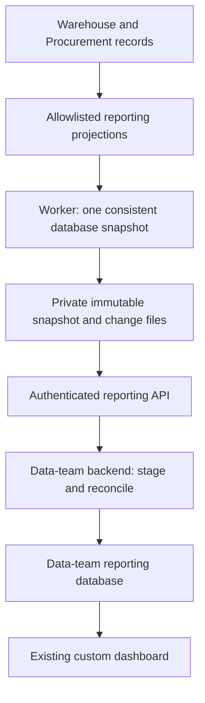

# mWell Intra Reporting API: Technical Specification

Date: September 20, 2026. Revision 2: security and integration-experience review. Status: proposed design; not implemented, penetration-tested or deployed.

Start with the [Data-team quickstart](../../integrations/reporting-api/DATA-TEAM-QUICKSTART.md). Review risks and release evidence in the [Security review](../../integrations/reporting-api/SECURITY-REVIEW.md). This specification reduces identified design risks; it cannot establish that a future implementation has no vulnerabilities.

## 1. Agreed Outcome

The data team already operates a custom dashboard. Its backend will ingest Warehouse and Procurement data into its own database. Phase 1 covers all departments and warehouse locations, an initial full extraction, then polling every 15 minutes. No operational process, approval ladder, onboarding rule or warehouse custody rule changes. SMTP is out of scope.

All-location access is not unrestricted platform access. The integration can read an explicit reporting contract, not arbitrary tables, user profiles, private documents or operational commands. The dashboard browser never receives integration credentials.

The initial extraction means all retained, authorized reporting records at a consistent point in time. It cannot reconstruct past states the application never recorded. Published snapshots represent state; existing movement, receipt and approval journals provide recorded transaction history. A state that changes twice between captures may appear only in its final form unless an existing journal records both transitions. This is not a promise of a new complete audit stream.

## 2. Evidence and Repository Boundary

Reviewed source repository: `C:/Users/NormanArisDeocareza/Projects/mwell-intra-onboarding`, commit `2c2adfb6b4004a505369f3286dea044d32199517`. This is source evidence, not a September 20 live deployment verification.

This document and its companion plan are stored in the current writable `mwell-intra-warehouse` workspace. The implementation targets the full Intra monorepo above, not the older standalone Warehouse application. Resolve the approved implementation checkout and current runtime schema before applying the plan. Do not copy code into the wrong application or overwrite existing work.

Existing building blocks:

| Source | Observed behavior | Implication |
|---|---|---|
| `apps/shell/app/api/warehouse/exports/route.ts` | Signed-in-user CSV preparation, storage and download; six export kinds; fixed query limits | Reuse field meaning, not the endpoint as an exhaustive unattended feed. Current limits are not proof of complete extraction. |
| `apps/shell/app/api/insights/export/route.ts` | Signed-in-user export of at most 500 summary metrics | Not a detailed cross-module integration. |
| `20260710170000_warehouse_w1_imports_po_and_reporting.sql` | Inventory-position, movement, Quality and cycle-count reporting views | Candidate projection logic; inspect effective definitions and authorization first. |
| `20260721200000_cross_department_wms_persistence.sql` | Fulfillment, department requests, customer returns, kits and re-kit work; some child lines stored as JSON | Preserve source relationships; do not invent stable line identities from array positions. |
| Procurement migrations and `modules/procurement/src/types.ts` | Requests, sourcing, approval records, orders, amendments, receipts and readiness controls | Detailed source contracts exist but need field-by-field projection and disclosure review. |

## 3. Architecture Decision

Use a versioned REST API serving immutable reporting generations, built by a scheduled worker from narrowly permitted reporting projections. The data team's backend stages each generation and publishes it locally only after all required datasets reconcile.



Why this design: paginating directly over changing operational tables risks missed rows and inconsistent PO/receipt/balance combinations. A naive `updated_at > last_sync` query also misses some joined-view changes, hard deletes, timestamp ties and long-running transactions. A database sequence alone does not establish commit order. Immutable generations give a concrete, testable consistency boundary without changing business commands.

Alternatives considered:

- Direct scheduled CSV exports: simpler for occasional manual reporting, but the existing endpoints do not provide this scope, resumable complete synchronization or deletion semantics.
- Logical replication to a reporting database: stronger for very large data volumes and fine-grained history, but adds replication infrastructure, source publication controls and downstream schema operations. Reconsider if representative extraction fails the performance gate below. Do not silently substitute it during implementation.

The API stays stable if the internal extraction mechanism changes later.

## 4. Dataset Catalogue and Disclosure

Dataset names below are proposed public contract identifiers. Physical source names are candidates verified in migrations, not a claim that every current runtime column has already been validated. Task 1 resolves current sources, grain and every allowed field before migrations are written.

| Dataset | Grain and relationships | Candidate source / disclosure |
|---|---|---|
| `warehouse.products` | One product; SKU, name, category, serialized flag, unit, active state | `warehouse.products`; approved cost fields only, no arbitrary attributes blob |
| `warehouse.locations` | One location; type and active state | `warehouse.locations`; exclude private contacts and free-text addresses by default |
| `warehouse.bins` | One storage area; location FK | `warehouse.storage_areas` |
| `warehouse.lots` | One lot; product and supplier/receipt references where persisted | `warehouse.lots`; dates and lifecycle only |
| `warehouse.inventory_units` | One physical serialized unit; product, lot, location/bin and recorded custody | `warehouse.inventory_units`; operational serial allowed, personal assignee fields excluded |
| `warehouse.inventory_positions` | Product/location/bin balance | `warehouse.inventory_position_v1`; preserve on-hand, committed, held, unavailable and available separately |
| `warehouse.movements` | One persisted movement; product, source/destination, source references | `warehouse.movements` / `bi_movements_v1`; no fabricated journals |
| `warehouse.receipts` | One canonical warehouse receipt | `warehouse.receipts`; procurement receipt links explicit, not two receipts counted as two physical deliveries |
| `warehouse.inspections` | One persisted inspection | `warehouse.quality_inspections` / `bi_quality_v1`; disposition, quantities, source keys; no evidence body or free-text reason |
| `warehouse.holds` | One hold; affected stock/source, state and quantities | `warehouse.inventory_holds`; no sensitive free-text notes |
| `warehouse.allocations` | One allocation; product, event/request references, purpose, quantity and state | `warehouse.allocations`; referential event ID only, no full Events module expansion |
| `warehouse.department_requests` | One request with allowlisted child lines | `warehouse.department_stock_requests`; department, dates, quantities and linked order, not private draft contents |
| `warehouse.fulfillment_orders` | One order with allowlisted lines | `warehouse.fulfillment_orders`; source, order reference, state, dates and issue references; no customer/contact/address payload |
| `warehouse.shipment_events` | One persisted shipment event, or a parent-owned event collection if stable IDs are absent | Resolve actual persistence; carrier/status/time and parent ID; no tracking URLs carrying access tokens or delivery photos |
| `warehouse.return_cases` | One customer-return case; original order and recorded replacement reference | `warehouse.customer_return_cases`; disposition/state, product quantities and source keys; no customer narrative |
| `warehouse.vendor_returns` | One vendor return with source/PO references | `warehouse.vendor_returns`; do not merge with customer return cases |
| `warehouse.cycle_counts` | One count with count-line records | `warehouse.cycle_counts` / `bi_cycle_counts_v1`; expected, counted, variance and approval state |
| `warehouse.kit_definitions` | One versioned recipe with components | `warehouse.kit_definitions`; preserve retired definitions referenced by history |
| `warehouse.rekit_work_orders` | One work order with source/output/component linkage | `warehouse.rekit_work_orders`; report actual supported source type, not the unimplemented Sept 16 proposal |
| `procurement.suppliers` | One approved reporting supplier identity | Resolve canonical vendor master; alias mapping to Warehouse supplier IDs; legal business name/state only, no contacts, tax IDs or bank details |
| `procurement.requests` | One submitted-or-later request; department, category, cost center, dates, amounts, state, allowlisted lines | `procurement.requests`; saved private drafts excluded; no narrative/attachment blobs |
| `procurement.approvals` | One persisted decision/step; request/order/amendment references | `procurement.approval_steps` plus applicable amendment steps; pseudonymous actor ID/role, no email/name by default |
| `procurement.sourcing_events` | One sourcing event; request, method/tier, state and lifecycle dates | `procurement.sourcing_events` and approved route projection; policy state preserved |
| `procurement.quotations` | One disclosed supplier response with permitted line/amount fields | `procurement.sourcing_responses`; withhold sealed commercial contents until authoritative opening/disclosure rules allow release |
| `procurement.purchase_orders` | One PO; request/vendor, currency, amounts, state and dates | `procurement.purchase_orders`; canonical Procurement record, not a second Warehouse PO total |
| `procurement.purchase_order_lines` | One persisted PO line; PO/product keys, quantity, unit price and tax treatment | `procurement.purchase_order_lines`; do not infer product relationships by matching labels |
| `procurement.amendments` | One amendment; PO/line, old/new approved values, state and dates | `procurement.purchase_order_amendments`; approvals linked, no free-text justification |
| `procurement.receipts` | One procurement receipt; PO/line and canonical warehouse receipt links where persisted | `procurement.receipts` and receipt-status projection; accepted/rejected/excess measures remain distinct |
| `procurement.payment_readiness` | One readiness pack/state with PO and acceptance references | `procurement.payment_readiness_packs` and current staleness projection; readiness is not proof of payment |
| `reference.links` | One verified cross-system relationship | Explicit source IDs/alias mappings only; unresolved links carry a quality flag, never an invented join |

Unknown or absent source features must appear in the catalogue as `unavailable` with a reason, not an empty successful dataset. Phase 1 is not complete until promised datasets are implemented or an exclusion is explicitly accepted.

Default exclusions apply recursively: passwords, tokens, session data, bank accounts, personal contact data, medical information, private document content, signed URLs, unreviewed free-text notes and raw JSON payloads. Approved quotation prices, PO values and unit costs are commercially sensitive and require the dedicated reporting grant; they are not public. Sealed bids and legal documents remain governed even across all departments.

## 5. Public Data Contract

- JSON with snake_case fields. IDs are opaque strings. Numeric decimal quantities and money use decimal strings plus unit/currency; counts may be integers. Never sum mixed currencies without explicit conversion data.
- Times use RFC 3339 UTC. Date-only business fields use `YYYY-MM-DD` with their meaning documented. `null` means unknown/not recorded, not zero or empty string.
- Each record has `record_id`, `dataset`, `source_system`, `source_id`, `source_updated_at` (nullable), `record_hash`, `data_quality_flags` and its explicit business fields. `captured_at` belongs to the manifest, not the record hash.
- Each field dictionary declares type, nullable state, unit/currency, sensitivity, definition, source mapping and FK target. Preserve native status codes and separately document lifecycle meanings; approval is not receipt, readiness is not payment, and held stock is not available stock.
- Stable child IDs are used when persisted. Otherwise ship the whole allowlisted parent collection and replace that collection atomically on parent upsert. Do not fabricate a durable line ID from array index or label. A future normalized child table requires an explicit schema version.
- Dataset IDs and opaque record IDs are unique within the environment. Duplicate business references remain distinct records. No matching by human-readable PO number alone.
- `record_hash` uses the normative hashing protocol in section 12. Hashing is an integrity check, not authorization or proof of trusted provenance. Schema/disclosure changes require a new bootstrap when existing local copies must be purged.
- Additive nullable fields may be introduced in v1 with dictionary revision. Removed fields, changed meaning, different identity/grain, or restrictive disclosure changes create a new contract version or scope epoch. Maintain the previous supported version for 90 days unless an urgent security revocation requires immediate withdrawal.

## 6. Authentication and Authorization

Provision a dedicated integration principal with `reporting:warehouse:read` and `reporting:procurement:read`, all departments/locations, and environment-specific dataset allowlists. It is not a human UAT test account, admin session or Supabase service-role key.

Replace the proposed 90-day data-access bearer with standards-based OAuth 2.0 client credentials through an approved managed authorization server. Do not build a token server or cryptographic protocol inside Intra. Prefer asymmetric `private_key_jwt` client authentication: only the public key is registered; the data team retains the private key. The reference client handles token acquisition/renewal. No user login, onboarding completion, password-reset email or SMTP dependency is added.

Access tokens expire after at most 10 minutes, target a single reporting API audience and environment, and cannot authorize operational APIs. The verifier pins issuer, audience, algorithms and key source; rejects unsigned tokens, algorithm confusion, unknown issuer, wrong token type, expired/early tokens and client-supplied key URLs. Use maintained provider/JOSE libraries and a maximum 60-second clock-skew allowance. No token, assertion, private key, cursor or row payload in logs, traces or error monitoring. Strict TLS verification applies to API, token server, storage and database connections.

Service-client key registration, grant changes and revocation occur through a separate admin control plane with MFA, limited administrators, recorded owner, expiry and auditable approval. The data-plane credential cannot change its grants, issue credentials, delete exports or administer storage. Normal private-key rotation has at most 24 hours overlap and no required data rebootstrap when grants remain unchanged; compromised keys have no overlap. On compromise, permanently deny the old OAuth client registration in both provider and API grant mapping and issue a new client ID after review. Do not re-enable the compromised client ID after rotating its key: previously issued tokens might otherwise regain access. The verifier checks the trusted issuer/client-ID pair against its current disabled/allowed registration on every request. Normal rotation is separate from incident replacement. Revocation stops existing tokens at the next authorization check; token expiry or an unbound local epoch alone is insufficient. Missing/unreachable current grant state fails closed with 503, not cached allow. Revocation prevents new page dispatch; already received/in-flight bytes cannot be recalled.

Before live release, verify the provider supports this profile. If the team's runtime only supports a confidential shared client secret, require an explicit documented exception, secret-manager storage and controlled rotation; do not silently restore a long-lived data API key. For approved high-sensitivity access, evaluate certificate-bound access tokens/mTLS at the gateway when provider and client support it. Short-lived bearer tokens alone remain replayable during their validity period; this residual risk is explicit, not claimed solved by OAuth.

Authentication and current scope/disclosure epochs are checked on every API call, including old cursors and manifests. Rate limits are shared across API instances. An old revoked credential cannot keep downloading a cached snapshot. Metadata/storage access uses a narrow reporting identity, not a bypass-RLS role. A capture identity can read only curated projections and cannot execute operational RPCs or change source records. If a projection must use definer privileges to avoid human-session RLS, a non-login least-privileged owner, fixed search_path, explicit column allowlist and revocation from public/anon/authenticated are required and independently tested. Audit schema/table/view/function/default privileges and role membership; read-only transaction mode alone is not a permission boundary. The reporting schema is not generally exposed through PostgREST.

Historical files have no public URLs or client-visible object keys. Separate production/UAT buckets and IAM credentials. Capture may create staging objects, the publisher may create immutable ready objects, the API may read ready objects only, and a retention identity may delete only eligible reporting-owned objects. None has business attachment access. Use storage encryption at rest, provider-managed key controls, environment-specific prefixes and audit logs. A private bucket plus an application check is not sufficient if a public/service-role storage policy still permits access.

Every stored segment belongs to an environment, contract, disclosure epoch and audience profile. A snapshot manifest includes only granted datasets and valid dependency closure; raw broad segments are never returned then filtered by the recipient. Future field/row scopes require separate audience materializations. `reference.links`, counts, data-quality flags, hashes and error details follow the same scope and cannot reveal excluded records. Grant expansion or reduction creates a new stream/bootstrap rather than reusing a differently scoped checkpoint.

Security withdrawal is different from normal correction/deletion. On sealed-bid reclassification, erroneous sensitive disclosure or privacy withdrawal, atomically block the affected reporting audience/epoch before the source restriction becomes effective. Invalidate old manifests and pages; rebuild compliant materialization and require purge/rebootstrap. If a source transition cannot participate in this administrative interlock, it is a release blocker for that affected dataset. Do not wait for the next 15-minute capture to enforce a known withdrawal, and do not allow an old ready generation as a stale fallback in this case. Normal business corrections continue through upsert/delete. Previously downloaded copies cannot be remotely revoked; the recipient must suspend affected dashboard access, purge active/staging/cache copies, and follow approved backup retention/restore purge rules, with recorded completion.

The dashboard must enforce its own viewer permissions; an all-department backend grant does not make every viewer an all-department reader. Agree named access owners, retention, backup handling, encryption and incident contact before issuing live credentials. CORS is not an authorization mechanism; this backend-only API has no permissive CORS or cookie/session fallback.

## 7. Consistent Capture and Change Delivery

1. A worker starts a generation every 15 minutes, with one active capture per environment/contract/audience. Use a renewable lease plus a monotonically increasing fencing token. At publication compare-and-swap the expected predecessor and verify the current fence/epoch; a resumed expired worker cannot publish over a newer generation. No unawaited background work in an HTTP request and no long-running transaction stretched across API calls.
2. It opens one dedicated database connection with a read-only repeatable-read transaction. Establish the MVCC snapshot before reading any dataset. Read projections with stable ordering and bounded batches into private staging files. All datasets use that same snapshot, including derived balances and joined disclosure state.
3. Commit the source transaction after extraction, validate counts, identities, references and hashes, and mark private work `captured`, not `ready`. Snapshot completion alone does not make a generation visible to clients. Failed/partial generations stay private; the last complete authorized generation remains readable and visibly stale within retention limits.
4. Diff allowed record maps against the preceding ready generation. Emit `upsert` with complete allowed record or `delete` with record identity only. Deletion means remove from the reporting replica, not permission to delete the source. An empty successful dataset can be legitimate; failed queries or incomplete inventories cannot become tombstones. Changes affecting more than 20% of a dataset's prior rows as deletes, or any nonempty-to-empty dataset, pause publication for automated source-health and independent operator validation; they are not silently discarded. Security withdrawal uses section 6's immediate block, not a delayed tombstone.
5. Write immutable change segments with generation ordinal, dataset, record identity and deterministic event ID. Only after snapshot objects, change objects and target reconciliation manifest all validate may one fenced transaction publish the complete generation as `ready`. A crash between snapshot and diff leaves neither publicly ready. These ordinals order published generations, not source database transaction commits. Generations replay at-least-once; the recipient must deduplicate/apply idempotently.
6. During initial load, the client pins generation G and a stable `stream_id` for the dataset set. Its baseline checkpoint means "G is fully applied"; catch-up begins strictly after G. It never starts from a later timestamp and skips intervening changes. It switches staging to active only after all datasets reconcile. Changes spanning datasets are staged and activated as one complete generation too. User-visible source references can legitimately point at absent historical or excluded records; the dictionary declares those as opaque/nullable with quality flags, not invalid numeric totals.

Initial freshness targets to validate: capture starts every 15 minutes, finishes within 5 minutes at representative scale, and the client polls every 15 minutes. A change just missing capture and polling may take about 35 minutes plus ingestion time to appear; this is not a 15-minute end-to-end SLA. Publish `captured_at`, `ready_at`, `source_lag_seconds`, and client `last_applied_at`. Warn when applied source data is over 40 minutes old. If a strict 15-minute end-to-end SLA is later required, tighten capture/poll timing and revalidate capacity.

Keep unpinned snapshots for 48 hours from readiness. A bootstrap pin expires at the earlier of pin creation +48 hours or generation readiness +96 hours, and may extend retention of its exact objects plus required change chain until that deadline; repeated POST calls do not extend the same pin. Retain change segments and their public target/predecessor reconciliation manifests for 30 days from publication, independently of snapshot payload expiry. Protect bounded in-flight page reads with a 60-second read lease so cleanup cannot delete a page mid-request. Expired checkpoints return a clear rebootstrap requirement, never empty success. Last-good data is retained only within these limits; after expiry return 503 rather than retain it forever. Authorizations and security withdrawal always override pins. Private staging attempts expire after 24 hours; versioned objects/backups must have documented bounded lifecycle and purge-on-restore rules before release. These defaults require capacity validation and a recipient retention agreement.

## 8. Proposed REST Surface

Retention implementation must enforce the 96-hour absolute snapshot ceiling above as well as each pin deadline; a new pin or outage cannot renew that ceiling.

Base path: `/api/reporting/v1`. Examples are proposed interfaces, not live endpoints.

| Method and path | Purpose |
|---|---|
| `GET /connection` | Safe connection check: principal label, environment, allowed scopes, contract version and service readiness; no record contents |
| `GET /catalog` | Allowed datasets, grain, availability, dictionary version and FK definitions |
| `POST /snapshots` | Create/recover a stream bootstrap and pin latest complete generation for the fixed approved Phase 1 bundle; idempotency key required |
| `GET /snapshots/{snapshot_id}` | Manifest: environment, schema/scope epoch, generation, counts, hashes, expiry and baseline checkpoint |
| `GET /snapshots/{snapshot_id}/datasets/{dataset}?cursor=...&limit=500` | Page immutable snapshot records; no arbitrary columns, SQL, joins or ordering |
| `GET /changes?cursor=...&limit=500` | Ordered changes from a baseline/continuation cursor, across granted datasets |
| `GET /streams/{stream_id}/generations/{generation_id}` | Granted target manifest for incremental reconciliation, predecessor ID, counts/hashes and completion checkpoint |
| `POST /checkpoints` | Acknowledge successfully committed local generation; writes integration metadata only |
| `GET /status` | Last ready capture, lag, failures and this principal's last acknowledgement; no cross-principal data |

The snapshot pin and checkpoint endpoints do not mutate business records. Credentials cannot invoke receive, issue, approve, resolve-return or other operational commands.

```json
{
  "environment": "uat",
  "schema_version": "1.0",
  "generation_id": "gen_example_42",
  "captured_at": "2026-09-20T02:00:00Z",
  "data": [{
    "event_id": "gen_example_42:warehouse.allocations:example_allocation",
    "dataset": "warehouse.allocations",
    "operation": "upsert",
    "record_id": "example_allocation",
    "record": {
      "record_id": "example_allocation",
      "dataset": "warehouse.allocations",
      "source_system": "warehouse",
      "source_id": "example_allocation",
      "source_updated_at": null,
      "record_hash": "example_sha256_not_a_real_digest",
      "data_quality_flags": [],
      "product_id": "example_product",
      "quantity": "20",
      "status": "issued"
    }
  }],
  "next_cursor": "opaque_signed_continuation",
  "generation_complete": false,
  "next_checkpoint": null
}
```

Change pages include `stream_id`, epoch/contract identifiers, `generation_id`, `previous_generation_id`, `has_more`, `next_cursor`, `generation_complete`, `next_checkpoint`, `manifest_path` and integrity metadata. `has_more` means more pages within this pinned generation, not that newer generations exist. `next_checkpoint` is supplied only after the final change page; it is a continuation input for `/changes`, not another data-access credential. Non-final pages cannot acknowledge generation completion. An accepted checkpoint acknowledgement is monotonic per stream, duplicate-safe, and cannot prune shared history or certify recipient content.

Snapshot pages instead identify `dataset`, `dataset_complete`, page integrity, `has_more` within that dataset and `next_cursor`. Finishing one dataset does not finish the bootstrap. Baseline checkpoint is delivered in the pinned snapshot manifest and must not be activated until all bundle datasets match the manifest. `POST /checkpoints` takes `{ "stream_id": "...", "checkpoint": "..." }`; same checkpoint is idempotent, backwards or mismatched stream/epoch is 409, tampered token is 400. Acknowledgement failure after local commit is retried without applying the data twice.

No new ready generation: return HTTP 200, `state: "caught_up"`, empty data, `generation_complete: false`, `next_cursor: null`, unchanged checkpoint in `resume_checkpoint`, and `poll_after_seconds: 900`. Do not invent a new empty generation. A genuinely published generation with no record changes returns `state: "generation"`, its own manifest, `generation_complete: true` and the next checkpoint. Clients act on explicit state, not array length.

After committing each generation, immediately request changes with its checkpoint until `caught_up`; do not sleep 900 seconds between queued generations. Drain backlog within shared quotas, respecting Retry-After and authorization validity. Only caught_up starts the normal 900-second polling wait. This is required after bootstrap/outages so one generation per 15-minute poll does not leave the recipient permanently behind. Test multiple queued generations including zero-change ones.

POST snapshot body is `{ "consumer_id": "data-team-primary" }`. consumer_id is a registered fixed replica identifier, not a permission grant. V1 serves one fixed authorized Phase 1 bundle per principal/replica; arbitrary client-selected subsets are not implemented. The operator records permitted dependency closure and any accepted exclusions in the versioned bundle before provisioning. Server returns 201 plus stream ID, immutable bundle, snapshot manifest path and expiry, or 503 if no ready generation exists. Missing required datasets fail explicitly. Idempotency uses a 16-128-character UUID/random string, scoped by principal/environment/path plus a canonical body hash; retain for the pin lifetime. Same key/body returns the original result, changed body returns 409, an expired remembered pin returns 410 without creating a new one. A new stream after rebootstrap invalidates the superseded stream for that replica; changing dataset scope requires a new approved bundle and bootstrap.

Snapshot paging exposes first/next relative API paths per dataset. All continuation paths must remain under the configured same-origin `/api/reporting/v1/` prefix. The client does not follow redirects, arbitrary next URLs or alternate storage links with its Authorization header. Cursors are signed to authorize a position only, never an identity. Reject unknown signing key IDs, malformed tokens, path traversal and altered selection before storage access.

Cursors bind principal, environment, scope/disclosure epoch, contract, stream, dataset selection, generation and position; sign with a separate managed cursor key, not the OAuth signing key. They contain no raw row data, are redacted from query logs, and never grant access without current authentication. `limit` defaults to 500, maximum 1000. Bound the entire uncompressed response to 5 MiB without splitting a record; reserve envelope space during page construction. A single record that cannot fit blocks generation publication until source/projection remediation or an explicit versioned child-collection design. No silent truncation or unlimited "large record" endpoint.

Requests accept UTF-8 JSON only, at most 16 KiB body and 8 KiB URL, cursor at most 4 KiB, depth at most 8 and only declared fields; reject duplicate JSON keys, duplicate security-sensitive query parameters and unexpected methods. Registry-based dataset/storage lookup and parameterized SQL only; never concatenate client IDs into SQL identifiers or storage paths. API returns 405/413/415 for wrong method/oversize/content type, and sanitized 400/409 errors for bad input/state.

Initial quotas: 60 requests/minute, 2 concurrent page reads and 2 active bootstrap pins per principal; at most 4 fresh pins/day, plus idempotent retries; one capture per schedule, never per consumer POST. Quota checks are shared and atomic, not per-process. Byte budget is configured and published in connection metadata after volume measurement, as 2 full approved bootstraps plus 2x measured daily change bytes per day. No live principal has unlimited bytes. Aggregate environment ceilings and per-IP pre-auth limits protect against invalid-credential floods and many-principal attacks. Exhaustion returns 429/Retry-After; anomalous extraction raises an alert, not silent permission expansion.

Every success/error response uses `Cache-Control: no-store`, fixed JSON content type and `X-Content-Type-Options: nosniff`; HTTP credentials are rejected rather than redirected. Gateway/app limits must agree. No cookies, JSONP, SQL console, consumer callbacks, uploads, source-URL fetches or arbitrary egress. An API key in a URL, leaked cursor, path or error message is not an accepted diagnostic shortcut.

Error envelope: `{ "error": { "code": "checkpoint_expired", "message": "Your saved sync point has expired. Start a new full sync.", "request_id": "...", "retryable": false } }`.

| HTTP | Code / required client behavior |
|---|---|
| 400 | Invalid parameter/cursor; fix request, do not retry blindly |
| 401 | Missing/invalid token: proactively renew before expiry; for an unclassified/expired token allow one token re-acquisition and same-request retry. Confirmed disabled client/revocation stops and quarantines; repeated 401 stops and alerts, no infinite refresh loop. |
| 403 | Dataset/scope denied or changed; no partial unauthorized response; establish new authorized bootstrap |
| 404 | Unknown or another principal's snapshot; do not disclose existence |
| 409 | Idempotency key reused with different body or incompatible contract; resolve explicitly |
| 410 | Snapshot/checkpoint expired; rebuild staging with a full sync |
| 429 | Back off with jitter and Retry-After, resume the same cursor |
| 503 | No complete generation or temporary storage/capture service failure; bounded retry, keep last valid local dataset visibly stale |

## 9. Performance, Operations and Recovery

Serve downloads from private generated files, not by repeating full operational queries per consumer. The first implementation uses full consistent extraction plus record-map diff each generation. This deliberately prioritizes correctness at modest scale; it is not declared suitable for maximum capacity until measured.

Use a durable job runner with a dedicated connection and validated transaction time budget; the existing web-host request handler is only the control/read surface. Worker hosting and private object storage must pass a deployment proof before release. Use statement/lock timeouts, bounded memory and exclusive worker lease. Do not hold locks on source rows or write synchronous extraction triggers into operational commands. If a capture exceeds 5 minutes or adds over 10% to representative warehouse transaction p95 latency, do not release this capture design: measure query plans and move heavy reporting to an approved replica/CDC design while preserving the API contract.

Read views should have explicit fields, stable keys and query-plan-backed underlying indexes. Do not add speculative indexes to every timestamp. Track generation duration, counts, bytes, query latency, source load, last successful generation, 401/403/429 rates, schema drift and per-principal lag. Logs contain IDs/status/durations, not record bodies or credentials.

Runbook covers worker crash, failed capture, storage outage, lost checkpoint, source restore, scope change, credential rotation, retention purge and schema deployment. A database restore or environment rebuild creates a new dataset epoch, invalidates old cursors and requires rebootstrap. Integration disablement stops API/worker access while the app keeps working. Retention cleanup deletes only owned reporting objects; it never cleans tester stock, receipt photos or business records.

## 10. Verification and Release Gates

- Reconcile every dataset's counts/hashes at the same generation and validate all declared links, recording legitimate missing legacy relationships.
- Prove bootstrap during writes, timestamp ties, an older transaction committing late, inserted/updated/deleted rows, joined-view changes, and parent collection reorder/removal do not lose data.
- Prove retries, two clients, credential rotation/revocation, cross-environment cursor reuse, retention expiry and restore epoch behave as specified.
- Probe sealed bids, personal data nested in JSON/free text, private drafts, unauthenticated calls and direct operational mutations; all restricted paths must fail or redact according to the contract.
- Benchmark current data and isolated 10x representative fixtures, including skewed orders with many lines and holdings. Read-only API testing must not modify live tester records. Seed writes are UAT-only, labeled and separately approved at execution.
- Run existing Warehouse/Procurement workflow regression and full CI on the release candidate. Verify the same commit and migration set on UAT before handing over credentials.
- Data team runs one complete bootstrap, at least four consecutive incremental cycles, an interrupted/resumed run and reconciliation in UAT. Agreement on data meaning and access is separate from automated test success.

Deliverables: implemented endpoints, checked OpenAPI document, complete field dictionary, source/relationship manifest, sample ingestion client, UAT evidence, operator runbook and a short handoff guide. Update KB and standalone handbook when functionality actually ships. This design does not claim any new endpoint is currently available.

## 11. Security Model and Release Evidence

Trust boundaries: source database -> capture worker -> private storage/publisher -> API -> data-team backend -> its dashboard/viewers. Treat every client parameter and source string as untrusted. The data team is an authorized recipient, not a platform administrator. Threats include a stolen token, malicious reporting client, broken grants, compromised capture/API identity, stale publisher, leaked logs/objects, and a consumer bug that duplicates or exposes data.

Separate source extractor, publisher, API reader, retention job and credential administrator privileges. Publication requires the current fence, expected predecessor, approved audience/disclosure epoch, validated object checksums and schema. Ready objects are create-only/version-addressed; replacement attempts fail. API reader cannot overwrite manifests. The gatekeeper refuses corrupt/missing objects. Provider storage encryption protects at-rest data, while authenticated TLS plus the trusted publisher path protects delivery; a bare SHA-256 hash is not a signature against a malicious publisher.

Hardening verification includes default privilege audits, real PostgreSQL role tests, public/storage URL probes, current-epoch enforcement, gateway headers, secret/log scans, dependency vulnerability/SBOM review, schema/contract drift and request fuzzing. Lock/pin maintained dependencies, scan shipped/runtime code, disable debug endpoints and use approved secret distribution. Apply platform egress restrictions to approved database/storage/identity endpoints. No live penetration or flood testing is authorized merely by this document review; execution follows approved UAT boundaries.

Release gate: no unresolved Critical/High exploitable finding in the reporting surface or its reachable dependencies; Medium findings need a specific mitigation and accountable written acceptance. Each important control must have a negative real-system test and evidence, not just a checked plan box. Automated reviewers/tests are not substitutes for organization signoff. Exercise a client-key compromise drill, scope withdrawal/purge, failed capture recovery and stale-worker publication before rollout. Define who disables the client, preserves redacted evidence and notifies the data team; restore only after new credentials and a compliant bootstrap.

## 12. Hashes, Compatibility and Recipient Simplicity

Use maintained RFC 8785 JCS canonicalization. Reject duplicate keys, invalid Unicode and non-finite numbers; decimals remain strings so recipient languages do not round money. record_hash is lower-case SHA-256 of UTF-8 JCS of the complete record excluding only record_hash and extraction-envelope metadata. record_id/dataset/source identity and declared quality flags are included. Canonicalize set-like source arrays in the projection as documented; preserve meaningful order in other arrays.

Dataset checksum: sort records by unsigned UTF-8 bytes of record_id, then SHA-256 the concatenation of each UTF-8 JCS `[record_id, record_hash]` followed by LF; empty dataset hashes empty bytes. Manifest states `hash_algorithm: "sha256-jcs-v1"`, record count, checksum and schema/dictionary versions. Generate and publish test vectors from a maintained library, not manual sample digests. Client verifies schema, duplicates, page record hashes and final target dataset counts/checksums before activation. Unsupported hash/schema version stops safely. Signed cursors protect position, not downloaded data; authentication and storage publisher controls remain necessary.

The delivered reference client wraps auth, dependency selection, paging, hash checks, 429 retries, checkpoint persistence and recovery behind `doctor`, `sync --once` and `sync --interval 900` commands. Ship a typed TypeScript client generated from checked OpenAPI plus plain HTTP examples for other languages, Postman collection, sanitized synthetic responses, a default Phase 1 dataset bundle and status-to-action guidance. These are future build deliverables, not software already installed by this review.

Default local storage contract uses one generation-owned record store keyed by environment/stream/dataset/record_id plus typed SQL reporting views and JSON-child extraction examples. Provide a tested PostgreSQL adapter and a SQLite demonstration adapter. Other target databases use the same conformance tests. This avoids requiring the team to design 30 separate ingestion engines. Consumer treats strings as data: parameterized SQL, no dynamic table names from responses, HTML escaping in dashboards, no unsafe object merges or execution of supplied URLs. JSON transport does not sanitize a later SQL/HTML/CSV sink.

Large local datasets use staging tables/versioned records plus a small atomic active-generation pointer rather than copying the entire database inside one long commit. Reconcile complete target state and manifest. In the final local transaction, require the current worker fence, durable authorization fence, disclosure/scope/restore epochs, stream/bundle IDs and expected predecessor; also require not-quarantined state and an unexpired authorization deadline at commit. Compare-and-swap the active pointer and durable checkpoint together, then acknowledge. Quarantine atomically increments the local authorization fence and hides affected data; it does not rely on another worker or generation to invalidate a paused activator. Authorization renewal for a new epoch never unlocks old-epoch staging. A paused consumer cannot overwrite newer data or undo quarantine. Test withdrawal and deadline expiry between validation and commit with no competing generation. Scoped schema/grant changes replace/purge old columns and rows rather than leaving old keys in merged JSON.

The recipient's access-validity check is separate from capture freshness. `/connection` returns current `authorization_checked_at` and `authorization_valid_until` no more than 30 minutes ahead, bound to the granted bundle/epochs. Refresh on each 15-minute sync. Confirmed client revocation or disclosure/scope withdrawal immediately quarantines affected active/staging/cache data; unknown authorization after an outage permits previously authorized stale data only until that validity deadline, then viewer access is suspended until reconfirmed. A refreshable access token's expiry is not a data-retention deadline. The recipient enforces this gate; Intra cannot technically recall copied data or enforce it in a malicious consumer. Record a recipient owner and test this behavior before live access. The data team keeps its existing dashboard; only its ingestion adapter and viewer access rules are in scope.

## 13. External References

Supabase explains that service-role/secret keys bypass row-level security; those keys must not be distributed as reporting credentials: [API keys](https://supabase.com/docs/guides/getting-started/api-keys). Dedicated schemas and explicit privileges are described in [Securing your API](https://supabase.com/docs/guides/api/securing-your-api). These references support security choices, not evidence of an implemented integration.

Security review uses [OWASP REST Security](https://cheatsheetseries.owasp.org/cheatsheets/REST_Security_Cheat_Sheet.html), [OWASP property-level authorization](https://api-security.owasp.org/editions/2023/en/0xa3-broken-object-property-level-authorization/) and [OAuth security BCP, RFC 9700](https://www.rfc-editor.org/rfc/rfc9700.html). Interoperable canonicalization follows [RFC 8785](https://www.rfc-editor.org/rfc/rfc8785.html). Our concrete lifetimes, quotas and performance gates are design defaults, not values prescribed by those sources.
